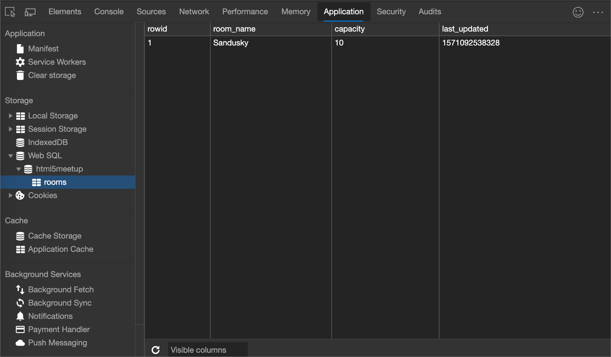
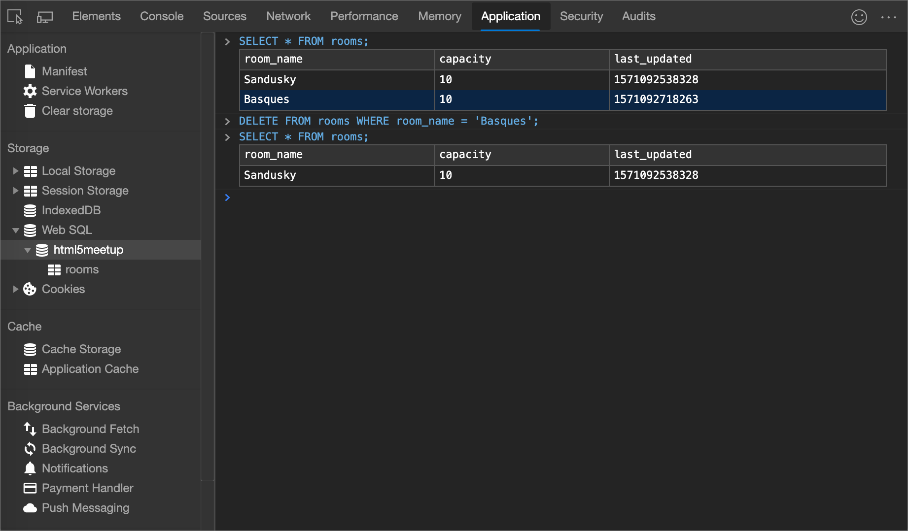
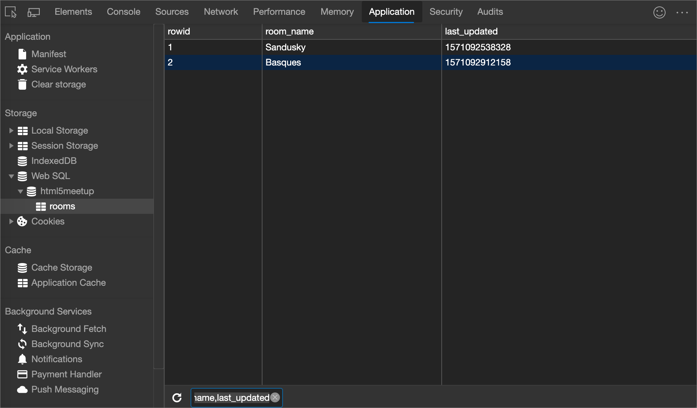

<!-- Copyright Kayce Basques

   Licensed under the Apache License, Version 2.0 (the "License");
   you may not use this file except in compliance with the License.
   You may obtain a copy of the License at

       https://www.apache.org/licenses/LICENSE-2.0

   Unless required by applicable law or agreed to in writing, software
   distributed under the License is distributed on an "AS IS" BASIS,
   WITHOUT WARRANTIES OR CONDITIONS OF ANY KIND, either express or implied.
   See the License for the specific language governing permissions and
   limitations under the License.  -->
# 查看 Web SQL 数据

本文介绍如何使用 DevTools 检查 Web SQL 数据。

> [!WARNING]
> Web SQL 规范[未得到维护](https://w3.org/TR/webdatabase/#status-of-this-document)。

<!-- ====================================================================== -->
## 查看 Web SQL 数据

1. 在 DevTools **中，** 打开应用程序工具。  通常默认**清单**窗格打开。

   

1. 展开 **Web SQL** 部分以查看数据库和表。  在下图中，**html5meetup** 下方是数据库，**子表**是表。

   

1. 单击表可查看该表的数据。

<!-- ====================================================================== -->
## 编辑 Web SQL 数据

查看 Web SQL 表时无法编辑 Web SQL 数据，如上图所示。  但是，可以从 Web SQL 控制台运行用于编辑或删除表的语句。  请参阅 [“运行 Web SQL 查询](#run-web-sql-queries)”。

<!-- ====================================================================== -->
## 运行 Web SQL 查询

1. 单击数据库以打开该数据库的控制台。

1. 键入 Web SQL 语句，然后按 `Enter` 下以运行它。

<!-- ====================================================================== -->
## 刷新 Web SQL 表

DevTools 不会实时更新表。  若要更新表中的数据，请执行以下操作：

1. [查看 Web SQL 表中的数据](#view-web-sql-data)。

1. 单击 **“刷新** () 。

<!-- ====================================================================== -->
## 筛选 Web SQL 表中的列

1. [查看 Web SQL 表中的数据](#view-web-sql-data)。

1. 使用**可见列**文本框指定要显示的列。  使用 CSV 列表提供列的名称。

   

<!-- ====================================================================== -->
## 删除所有的 Web SQL 数据

1. 打开**清除存储**窗格。

1. 确保 **Web SQL** 复选框已打开。

   

1. 单击 **“清除站点数据**”。

   

<!-- ====================================================================== -->
> [!NOTE]
> 此页面的某些部分是根据 [Google 创建和共享的](https://developers.google.com/terms/site-policies)作品所做的修改，并根据[ Creative Commons Attribution 4.0 International License ](https://creativecommons.org/licenses/by/4.0)中描述的条款使用。
> 原始页面位于[此处](https://developer.chrome.com/docs/devtools/storage/websql/)，由 [Kayce Basques](https://developers.google.com/web/resources/contributors#kayce-basques)\（Chrome DevTools 和 Lighthouse 的技术作家）撰写。

本作品根据[ Creative Commons Attribution 4.0 International License ](https://creativecommons.org/licenses/by/4.0)获得许可。
