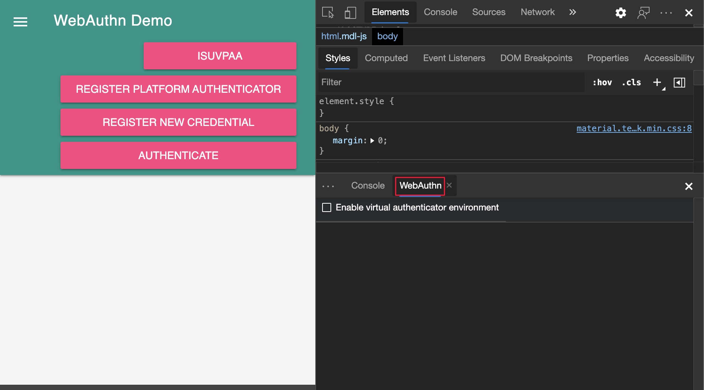
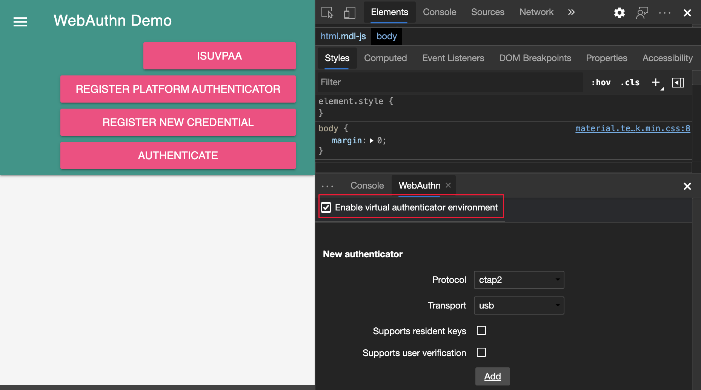
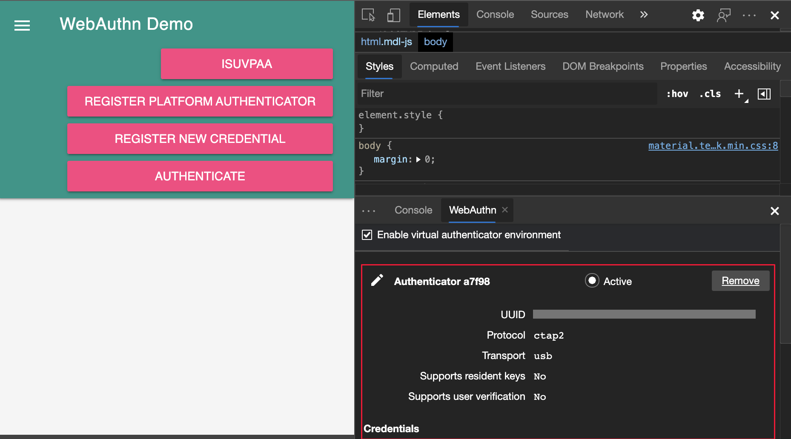
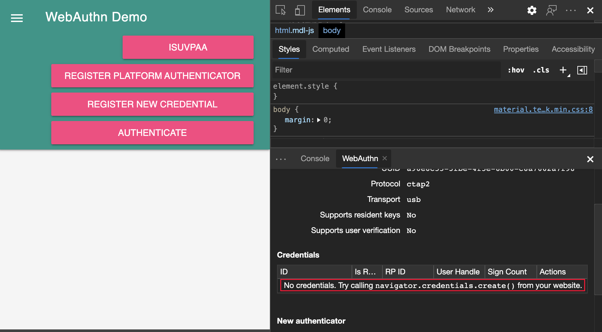
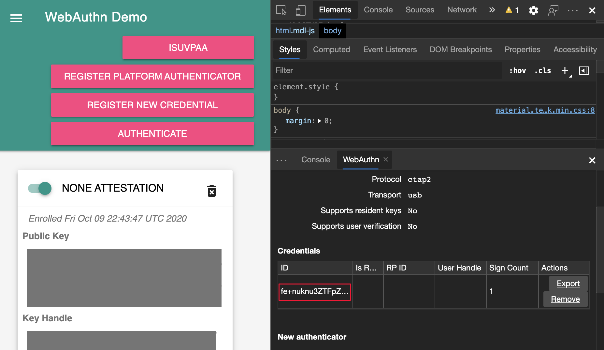
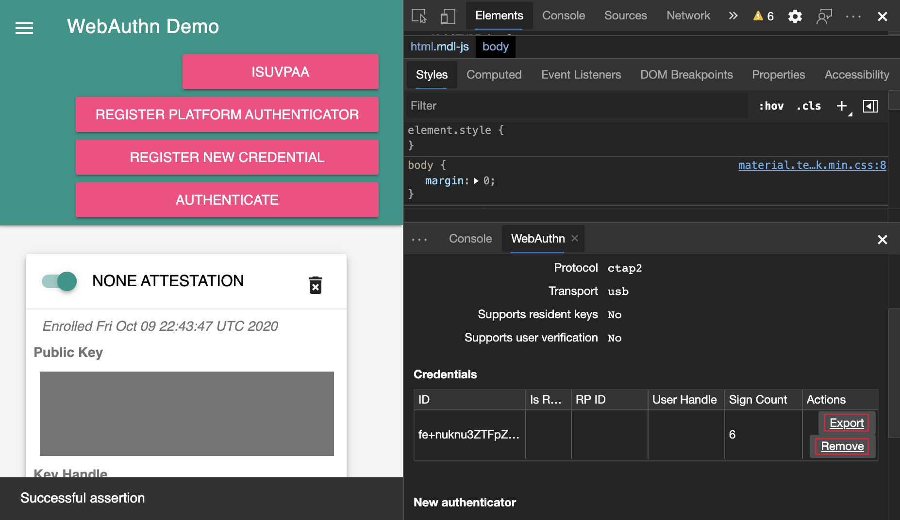
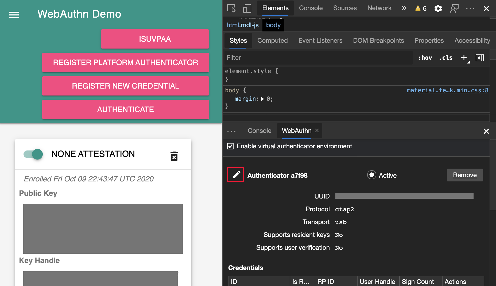
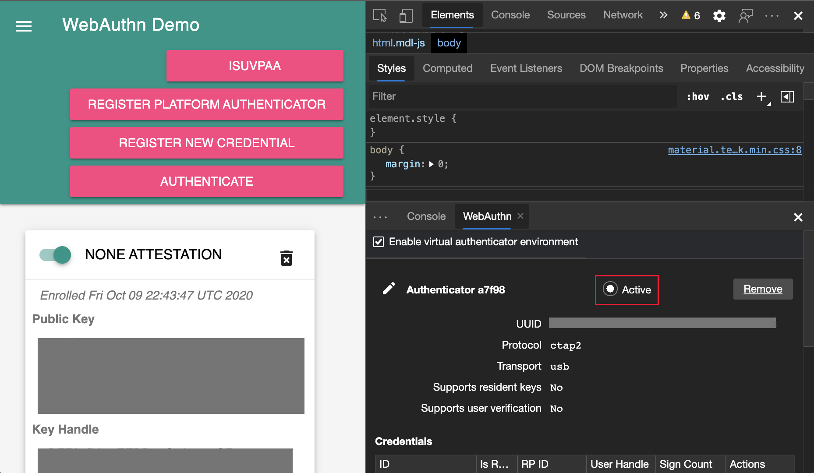
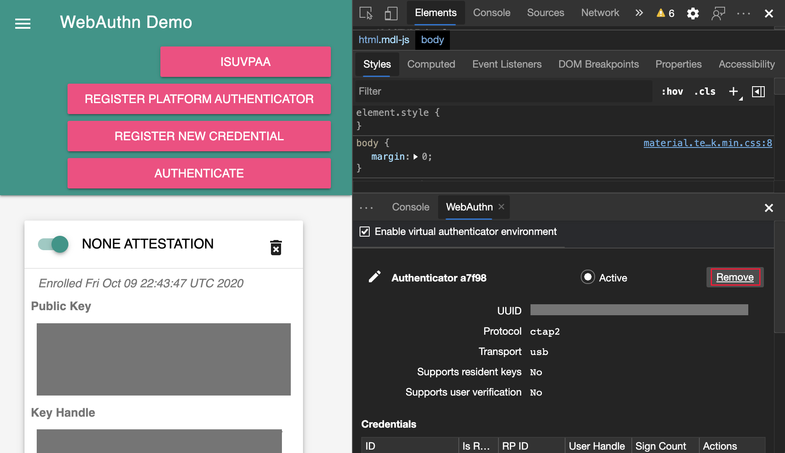

# 模拟身份验证器并调试 WebAuthn

<!--todo: remove notice at bottom, or add notice here?-->

使用 **WebAuthn** 工具创建基于软件的虚拟验证器并与之交互，而不是在网站或应用中使用物理身份验证器调试 Web 身份验证。

通过使用 **WebAuthn** 工具，无需依赖物理身份验证器即可执行以下操作：

*  模拟身份验证器。
*  自定义身份验证器的属性。
*  检查身份验证器的状态。

可以使用 **WebAuthn** 工具模拟身份验证器并调试 [Web 身份验证 API](https://w3c.github.io/webauthn)。

<!-- For real-time updates on this feature in the Chromium open-source project, see Issue [#1034663](https://crbug.com/1034663). -->

<!-- ====================================================================== -->
## 设置 WebAuthn 工具

1. 转到使用 WebAuthn 的网页。  例如，在新的浏览器窗口或选项卡中打开以下演示网站： [try-webauthn.appspot.com](https://try-webauthn.appspot.com/)。

1. 登录到网站。

1. 要打开 DevTools，请右击网页，然后选择“**检查**”。  或者，按“`Ctrl`+`Shift`+`I`”(Windows、Linux)或“`Command`+`Option`+`I`”(macOS)。  DevTools 随即打开。

1. 在 DevTools 的主工具栏上，选择 **“WebAuthn”** 选项卡。 如果该选项卡不可见，请单击“ **更多”选项卡** () 按钮，或者“ **更多工具** () 按钮。

   **WebAuthn** 工具随即打开：

   

1. 在 **WebAuthn** 工具中，选中 **“启用虚拟身份验证器环境”** 复选框。  将显示名为 **“新建身份验证器** ”的新部分：

   

1. 在 **“新建身份验证器** ”部分中，配置以下选项：

    | 选项 | Value | 详细信息 |
    |:--- |:--- |:--- |
    | `Protocol` | [ctap2](https://fidoalliance.org/specs/fido-v2.0-id-20180227/fido-client-to-authenticator-protocol-v2.0-id-20180227.html) 或 [u2f](https://fidoalliance.org/specs/fido-u2f-v1.2-ps-20170411/fido-u2f-overview-v1.2-ps-20170411.html) | 虚拟身份验证器用于编码和解码的协议 |
    | `Transport` |   `usb`、 `nfc`、 `ble`或 `internal` | 虚拟身份验证器模拟用于与客户端通信的所选传输，以获取特定凭据的断言。  请参阅[Authenticator传输枚举](https://w3c.github.io/webauthn#enum-transport) |
    |  `Supports resident keys` | 使用复选框打开 (或关闭)  | 如果 Web 应用依赖于驻留密钥，则打开 (也称为客户端可发现凭据) 。  请参阅 [驻留密钥要求枚举](https://w3c.github.io/webauthn#enum-residentKeyRequirement)。 |
    | `Supports user verification` | 使用复选框打开 (或关闭)  | 如果 Web 应用依赖于使用手势方式（如触摸加上引脚代码、密码输入或生物识别）的本地授权，请启用。  请参阅 [用户验证](https://w3c.github.io/webauthn#user-verification) |

1. 单击“添加”**** 按钮。

1. 将显示新创建的身份验证器的新部分：

   

**Authenticator**部分包含凭**据**表。  在向身份验证器注册凭据之前，该表为空：

<!-- ====================================================================== -->
## 注册新凭据

注册新凭据：

1. 在演示网站上，单击 **“注册新凭据**”。

1. 现在将新凭据添加到 WebAuthn 工具中的 **Credentials** 表中：

   

在演示网站上，单击 **“身份验证”** 按钮。  验证凭**据**表中凭据的[签名计数](https://w3c.github.io/webauthn/#sctn-sign-counter)是否增加了 1，这标志着 [AuthenticatorGetAssertion](https://w3c.github.io/webauthn#authenticatorgetassertion) 操作成功。

有关注册新凭据时 [Web 身份验证 API](https://w3c.github.io/webauthn) 正在执行的操作的详细信息，请参阅 [“创建新凭据](https://w3c.github.io/webauthn#sctn-createCredential)”。

<!-- ====================================================================== -->
## 导出和删除凭据

若要导出或删除凭据，请单击“ **导出** ”或 **“删除”** 按钮。

<!-- ====================================================================== -->
## 重命名身份验证器

重命名身份验证器：

1. 在验证器名称旁边，单击“ **编辑”** 按钮。

1. 编辑名称，然后按 **Enter** 保存更改。

<!-- ====================================================================== -->
## 设置活动身份验证器

将自动激活新创建的身份验证器。  若要使用另一个虚拟身份验证器，请单击验证器旁边的 **“活动** 单选”按钮。

DevTools 在任何时间点仅支持一个活动虚拟验证器。  如果删除活动身份验证器，则不会自动激活另一个身份验证器。

<!-- ====================================================================== -->
## 删除虚拟身份验证器

若要删除虚拟身份验证器，请单击身份验证器旁边的 **“删除** ”按钮。

<!--todo: remove this notice, or add notice at top?-->

<!-- ====================================================================== -->
> [!NOTE]
> 此页面的某些部分是根据 [Google 创建和共享的](https://developers.google.com/terms/site-policies)作品所做的修改，并根据[ Creative Commons Attribution 4.0 International License ](https://creativecommons.org/licenses/by/4.0)中描述的条款使用。
> 原始页面位于 [此处](https://developer.chrome.com/docs/devtools/webauthn/)，并由 [Jecelyn Yeen](https://developers.google.com/web/resources/contributors#jecelyn-yeen)  \（开发人员支持者，Chrome DevTools\）制作。

本作品根据[ Creative Commons Attribution 4.0 International License ](https://creativecommons.org/licenses/by/4.0)获得许可。
