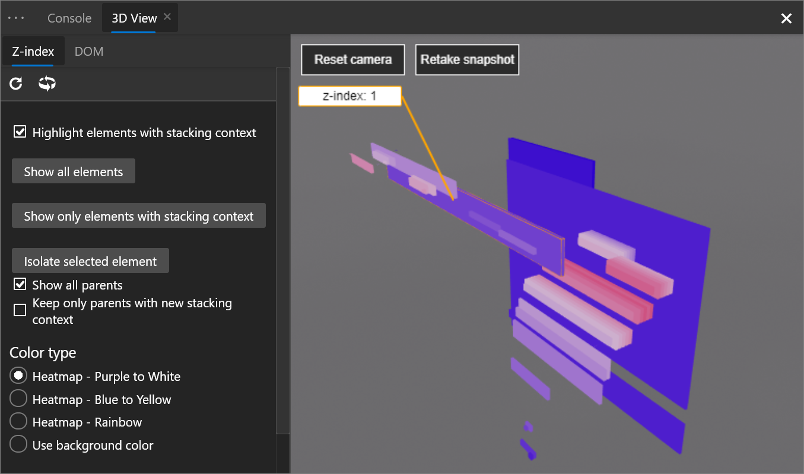
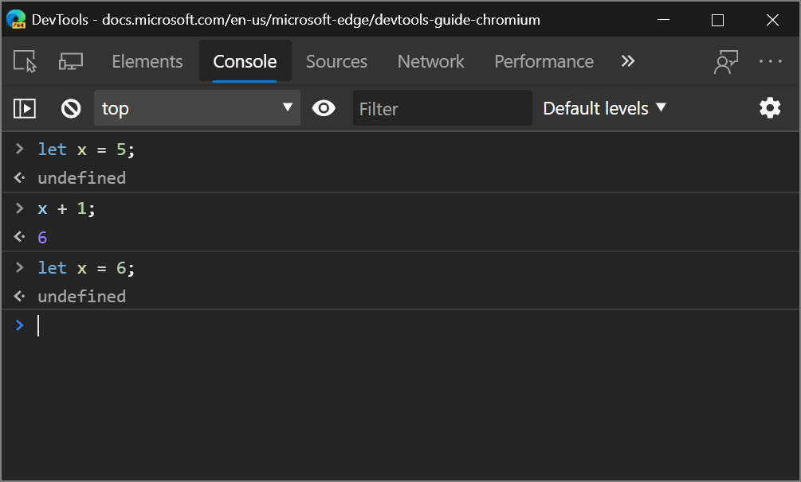
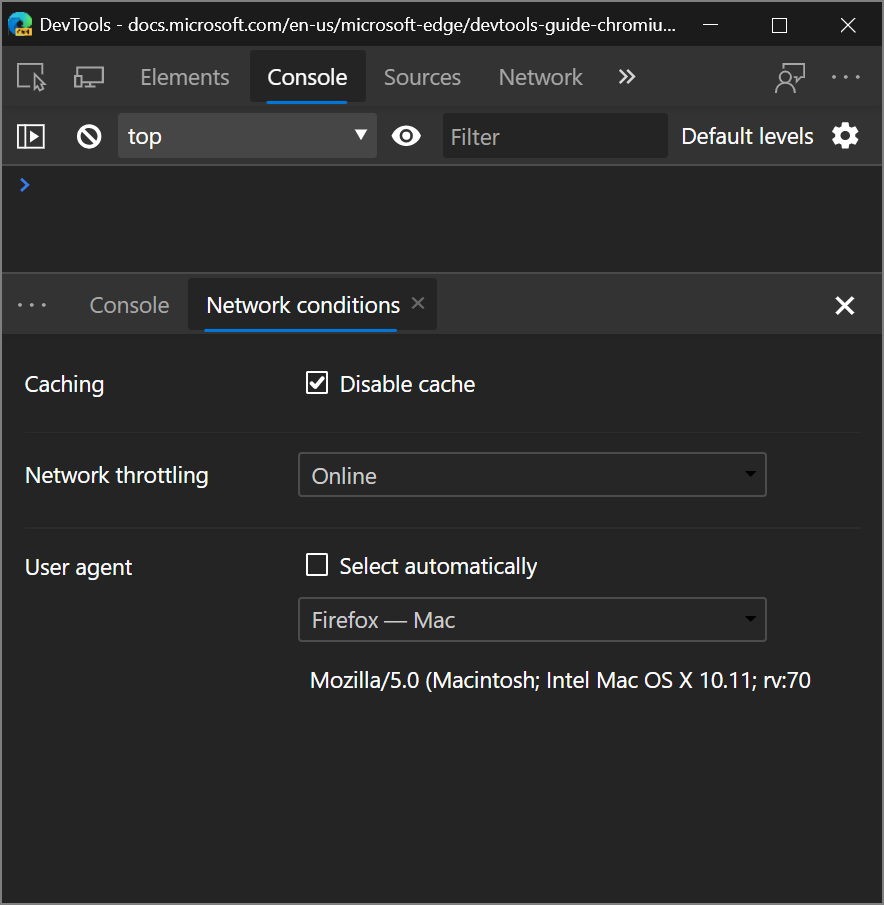
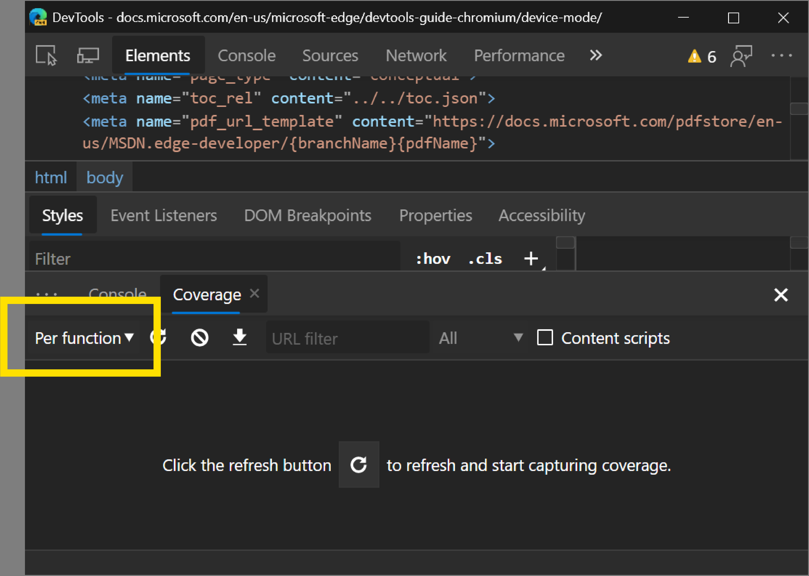

<!-- Copyright Kayce Basques

   Licensed under the Apache License, Version 2.0 (the "License");
   you may not use this file except in compliance with the License.
   You may obtain a copy of the License at

       https://www.apache.org/licenses/LICENSE-2.0

   Unless required by applicable law or agreed to in writing, software
   distributed under the License is distributed on an "AS IS" BASIS,
   WITHOUT WARRANTIES OR CONDITIONS OF ANY KIND, either express or implied.
   See the License for the specific language governing permissions and
   limitations under the License.  -->
# DevTools (Microsoft Edge 80) 中的新增功能

[!INCLUDE [Microsoft Edge team note for top of What's New](../../includes/edge-whats-new-note.md)]

<!-- ====================================================================== -->
## 来自 Microsoft Edge 开发人员工具团队公告

<!-- ====================================================================== -->
### DevTools 的辅助功能改进

<!-- dup entries: 2019/12, 2020/01 -->

DevTools 团队为Chromium提供了 170 项更改，以解决 DevTools 中影响很大的颜色对比度、键盘和屏幕阅读器问题。  生成 Web 的每个开发人员都应能够使用 DevTools。

想要了解如何使您的网页可供所有用户访问？  下载 Microsoft Edge 的 [Accessibility Insights](https://aka.ms/a11yinsights) 和 [Webhint](https://aka.ms/webhint/browser-extension) 扩展以开始使用。

如果使用屏幕阅读器或键盘在 DevTools 中导航，请通过 [向我们发微博](https://aka.ms/tweet/edgedevtools) 或选择 [“发送反馈](../../../contact.md) ”图标来发送反馈！

Chromium 问题 [#963183](https://crbug.com/963183)

另请参阅：
* [辅助功能测试功能](../../../accessibility/reference.md)
* [使用辅助技术导航开发工具](../../../accessibility/navigation.md)

<!-- ====================================================================== -->
### 在其他语言中使用 DevTools

<!-- dup entries: 2019/12, 2020/01 -->

许多开发人员使用其他开发人员工具（如 StackOverflow 和 Visual Studio Code）的本机语言，而不仅仅是英语。  我们很高兴地宣布 DevTools 的本地化，你现在可以使用除英语以外的 10 种语言之一：

* 中文 (简体) - &#20013;&#25991;&#65288;&#31616;&#20307;&#65289;
* 中国 (传统) - &#20013;&#25991;&#65288;&#32321;&#39636;&#65289;
* 法语 – fran&#231;ais
* 德语 - 德国
* 意大利语 - 意大利语
* 日语 - &#26085;&#26412;&#35486;
* 韩语 - &#54620;&#44397;&#50612;
* 葡萄牙语 - 波尔图古&#234;s
* 俄语 – &#1088;&#1091;&#1089;&#1089;&#1082;&#1080;&#1081;
* 西班牙语 - espa&#241;ol

<!--
|  |  |
|:--- |:--- |
| Chinese (Simplified) - 中文（简体）| Chinese (Traditional) - 中文（繁體）|
| French – français | German - deutsch |
| Italian - italiano | Portuguese - português |
| Korean - 한국어 | Japanese - 日本語 |
| Russian – русский | Spanish - español |
-->

转到`edge://flags`**“启用本地化开发人员工具**”标志并将其设置为 **“已启用**”。  还将 **开发人员工具试验** 标志设置为 **“已启用**”。  重启 Microsoft Edge 并打开 DevTools。  <!-- Select `F1` in the DevTools or go to Settings > Experiments and check the **Match browser language** checkbox.  -->  DevTools 与用于 Microsoft Edge 的 `edge://settings/languages`语言匹配。

如果要使用不同于可用语言的 DevTools，请 [向我们发微博](https://aka.ms/tweet/edgedevtools) 或单击 [“发送反馈](../../../contact.md) ”图标。

Chromium问题 [#941561](https://crbug.com/941561)

另请参阅：
* [更改开发工具语言设置](../../../customize/localization.md)

<!-- ====================================================================== -->
### webhint Microsoft Edge 扩展

<!-- dup entries: 2019/12, 2020/01 -->

通过 Webhint Microsoft Edge 扩展，可以轻松扫描网页，并在 DevTools 中获取有关辅助功能、浏览器兼容性、安全性、性能等的反馈。  阅读有关内容的详细信息 [https://webhint.io](https://aka.ms/webhint)。

[在 Microsoft Edge 中尝试 Webhint 浏览器扩展](https://aka.ms/webhint/edge-extension)。  安装扩展后，打开 DevTools，然后选择 **“提示”** 工具。  在此处，运行可自定义的站点扫描。  转到 [webhint.io](https://aka.ms/webhint/browser-extension) 了解详细信息。

另请参阅：
* [Visual Studio Code的 webhint 扩展](../../../../test-and-automation/webhint.md)

<!-- ====================================================================== -->
### 3D 视图

<!-- dup entries: 2019/12, 2020/01 -->

通过浏览文[档对象模型 (DOM) ](https://developer.mozilla.org/docs/Web/API/Document_Object_Model)或 [z 索](https://developer.mozilla.org/docs/Web/CSS/z-index)引堆栈上下文，使用 **3D 视图**调试 Web 应用程序。

若要访问 3D 视图，请转到 `edge://flags` 并确保开发 **人员工具试验** 标志设置为 **“已启用**”。  重启 Microsoft Edge 并打开 DevTools。  在 DevTools 中选择`F1`或打开 **“设置试验”** > 部分，然后打开 **“启用 3D 视图**”复选框。****  现在，按 `Ctrl` + `Shift` + `P`**3D 视图**键入，然后选择 **“显示 3D 视图**”。

我们正在处理 UI 并将更多功能添加到 3D 视图，因此请向我们发送 [反馈](../../../contact.md)。

Chromium问题 [#987787](https://crbug.com/987787)

另请参阅：
* [使用 3D 视图工具导航 z 索引、DOM 和层](../../../3d-view/index.md)

<!-- ====================================================================== -->
### Visual Studio Code扩展

DevTools 团队还发布了一些[用于Visual Studio Code](https://aka.ms/vscode)扩展，可让你直接从文本编辑器使用 DevTools 的功能。 请查看以下扩展。

#### Microsoft Edge 的元素

<!-- dup entries: 2019/12, 2020/01 -->

通过添加 [Microsoft Edge 的 Elements ](https://aka.ms/elements4code) Visual Studio Code 扩展，从Visual Studio Code中使用 Elements 工具。

更新：从 2022 年起，**Microsoft Edge 的 Elements** 扩展现在是**适用于 Visual Studio Code 的 Microsoft Edge DevTools 扩展**。

有关详细信息，请查看[适用于Visual Studio Code的 Microsoft Edge DevTools 扩展](../../../../visual-studio-code/microsoft-edge-devtools-extension.md)。

#### Microsoft Edge 的调试器

<!-- dup entries: 2019/12, 2020/01 -->

使用 [Microsoft Edge 的调试器](https://aka.ms/debugger4code)Visual Studio Code扩展，直接从Visual Studio Code调试在 Microsoft Edge 中运行的 JavaScript。

更新：截至 2022 年，**Microsoft Edge 的调试器Visual Studio Code扩展**已替换为 Visual Studio Code 中 Microsoft Edge 的内置调试器。  请参阅[Visual Studio Code中的“调试 Microsoft Edge](../../../../visual-studio-code/debugger-for-edge.md)”。

#### webhint

<!-- dup entries: 2019/12, 2020/01 -->

[Webhint](https://aka.ms/webhint4code) Visual Studio Code 扩展用于`webhint`在编写网页时改进网页！ 此扩展基于 `webhint` 分析在工作区文件上运行和报告诊断。

[详细了解Visual Studio Code webhint 扩展](https://aka.ms/webhint/code-extension)。

另请参阅：
* [用于 Web 开发的Visual Studio Code](../../../../visual-studio-code/index.md)
* [Visual Studio Code的 webhint 扩展](../../../../visual-studio-code/webhint.md)

<!-- ====================================================================== -->
### Visual Studio 集成

<!-- dup entries: 2019/12, 2020/01 -->

在 Visual Studio 2019 版本 16.2 或更高版本中，使用 Visual Studio 调试器调试在 Microsoft Edge 中运行的 JavaScript。  [下载 Visual Studio 2019](https://aka.ms/vs/download) 以试用此功能。

[阅读我们的博客文章，了解如何从 Visual Studio 调试 Microsoft Edge](https://aka.ms/vs/debug-edge)。

若要详细了解如何从 Visual Studio 调试 Microsoft Edge，请参阅 [Visual Studio 进行 Web 开发](../../../../visual-studio/index.md)。

<!-- ====================================================================== -->
### 跟踪预防控制台消息

<!-- dup entries: 2019/12, 2020/01 -->

跟踪防护是 Microsoft Edge 中的一项独特功能，它阻止你在访问网站之前被网站跟踪。  默认跟踪防护设置是均衡模式，它阻止第三方跟踪器和已知的恶意跟踪器，以获得平衡隐私和 Web 兼容性的体验。  为了更深入地了解某些跟踪器被阻止时网页的兼容性，Microsoft Edge 团队在阻止跟踪器时在 **控制台** 中添加了警告消息。

[详细了解如何跟踪防护以及隐私与 Web 兼容性之间的平衡](https://aka.ms/microsoftedge/tracking-prevention-blog)。

另请参阅：
* [Microsoft Edge 中的跟踪防护](../../../../web-platform/tracking-prevention.md)
* [控制台概述](../../../console/index.md)

<!-- ====================================================================== -->
## 来自 Chromium 项目的公告

以下部分将公布 Microsoft Edge 80 中为开放源代码 Chromium项目提供的其他功能。

<!-- ====================================================================== -->
### 支持控制台中的允许和类重新声明

**控制台**现在支持重新声明`let`和`class`语句。  对于使用控制台试验新 JavaScript 代码的 Web 开发人员来说，无法重新设置是一种常见的烦恼。

> [!WARNING]
> 在控制台外部或单个 `let` 控制台输入内的脚本中重新声明或 `class` 声明仍会导致 `SyntaxError`出现 。

例如，以前在重新声明本地变量 `let`时，控制台会引发错误：

现在，控制台允许重新声明：

Chromium问题 [#1004193](https://crbug.com/1004193)

另请参阅：
* [控制台概述](../../../console/index.md)
* [在控制台中运行 JavaScript](../../../console/console-javascript.md)

<!-- ====================================================================== -->
### 改进了 WebAssembly 调试

DevTools 已开始支持 DWARF 调试标准版，这意味着对在 DevTools 中跨代码、设置断点和解析源语言中的堆栈跟踪的支持增加。

<!-- [TODO: Add this link back] -->
<!--Check out [Improved WebAssembly debugging in Microsoft Edge DevTools](201912Webassembly) for the full story.  -->

<!-- [TODO: Replace this image with screenshot in Edge] -->
<!--

-->

另请参阅：
* 在 _DevTools (Microsoft Edge 92) 中的_[“网络”工具中筛选 Wasm 资源类型](../../../whats-new/2021/05/devtools.md#filter-wasm-resource-type-in-the-network-tool)。
* [WebAssembly 调试：在](../../../experimental-features/index.md#webassembly-debugging-enable-dwarf-support)_实验功能_中启用 DWARF 支持。

<!-- ====================================================================== -->
### 网络面板更新

#### 发起程序面板中的请求发起程序链

现在，可以将网络请求的发起程序和依赖项视图为嵌套列表。  这可以帮助你了解请求资源的原因，或者某个资源 (（例如脚本) 导致的网络活动）。

[在网络面板中记录网络活动](../../../network/index.md)后，选择一个资源，然后转到 **“发起程序**”面板以查看**请求发起程序链**：

*  检查的 **资源** 是粗体的。  在上面的屏幕截图中， `ai.2.min.js` 检查的资源。
*  所检查资源上方的资源是 **发起方**。  在上面的屏幕截图中， `https://www.microsoftedgeinsider.com` 是发起者 `ai.2.min.js`。  换句话说， `https://www.microsoftedgeinsider.com` 导致网络请求 `ai.2.min.js`。
*  检查的资源下面的资源是 **依赖项**。  在上面的屏幕截图中， `https://dc.services.visualstudio.com/v2/track` 是一个依赖项 `ai.2.min.js`。  换句话说， `ai.2.min.js` 导致网络请求 `https://dc.services.visualstudio.com/v2/track`。

还可以通过保存 `Shift` 并将其悬停在网络资源上来访问发起方和依赖项信息。  请参阅_网络功能参考_中的[显示发起程序和依赖项](../../../network/reference.md#display-initiators-and-dependencies)。

Chromium问题 [#842488](https://crbug.com/842488)

#### 在“概述”中突出显示所选网络请求

选择网络资源以进行检查后，网络面板现在会在 **“概述**”中将该资源周围的蓝色边框放置在该资源周围。  这可以帮助你检测网络请求是否比预期更早或更晚发生。

Chromium问题 [#988253](https://crbug.com/988253)

请参阅“隐藏_网络功能参考_中的[概述”窗格](../../../network/reference.md#hide-the-overview-pane)。

#### 网络面板中的 URL 和路径列

使用**网络**工具中的新**路径**和 **URL** 列显示每个网络资源的绝对路径或完整 URL。

若要显示新列，请右键单击 **瀑布** 表标题，然后选择 **“路径** ”或 **“URL**”。
<!-- **Path** or **URL** not found in N.f.r. page-->

Chromium问题 [#993366](https://crbug.com/993366)

另请参阅：
* [网络功能参考](../../../network/reference.md)。
* _网络功能引用_中的[排序请求](../../../network/reference.md#sort-requests)提到**瀑布**列。

#### 更新了User-Agent字符串

DevTools 支持通过 **“网络条件** ”面板设置自定义User-Agent字符串。  User-Agent字符串会影响附加到网络资源的 `User-Agent` HTTP 标头以及其值 `navigator.userAgent`。

预定义的User-Agent字符串已更新，以反映新式浏览器版本。

若要访问 **网络条件**， [请打开命令菜单](../../../command-menu/index.md) 并运行该 `Show Network Conditions` 命令。

> [!NOTE]
> 还可以 [在设备模式下设置User-Agent字符串](../../../device-mode/index.md#simulate-a-mobile-viewport)。

Chromium问题 [#1029031](https://crbug.com/1029031)

另请参阅：
* [网络条件工具](../../../network-conditions/network-conditions-tool.md)
* [替代用户代理字符串](../../../device-mode/override-user-agent.md)

<!-- ====================================================================== -->
### 审核面板更新

在稍后的版本中，“ **审核** ”面板已重命名为 **Lighthouse** 面板。

#### 新配置 UI

配置 UI 具有新的响应式设计，并且限制配置选项已简化。  有关限制 UI 更改的详细信息， [请参阅审核面板限制](https://github.com/GoogleChrome/lighthouse/blob/master/docs/throttling.md#devtools-audits-panel-throttling)。<!-- changing master to main doesn't work 5/19/2022 -->

另请参阅：
* [Lighthouse 工具](../../../lighthouse/lighthouse-tool.md)

<!-- ====================================================================== -->
### 覆盖范围工具更新

#### 按函数或按块覆盖模式

**“覆盖范围**”工具有一个新的下拉菜单，可用于指定是应**按函数**还是**每个块**收集代码覆盖率数据。  **每个块** 覆盖更详细，但也要贵得多收集。  默认情况下，DevTools 现在使用 **每个函** 数覆盖范围。

> [!CAUTION]
> 你可能会注意到 HTML 文件中的代码覆盖率差异很大，具体取决于是 **按函数** 还是 **按块** 模式使用。  **使用每个函数**模式时，HTML 文件中的内联脚本被视为函数。  如果脚本完全运行，DevTools 会将整个脚本标记为已用代码。  如果脚本根本未运行，DevTools 会将该脚本标记为未使用的代码。

#### 现在必须通过页面刷新启动覆盖范围

由于覆盖数据不可靠，在不刷新页面的情况下切换代码覆盖率已被删除。  例如，如果运行时是很久以前的某个函数，并且 V8 垃圾回收器已将其清理干净，则该函数可能会报告为未使用。

Chromium问题 [#1004203](https://crbug.com/1004203)

另请参阅：
* [使用覆盖工具查找未使用的 JavaScript 和 CSS 代码](../../../coverage/index.md)

<!-- ====================================================================== -->
> [!NOTE]
> 此页面的某些部分是根据 [Google 创建和共享的](https://developers.google.com/terms/site-policies)作品所做的修改，并根据[ Creative Commons Attribution 4.0 International License ](https://creativecommons.org/licenses/by/4.0)中描述的条款使用。
> 原始页面位于[此处](https://developer.chrome.com/blog/new-in-devtools-80)，由 [Kayce Basques](https://developers.google.com/web/resources/contributors#kayce-basques)\（Chrome DevTools 和 Lighthouse 的技术作家）撰写。

本作品根据[ Creative Commons Attribution 4.0 International License ](https://creativecommons.org/licenses/by/4.0)获得许可。
