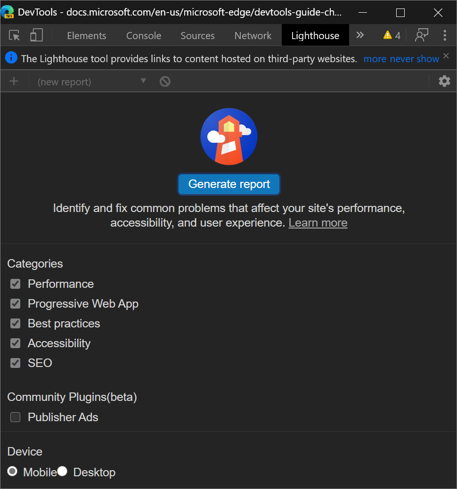
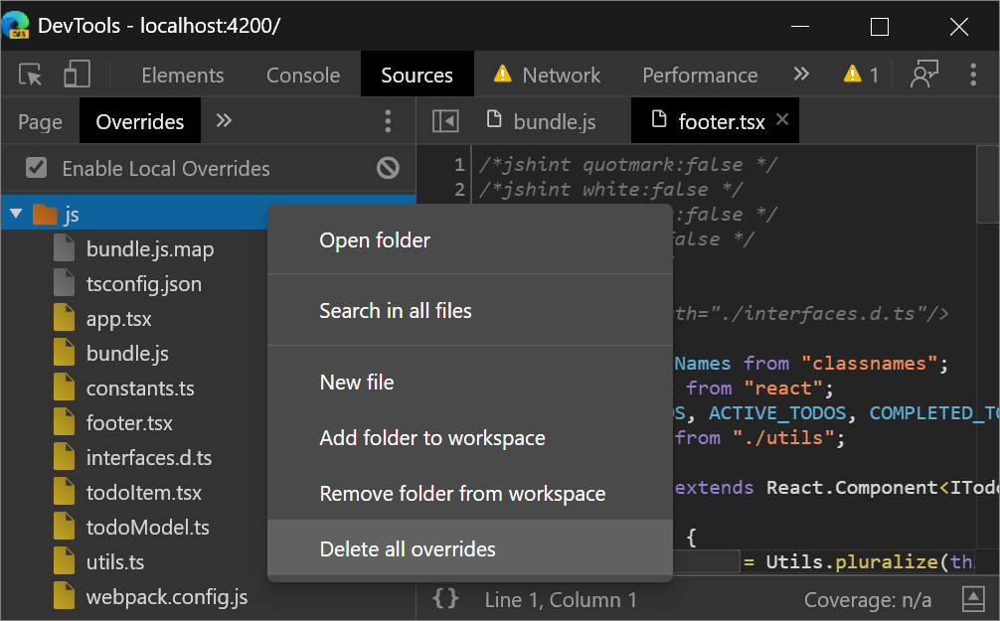
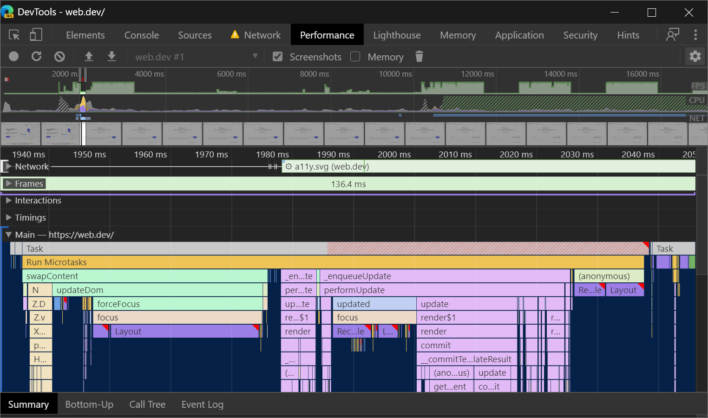

<!-- Copyright Kayce Basques

   Licensed under the Apache License, Version 2.0 (the "License");
   you may not use this file except in compliance with the License.
   You may obtain a copy of the License at

       https://www.apache.org/licenses/LICENSE-2.0

   Unless required by applicable law or agreed to in writing, software
   distributed under the License is distributed on an "AS IS" BASIS,
   WITHOUT WARRANTIES OR CONDITIONS OF ANY KIND, either express or implied.
   See the License for the specific language governing permissions and
   limitations under the License.  -->
# DevTools (Microsoft Edge 83) 中的新增功能

按照更新的 Chromium 计划，我们将调整即将推出的 Microsoft Edge 版本的计划，并取消 Microsoft Edge 82 版本。 有关详细信息，请查看我们的 [博客文章](https://blogs.windows.com/msedgedev/2020/03/20)。

[!INCLUDE [Microsoft Edge team note for top of What's New](../../includes/edge-whats-new-note.md)]

<!-- ====================================================================== -->
## 来自 Microsoft Edge 开发人员工具团队公告

<!-- ====================================================================== -->
### 在Windows 10或更高版本设备上远程调试Microsoft Edge

远程[工具Microsoft Edge (Beta) ](https://www.microsoft.com/store/apps/9P6CMFV44ZLT) 应用现已在[Microsoft Store](https://www.microsoft.com/store/apps/windows)中提供。 此应用扩展[了设备门户Windows](/windows/uwp/debug-test-perf/device-portal)。  可以从开发计算机上运行的Microsoft Edge连接到远程Windows 10或更高版本的设备，并显示目标列表。  此目标列表包括Microsoft Edge中的所有选项卡，以及在Windows设备上打开的 [PVA](../../../../progressive-web-apps-chromium/index.md)。  针对远程Windows设备上运行的目标，在开发计算机上使用 DevTools。

阅读本指南，了解如何为远程调试设置Windows 10设备和开发计算机：[远程调试Windows设备](../../../remote-debugging/windows.md)。

通过 [推特](https://twitter.com/intent/tweet?text=@EdgeDevTools) 或单击“ [发送反馈](../../../contact.md) ”图标，让我们知道远程调试体验。

<!-- ====================================================================== -->
### 访问设置的新方法

可以自定义大量 DevTools 设置，使 DevTools 的外观和工作方式与所需方式一样。 在 Microsoft Edge 83 中，现在在 DevTools 中访问[设置](../../../customize/index.md#settings)要容易得多。  单击控制台警报和主菜单旁边的齿轮图标打开**设置**。

还可以在 **“更多工具**”下的**主菜单**中打开**设置**。

Chromium 问题 [#1050855](https://crbug.com/1050855)

另请参阅：
* _使用焦点模式简化 DevTools_ 中的 [DevTools 自定义和设置](../../../experimental-features/focus-mode.md#devtools-customization-and-settings)

<!-- ====================================================================== -->
### 新增和改进的 infobars

在 DevTools 中 (信息栏) 的信息通知栏现在具有改进的外观和更多功能。 在 Microsoft Edge 83 中，信息栏更易于阅读和提供按钮，因此你可以立即执行相关操作。

Chromium 问题 [#1056348](https://crbug.com/1056348)

<!-- no link to regular docs, since this is a cross-feature UI -->

<!-- ====================================================================== -->
### 使用键盘导航颜色选取器

在早期版本的Microsoft Edge中，无法使用键盘导航[颜色选取器](../../../css/reference.md#change-colors-with-the-color-picker)的 **“阴影**”部分。  在 Microsoft Edge 83 中，现在可以使用键盘在颜色选取器的 **“阴影**”部分移动选择器。

颜色选取器是 **元素** 面板中用于更改 `color` 和 `background-color` 声明的 GUI：

Chromium 问题 [#963183](https://crbug.com/963183)

另请参阅：
* [使用 Elements 工具检查、编辑和调试 HTML 和 CSS](../../../elements-tool/elements-tool.md)

<!-- ====================================================================== -->
### 现在，刷新页面后将填充“属性”选项卡

在 Microsoft Edge 81 及更早版本中，“**元素**”面板中的 **“属性”选项卡**被页面刷新打破。  刷新页面时，“ **属性”选项卡** 未填充当前所选元素的属性：

在 Microsoft Edge 83 中，现在可以在“**属性”选项卡**中刷新页面后显示当前所选元素的属性：

Chromium 问题 [#1050999](https://crbug.com/1050999)

另请参阅：
* [使用 Elements 工具检查、编辑和调试 HTML 和 CSS](../../../elements-tool/elements-tool.md)

<!-- ====================================================================== -->
### 使用箭头键在 "更改" 工具中滚动

**更改工具**跟踪你在 DevTools 中对 CSS 或 JavaScript 所做的任何更改。  可以使用 **“更改”工具** 快速显示所有更改，并将这些更改带回编辑器/IDE。

若要打开 **“更改”工具**，请按 `Ctrl`+`Shift``P`+DevTools 打开[命令菜单](../../../command-menu/index.md)，然后键入`changes`。  选择 **“显示更改** ”命令，然后按下 `Enter`。  **更改工具**将在抽屉中打开。

对已缩小的文件进行更改后，“ **更改”工具** 允许你水平滚动以显示所有已缩小的代码。  从 Microsoft Edge 83 开始，现在可以使用键盘上的箭头键水平滚动。

如果使用屏幕阅读器或键盘在 DevTools 中导航，请通过 [向我们发微博](https://twitter.com/intent/tweet?text=@EdgeDevTools) 或单击“ [发送反馈](../../../contact.md) ”图标向我们发送反馈。

Chromium 问题 [#963183](https://crbug.com/963183)

另请参阅：
* [使用更改工具跟踪对文件的更改](../../../changes/changes-tool.md)

<!-- ====================================================================== -->
<!-- ====================================================================== -->
## 来自 Chromium 项目的公告

以下各部分公布了 Microsoft Edge 83 中提供的其他功能，这些功能是对开源 Chromium 项目的贡献。

<!-- ====================================================================== -->
### 模仿视觉缺陷

在 **呈现** 工具中，使用新的 **模拟视觉缺陷** 功能更好地了解具有不同视觉缺陷的人如何体验你的网站：

DevTools 可以模拟模糊的视觉和以下类型的颜色视觉缺陷：

| 颜色视觉缺陷 | 详细信息 |
|---|---|
| 红色盲 | 无法感觉任何红色的光线。 |
| 绿色盲 | 无法感觉任何绿色的光线。 |
| 黄蓝色盲 | 无法感觉任何蓝色的光线。 |
| 全色盲 | 无法感知任何颜色，除了灰色的阴影 (极其罕见的) 。 |

这些颜色视觉缺陷的极端版本较少，而且更为常见。  例如，红色弱降低了对红光的敏感性（与红色盲相对，后者完全无法感知红光）。  然而，这些 **异常** 视力缺陷并没有明确定义：每个患有这种视力缺陷的人都是不同的，而且可能以不同的方式看待事物 (能够或多或少地感知) 相关颜色。

通过在 DevTools 中设计更极端的模拟，保证有视力缺陷的人也可访问 Web 应用。

通过 [推特](https://twitter.com/intent/tweet?text=@EdgeDevTools) 或单击“ [发送反馈](../../../contact.md) ”图标发送反馈。

Chromium 问题 [#1003700](https://crbug.com/1003700)

另请参阅：
* [模仿视觉缺陷](../../../accessibility/emulate-vision-deficiencies.md)
* 使用性能_功能参考_中的[呈现工具分析呈现性能](../../../evaluate-performance/reference.md#analyze-rendering-performance-with-the-rendering-tool)
* [色盲的类型](http://www.colourblindawareness.org/colour-blindness/types-of-colour-blindness)，在 Colourblindawareness.org。

<!-- ====================================================================== -->
### 模拟语言环境

若要模拟区域设置，请在 **“传感器”** 工具中，从 **“位置”** 下拉列表中选择一个位置。   (若要访问 **传感器** 工具， [请打开 **命令菜单**](../../../command-menu/index.md) 并键入 `Sensors`.) 选择位置后，DevTools 会修改当前的默认区域设置，这会影响以下代码：

*  `Intl.*` 例如，API： `new Intl.NumberFormat().resolvedOptions().locale`
*  其他可识别语言环境的 JavaScript API，例如`String.prototype.localeCompare`和`*.prototype.toLocaleString`，例如： `123_456..toLocaleString()`
*  DOM API，如 `navigator.language` 和 `navigator.languages`
*  [接受语言](https://developer.mozilla.org/docs/Web/HTTP/Headers/Accept-Language)HTTP 请求标头

> [!NOTE]
> 更新到 `navigator.language` 并 `navigator.languages` 不会立即显示，但仅在下一次导航或页面刷新之后才可见。  只有后续请求才会反映对 `Accept-Language` HTTP 标头的更改。

若要尝试演示，请参阅[与区域设置相关的代码示例](https://mathiasbynens.be/demo/locale)。

Chromium 问题 [#1051822](https://crbug.com/1051822)

另请参阅：
* [使用传感器工具替代地理位置](../../../device-mode/geolocation.md)

<!-- ====================================================================== -->
### 跨域嵌入程序策略 (COEP) 调试

**网络**面板现在提供[跨源嵌入器](https://docs.google.com/document/d/1zDlfvfTJ_9e8Jdc8ehuV4zMEu9ySMCiTGMS9y0GU92k/edit#bookmark=id.uo6kivyh0ge2)策略调试信息。

“**状态**”列现在提供有关为何阻止请求的快速说明，以及查看该请求标头以进行进一步调试的链接：

"**标头**" 选项卡上的 "**响应标头**" 部分提供了有关如何解决这些问题的更多指导：

通过 [推特](https://twitter.com/intent/tweet?text=@EdgeDevTools) 或单击“ [发送反馈](../../../contact.md) ”图标发送反馈。

Chromium 问题 [#1051466](https://crbug.com/1051466)

另请参阅：
* [阻止](../../../network/index.md#block-requests)_检查网络活动中_的请求。

<!-- ====================================================================== -->
### 断点、条件断点和登录点的新图标

更新：从 2022 年起，断点现在由蓝色矩形（而不是红色圆圈）指示。

**“源**”面板具有用于断点、条件断点和日志点的新图标：

*  断点 () 用红色圆圈表示。
*  条件断点 () 用半红色半白圆表示。
*  日志点 () 由带有控制台图标的红色圆圈表示。

新图标的动机是使 UI 与其他 GUI 调试工具更一致， (通常将断点颜色为红色) ，并更轻松地一目了然地区分 3 个功能。

Chromium 问题 [#1041830](https://crbug.com/1041830)

另请参阅：
* [使用断点暂停代码](../../../javascript/breakpoints.md)

<!-- ====================================================================== -->
### 查看设置了特定 cookie 路径的网络请求

使用**网络**工具中的新`cookie-path`筛选器关键字，重点关注设置特定 [Cookie 路径](https://developer.mozilla.org/docs/Web/HTTP/Headers/Set-Cookie#Directives)的网络请求。

若要发现更多关键字`cookie-path`，请参阅_网络功能参考_中的[按属性筛选请求](../../../network/reference.md#filter-requests-by-properties)。

<!-- ====================================================================== -->
### 从 "命令" 菜单向左停靠

若要将 DevTools 移到视区左侧 (呈现的网页) ，请打开 [命令菜单](../../../command-menu/index.md) 并运行命令 `Dock to left` 。  **停靠左**侧功能自 Microsoft Edge 75 起可用，但以前只能从主菜单访问。  现在也可以从命令菜单访问 **“停靠到左侧** ”功能。

"

通过 [推特](https://twitter.com/intent/tweet?text=@EdgeDevTools) 或单击“ [发送反馈](../../../contact.md) ”图标发送反馈。

Chromium 问题 [#1011679](https://crbug.com/1011679)

另请参阅：
* [更改开发工具放置位置（取消停靠，停靠到底部，停靠到左侧）](../../../customize/placement.md)

<!-- ====================================================================== -->
### "审核" 面板现在是 "灯塔" 面板

DevTools 团队经常收到 Web 开发人员的反馈，即虽然可以从 DevTools 运行 [Lighthouse](https://github.com/GoogleChrome/lighthouse) ，但当他们尝试时，他们找不到“Lighthouse”面板。  因此，“ **审核** ”面板现在称为 **“灯塔”** 面板。

注意： **Lighthouse** 面板提供指向第三方网站上托管的内容的链接。  Microsoft 对这些网站及其可能收集的任何数据的内容不承担任何责任。

另请参阅：
* [Lighthouse 工具](../../../lighthouse/lighthouse-tool.md)

<!-- ====================================================================== -->
### 删除文件夹中的所有本地覆盖

设置 **本地替代**后，可以右键单击目录，然后选择新的 **“删除所有重写** ”选项以删除该文件夹中的所有本地替代。

通过 [推特](https://twitter.com/intent/tweet?text=@EdgeDevTools) 或单击“ [发送反馈](../../../contact.md) ”图标发送反馈。

Chromium 问题 [#1016501](https://crbug.com/1016501)

另请参阅：
* [使用本地副本替代网页资源（“替代”选项卡）](../../../javascript/overrides.md)

<!-- ====================================================================== -->
### 更新的长任务 UI

**长任务**是长时间垄断了主线程，从而导致网页冻结的 JavaScript 代码。

一段时间以来，你一直能够[在“性能”面板中可视化“长任务](../../../evaluate-performance/reference.md#view-main-thread-activity)”，但在 Microsoft Edge 83 中，**性能**面板中的长任务可视化 UI 已更新。  任务的 Long Task 部分现在带有带条带红色背景的颜色：

通过 [推特](https://twitter.com/intent/tweet?text=@EdgeDevTools) 或单击“ [发送反馈](../../../contact.md) ”图标发送反馈。

Chromium 问题 [#1054447](https://crbug.com/1054447)

<!-- ====================================================================== -->
### "清单" 窗格中的可屏蔽图标支持

在**应用程序工具的****“清单**”窗格中，有一个新的复选框，**仅显示可掩码图标的最小安全区域**。

Android Oreo 引入了自适应图标，可在不同的设备模型之间显示各种形状中的应用图标。  **可屏蔽图标**是支持自适应图标的新图标格式，使你可以确保[ PWA ](../../../../progressive-web-apps-chromium/index.md)图标在支持可屏蔽图标标准的设备上看起来不错。

若要检查可掩码图标在 Android Oreo 设备上是否良好，请在**应用程序工具的****“清单**”窗格中，选择新的复选框 **，仅显示可掩码图标的最小安全区域**：

<!-- Check out [Are my current icons ready?] to learn more.  -->

此功能在 Microsoft Edge 81 中发布。  Microsoft Edge 83 中介绍的更新未[在 DevTools (Microsoft Edge 81) ](../01/devtools.md)中介绍。

另请参阅：
* [查看、编辑和删除 Cookie](../../../storage/cookies.md) - **有关应用程序工具** 的文章。

<!-- ====================================================================== -->
> [!NOTE]
> 此页面的某些部分是根据 [Google 创建和共享的](https://developers.google.com/terms/site-policies)作品所做的修改，并根据[ Creative Commons Attribution 4.0 International License ](https://creativecommons.org/licenses/by/4.0)中描述的条款使用。
> 原始页面位于[此处](https://developer.chrome.com/blog/new-in-devtools-83)，由 [Kayce Basques](https://developers.google.com/web/resources/contributors#kayce-basques)\（Chrome DevTools 和 Lighthouse 的技术作家）撰写。

本作品根据[ Creative Commons Attribution 4.0 International License ](https://creativecommons.org/licenses/by/4.0)获得许可。
