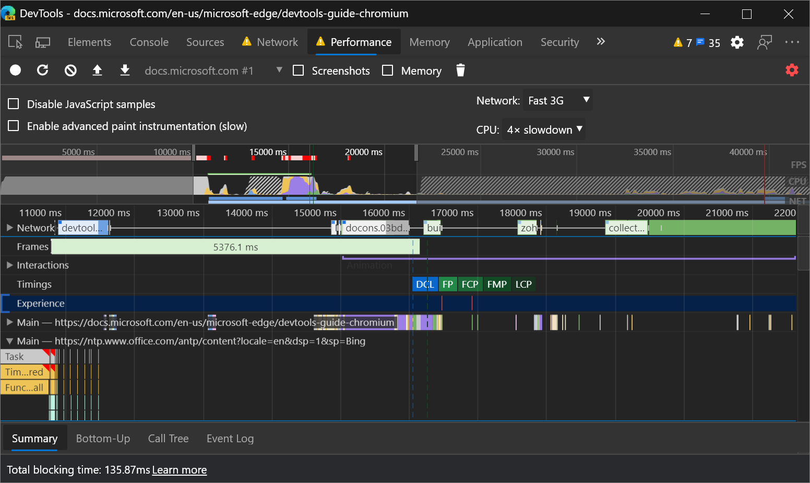
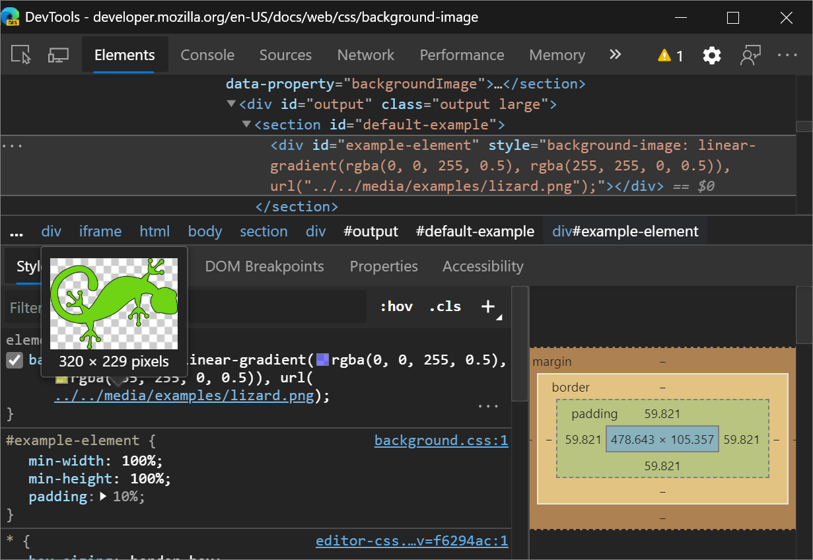

<!-- Copyright Kayce Basques

   Licensed under the Apache License, Version 2.0 (the "License");
   you may not use this file except in compliance with the License.
   You may obtain a copy of the License at

       https://www.apache.org/licenses/LICENSE-2.0

   Unless required by applicable law or agreed to in writing, software
   distributed under the License is distributed on an "AS IS" BASIS,
   WITHOUT WARRANTIES OR CONDITIONS OF ANY KIND, either express or implied.
   See the License for the specific language governing permissions and
   limitations under the License.  -->
# DevTools (Microsoft Edge 84) 中的新增功能

[!INCLUDE [Microsoft Edge team note for top of What's New](../../includes/edge-whats-new-note.md)]

<!-- ====================================================================== -->
## 来自 Microsoft Edge 开发人员工具团队公告

<!-- ====================================================================== -->
### 在高对比度模式下Windows使用 DevTools

Microsoft Edge当Windows处于高对比度模式时，DevTools 现在以高对比度模式显示。

[按照说明在Windows中启用高对比度模式](https://support.microsoft.com/help/4026951/windows-10-turn-high-contrast-mode-on-or-off)。  若要在Microsoft Edge中打开 DevTools，请选择`F12`或 `Ctrl``I`+`Shift`+。  DevTools 以高对比度模式显示。

注意：DevTools 目前支持Windows的高对比度模式，但不支持macOS。

Chromium问题 [#1048378](https://crbug.com/1048378)

另请参阅：
* [将颜色主题应用于开发工具](../../../customize/theme.md)
* [检查深色主题和浅主题的对比度问题](../../../accessibility/test-dark-mode.md)

<!-- ====================================================================== -->
### 将 DevTools 中的键盘快捷方式匹配为Visual Studio Code

从[反馈](../../../contact.md)和[Chromium公共问题跟踪器](https://bugs.chromium.org/p/chromium/issues/list)中，Microsoft Edge DevTools 团队了解到你希望能够在 DevTools 中自定义键盘快捷方式。  在 Microsoft Edge 84 中，现在可以将 DevTools 中的键盘快捷方式与[Visual Studio Code](https://code.visualstudio.com/)匹配，这只是团队为快捷自定义而使用的功能之一。

若要尝试此试验，请执行以下操作：

1. 在 DevTools 中，通过选择`?`或选择  DevTools 右上角的图标。

1. 在 **“试验** ”部分中，选择 **“启用自定义键盘快捷方式设置”选项卡 (需要重新加载) **。

1. 重新加载 DevTools。

1. 再次**打开设置**，然后选择 **“快捷方式”** 部分。

1. 单击预设下拉列表**中的“匹配”快捷方式**，选择 **“DevTools (默认) **”，然后选择**Visual Studio Code**。  

DevTools 中的键盘快捷方式现在与Visual Studio Code中等效操作的快捷方式匹配。

例如，在[Visual Studio Code](https://code.visualstudio.com/shortcuts/keyboard-shortcuts-windows.pdf)中暂停或继续运行脚本的键盘快捷方式是`F5`。  使用 **DevTools (默认) **预设，DevTools 中的同一快捷方式是`F8`，但**使用Visual Studio Code**预设时，该快捷方式现在也是`F5`。

此功能当前在 Microsoft Edge 84 中作为试验提供，因此请与团队分享[反馈](../../../contact.md)！

Chromium问题 [#174309](https://crbug.com/174309)

另请参阅：
* [自定义键盘快捷方式](../../../customize/shortcuts.md)

<!-- ====================================================================== -->
### 远程调试 Surface Duo 仿真器

现在，可以使用 Microsoft Edge DevTools 的全部功能远程调试 [Surface Duo 模拟器](/dual-screen/android/use-emulator)中运行的 Web 内容。

使用 Surface Duo 仿真器，可以测试 Web 内容在可折叠和双屏设备的新类上呈现的方式。  模拟器运行Android操作系统，并提供[Microsoft Edge Android应用](https://play.google.com/store/apps/details?id=com.microsoft.emmx)。  在[Microsoft Edge应用](https://play.google.com/store/apps/details?id=com.microsoft.emmx)中加载 Web 内容，并使用 DevTools 对其进行调试：

`edge://inspect` Microsoft Edge桌面实例中的页面显示 **SurfaceDuoEmulator**，其中包含在 Surface Duo 模拟器上运行的打开选项卡或 [PVA](../../../../progressive-web-apps-chromium/index.md) 的列表：

单击**检查**要调试的选项卡或PWA，打开 DevTools。  按照分步指南在 Surface Duo 模拟器上远程调试 Web 内容： [远程调试 Surface Duo 仿真器](../../../remote-debugging/surface-duo-emulator.md)。

<!-- ====================================================================== -->
### 更轻松地调整 DevTools 抽屉的大小

在 Microsoft Edge 83 或更早版本中，通过将鼠标悬停在抽屉的工具栏内来调整 [DevTools 抽屉](../../../customize/index.md#drawer)的大小。  抽屉的行为不同于 DevTools 中窗格的其他调整大小控件，你将鼠标悬停在窗格边框上以调整其大小。  下图显示了在版本 83 或更低版本 Microsoft Edge中调整抽屉大小的工作原理：

从 Microsoft Edge 84 开始，可以通过将鼠标悬停在边框上来调整抽屉的大小。  此更改将调整 DevTools 抽屉大小的行为与 DevTools 中的其他窗格保持一致。 下图显示了在 Microsoft Edge 84 或更高版本中调整抽屉大小的工作原理：

Chromium问题 [#1076112](https://crbug.com/1076112)

<!-- ====================================================================== -->
### 屏幕广播导航按钮显示焦点

远程调试[Android设备](../../../remote-debugging/index.md)、[Windows 10或更高版本设备或](../../../remote-debugging/windows.md) [Surface Duo 模拟器](../../../remote-debugging/surface-duo-emulator.md)时，可以使用 DevTools 左上角的图标。  启用了屏幕广播后，可以从 DevTools 窗口在远程设备上的Microsoft Edge中导航选项卡。

在 Microsoft Edge 84 中，这些导航按钮现在也可使用键盘访问。  例如，从屏幕截图 URL 栏按 `Shift`+`Tab` 下焦点将焦点放在 **“刷新** ”按钮上：

Chromium问题 [#1081486](https://crbug.com/1081486)

<!-- ====================================================================== -->
### 现在可访问“网络面板详细信息”窗格

在 Microsoft Edge 84 中，“**网络**”工具中的[“详细信息”窗格](../../../network/index.md#inspect-the-details-of-the-resource)现在会在为[网络日志](../../../network/index.md#log-network-activity)中的资源打开它时占据焦点。  此更改允许屏幕阅读器读出内容并与“ **详细信息** ”窗格的内容进行交互。

Chromium 问题 [#963183](https://crbug.com/963183)

<!-- ====================================================================== -->
<!-- ====================================================================== -->
## 来自 Chromium 项目的公告

以下部分将公布Microsoft Edge 84 中为开放源代码 Chromium项目提供的其他功能。

<!-- ====================================================================== -->
### 修复 DevTools 抽屉中新问题工具的站点问题

DevTools 底部抽屉中的新 **问题** 工具可减少 **控制台**的通知疲劳和混乱。  目前，**控制台**是网站开发人员、库、框架和Microsoft Edge记录消息、警告和错误的中心位置。  **“问题**”工具以结构化、聚合和可操作的方式聚合来自浏览器的警告。  **“问题**”工具链接到 DevTools 中受影响的资源，并提供有关如何解决问题的指导。

随着时间的推移， **问题工具中** 会显示更多警告，而不是在 **控制台**中显示，以简化 **控制台** 消息。

若要开始，请 [参阅使用“问题”工具查找和修复问题](../../../issues/index.md)。

Chromium问题 [#1068116](https://crbug.com/1068116)

<!-- ====================================================================== -->
### 在“检查模式”工具提示中查看辅助功能信息

**“检查模式**”工具提示现在指示元素是否具有可访问的[名称和角色](https://webhint.io/docs/user-guide/hints/hint-axe/name-role-value/)，并且可[使用键盘。](https://webhint.io/docs/user-guide/hints/hint-axe/keyboard/)

<!--todo:  add link inspect mode tooltip (WebdevCls) when section is live  -->
<!--todo:  add link name and role (WebdevLabelsText) when section is live  -->
<!--todo:  add link keyboard-focusable (WebdevControlFocus) when section is live  -->

Chromium问题 [#1040025](https://crbug.com/1040025)

另请参阅：
* [使用检查工具分析页面](../../../css/inspect.md)

<!-- ====================================================================== -->
### 性能面板更新

另请参阅：
* [性能功能参考](../../../evaluate-performance/reference.md)

<!-- ====================================================================== -->
#### 在页脚中查看总阻塞时间信息

录制负载性能后， **性能** 面板现在会在页脚中显示总阻塞时间 (TBT) 信息。  TBT 是一种负载性能指标，可帮助量化页面可用所需的时间。  TBT 实质上衡量 _页面似乎仅_ 可用 (的时间，因为内容将呈现到屏幕) ;但是页面实际上不可用，因为 JavaScript 阻止了主线程，因此页面不会响应用户输入。  TBT 是近似第一次输入延迟的主要指标。

<!--todo:  add link Total Blocking Time (TBT) (WebdevTbt) when section is live  -->
<!--todo:  add link lab metric (WebdevMeasureSpeedLabField) when section is live  -->
<!--todo:  add link Core Web Vitals (WebdevCoreWebVitals) when section is live  -->

若要获取总阻塞时间信息，请不要使用 **“刷新页面刷新”页** 用于记录页面加载性能的工作流。

而是选择 **“记录记录**手动重新加载页面，等待页面加载，然后停止录制。

如果`Total Blocking Time: Unavailable`显示，Microsoft Edge DevTools 未从Microsoft Edge中的内部分析数据获取所需的信息。

Chromium问题 [#1054381](https://crbug.com/1054381)

另请参阅：
* [性能功能参考](../../../evaluate-performance/reference.md)

<!-- ====================================================================== -->
#### 新“体验”部分中的“布局班次”事件

**“性能**”面板的新 **“体验**”部分可帮助你检测布局变化。  累积布局转移 (CLS) 是一个指标，可帮助你量化不需要的视觉不稳定性。

<!--todo:  add link Core Web Vitals (WebdevCoreWebVitals) when section is live  -->
<!--todo:  add link layout shifts (WebdevCls) when section is live  -->

单击 **“布局转移** ”事件可在“ **摘要** ”窗格中显示布局移位的详细信息。  将鼠标悬停在 **“已移动** ”位置，并 **移到** 字段以可视化布局移位发生的位置。

另请参阅：
* [性能功能参考](../../../evaluate-performance/reference.md)

<!-- ====================================================================== -->
### 控制台中更准确的承诺术语

日志记录 `Promise`时， **控制台** 错误地提供了 `PromiseStatus` 设置为 `resolved`的值。

**控制台**现在使用与规范一致的`Promise`术语`fulfilled`。  有关规范的`Promise`详细信息，请参阅[GitHub上的状态和命运](https://github.com/domenic/promises-unwrapping/blob/master/docs/states-and-fates.md)。<!-- changing master to main doesn't work 5/19/2022 -->

V8 问题 [#6751](https://bugs.chromium.org/p/v8/issues/detail?id=6751)

另请参阅：
* [控制台概述](../../../console/index.md)

<!-- ====================================================================== -->
### 样式窗格更新

另请参阅：
* [在“样式”窗格中编辑 CSS 字体样式和设置](../../../inspect-styles/edit-fonts.md)

<!-- ====================================================================== -->
#### 支持还原关键字

样 **式** 窗格的自动完成 UI 现在检测 [还原](https://developer.mozilla.org/docs/Web/CSS/revert) CSS 关键字，该关键字将属性的级联值还原为应用于元素样式的上一个值。

Chromium问题 [#1075437](https://crbug.com/1075437)

另请参阅：
* [在“样式”窗格中编辑 CSS 字体样式和设置](../../../inspect-styles/edit-fonts.md)

<!-- ====================================================================== -->
#### 图像预览

将鼠标悬停在“**样式**”窗格中的值上`background-image`，以在工具提示中显示图像的预览。

Chromium问题 [#1040019](https://crbug.com/1040019)

另请参阅：
* [在“样式”窗格中编辑 CSS 字体样式和设置](../../../inspect-styles/edit-fonts.md)

<!-- ====================================================================== -->
#### 颜色选取器现在使用空格分隔功能颜色表示法

[CSS 颜色模块级别 4](https://drafts.csswg.org/css-color#changes-from-3) 指定颜色函数（例如 `rgb()`）应支持空格分隔参数。  例如，`rgb(0, 0, 0)` 与 `rbg(0 0 0)` 等效。

使用 [颜色选取器](../../../css/reference.md#change-colors-with-the-color-picker) 选择颜色或在“ **样式** ”窗格中的颜色表示形式之间通过保留 `Shift` 和选择 `background-color` 值进行交替时，将显示空格分隔参数语法。

还应在 **“计算** ”窗格和“ **检查模式** ”工具提示中显示语法。

Microsoft Edge DevTools 使用新语法，因为即将推出的 CSS 功能（如[颜色 () ](https://drafts.csswg.org/css-color#the-color-property)）不支持已弃用的逗号分隔参数语法。

一段时间以来，大多数浏览器都支持空格分隔参数语法。  是否 [可以使用：空格分隔功能颜色表示号？](https://caniuse.com/#feat=mdn-css_types_color_space_separated_functional_notation)

Chromium问题 [#1072952](https://crbug.com/1072952)

<!-- ====================================================================== -->
### 在“元素”面板中弃用“属性”窗格

**“元素**”工具中的 **“属性**”窗格已弃用。  改为在**控制台**中运行`console.dir($0)`。

#### 参考

* [console.dir () ](../../../console/api.md#dir)
* [$0](../../../console/utilities.md#recently-selected-element-or-javascript-object)

<!-- ====================================================================== -->
### 清单窗格中的应用快捷方式支持

在 **应用程序工具** 中，“ **清单”** 页现在显示应用快捷方式。  应用快捷方式可帮助用户快速启动 Web 应用中的常见或推荐任务。  应用快捷方式菜单仅显示在用户桌面或移动设备上安装的渐进式Web 应用。

<!-- For more information, see [Get things done quickly with app shortcuts](https://alphabet-dev/app-shortcuts). -->

<!--todo: add link Get things done quickly with app shortcuts (WebdevAppShortcuts) when section is live -->

另请参阅：
* [渐进式 Web 应用 （PWA） 概述](../../../../progressive-web-apps-chromium/index.md)
* [调试渐进式 Web 应用 (PWA)](../../../progressive-web-apps/index.md)

<!-- ====================================================================== -->
> [!NOTE]
> 此页面的某些部分是根据 [Google 创建和共享的](https://developers.google.com/terms/site-policies)作品所做的修改，并根据[ Creative Commons Attribution 4.0 International License ](https://creativecommons.org/licenses/by/4.0)中描述的条款使用。
> 原始页面位于[此处](https://developer.chrome.com/blog/new-in-devtools-84)，由 [Kayce Basques](https://developers.google.com/web/resources/contributors#kayce-basques)\（Chrome DevTools 和 Lighthouse 的技术作家）撰写。

本作品根据[ Creative Commons Attribution 4.0 International License ](https://creativecommons.org/licenses/by/4.0)获得许可。
