<!-- Copyright Jecelyn Yeen

   Licensed under the Apache License, Version 2.0 (the "License");
   you may not use this file except in compliance with the License.
   You may obtain a copy of the License at

       https://www.apache.org/licenses/LICENSE-2.0

   Unless required by applicable law or agreed to in writing, software
   distributed under the License is distributed on an "AS IS" BASIS,
   WITHOUT WARRANTIES OR CONDITIONS OF ANY KIND, either express or implied.
   See the License for the specific language governing permissions and
   limitations under the License.  -->
# DevTools (Microsoft Edge 85) 中的新增功能

[!INCLUDE [Microsoft Edge team note for top of What's New](../../includes/edge-whats-new-note.md)]

<!-- ====================================================================== -->
## 来自 Microsoft Edge 开发人员工具团队公告

<!-- ====================================================================== -->
### CSS 网格调试功能

Microsoft Edge DevTools 团队正在与 Chrome DevTools 团队和Chromium社区合作，向 DevTools 添加新的 CSS 网格调试功能。  现在，可以将网格线号、网格间隙和扩展网格线显示为页面覆盖。  此外，即将对网格工具进行更多改进。

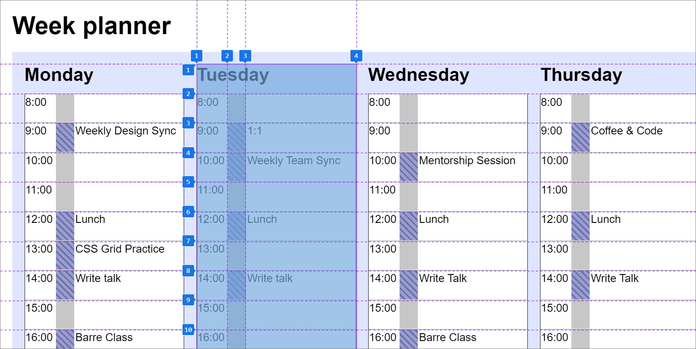

更新：此功能已发布，不再具有实验性。<!-- To enable the experiment, see [Turning an experiment on or off](../../../experimental-features/index.md#turning-an-experiment-on-or-off) and select the checkbox next to **Enable new CSS Grid debugging features**. -->

若要使用示例试用试验，请参阅 [CSS 网格规划器示例](https://codepen.io/hxlnt/full/YzwBzKM)。

Chromium问题 [#1047356](https://crbug.com/1047356)

另请参阅：
* [检查 CSS 网格](../../../css/grid.md)

<!-- ====================================================================== -->
### 使用网络控制台编辑和重播请求

现在可以使用**网络控制台**对[网络日志](../../../network/index.md#log-network-activity)中的请求使用**编辑和重播**。  打开 [网络日志](../../../network/index.md#log-network-activity)，右键单击，然后选择 **“编辑”和“重播**”

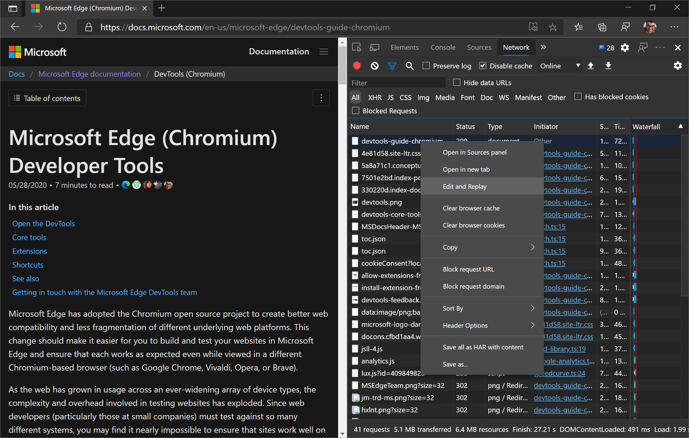

新面板“ **网络控制台** ”将在 [DevTools 抽屉](../../../customize/index.md#drawer) 中打开，并自动填充 HTTP 请求的信息。  若要显示从服务器返回的响应，请根据需要编辑请求 () 并选择 **“发送**”。

还可以使用 **网络控制台** 直接从 DevTools 创建和发送 HTTP 请求。

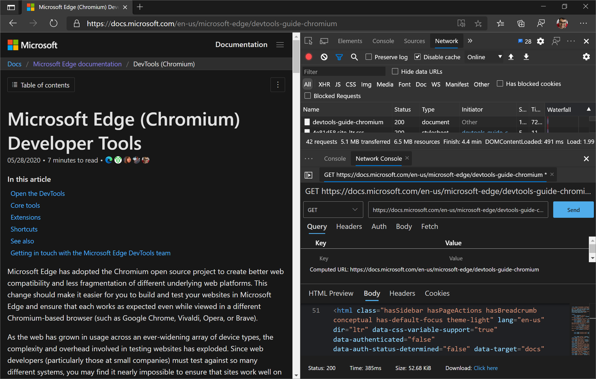

提示：若要在主 (顶部) 面板（而不是 [DevTools 抽屉](../../../customize/index.md#drawer)）中显示**网络控制台**，请参阅[面板之间的移动工具](#move-tools-between-panels)。

更新：此功能已发布，不再具有实验性。<!-- To enable the experiment, see [Turning an experiment on or off](../../../experimental-features/index.md#turning-an-experiment-on-or-off) and select the checkbox next to **Enable Network Console**. -->

Chromium问题 [#1093687](https://crbug.com/1093687)

<!-- ====================================================================== -->
### “计时”选项卡中的服务辅助角色响应与事件

**“网络**”工具的 **“计时**”选项卡现在包含`respondWith`服务辅助角色事件。  服务`respondWith`辅助角色事件显示从服务辅助角色`fetch`事件处理程序开始运行之前的持续时间到处理程序承诺`fetch`的解决时间`respondWith`。

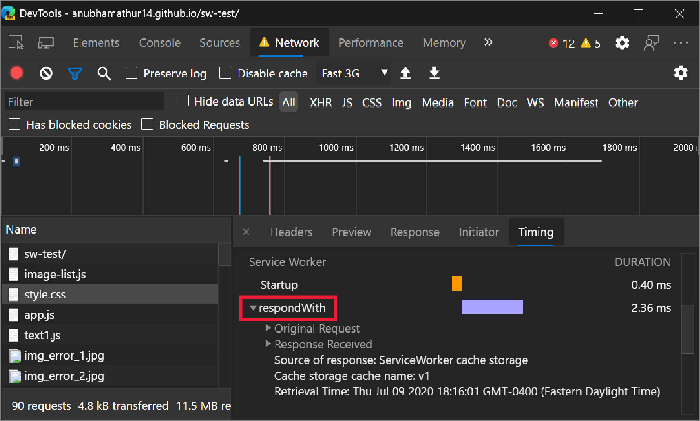

展开**收到的响应**，以显示响应中`fetch`的其他信息，例如`CacheStorageCacheName`，`ResponseTime``serviceWorkerResponseSource`

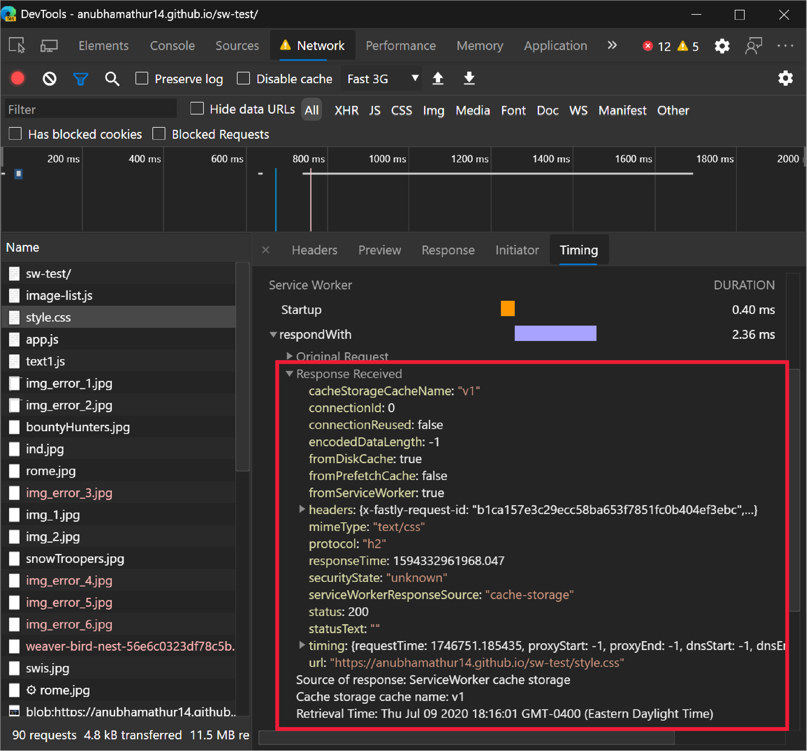

Chromium问题 [#1066579](https://crbug.com/1066579)

另请参阅：
* 在_网络功能参考_中[显示请求的计时关系](../../../network/reference.md#display-the-timing-relationship-of-requests)。
* 在_网络功能参考_中[显示请求的计时细目](../../../network/reference.md#display-the-timing-breakdown-of-a-request)。

<!-- ====================================================================== -->
### 问题面板中的 webhint 反馈

<!-- valid 05/13/2022 -->

[webhint](https://webhint.io) 是一种开源工具，提供有关网站的辅助功能、跨浏览器兼容性、安全性、性能、PVA 和其他常见 Web 开发问题的实时反馈。  可以在 [“问题](../../../issues/index.md) ”面板中查看 Webhint 反馈。

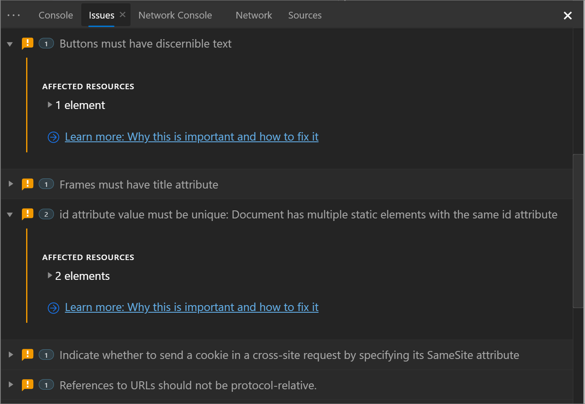

若要启用试验，请参阅 [打开或关闭试验](../../../experimental-features/index.md#turning-an-experiment-on-or-off) ，然后选中 **“启用 Webhint”旁边的**复选框。  打开 [“问题](../../../issues/index.md) ”面板以显示来自 Webhint 的反馈。

Chromium问题 [#1070378](https://crbug.com/1070378)

另请参阅：
* [适用于Visual Studio Code的 webhint 扩展](../../../../test-and-automation/webhint.md)
* 在_实验功能_中[启用 Webhint](../../../experimental-features/index.md#enable-webhint)

<!-- ====================================================================== -->
### 在面板之间移动工具

通常， **元素** 和 **网络** 等工具只能在 DevTools 的主 (顶部) 面板中打开。  同样， **3D 视图** 和 **问题** 等工具只能在开发工具的抽屉 (底部) 面板中打开。  现在，可以通过在顶部和底部面板之间移动工具来自定义 DevTools 布局。

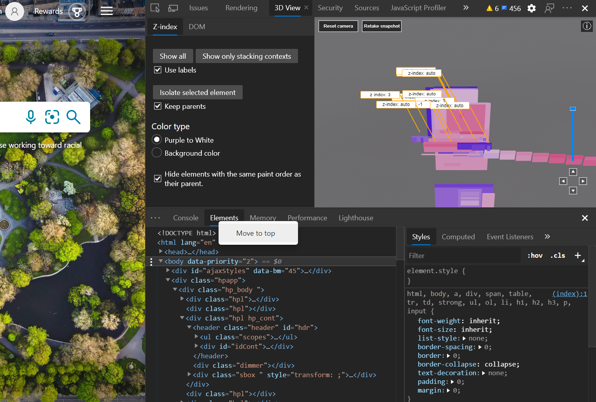

更新：此功能已发布，不再具有实验性。<!-- Note: To enable the experiment, see [Turning an experiment on or off](../../../experimental-features/index.md#turning-an-experiment-on-or-off) and select the checkbox next to **Enable support to move tabs between panels**. -->

Chromium问题 [#897944](https://crbug.com/897944)

另请参阅：
* 关于 _DevTools 概述_中的[面板和抽屉工具](../../../overview.md#about-panel-and-drawer-tools)。

<!-- ====================================================================== -->
### 改进了网络面板中的发起程序工具提示

在 Microsoft Edge 83 和 84 中，使用水平滚动条显示的[网络日志](../../../network/index.md#log-network-activity)中“发起程序”列的工具提示（显示资源请求的原因）。  只能通过在工具提示中水平滚动来显示启动请求的调用堆栈。

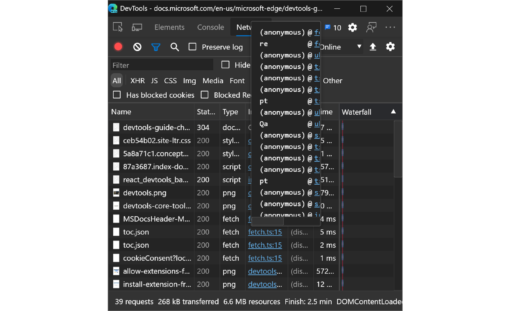

从 Microsoft Edge 85 开始，现在可以在工具提示中显示发起程序调用堆栈，而无需水平滚动。

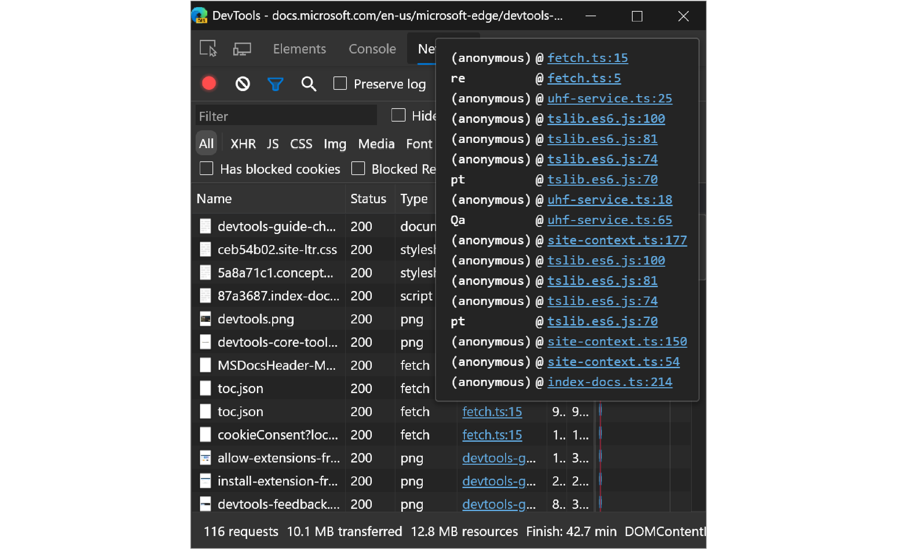

Chromium问题 [#1069404](https://crbug.com/1069404)

<!-- ====================================================================== -->
## 来自 Chromium 项目的公告

以下部分将公布Microsoft Edge 85 中为开放源代码 Chromium项目提供的其他功能。

<!-- ====================================================================== -->
### CSS-in-JS 框架的样式编辑

“ **样式** ”窗格现在更好地支持使用 [CSS 对象模型 (CSSOM) ](https://drafts.csswg.org/cssom) API 创建的编辑样式。  许多 CSS in-JS 框架和库使用引擎盖下的 CSSOM API 来构造样式。

现在可以使用 [可构造样式表](https://wicg.github.io/construct-stylesheets/)编辑 JavaScript 中添加的样式。  可构造样式表是使用 [Shadow DOM](https://developer.mozilla.org/docs/Web/Web_Components/Using_shadow_DOM) 时创建和分发可重用样式的新方法。

例如， `h1` 使用 (CSSOM API 添加 `CSSStyleSheet` 的样式) 以前不可编辑。  样式现在可在“ **样式** ”面板中进行编辑。

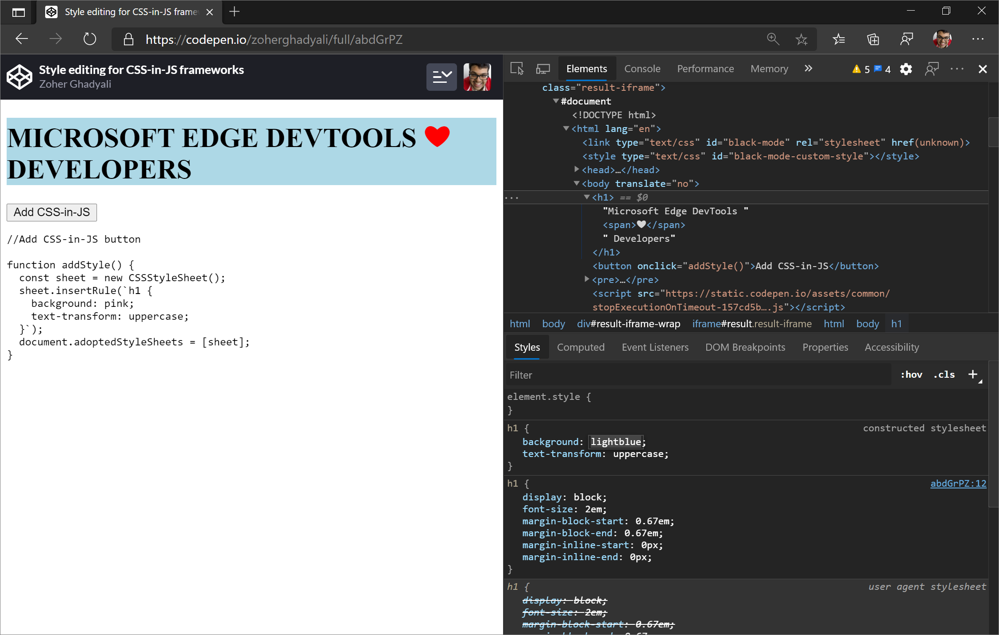

尝试 [使用 CSS in-JS 的示例](https://codepen.io/zoherghadyali/full/abdGrPZ)，尝试使用此功能。  请参阅 [CSS in-JS 框架的样式编辑](../../../css/css-in-js.md)。

Chromium问题 [#946975](https://crbug.com/946975)

<!-- ====================================================================== -->
### 灯塔面板中的灯塔 6

**灯塔**面板现在运行灯塔 6。  有关所有更改的完整列表，请参阅 [v6.0.0 发行说明](https://github.com/GoogleChrome/lighthouse/releases/tag/v6.0.0)。

Lighthouse 6.0 为报表引入了三个新指标：最大的内容画图 (LCP) 、累积布局转移 (CLS) 和总阻塞时间 (TBT) 。

性能分数公式也已重新加权，以更好地反映用户的加载体验。

Chromium问题 [#772558](https://crbug.com/772558)

另请参阅：
* [Lighthouse 工具](../../../lighthouse/lighthouse-tool.md)

#### 第一个有意义的画图弃用

第一个有意义的画图 (FMP) 在 Lighthouse 6.0 中弃用。  FMP 也已从 **“性能”** 面板中删除。  **建议将最大的内容画图**替换为 FMP。  <!--For an explanation of why it was deprecated, see [First Meaningful Paint](https://web.dev/first-meaningful-paint).  -->

<!--todo: add Largest Contentful Paint when section available  -->
<!--todo: add First Meaningful Paint link and note when available  -->

Chromium问题 [#1096008](https://crbug.com/1096008)

另请参阅：
* [Lighthouse 工具](../../../lighthouse/lighthouse-tool.md)

<!-- ====================================================================== -->
### 支持新的 JavaScript 功能

DevTools 现在对一些最新的 JavaScript 语言功能有更好的支持：

* [可选链接](https://v8.dev/features/optional-chaining) 语法自动完成。  **控制台**中的属性自动完成现在支持可选的链接语法，例如，`name?.`现在除了`name.`和 `name[`。

*  [专用字段](https://v8.dev/features/class-fields#private-class-fields)的语法突出显示。  私有类字段现在已在 **“源** ”面板中正确地突出显示语法，并且打印得非常漂亮。

*  [Nullish 合并运算符的](https://v8.dev/features/nullish-coalescing)语法突出显示。  DevTools 现在在 **“源** ”面板中正确地打印了 nullish 合并运算符。

Chromium问题 [#1073903](https://crbug.com/1073903)， [#1083214](https://crbug.com/1083214)， [#1083797](https://crbug.com/1083797)

另请参阅：
* [在控制台中运行 JavaScript](../../../console/console-javascript.md)
* [JavaScript 调试功能](../../../javascript/reference.md)

<!-- ====================================================================== -->
### 清单窗格中的新应用快捷方式警告

在 **应用程序工具** 中， **应用快捷方式** 可帮助用户快速启动 Web 应用中的常见或推荐任务。

<!--todo: add App shortcuts when section is live  -->

在“ **应用程序** ”工具中，“ **清单”** 窗格现在显示以下条件的警告：

*  当应用快捷方式图标小于 96x96 像素时。
*  当应用快捷方式图标和清单图标不是平方 (，因为) 忽略这些图标。

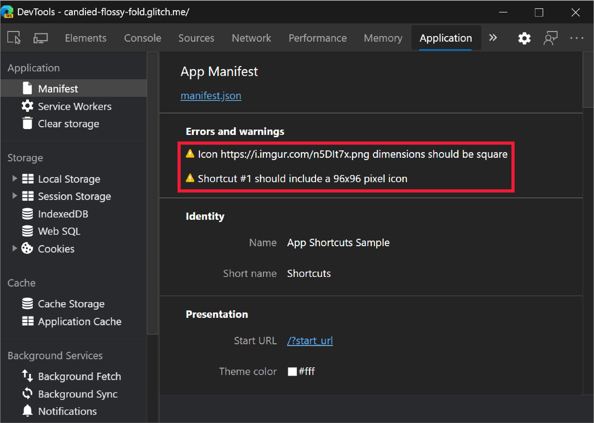

Chromium问题 [#955497](https://crbug.com/955497)

另请参阅：
* [用于管理存储的应用程序工具](../../../storage/application-tool.md)

<!-- ====================================================================== -->
### 计算窗格的一致显示

**“元素**”工具中的 **“计算**”窗格现在一致地显示为所有视区大小的窗格。  以前，当 DevTools 变窄时， **计算** 窗格合并到“ **样式** ”窗格内。

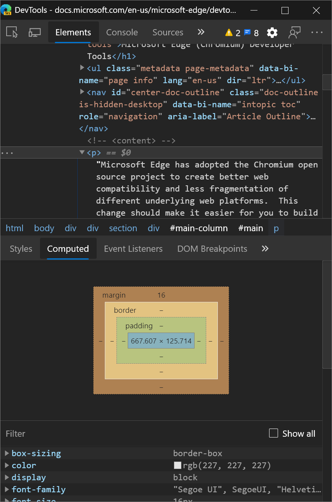

Chromium问题 [#1073899](https://crbug.com/1073899)

另请参阅：
* [仅查看实际应用于 CSS](../../../css/reference.md#view-only-the-css-that-is-actually-applied-to-an-element) _功能引用中的元素的 CSS_

<!-- ====================================================================== -->
### WebAssembly 文件的字节码偏移量

<!-- todo: in what tool? -->DevTools 现在使用字节码偏移量来显示 Wasm 反汇编的行号。  行号更清楚地表明你正在查看二进制数据，并且与 Wasm 运行时引用位置的方式更加一致。

Chromium问题 [#1071432](https://crbug.com/1071432)

另请参阅：
* [使用内存检查器工具检查 JavaScript ArrayBuffer](../../../memory-inspector/memory-inspector-tool.md)
<!-- todo: correct tool? -->

<!-- ====================================================================== -->
### 源面板中的折线复制和剪切

在 [“源”面板编辑](../../../sources/index.md#using-the-editor-pane-to-view-or-edit-files)器中执行复制或剪切时，DevTools 会复制或剪切当前内容行。

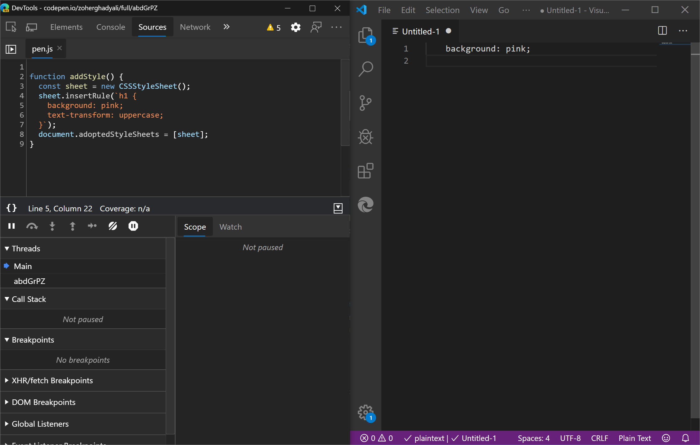

Chromium问题 [#800028](https://crbug.com/800028)

<!-- ====================================================================== -->
### 控制台设置更新

#### 取消组合相同的控制台消息

控制台中类似切换的**组**设置现在适用于重复消息。  以前，它只应用于类似的消息。

例如，以前，即使未选中“**组相似**”，DevTools 也不会取消对消息进行分组`hello`。  现在， `hello` 消息已取消分组。

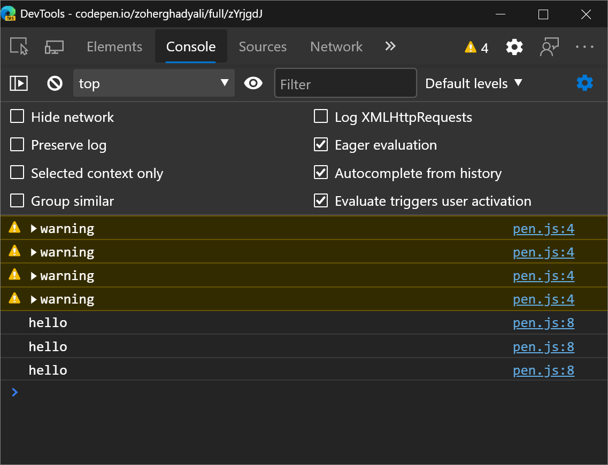

尝试使用将 [重复消息发送到控制台的示例来](https://codepen.io/zoherghadyali/full/zYrjgdJ)尝试此功能。

Chromium问题 [#1082963](https://crbug.com/1082963)

另请参阅：
* 在_控制台功能参考_中[关闭消息分组](../../../console/reference.md#turn-off-message-grouping)

<!-- ====================================================================== -->
### 仅保留所选上下文设置

现在将保留控制台设置中**仅选定的上下文**设置。  以前，每次关闭并重新打开 DevTools 时都会重置设置。  此更改使设置行为与其他控制台设置选项一致。

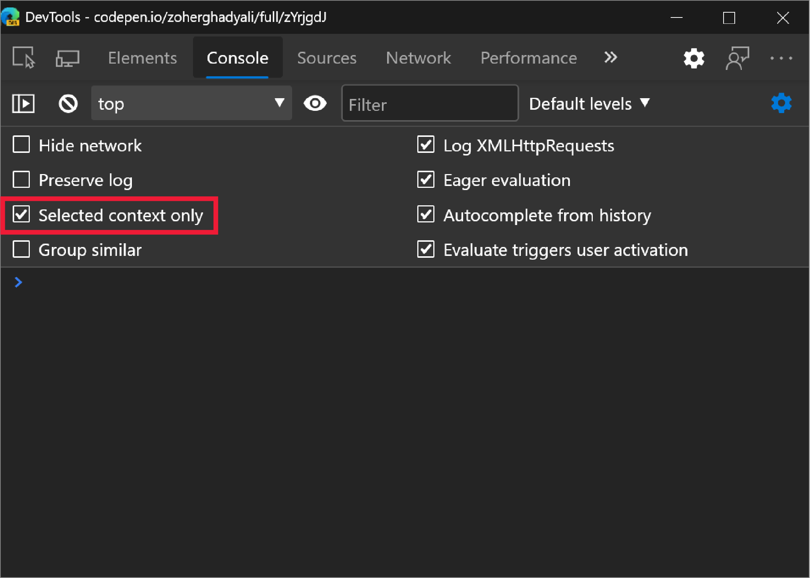

Chromium问题 [#1055875](https://crbug.com/1055875)

另请参阅：
* [筛选出来自不同上下文的消息](../../../console/reference.md#filter-out-messages-from-different-contexts) - 在_控制台功能参考_中

<!-- ====================================================================== -->
### 性能面板更新

#### **性能**工具中的 JavaScript 编译缓存信息

[JavaScript 编译缓存信息](https://v8.dev/blog/code-caching-for-devs)现在始终显示在**性能**工具的 **“摘要**”面板中。  以前，如果未发生代码缓存，DevTools 不会显示任何与代码缓存相关的内容。

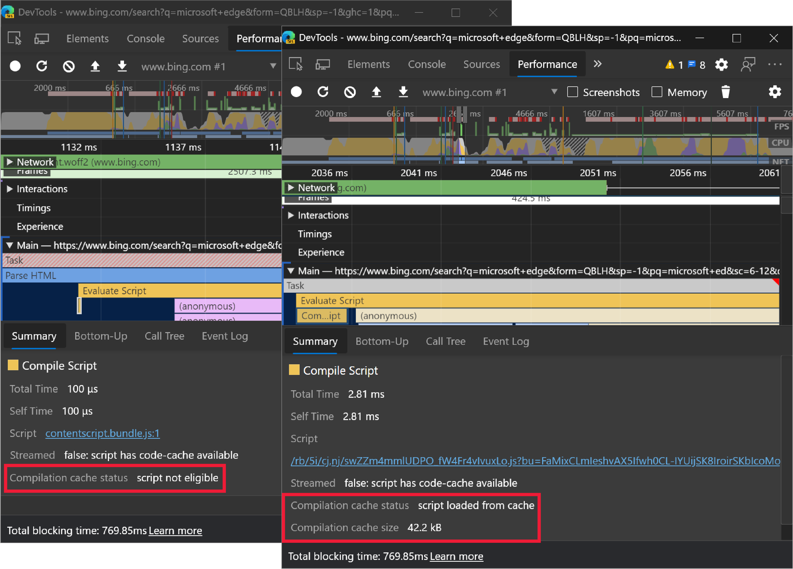

Chromium问题 [#912581](https://crbug.com/912581)

另请参阅：
* [性能功能参考](../../../evaluate-performance/reference.md)

<!-- ====================================================================== -->
#### “性能”面板中的导航计时对齐方式

以前，“ **性能”** 面板根据录制开始的时间在标尺中显示时间。  现在，用户在其中导航的录制的计时已更改。  DevTools 现在显示相对于导航的标尺时间，而不是开始录制的时间。

第一画图、第一个内容画图和最大的内容画图事件的时间`DOMContentLoaded`更新为相对于导航的开始，这意味着计时匹配所`PerformanceObserver`报告的时间。

Chromium问题 [#974550](https://crbug.com/974550)

另请参阅：
* [性能功能参考](../../../evaluate-performance/reference.md)

<!-- ====================================================================== -->
### 断点、条件断点和登录点的新图标

更新：从 2022 年起，断点现在由蓝色矩形（而不是红色圆圈）指示。

**“源**”面板有针对断点、条件断点和日志点的新设计。  断点由红色圆圈表示，就像[Visual Studio Code](https://code.visualstudio.com/)和[Visual Studio](https://visualstudio.microsoft.com/)一样。  添加图标以区分条件断点和日志点。

<!-- todo: update capture -->
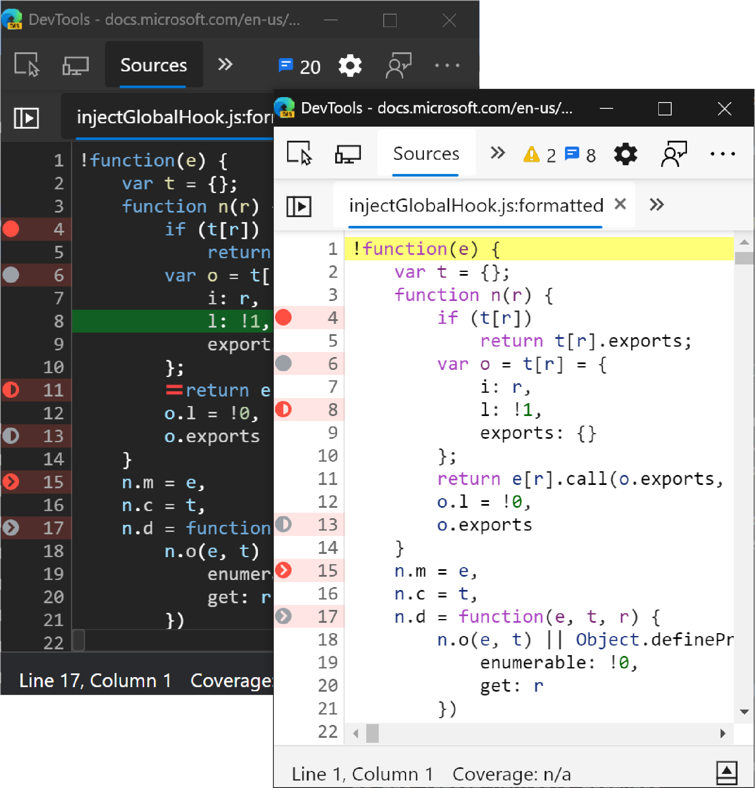

Chromium 问题 [#1041830](https://crbug.com/1041830)

另请参阅：
* [使用断点暂停代码](../../../javascript/breakpoints.md)

<!-- ====================================================================== -->
> [!NOTE]
> 此页面的某些部分是根据 [Google 创建和共享的](https://developers.google.com/terms/site-policies)作品所做的修改，并根据[ Creative Commons Attribution 4.0 International License ](https://creativecommons.org/licenses/by/4.0)中描述的条款使用。
> 原始页面位于 [此处](https://developer.chrome.com/blog/new-in-devtools-85)，并由 [Jecelyn Yeen](https://developers.google.com/web/resources/contributors#jecelyn-yeen)  \（开发人员支持者，Chrome DevTools\）制作。

本作品根据[ Creative Commons Attribution 4.0 International License ](https://creativecommons.org/licenses/by/4.0)获得许可。
