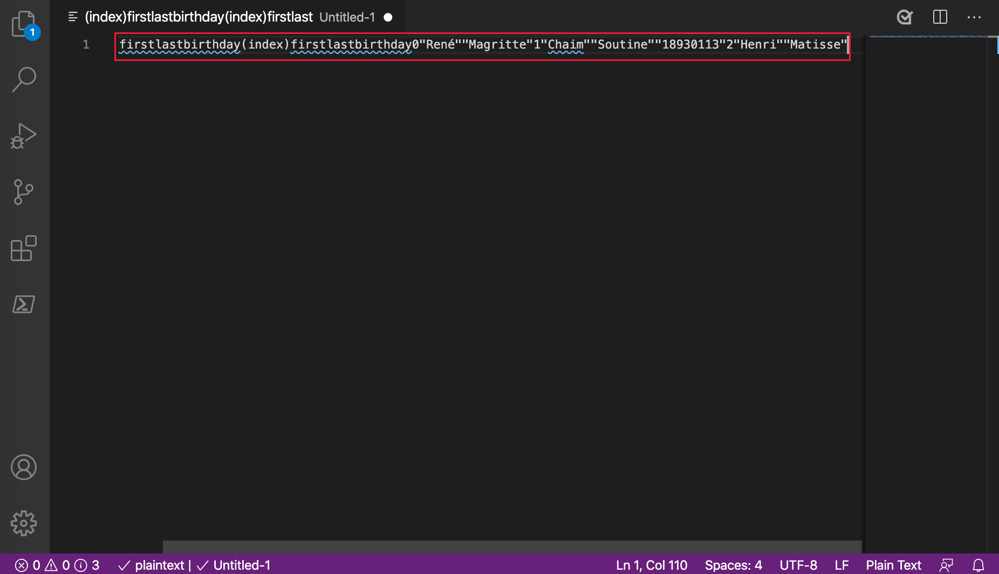
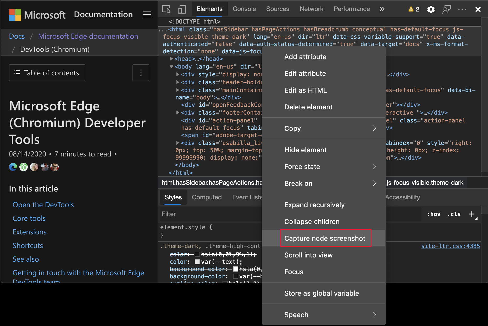
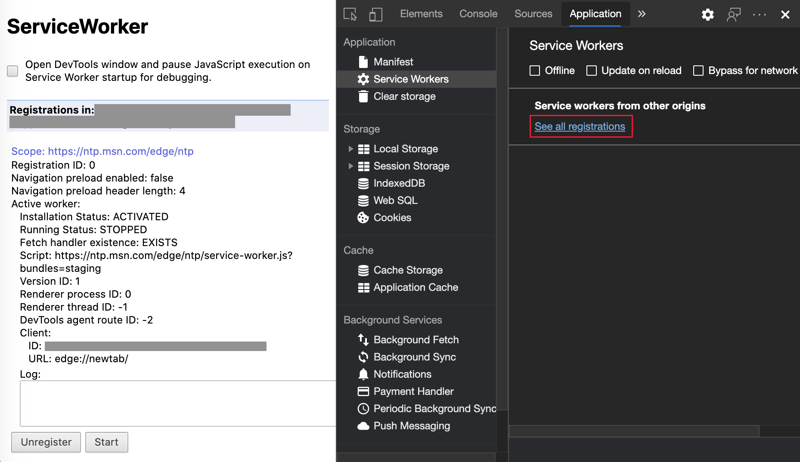
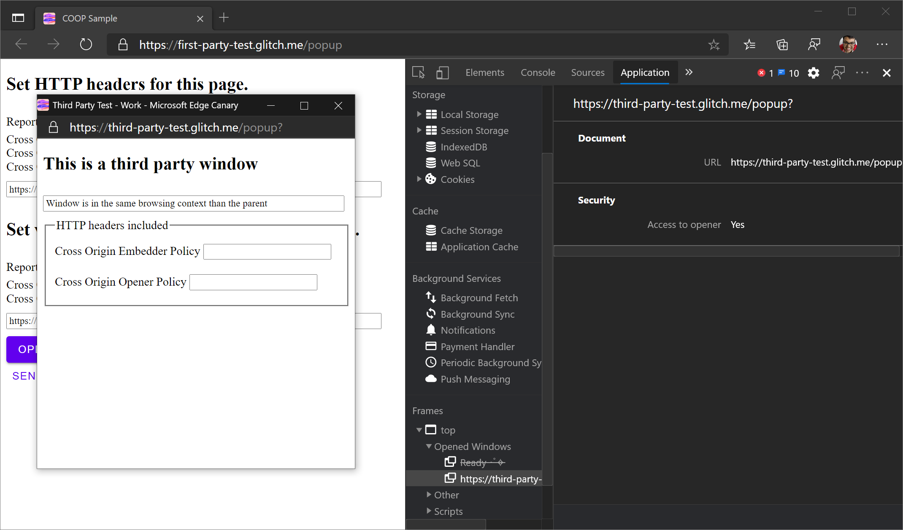
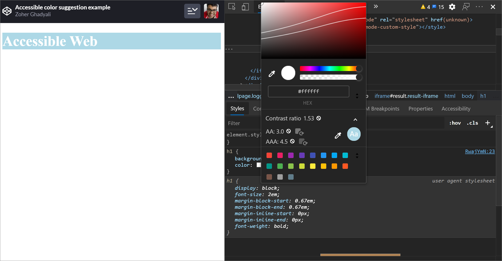
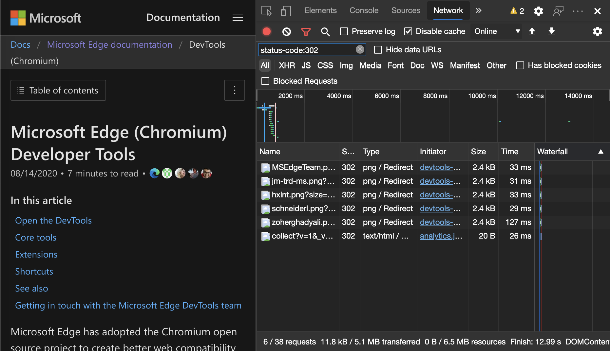

<!-- Copyright Jecelyn Yeen

   Licensed under the Apache License, Version 2.0 (the "License");
   you may not use this file except in compliance with the License.
   You may obtain a copy of the License at

       https://www.apache.org/licenses/LICENSE-2.0

   Unless required by applicable law or agreed to in writing, software
   distributed under the License is distributed on an "AS IS" BASIS,
   WITHOUT WARRANTIES OR CONDITIONS OF ANY KIND, either express or implied.
   See the License for the specific language governing permissions and
   limitations under the License.  -->
# DevTools (Microsoft Edge 86) 中的新增功能

[!INCLUDE [Microsoft Edge team note for top of What's New](../../includes/edge-whats-new-note.md)]

<!-- ====================================================================== -->
## 来自 Microsoft Edge 开发人员工具团队公告

<!-- ====================================================================== -->
### 将 DevTools 中的键盘快捷方式匹配为Visual Studio Code

在 Microsoft Edge 86 中，可以将 DevTools 中的键盘快捷方式与 [Microsoft Visual Studio Code](https://code.visualstudio.com) 中的快捷方式匹配。

若要激活此功能，请参阅 [DevTools 中的自定义键盘快捷方式](../../../customize/shortcuts.md)。

例如，在[Visual Studio Code](https://code.visualstudio.com/shortcuts/keyboard-shortcuts-windows.pdf)中暂停或继续运行脚本的键盘快捷方式是`F5`。  使用 **DevTools (默认) **预设时，DevTools 中的快捷方式相同`F8`，但是当你选择**Visual Studio Code**预设时，该快捷方式现在也是`F5`。

Chromium问题 [#174309](https://crbug.com/174309)

<!-- ====================================================================== -->
### 模拟 Surface Duo 和 Samsung Galaxy Fold

现在可以在两个新设备上测试网站或应用的外观：Microsoft Edge 中的 [Surface Duo](https://www.microsoft.com/surface/devices/surface-duo) 和 [Samsung Galaxy Fold](https://www.samsung.com/us/mobile/galaxy-fold) 。

若要帮助增强双屏和可折叠设备的网站或应用，请 [在模拟设备](../../../device-mode/index.md)时使用以下功能：

* [跨越](../../../device-mode/dual-screen-and-foldables.md)，即你的网站（或应用）跨两个屏幕显示。

* [呈现接缝](/dual-screen/introduction#how-to-work-with-the-seam)，即两个屏幕之间的空间。

*  启用实验性 Web 平台 API 以访问新的 [CSS 媒体屏幕跨越功能](/dual-screen/web/css-media-spanning) 和 [JavaScript getWindowSegments API](/dual-screen/web/javascript-getwindowsegments)。

更新：此功能已发布，不再处于实验性状态。<!-- To turn on this experimental feature, see [Turning an experiment on or off](../../../experimental-features/index.md#turning-an-experiment-on-or-off) and select the checkbox next to **Emulation: Support dual screen mode**. -->

另请参阅：
*  [在 Microsoft Edge DevTools 中模拟双屏和可折叠设备](../../../device-mode/dual-screen-and-foldables.md)

Chromium问题： [#1054281](https://crbug.com/1054281)

<!-- ====================================================================== -->
### CSS 网格覆盖改进和新的实验性网格功能

Microsoft Edge DevTools 团队和 Chrome DevTools 团队协作开发其他功能。  新功能包括多个覆盖层，这些覆盖层是持久性的，可从 **Elements** 工具上的新**布局**窗格中进行配置：

更新：此功能已发布，不再处于实验性状态。<!-- To turn on this experimental feature, see [Turning an experiment on or off](../../../experimental-features/index.md#turning-an-experiment-on-or-off) and select the checkbox next to **Enable new CSS Grid debugging features (configuration options available in Layout sidebar pane in Elements after restart)**. -->

另请参阅：
* _DevTools (Microsoft Edge 85) 中的新增功能中的 _[CSS 网格调试功能](../06/devtools.md#css-grid-debugging-features)。
* [检查 Microsoft Edge DevTools 中的 CSS 网格](../../../css/grid.md)。

Chromium问题： [#1047356](https://crbug.com/1047356)

<!-- ====================================================================== -->
### 从控制台复制的表保留格式设置

在 Microsoft Edge 85 或更早版本中，在 **控制台**中，复制的格式 `console.table` <!--where, what tool?--> 丢失了  如果从 [表](../../../console/api.md#table) 控制台 API 复制了输出并粘贴了输出，则只保留该表的文本。

`table` Microsoft Edge 85 或更低版本中的控制台 API 输出：

`table` Microsoft Edge 85 或更早版本的控制台 API 输出粘贴到Visual Studio Code：

在 Microsoft Edge 86 或更高版本中，从 **控制台**复制表时，现在会保留格式。

`table` Microsoft Edge 86 或更高版本中的控制台 API 输出：

`table` Microsoft Edge 86 或更高版本的控制台 API 输出粘贴到Visual Studio Code：

Chromium问题： [#1115011](https://crbug.com/1115011)

另请参阅：
* [控制台功能参考](../../../console/reference.md)

<!-- ====================================================================== -->
### 用于更轻松的辅助功能测试的源订单查看器

新的辅助功能帮助程序显示元素驻留在源文件中的顺序：

通过此功能，可以更轻松地测试屏幕阅读器和键盘用户体验网站或应用的方式。  屏幕阅读器和键盘导航取决于在网站或应用的源代码中按特定顺序放置的内容，以便它与呈现的页面匹配。  源订单查看器在呈现的页面和源代码之间按顺序显示潜在的差异。

更新：此功能已发布，不再处于实验性状态。<!-- To turn on this experimental feature, see [Turning an experiment on or off](../../../experimental-features/index.md#turning-an-experiment-on-or-off) and select the checkbox next to **Enable Source Order Viewer**. -->

另请参阅：
* [使用源订单查看器测试键盘支持](../../../accessibility/test-tab-key-source-order-viewer.md)

Chromium问题： [#1094406](https://crbug.com/1094406)

<!-- ====================================================================== -->
<!--
### DevTools language enhancements

Your feedback and internal discoveries uncovered which text strings used in the Microsoft Edge feedback should remain untranslated or create confusion when translated.

Microsoft Edge DevTools 85 and earlier in Traditional Chinese:

Microsoft Edge DevTools 86 or later in Traditional Chinese:

To meet your translation needs, the Microsoft Edge DevTools team is focused on improving translation quality.

The current effort to improve translation quality enables easier support for more languages in the future.

See also:
* [Change DevTools language settings](https://docs.microsoft.com/microsoft-edge/devtools-guide-chromium/customize/localization)
-->

<!-- ====================================================================== -->
### 在“元素”工具中突出显示所有搜索结果

在 Microsoft Edge 84 和 85 中， **Elements** 工具中的第一个搜索结果没有突出显示。  其余搜索结果已正确突出显示。

感谢你发送反馈并帮助改进Chromium。  反馈在开源[Chromium](https://crbug.com/1103316)项目中发现了问题 #1103316。

此问题现已在所有版本的 Microsoft Edge 中得到解决。

Chromium问题： [#1103316](https://crbug.com/1103316)

另请参阅：
* 在_开始查看和更改 DOM 中_[搜索节点](../../../dom/index.md#search-for-nodes)

<!-- ====================================================================== -->
## 来自 Chromium 项目的公告

以下部分将公布 Microsoft Edge 中已组成开源 Chromium 项目的其他可用功能。

<!-- ====================================================================== -->
### 新建媒体工具

DevTools 现在在媒体工具中显示 [媒体](../../../media-panel/index.md) 播放器信息。

若要打开新的**媒体**工具，请选择“) >**更多工具** > **媒体**” (`...` **自定义和控制 DevTools**。

在 DevTools 中的新 **媒体** 工具之前，有关视频播放器的日志记录和调试信息位于 **“最近玩家** ”设置下。  若要打开 **“最近玩家** ”设置，请转到 `edge://media-internals` “玩家”工具，然后选择 **“玩家** ”工具。

查看实时内容并更快地检查潜在问题，例如调查：
*  为何删除帧。
*  为什么 JavaScript 以意外的方式与玩家交互。

<!-- ====================================================================== -->
### 使用“元素”工具上下文菜单捕获节点屏幕截图

现在，可以使用 **“元素** ”工具中的右键单击菜单捕获节点屏幕截图。

例如，若要拍摄目录的屏幕截图，请右键单击该元素，然后选择 **“捕获节点”屏幕截图**。

Chromium问题： [#1100253](https://crbug.com/1100253)

另请参阅：
* 在 _DevTools (Microsoft Edge 89) 中的新增功能中_捕获[视区之外的节点屏幕截图](../../2021/01/devtools.md#capture-node-screenshot-beyond-viewport)

<!-- ====================================================================== -->
### 颁发工具更新

**控制台**工具上的“问题”警告栏现在已替换为常规消息。

<!--todo: update this figure -->

另请参阅：
* [使用问题工具查找和修复问题](../../../issues/index.md)

#### 第三方问题

第三方问题现在默认隐藏在 **“问题** ”工具中。  选中新的 **“包括第三方问题** ”复选框以查看问题。

Chromium问题：[1096481](https://crbug.com/1096481)、[1068116](https://crbug.com/1068116)、[1080589](https://crbug.com/1080589)

有关详细信息，请参阅“查找”中的 [“按源](../../../issues/index.md#filter-by-origin) 筛选” _，并使用“问题”工具解决问题_。

<!-- ====================================================================== -->
### 模拟缺少的本地字体

<!-- copied section to regular docs -->

在 **呈现** 工具中，使用新的 **“禁用本地字体** ”复选框来模拟规则中缺少 `local()` 的 `@font-face` 源。

例如，当 `Rubik` 设备上安装了字体并且 `@font-face src` 规则将其用作 `local()` 字体时，Microsoft Edge 使用设备中的本地字体文件。

选择 **禁用本地字体** 时，DevTools 会忽略 `local()` 字体并从网络中提取每个字体：

如果在开发过程中使用同一字体的两个不同副本，则此功能非常有用，例如：
*  设计工具的本地字体。
*  代码的 Web 字体。

使用 **禁用本地字体** 可以更轻松地执行以下操作：
*  调试和测量 Web 字体的加载性能和优化。
*  验证 CSS `@font-face` 规则的准确性。
*  发现设备上安装的本地版本与 Web 字体之间的差异。

Chromium问题： [#384968](https://crbug.com/384968)

有关详细信息，请参阅“_性能功能参考_”中[禁用本地字体](../../../evaluate-performance/reference.md#disable-local-fonts)。

另请参阅使用_性能功能参考_中的[呈现工具分析呈现性能](../../../evaluate-performance/reference.md#analyze-rendering-performance-with-the-rendering-tool)。

<!-- ====================================================================== -->
### 模拟非活动用户

[空闲检测 API](https://web.dev/idle-detection) 允许开发人员检测非活动用户，并响应空闲状态更改。  现在可以使用 DevTools 模拟 **传感器** 工具中用户状态和屏幕状态的空闲状态更改，而不是等待实际空闲状态更改。  可以从[抽屉](../../../customize/index.md#drawer)中打开**传感器**工具。

Chromium问题： [#1090802](https://crbug.com/1090802)

另请参阅：
* [使用传感器工具替代地理位置](../../../device-mode/geolocation.md)

<!-- ====================================================================== -->
### 模拟 prefers-reduced-data

> [!NOTE]
> 在 Microsoft Edge 86 中，若要启用此功能，请转到 `edge://flags#enable-experimental-web-platform-features` 并打开 **实验性 Web 平台功能** 标志。  仅当启用标志时，才会显示仿真选项。

[prefers-reduced-data](https://drafts.csswg.org/mediaqueries-5#descdef-media-prefers-reduced-data) 媒体查询检测用户内容首选项以减少数据。  如果选中，用户将接收使用较少数据的备用页面内容。

现在，可以在**呈现**工具中使用 DevTools 模拟`prefers-reduced-data`媒体查询：

Chromium问题： [#1096068](https://crbug.com/1096068)

另请参阅：
* [在呈现的页面中模拟深色或浅色方案](../../../accessibility/preferred-color-scheme-simulation.md)

<!-- ====================================================================== -->
### 支持新的 JavaScript 功能

DevTools 现在对以下 JavaScript 语言功能有更好的支持：

| JavaScript 语言功能 | 详细信息 |
|:--- |:--- |
| [逻辑分配运算符](https://v8.dev/features/logical-assignment) | DevTools 现在支持使用新的`&&=`逻辑分配，`||=`以及**控制台**和`??=`源工具中的运**算**符。  |
| 漂亮的打印 [数字分隔符](https://v8.dev/features/numeric-separators) | DevTools 现在可在 **“源** ”工具中正确地打印数字分隔符。  |

Chromium问题：[1086817](https://crbug.com/1086817)、[1080569](https://crbug.com/1080569)

另请参阅：
* [在控制台中运行 JavaScript](../../../console/console-javascript.md)
* [使用“编辑器”窗格在](../../../sources/index.md#using-the-editor-pane-to-view-or-edit-files)_“源”工具概述_中查看或编辑文件

<!-- ====================================================================== -->
### 灯塔面板中的 Lighthouse 6.2

**Lighthouse** 工具现在运行 Lighthouse 6.2。  有关更改的完整列表，请参阅 [Lighthouse 发行说明](https://github.com/GoogleChrome/lighthouse/releases/tag/v6.2.0)。

Chromium问题： [#772558](https://crbug.com/772558)

有关详细信息，请参阅 [Lighthouse 工具](../../../lighthouse/lighthouse-tool.md)。

<!-- ====================================================================== -->
### 在“服务工作者”窗格中弃用其他源列表

**应用程序工具**现在提供来自**服务辅助角色**窗格的链接，以查看来自其他来源的服务工作者的完整列表。  若要在不打开 DevTools 的情况下访问服务人员列表，请转到 `edge://service-worker-internals/?devtools`。

以前，DevTools 会显示嵌套在**应用程序工具>****服务辅助角色**窗格下的列表。

Chromium问题： [#807440](https://crbug.com/807440)

另请参阅：
* [服务工作进程改进](../../../service-workers/index.md)
* [用于管理存储的应用程序工具](../../../storage/application-tool.md)

<!-- ====================================================================== -->
### 显示筛选项的覆盖率摘要

DevTools 现在会重新计算并动态显示覆盖信息摘要。  在 [覆盖](../../../coverage/index.md) 工具中应用筛选器时，将触发动态显示。  以前， **覆盖** 范围工具始终显示所有覆盖信息的摘要。

在以下示例中，覆盖范围摘要最初显示 `344 kB of 1.7 MB (20%) used so far.  1.4 MB unused.`：

应用 CSS 筛选后，覆盖范围摘要显示 `26.8 kB of 408 kB (7%) used so far.  381 kB unused.`：

Chromium问题： [#1061385](https://crbug.com/1090802)

<!-- ====================================================================== -->
### 应用程序面板中的新帧详细信息视图

**在应用程序**工具中，现在有一个 **Frames** 部分，它为每个帧提供详细视图。  若要访问详细视图，请单击**应用程序工具中****“框架”** 菜单下的帧。

Chromium问题： [#1093247](https://crbug.com/1093247)

另请参阅：
* [用于管理存储的应用程序工具](../../../storage/application-tool.md)

<!-- ====================================================================== -->
#### 打开的窗口的帧详细信息

打开窗口和弹出窗口现在也会显示在框架树下。  打开的窗口的详细视图包括其他安全信息。

Chromium问题： [#1107766](https://crbug.com/1107766)

另请参阅：
* [用于管理存储的应用程序工具](../../../storage/application-tool.md)

<!-- ====================================================================== -->
#### 安全和隔离信息

安全上下文、 [跨源嵌入策略 (COEP) ](https://web.dev/coop-coep)和 [跨源-开放策略 (COOP) ](https://web.dev/coop-coep) 现在显示在帧详细信息中。

Chromium项目计划向帧详细信息添加更多安全信息。

Chromium问题： [#1051466](https://crbug.com/1051466)

另请参阅：
* [用于管理存储的应用程序工具](../../../storage/application-tool.md)
* [使用安全工具了解安全问题](../../../security/index.md)

<!-- ====================================================================== -->
### 元素和网络面板更新

另请参阅：
* [使用 Elements 工具检查、编辑和调试 HTML 和 CSS](../../../elements-tool/elements-tool.md)
* [网络功能参考](../../../network/reference.md)

<!-- ====================================================================== -->
#### “样式”窗格中的可访问颜色建议

DevTools 现在为低颜色对比度文本提供颜色建议。

在下面的示例中， `h1` 具有低对比度文本。  若要修复对比度，请在“**样式**”窗格中打开属性的颜色选取器`color`。  展开 **对比度** 部分后，DevTools 会提供 AA 和 AAA 颜色建议。  选择建议的颜色以应用颜色。

Chromium问题： [#1093227](https://crbug.com/1093227)

另请参阅：
* 使用 _CSS 功能参考_中的[颜色选择器更改颜色](../../../css/reference.md#change-colors-with-the-color-picker)
* [使用颜色选取器测试文本颜色对比度](../../../accessibility/color-picker.md)

<!-- ====================================================================== -->
#### “元素”面板中的“恢复属性”窗格

在 **“元素** ”工具中，“ **属性** ”窗格将返回。  [Microsoft Edge 84 中已弃用](../05/devtools.md#deprecation-of-the-properties-pane-in-the-elements-panel)“**属性**”窗格。  Microsoft Edge DevTools 团队和 Chrome DevTools 团队正在计划改进以检查元素的属性。

Chromium问题： <!-- [#1105205](https://crbug.com/1105205), --> [#1116085](https://crbug.com/1116085)

另请参阅：
* [使用 Elements 工具检查、编辑和调试 HTML 和 CSS](../../../elements-tool/elements-tool.md)

<!-- ====================================================================== -->
<!--
#### Human-readable X-Client-Data header values in the Network panel

When inspecting a network resource in the Network panel, DevTools now formats any `X-Client-Data` header values in **Headers** pane as code.

The `X-Client-Data` HTTP header contains a list of experiment IDs and Microsoft Edge flags that are enabled in your browser.  The raw header values look like opaque strings since the values are `base-64-encoded`, serialized [protocol buffers](https://developers.google.com/protocol-buffers).  To make the contents more transparent to developers, DevTools now shows the decoded values.

Chromium issue: [#1103854](https://crbug.com/1103854)

See also:
* [Network features reference](../../../network/reference.md)
-->

<!-- ====================================================================== -->
#### 在“样式”窗格中自动完成自定义字体

现在，在“**样式**”窗格中编辑`font-family`属性时，导入的字体人脸将添加到 CSS 自动完成列表中。

例如，如果 `monospace` 是本地计算机上安装的自定义字体，则它将显示在 CSS 完成列表中。  在早期版本的 Microsoft Edge 中，未显示字体。

Chromium问题： [#1106221](https://crbug.com/1106221)

另请参阅：
* [在“样式”窗格中编辑 CSS 字体样式和设置](../../../inspect-styles/edit-fonts.md)
* [CSS 功能参考](../../../css/reference.md)

<!-- ====================================================================== -->
#### 在网络面板中一致显示资源类型

在 **网络** 工具中，DevTools 现在始终显示与原始网络请求相同的资源类型。  当重定向 (HTTP 状态代码 302) 时，DevTools 会追加 **/重定** 向到 **Type** 列中的值。

以前，DevTools 有时会将 **Type** 列中的值更改为 **“其他**”。

Chromium问题： [#997694](https://crbug.com/997694)

另请参阅：
* [网络功能参考](../../../network/reference.md)

<!-- ====================================================================== -->
#### 清除元素和网络工具中的按钮

以下文本框现在具有 **“清除** ”按钮：

*  “ **样式** ”窗格和 **“网络** ”工具中的筛选器文本框。
*  **元素**工具中的 DOM 搜索文本框。

单击 **“清除”** 按钮可删除任何输入的文本。

**清除** **Elements** 工具中的按钮：

**清除****网络**工具中的按钮：

Chromium问题： [#1067184](https://crbug.com/1067184)

另请参阅：
* [使用 Elements 工具检查、编辑和调试 HTML 和 CSS](../../../elements-tool/elements-tool.md)
* [网络功能参考](../../../network/reference.md)

<!-- ====================================================================== -->
> [!NOTE]
> 此页面的某些部分是根据 [Google 创建和共享的](https://developers.google.com/terms/site-policies)作品所做的修改，并根据[ Creative Commons Attribution 4.0 International License ](https://creativecommons.org/licenses/by/4.0)中描述的条款使用。
> 原始页面位于 [此处](https://developer.chrome.com/blog/new-in-devtools-86)，并由 [Jecelyn Yeen](https://developers.google.com/web/resources/contributors#jecelyn-yeen)  \（开发人员支持者，Chrome DevTools\）制作。

本作品根据[ Creative Commons Attribution 4.0 International License ](https://creativecommons.org/licenses/by/4.0)获得许可。
