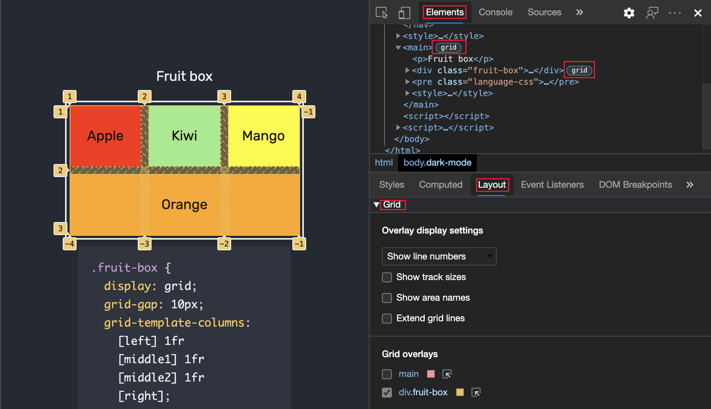
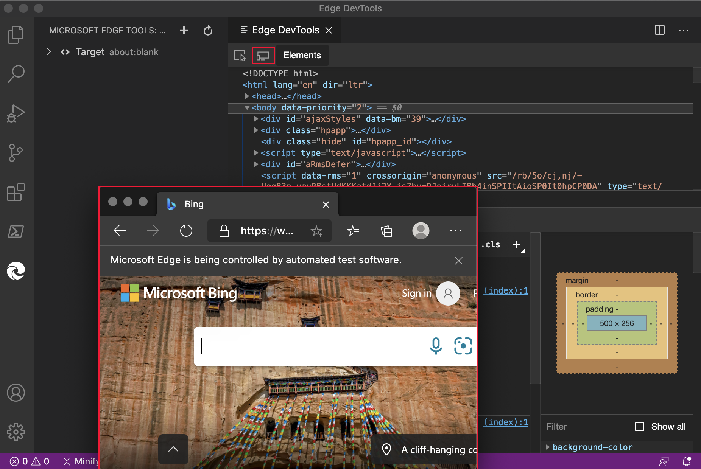
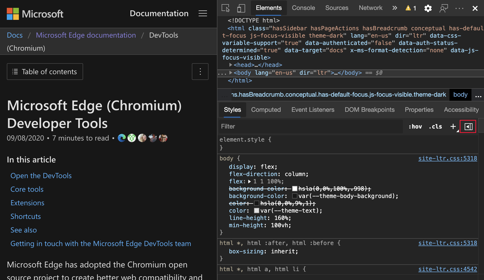
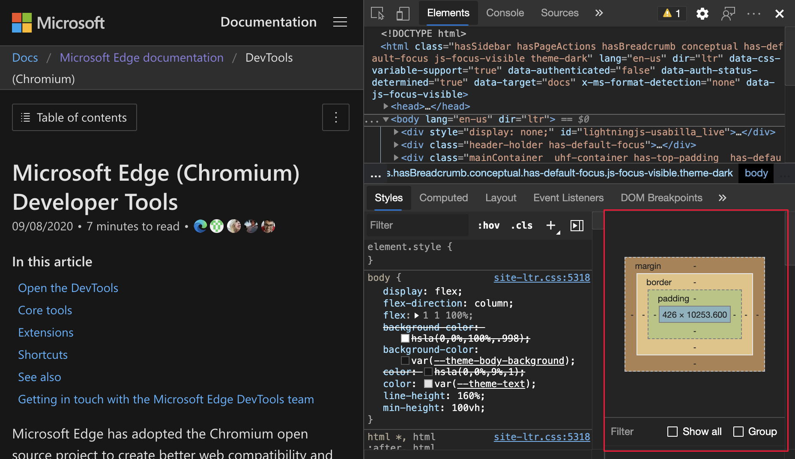
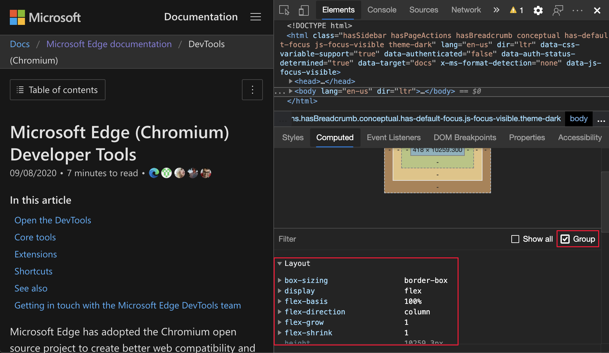

<!-- Copyright Jecelyn Yeen

   Licensed under the Apache License, Version 2.0 (the "License");
   you may not use this file except in compliance with the License.
   You may obtain a copy of the License at

       https://www.apache.org/licenses/LICENSE-2.0

   Unless required by applicable law or agreed to in writing, software
   distributed under the License is distributed on an "AS IS" BASIS,
   WITHOUT WARRANTIES OR CONDITIONS OF ANY KIND, either express or implied.
   See the License for the specific language governing permissions and
   limitations under the License.  -->
# <a name="whats-new-in-devtools-microsoft-edge-87"></a>DevTools (Microsoft Edge 87) 中的新增功能

[!INCLUDE [Microsoft Edge team note for top of What's New](../../includes/edge-whats-new-note.md)]


<!-- ====================================================================== -->
## <a name="improving-devtools-localization"></a>改进 DevTools 本地化

为了满足翻译需求，Microsoft Edge DevTools 团队专注于提高翻译质量。  从 Microsoft Edge 版本 87 开始，将锁定多个字符串和术语，即使其余的 DevTools 以其他语言显示，也不会更改。  受影响的字符串和术语的列表包括：

*  **Lighthouse** 工具中的字符串。
*  术语 `service worker`。
*  一些**网络**工具筛选器，例如`URL`，`XHR``JS`和 `CSS`。
*  [$0](../../../console/utilities.md#recently-selected-element-or-javascript-object) 控制台实用工具 API。

[$0](../../../console/utilities.md#recently-selected-element-or-javascript-object) 现可在 [控制台](../../../console/index.md) 中提供给 DevTools 本地化版本的用户。   感谢全球开发人员社区帮助改进 Microsoft Edge DevTools 的本地化。  继续 [发送有关本地化质量的反馈](../../../contact.md) ，以改进对所有区域设置中的 DevTools 的支持。  有关Chromium开源项目中此功能的实时更新，请参阅问题 [#1136655](https://crbug.com/1136655)。


另请参阅：
* [更改开发工具语言设置](../../../customize/localization.md)


<!-- ====================================================================== -->
## <a name="move-tools-between-top-and-bottom-panels"></a>在顶部和底部面板之间移动工具

DevTools 现在支持在顶部和底部面板之间移动工具。  通过同时查看两个工具的任何组合，自定义 DevTools 并提高工作效率。  例如，通过将“**源**”工具移到底部) ，同时查看 **“元素**”和“**源**”工具 (。

若要将任何顶部工具移到底部，请右键单击选项卡，然后选择 **“移到底部**”


若要将任何底部工具移到顶部，请右键单击选项卡，然后选择 **“移动到顶部**”


有关Chromium开源项目中此功能的历史记录，请参阅问题 [#1075732](https://crbug.com/1075732)。

另请参阅：
* _“关于工具列表_”中的[面板工具与抽屉工具](../../../about-tools.md#panel-tools-vs-drawer-tools)


<!-- ====================================================================== -->
## <a name="save-and-export-using-the-network-console"></a>使用网络控制台保存和导出

<!-- copied section to linked article -->

**网络控制台**工具现在改进了与 [Postman v2.1](https://schema.getpostman.com/json/collection/v2.1.0/docs/index.html) 和 [OpenAPI v2](https://swagger.io/specification/v2) 架构的兼容性。

**网络控制台**工具现在支持以下操作：

*  保存和导出集合和环境。
*  在 **网络控制台** 工具中编辑和导出环境变量集。

输入新环境的名称：


选择新环境的格式：


更新：此功能已发布，不再处于实验性状态。<!-- To enable the experiment, see [Turning an experiment on or off](../../../experimental-features/index.md#turning-an-experiment-on-or-off) and select the checkbox next to **Enable Network Console**. -->

另请参阅：
* 在 Compose [中保存和导出集合、环境和环境变量，](../../../network-console/network-console-tool.md#save-and-export-collections-environments-and-environment-variables)_并使用网络控制台工具发送 Web API 请求_。

有关历史记录，请参阅Chromium开源项目中的问题 [#1093687](https://crbug.com/1093687)。


<!-- ====================================================================== -->
## <a name="improved-css-grid-tooling"></a>改进了 CSS 网格工具

Microsoft Edge DevTools 现在支持以下用于检查、查看和调试 CSS 网格的功能。

*  使用 **“检查** ”工具显示简化的网格覆盖，或使用持久覆盖获取更详细的信息。

*  若要启用永久性网格覆盖，请单击 **Elements** 工具中网格容器元素旁边的网格图标，或单击 **“布局** ”工具中的网格。

*  可以为多个网格启用持久覆盖。

*  使用新的 **布局** 工具，可以轻松切换网格覆盖并配置每个布局的外观和内容。

默认情况下，这些功能处于打开状态。



更新：此功能已发布，不再处于实验性状态。<!-- valid. -->

另请参阅：
* [CSS 网格](../../../css/grid.md)

有关历史记录，请参阅Chromium开源项目[中的问题 #1047356](https://crbug.com/1047356)。

Microsoft Edge DevTools 团队正在与 Chrome DevTools 团队和Chromium社区合作，为 DevTools 添加新的弹性盒工具功能。  有关Chromium开源项目中弹性框工具的更新，请参阅问题 [#1136394](https://crbug.com/1136394)。


<!-- ====================================================================== -->
## <a name="customize-keyboard-shortcuts-in-settings"></a>在“设置”中自定义键盘快捷方式

现在，你可以为 DevTools 中的任何操作自定义键盘快捷方式。  自 Microsoft Edge 版本 84 起，你可以在**Visual Studio Code**和 **DevTools (** 键盘快捷方式的默认) 预设之间进行选择。  从 Microsoft Edge 版本 87 开始，可以进一步自定义键盘快捷方式。


更新：此功能已发布，不再处于实验性状态。<!-- To enable the experiment, see [Turning an experiment on or off](../../../experimental-features/index.md#turning-an-experiment-on-or-off) and select the checkbox next to **Enable keyboard shortcut editor**. -->

另请参阅：
* 在“_自定义键盘快捷方式_”中[编辑开发人员工具操作的键盘快捷方式](../../../customize/shortcuts.md#edit-the-keyboard-shortcut-for-a-devtools-action)。

有关历史记录，请参阅Chromium开源项目[中的问题 #174309](https://crbug.com/174309)。


<!-- ====================================================================== -->
## <a name="introducing-the-microsoft-edge-tools-for-visual-studio-code-extension"></a>Microsoft Edge Tools for Visual Studio Code 扩展简介

Visual Studio Code和**网络Visual Studio Code**扩展的**元素**现在合并到新的 [Microsoft Edge 开发人员工具Visual Studio Code](https://marketplace.visualstudio.com/items?itemName=ms-edgedevtools.vscode-edge-devtools)扩展中。  在不离开 Microsoft Visual Studio Code的情况下，将 Microsoft Edge DevTools 用于以下活动。

*  调试 DOM
*  编辑 CSS
*  检查网络流量

使用扩展，启动 Microsoft Edge，连接到浏览器的现有实例，或直接从编辑器使用无头浏览器。  若要开始参与和提交有关此扩展的反馈问题，请参阅 GitHub 上用于 Visual Studio Code 存储库的 [Microsoft Edge 开发人员工具](https://github.com/Microsoft/vscode-edge-devtools)。

在完整浏览器模式下使用扩展：



在无头模式下使用扩展：


有关详细信息，请参阅[适用于 Visual Studio Code 的 Microsoft Edge DevTools 扩展](../../../../visual-studio-code/microsoft-edge-devtools-extension.md)。


<!-- ====================================================================== -->
## <a name="announcements-from-the-chromium-project"></a>来自 Chromium 项目的公告

以下部分将公布 Microsoft Edge 中已组成开源 Chromium 项目的其他可用功能。


<!-- ====================================================================== -->
### <a name="new-webauthn-tool"></a>新建 WebAuthn 工具

在早期版本的 Microsoft Edge 中，没有本机 WebAuthn 调试支持。  需要物理身份验证器才能使用 [Web 身份验证 API 测试 Web](https://w3c.github.io/webauthn) 应用程序。  使用新的 **WebAuthn** 工具，无需使用任何物理身份验证器即可执行以下操作：

*  模拟身份验证器。
*  自定义身份验证器的属性。
*  检查身份验证器的状态。

可以使用新的 **WebAuthn** 工具模拟身份验证器并调试 [Web 身份验证 API](https://w3c.github.io/webauthn)。  若要打开 **WebAuthn** 工具，请单击“ **自定义并控制 DevTools** ” (`...`) 图标> **更多工具** > **WebAuthn**。  有关Chromium开源项目中此功能的实时更新，请参阅问题 [#1034663](https://crbug.com/1034663)。

打开 **WebAuthn** 工具：


**WebAuthn** 工具：


有关详细信息，请参阅 [模拟身份验证器并调试 WebAuthn](../../../webauthn/index.md)。


<!-- ====================================================================== -->
### <a name="elements-tool-updates"></a>“元素”工具更新

另请参阅：
* [使用 Elements 工具检查、编辑和调试 HTML 和 CSS](../../../elements-tool/elements-tool.md)


<!-- ====================================================================== -->
#### <a name="view-the-computed-sidebar-pane-in-the-styles-pane"></a>在“样式”窗格中查看计算边栏窗格

在“样**式**”窗格中切换 **“计算**”窗格。  默认情况下，“**样式**”窗格中的 **“计算**”窗格会折叠。  若要在“样**式**”窗格中显示或隐藏 **“计算**”窗格，请单击“**显示计算样式”边栏** () 按钮。

打开 **计算边栏** 窗格：



**计算边栏**窗格：



有关Chromium开源项目中此功能的实时更新，请参阅问题 [#1073899](https://crbug.com/1073899)。

<!-- lacks the new feature: -->
另请参阅：
* [仅查看实际应用于 CSS](../../../css/reference.md#view-only-the-css-that-is-actually-applied-to-an-element) _功能引用中的元素的 CSS_


<!-- ====================================================================== -->
#### <a name="grouping-css-properties-in-the-computed-pane"></a>在“计算”窗格中对 CSS 属性进行分组

若要查看滚动较少的已应用 CSS，请按 **计算** 窗格中的类别对 CSS 属性进行分组。  在检查 CSS 时，还可以有选择地专注于一组相关属性。  从 **“元素”** 工具中，选择一个元素。  若要将 (或取消组合) CSS 属性，请切换 **“组** ”复选框。



有关Chromium开源项目中此功能的实时更新，请参阅问题 [#1096230](https://crbug.com/1096230)、[#1084673](https://crbug.com/1084673) 和 [#1106251](https://crbug.com/1106251)。

<!-- probably lacks the new feature: -->
另请参阅：
* [仅查看实际应用于 CSS](../../../css/reference.md#view-only-the-css-that-is-actually-applied-to-an-element) _功能引用中的元素的 CSS_


<!-- ====================================================================== -->
### <a name="lighthouse-64-in-the-lighthouse-tool"></a>灯塔工具中的 Lighthouse 6.4

**Lighthouse** 工具现在运行 Lighthouse 6.4。  有关更改的完整列表，请参阅 [Lighthouse 发行说明](https://github.com/GoogleChrome/lighthouse/releases/v6.4.1)。  有关Chromium开源项目中此功能的实时更新，请参阅问题 [#772558](https://crbug.com/772558)。

另请参阅：
* [Lighthouse 工具](../../../lighthouse/lighthouse-tool.md)


<!-- ====================================================================== -->
### <a name="performancemark-events-in-the-timings-section"></a>计时部分中的 performance.mark () 事件

[“性能](../../../evaluate-performance/reference.md)”工具中录制的 **“计时”部分**现在标记 `performance.mark()` <!--[performance mark](https://jec.fyi/demo/perf-mark) -->事件。  若要尝试此功能并测量 JavaScript 代码的性能，请将事件添加 `performance.mark()` 到代码中。

以下代码在循环之前和`end`之后`for`添加`start`性能标记：

```javascript
performance.mark('start');
for (var i = 0; i < 1000; i+=7;){
  console.log(i);
}
performance.mark('end');
```

然后，打开 [“性能](../../../evaluate-performance/reference.md) ”工具并查看 **“计时”部分** 以记录 JavaScript 代码。  `performance.mark()`添加的事件现在显示在录制中。


<!-- ====================================================================== -->
### <a name="new-resource-type-and-url-filters-in-the-network-tool"></a>网络工具中的新资源类型和 URL 筛选器

使用**网络**工具中的新`resource-type`字和`url`关键字来筛选网络请求。  例如，用于 `resource-type:image` 专注于映像的网络请求：


若要发现更多特殊关键字，例如`resource-type`，请`url`[参阅按属性筛选请求](../../../network/reference.md#filter-requests-by-properties)。

有关Chromium开源项目中此功能的实时更新，请参阅问题 [#1121141](https://crbug.com/1121141) 和 [#1104188](https://crbug.com/1104188)。


<!-- ====================================================================== -->
### <a name="frame-details-view-updates"></a>框架详细信息视图更新

在“ **应用程序** ”工具的左侧页面列表中，底部页是 **“框架**”，通常会列出名为 **顶部**的帧。


<!-- ====================================================================== -->
#### <a name="display-coep-and-coop-reporting-to-endpoint"></a>向终结点显示 COEP 和 COOP 报告

在“ **应用程序** ”工具的左侧页面列表中，底部页是 **“框架**”，通常会列出名为 **顶部**的帧。  选择框架以查看帧详细信息视图，其中包括 **“安全&隔离”** 部分。

在框架详细信息页 **的安全&隔离** 部分中，查看 COEP) 和跨源开机策略 (跨源嵌入器策略 (COOP) `reporting to` 终结点。  [报表 API](https://developer.mozilla.org/docs/Web/API/Reporting_API) 定义`Report-To`，这是一个新的 HTTP 标头，可用于指定浏览器发送警告和错误的服务器终结点。


有关Chromium开源项目中此功能的实时更新，请参阅问题 [#1051466](https://crbug.com/1051466)。

另请参阅：
* 在 _DevTools (Microsoft Edge 88) 中 _ [显示打开的窗口的开机帧详细信息](../11/devtools.md#display-opener-frame-details-for-opened-windows)
* [用于管理存储的应用程序工具](../../../storage/application-tool.md)


<!-- ====================================================================== -->
#### <a name="display-coep-and-coop-report-only-mode"></a>显示仅 COEP 和 COOP 报表模式

在“ **应用程序** ”工具的左侧页面列表中，底部页是 **“框架**”，通常会列出名为 **顶部**的帧。  选择框架以查看帧详细信息视图，其中包括 **“安全&隔离”** 部分。

框架详细信息页 **的安全&隔离** 部分现在显示 `report-only` 设置 `report-only` 为模式的 COEP 和 COOP 的标签。


有关Chromium开源项目中此功能的实时更新，请参阅问题 [#1051466](https://crbug.com/1051466)。

另请参阅：
* 在 _DevTools (Microsoft Edge 88) 中 _ [显示打开的窗口的开机帧详细信息](../11/devtools.md#display-opener-frame-details-for-opened-windows)
* [用于管理存储的应用程序工具](../../../storage/application-tool.md)


<!-- ====================================================================== -->
### <a name="view-and-fix-color-contrast-issues-in-the-css-overview-tool"></a>在 CSS 概述工具中查看和修复颜色对比度问题

**CSS 概述**工具现在显示页面上存在颜色对比度问题的元素列表。  [CSS“概述”辅助颜色演示](https://css-overview-accessible-colors-demo.glitch.me)页包含颜色对比度问题的示例。

若要查看具有颜色对比度问题的元素列表，请在 **“对比度”问题上**单击 **“文本**”。  若要打开 **Elements** 工具中的元素，请单击列表中的元素。  为了帮助解决对比度问题，Microsoft Edge DevTools [会自动提供颜色建议](../08/devtools.md#accessible-color-suggestion-in-the-styles-pane)。


更新：此功能已发布，不再处于实验性状态。<!-- To enable this experiment, under **Settings** > **Experiments**, select the **CSS Overview** checkbox. -->

另请参阅：
* [CSS 概述工具](../../../css/css-overview-tool.md)

有关历史记录，请参阅Chromium开源项目[中的问题 #1120316](https://crbug.com/1120316)。


<!-- ====================================================================== -->
> [!NOTE]
> 此页面的某些部分是根据 [Google 创建和共享的](https://developers.google.com/terms/site-policies)作品所做的修改，并根据[ Creative Commons Attribution 4.0 International License ](https://creativecommons.org/licenses/by/4.0)中描述的条款使用。
> 原始页面位于 [此处](https://developer.chrome.com/blog/new-in-devtools-87)，并由 [Jecelyn Yeen](https://developers.google.com/web/resources/contributors#jecelyn-yeen)  \（开发人员支持者，Chrome DevTools\）制作。

[](https://creativecommons.org/licenses/by/4.0)
本作品根据[ Creative Commons Attribution 4.0 International License ](https://creativecommons.org/licenses/by/4.0)获得许可。
