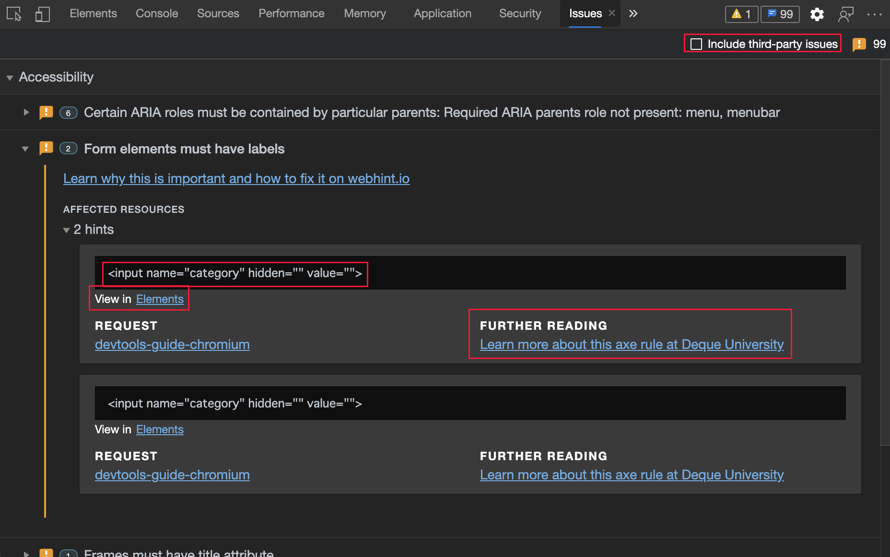
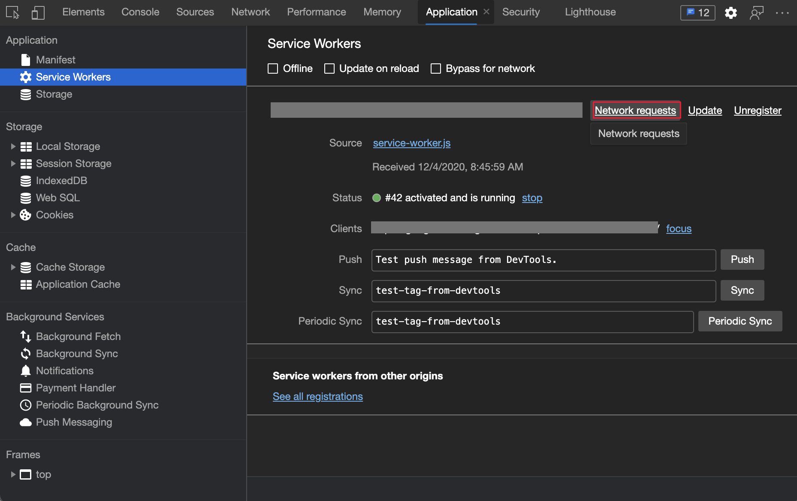
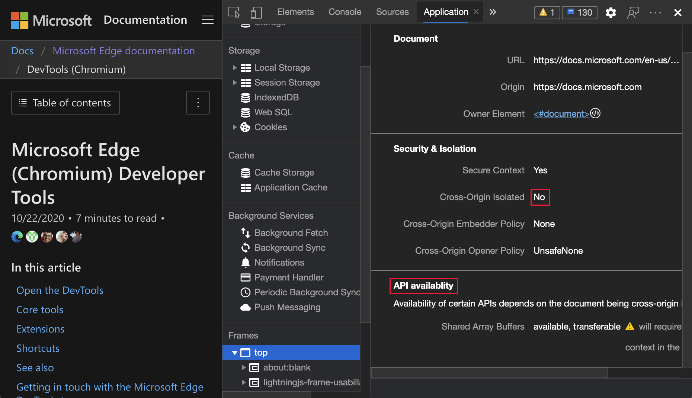

<!-- Copyright Jecelyn Yeen

   Licensed under the Apache License, Version 2.0 (the "License");
   you may not use this file except in compliance with the License.
   You may obtain a copy of the License at

       https://www.apache.org/licenses/LICENSE-2.0

   Unless required by applicable law or agreed to in writing, software
   distributed under the License is distributed on an "AS IS" BASIS,
   WITHOUT WARRANTIES OR CONDITIONS OF ANY KIND, either express or implied.
   See the License for the specific language governing permissions and
   limitations under the License.  -->
# <a name="whats-new-in-devtools-microsoft-edge-88"></a>DevTools 中的新增功能 (Microsoft Edge 88)

[!INCLUDE [Microsoft Edge team note for top of What's New](../../includes/edge-whats-new-note.md)]


<!-- ====================================================================== -->
## <a name="microsoft-edge-and-microsoft-edge-webdriver-now-available-on-linux"></a>Microsoft Edge和 Microsoft Edge WebDriver 现已在 Linux 上提供

<!-- Title: Microsoft Edge and Microsoft Edge WebDriver on Linux  -->
<!-- Subtitle: Get Microsoft Edge Dev on Ubuntu, Debian, Fedora, and openSUSE distributions and start automating in CI/CD environments with Microsoft Edge WebDriver. -->

Microsoft Edge Dev 现已在 Ubuntu、Debian、Fedora 和 openSUSE 发行版上受到支持。  直接从 [Microsoft Edge 预览体验成员网站](https://www.microsoftedgeinsider.com/download?platform=linux) 下载并安装 Microsoft Edge Dev `.deb` 或 `.rpm` 程序包，或使用 Linux 发行版的标准程序包管理工具。

如果在持续集成和交付 （CI/CD） 解决方案中使用 Linux 环境，则 Linux 上也提供 Microsoft Edge WebDriver。  若要开始使用 Microsoft Edge WebDriver 自动执行Microsoft Edge，请参阅 Microsoft Edge WebDriver 页面的 [最近版本](https://developer.microsoft.com/microsoft-edge/tools/webdriver#downloads)。  有关使用 Microsoft Edge WebDriver 自动Microsoft Edge的帮助，请参 [阅使用 WebDriver 进行测试自动化](../../../../webdriver-chromium/index.md)。


另请参阅：
* [使用 WebDriver 自动执行 Microsoft Edge](../../../../webdriver-chromium/index.md)


<!-- ====================================================================== -->
## <a name="improved-webhint-and-platform-tips-in-the-issues-tool"></a>“问题”工具中改进的 Web 提示和平台提示

<!-- Title: Improvements to Issues tool and webhint integration  -->
<!-- Subtitle: Categories and third-party filtering make it easier to survey issues in the Issues tool.  Issues surfaced by webhint now have improved code snippets and documentation links to help you fix problems in your website.  -->

[webhint](https://webhint.io) 是一个开源代码工具，可为网站和本地网页提供实时反馈。  从 [Microsoft Edge 版本 85](../06/devtools.md#webhint-feedback-in-the-issues-panel) 开始，在 [问题](../../../issues/index.md) 工具中查看 Webhint 反馈。  现在，通过添加以下类别，可以更轻松地查看**问题**工具中出现的问题。

* [辅助功能](https://webhint.io/docs/user-guide/hints/accessibility)
* [兼容性](https://webhint.io/docs/user-guide/hints/compatibility)
* [性能](https://webhint.io/docs/user-guide/hints/performance)
* [隐患](https://webhint.io/docs/user-guide/hints/pitfalls)
* [PWA](https://webhint.io/docs/user-guide/hints/pwa)
* [安全性](https://webhint.io/docs/user-guide/hints/security)

现在可以使用新复选框筛选出第三方问题。  筛选器功能可帮助你隐藏第三方库或其他源中与代码相关的问题。

为了帮助你查看 [Webhint](https://webhint.io) 发现的问题，“**问题**”工具现在会显示以下信息：

*  改进的代码段。
*  指向其他相关面板的链接。
*  指向文档的链接，可帮助你修复网站中的问题。



另请参阅：
* [使用问题工具查找和修复问题](../../../issues/index.md)
* [适用于Visual Studio Code的 webhint 扩展](../../../../test-and-automation/webhint.md)


<!-- ====================================================================== -->
## <a name="composited-layers-are-now-in-3d-view"></a>复合层现在采用 3D 视图

<!-- Title: 3D View is now integrated with Composited Layers  -->
<!-- Subtitle: Composited Layers are now in 3D View.  -->

现在，可以将 **Layers** 内容与 z-index 值以及文档对象模型 (DOM) 一起可视化。  此功能可帮助你进行调试，无需在**3D 视图**工具和**图层**工具之间切换。


更新：此功能已发布，不再处于实验性状态。  “**图层**”工具已替换为**3D 视图**工具。

另请参阅：
* [使用 3D 视图工具导航 z 索引、DOM 和层](../../../3d-view/index.md)


<!-- ====================================================================== -->
## <a name="css-variable-definitions-in-styles-pane"></a>“样式”窗格中的 CSS 变量定义

<!-- Title: Jump to CSS variable definitions  -->
<!-- Subtitle: Click any CSS variable to navigate directly to the definition in the Styles tool. -->

在“**元素**”工具的“**样式**”窗格中，[CSS 变量](https://developer.mozilla.org/docs/Web/CSS/Using_CSS_custom_properties)现在会直接链接到每个定义。  选择变量以轻松查看或更改 CSS 变量定义。  在示例中，DevTools 显示 `body` 元素的 CSS 属性。

例如，若要显示 `--theme-body-background` CSS 变量的变量定义，请执行以下操作：

1. 在“**元素**”工具的“**样式**”窗格中，将鼠标悬停在 CSS 变量`var(--theme-body-background)`的样式`--theme-body-background`上。  将显示工具提示**跳转到定义**：


1. 单击样式`--theme-body-background`。  “**样式**”窗格显示样式的定义：


另请参阅：
* [在“样式”窗格中编辑 CSS 字体样式和设置](../../../inspect-styles/edit-fonts.md)
* [CSS 功能参考](../../../css/reference.md)


<!-- ====================================================================== -->
## <a name="service-worker-debugging-improvements"></a>服务工作线程调试改进

<!-- Title:  Service worker debugging improvements in the Network, Application, and Sources tools  -->
<!-- Subtitle:  Making service workers easier to debug for progressive web applications and more.  -->

**网络**工具、**应用程序**工具 和 **源** 工具中的以下新功能可帮助您构建 [PWA](../../../../progressive-web-apps-chromium/index.md)。  在调试服务工作线程遇到困难时，请使用以下功能。

请求路由显示基于通过服务工作线程运行的网络请求的 `startup` 和 `fetch` 事件。  通过 **应用程序** 或 **网络工具** 访问时间线。  如果遇到服务工作线程问题，并且希望查看 `startup` 或 `fetch` 事件是否出错，时间线会有所帮助。

另请参阅：
* [服务工作进程改进](../../../service-workers/index.md)


<!-- ====================================================================== -->
### <a name="application-tool"></a>应用程序工具

<!-- Title: Open Network tool from the Service Workers pane  -->
<!-- Subtitle: Display additional context when debugging a service worker.  -->

在**应用程序工具**中，使用新的**网络请求**链接查看所有服务工作进程请求路由信息。

若要在调试服务工作线程时显示其他上下文：

1. 在**应用程序**工具的左侧，选择“**服务工作线程**”。

1. 单击“**网络请求**”链接：

   

   **网络** 工具在 **工具箱** 中打开，并显示所有与服务工作线程相关的网络请求。  使用 `is:service-worker-intercepted` 筛选网络请求：

   

1. 若要将 **网络** 工具移动到顶部面板，请关闭 **工具箱**：

   

另请参阅：
* [用于管理存储的应用程序工具](../../../storage/application-tool.md)
* [服务工作进程改进](../../../service-workers/index.md)


<!-- ====================================================================== -->
### <a name="network-tool"></a>网络工具

在“**网络**”工具中，可以调试由服务工作线程运行的网络请求。  （还可以从**应用程序**工具（而不是**网络**工具）中打开网络请求。） 在“**网络**”工具的“**计时**”窗格中，对于每个请求，开发人员工具将显示以下信息：

*  请求开示和启动持续时间。
*  对服务工作线程注册的更改。
*  `fetch` 事件处理器的运行时。
*  用于加载客户端的所有 `fetch` 事件的运行时。


另请参阅：
* _网络功能参考_中的[显示请求的计时细目](../../../network/reference.md#display-the-timing-breakdown-of-a-request)。
* [服务工作进程改进](../../../service-workers/index.md)


<!-- ====================================================================== -->
### <a name="sources-tool"></a>源工具

在旧版 Microsoft Edge 中，调用堆栈的深度级别仅限于服务工作线程中的 JavaScript 代码。  在 Microsoft Edge 88 中，调用堆栈现在显示通过服务工作线程运行的请求发起程序。

若要定位请求发起程序，请使用服务工作线程中 JavaScript 代码的调用堆栈。  下图中调用堆栈以服务工作线程(`service-worker.js`)中的 JavaScript 代码开头，并将对原始网页请求的引用显示为 `(index):157`。  将显示 `service-worker.js` 文件，并且调用堆栈突出显示请求发起者， `(index):157`：<!--"request initiator?"-->


在下图中，已选择引用，并打开提出请求的发起程序。  `(index)` 网页是请求发起程序：<!--"request originator?" is there a reason for changing the terminology, in the alt-text?-->


另请参阅：
* 在_JavaScript 调试功能_中[查看调用堆栈](../../../javascript/reference.md#view-the-call-stack)
* [服务工作进程改进](../../../service-workers/index.md)


<!-- ====================================================================== -->
## <a name="copy-property-value-of-a-network-request"></a>复制网络请求的属性值

<!-- Title: Copy response JSON in Network tool using the right-click menu  -->
<!-- Subtitle:  The Network tool now has a more consistent UX.  Easily copy the JSON response using the right-click menu.  -->

在 **网络** 工具中，使用新的 **复制值** 选项复制网络请求的属性值。  将属性值复制为解码的 JSON 值。  在旧版 Microsoft Edge 中，必须执行下列操作之一复制值：

*  突出显示并复制整个文本。
*  将值存储为全局变量（如果适用），然后从 DevTools **控制台** 将其复制。

要将属性值复制到剪贴板，请参阅_网络功能参考_中的[复制格式化响应 JSON 到剪贴板](../../../network/reference.md#copy-formatted-response-json-to-the-clipboard)。

在 DevTools 中复制属性值：


在 Microsoft Visual Studio Code 中粘贴属性值：


另请参阅：
* [控制台概述](../../../console/index.md)

有关历史记录，请参阅 Chromium 开源项目中的问题 [1132084](https://crbug.com/1132084)。


<!-- ====================================================================== -->
## <a name="customize-multi-press-keyboard-shortcuts"></a>自定义多键连发键盘快捷方式

<!-- Title: Customize multi-press keyboard shortcuts  -->
<!-- Subtitle: Create custom multi-press keyboard shortcuts in the shortcut editor.  -->

[自 Microsoft Edge 版本 87](../10/devtools.md#customize-keyboard-shortcuts-in-settings) 起，可以为 DevTools 中任何操作自定义键盘快捷方式。  在 Microsoft Edge 版本 88 中，现在可以创建多键连发快捷方式。

例如，下面的红色突出显示显示“**开始录制事件**”操作的自定义多按键盘快捷方式：


更新：此功能已发布，不再处于实验性状态。<!-- To set a shortcut for an action in the DevTools, see [Settings](../../../customize/index.md#settings) > **Experiments**  and select the checkbox next to **Enable keyboard shortcut editor**. -->

另请参阅：
* 在“_自定义键盘快捷方式_”中[编辑开发人员工具操作的键盘快捷方式](../../../customize/shortcuts.md#edit-the-keyboard-shortcut-for-a-devtools-action)。

有关历史记录，请参阅 Chromium 开源项目中的[问题 #174309](https://crbug.com/174309)。


<!-- ====================================================================== -->
## <a name="the-devtools-ui-now-matches-the-browser-language"></a>开发人员工具 UI 现在与浏览器语言相匹配

在 Microsoft Edge 版本 87 中，如果在 [开发人员工具设置](../../../customize/index.md#settings)中启用了 **匹配浏览器语言**设置，则开发人员工具 UI 语言不会匹配浏览器 UI 语言。  在 Microsoft Edge 版本 88 中，如果打开 **匹配浏览器语言** 设置，则 DevTools 现在与浏览器语言匹配。  请参见 [更改开发工具语言设置](../../../customize/localization.md)。


<!-- ====================================================================== -->
## <a name="announcements-from-the-chromium-project"></a>来自 Chromium 项目的公告

以下部分将公布 Microsoft Edge 中已组成开源 Chromium 项目的其他可用功能。


<!-- ====================================================================== -->
### <a name="new-css-angle-visualization-tools"></a>全新 CSS 角度可视化工具

DevTools 现在更好地支持 CSS 角度调试。  如果页面上 HTML 元素应用 CSS 角度，**样式** 工具中该角度旁边会显示一个时钟图标。  若要切换时钟覆盖层，请点击时钟图标。  若要更改角度，请单击时钟中的任意位置、拖动针或使用鼠标和键盘快捷方式。

以下 CSS 角度用于示例：

```css
background: linear-gradient(100deg, lightblue, pink);
```


有关详细信息，请参阅_CSS 功能参考_中的“[更改角度时钟的角度值](../../../css/reference.md#change-angle-value-with-the-angle-clock)”。

若要在 Chromium 开源项目中查看此功能的实时更新，请参阅问题 [1126178](https://crbug.com/1126178) 和 [1138633](https://crbug.com/1138633)。


<!-- ====================================================================== -->
### <a name="simulate-storage-quota-size-in-the-storage-pane"></a>模拟存储窗格中的存储配额大小

现在，可以在 **存储** 窗格中重写存储配额大小。  此功能允许你模拟不同的设备，并测试网站或应用在低磁盘可用性场景中的行为。  模拟存储配额：

1. 导航至 **应用程序** > **存储**。
1. 选择 **模拟自定义存储配额** 复选框。
1. 输入有效号码。


有关详细信息，请参阅 [模拟移动设备（设备仿真）](../../../device-mode/index.md)。  若要在 Chromium 开源项目中查看此功能的实时更新，请参阅问题 [945786](https://crbug.com/945786) 和 [1146985](https://crbug.com/1146985)。


<!-- ====================================================================== -->
### <a name="report-cors-errors-in-the-network-tool"></a>报告网络工具中的 CORS 错误

通过导航至 [CORS 错误演示](https://cors-errors.glitch.me) 尝试此功能。  打开 **网络** 工具，刷新页面，并观察失败的 CORS 网络请求。  状态列显示 **CORS 错误**。  将鼠标悬停在错误上时，工具提示现在将显示错误代码。  在 Microsoft Edge 版本 87 及更早版本中，DevTools 只显示CORS 错误的一般 **（失败）** 状态。


有关 Chromium 开源项目中此功能的实时更新，请参阅问题[1141824](https://crbug.com/1141824)。

另请参阅：
* _开发人员工具 (Microsoft Edge 92)中的新增功能_[增强了 CORS 调试支持](../../2021/05/devtools.md#enhanced-cors-debugging-support)
* [网络功能参考](../../../network/reference.md)


<!-- ====================================================================== -->
### <a name="frame-details-view-updates"></a>框架详细信息视图更新

在**应用程序**工具中，有一个“**帧**”部分，它为每个帧提供详细视图。  

另请参阅：
* [用于管理存储的应用程序工具](../../../storage/application-tool.md)


<!-- ====================================================================== -->
#### <a name="cross-origin-isolation-information-in-the-frame-details-view"></a>框架详细信息视图中的跨域隔离信息

在**应用程序**工具中，有一个“**帧**”部分，它为每个帧提供详细视图。  选择帧时，会显示帧详细信息页，包括“**安全与隔离**”部分。

现在，跨域隔离状态在 **安全性和隔离** 区域下显示。  新的 **API 可用性**部分显示 `SharedArrayBuffer` (SAB) 的可用性，以及是否可以使用共享缓冲区`postMessage()`。  弃用警告显示 SAB 和 `postMessage()` 当前是否可用，但上下文并非跨域隔离。



有关跨域隔离以及为何需要如 `SharedArrayBuffers` 一样的功能的详细信息 ，请导航至 [WindowOrWorkerGlobalScope.crossOriginIsolated](https://developer.mozilla.org/docs/Web/API/WindowOrWorkerGlobalScope/crossOriginIsolated)。

有关 Chromium 开源项目中此功能的实时更新，请参阅问题[1139899](https://crbug.com/1139899)。

另请参阅：
* [用于管理存储的应用程序工具](../../../storage/application-tool.md)


<!-- ====================================================================== -->
#### <a name="new-web-workers-information-in-the-frame-details-view"></a>框架详细信息视图中的新 Web 工作线程信息

现在，DevTools 在相关的父框架下组织 Web 工作线程。  例如，如果 `someName` 框架创建 `worker.js`，则 `worker.js` 出现在 **框架** 列表中的 `someName` 之下。  若要查看 Web 工作线程的详细信息，请执行以下操作：

1. 打开“**应用程序**”工具。
1. 在左侧列表的“**帧**”部分，展开包含 Web 辅助角色的帧。
1. 展开 **工作线程** 树。
1. 单击工作线程。

若要在 Chromium 开源项目中查看此功能的实时更新，请参阅问题 [1122507](https://crbug.com/1122507) 和 [1051466](https://crbug.com/1051466)。


另请参阅：
* [用于管理存储的应用程序工具](../../../storage/application-tool.md)


<!-- ====================================================================== -->
#### <a name="display-opener-frame-details-for-opened-windows"></a>显示已打开窗口的原框架详细信息

现在，DevTools 在相关的父 [框架](https://developer.mozilla.org/docs/Web/API/Window/frames) 下组织已打开的 [窗口](https://developer.mozilla.org/docs/Web/API/Window#Constructors)。  例如，如果 `top` 框架打开 `Window` 到 `https://docs.microsoft.com/microsoft-edge/devtools-guide-chromium`， 则框架 `Window` 将显示在 **列表** 中的 `top` 之下。

若要显示负责打开另一个窗口的帧，请在“**元素**”工具中查看该帧：

1. 打开“**应用程序**”工具。
1. 在左侧底部的“**帧**”部分中，展开一个框架。
1. 展开 **已打开窗口**，然后选择 `Window` 选取希望了解的父框架。
1. 选择 **开启框架** 链接。

将显示有关哪个框架导致另一个 `Window` 打开的详细信息。  若要在 **元素** 工具中展示开启程序，请执行以下操作：

1. 打开“**应用程序**”工具。
1. 在左侧底部的“**帧**”部分中，展开一个框架。
1. 单击打开的窗口以打开 `Window` 详细信息。
1. 选择 **开启框架** 链接。

有关 Chromium 开源项目中此功能的历史记录，请参阅问题 [1107766](https://crbug.com/1107766)。


另请参阅：
* [用于管理存储的应用程序工具](../../../storage/application-tool.md)


<!-- ====================================================================== -->
### <a name="copy-stacktrace-for-network-initiator"></a>复制网络发起程序堆栈跟踪

在“**网络**”工具中，若要将堆栈复制到剪贴板，请右键单击堆栈跟踪，然后选择“ **复制** > **复制堆栈**跟踪：


有关 Chromium 开源项目中此功能的历史记录，请参阅问题 [1139615](https://crbug.com/1139615)。

另请参阅：
* 在_网络功能参考_中[显示导致请求的堆栈跟踪](../../../network/reference.md#display-the-stack-trace-that-caused-a-request)


<!-- ====================================================================== -->
### <a name="preview-wasm-variable-value-on-mouseover"></a>鼠标悬停时预览 Wasm 变量值

在“**源**”工具中，使用此功能在代码暂停时查看 WebAssembly (Wasm) 变量的值。  若要显示变量的当前值，请将鼠标悬停在变量上:


若要在 Chromium 开源项目中查看此功能的实时更新，请参阅问题 [1058836](https://crbug.com/1058836) 和 [1071432](https://crbug.com/1071432)。

另请参阅：
* 在_源工具概述_中[使用“调试器”窗格中调试 JavaScript 代码](../../../sources/index.md#using-the-debugger-pane-to-debug-javascript-code)


<!-- ====================================================================== -->
### <a name="consistent-units-of-measurement-for-sizes-of-files-and-memory"></a>文件和内存大小的一致度量单位

现在，开发人员工具始终使用 `kB` 显示文件和内存的大小。  以前的开发人员工具会混合 `kB` 和 `KiB`。

*  `kB` 或千字节 (10^3 或 1000 字节)
*  `KiB` 或 kibibyte (2^10 或 1024 字节)

例如，**网络** 工具以前在标签中使用 `kB`，但在计算中使用 `KiB`。  您的反馈表明这种前后矛盾导致混淆。

有关 Chromium 开源项目中此功能的历史记录，请参阅问题 [1035309](https://crbug.com/1035309)。


<!-- ====================================================================== -->
> [!NOTE]
> 此页面的某些部分是根据 [Google 创建和共享的](https://developers.google.com/terms/site-policies)作品所做的修改，并根据[ Creative Commons Attribution 4.0 International License ](https://creativecommons.org/licenses/by/4.0)中描述的条款使用。
> 原始页面位于 [此处](https://developer.chrome.com/blog/new-in-devtools-88)，并由 [Jecelyn Yeen](https://developers.google.com/web/resources/contributors#jecelyn-yeen)  \（开发人员支持者，Chrome DevTools\）制作。

[](https://creativecommons.org/licenses/by/4.0)
本作品根据[ Creative Commons Attribution 4.0 International License ](https://creativecommons.org/licenses/by/4.0)获得许可。
