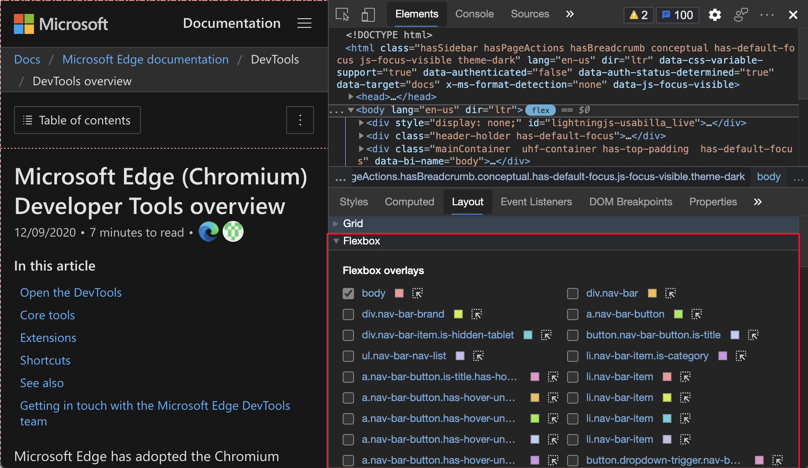
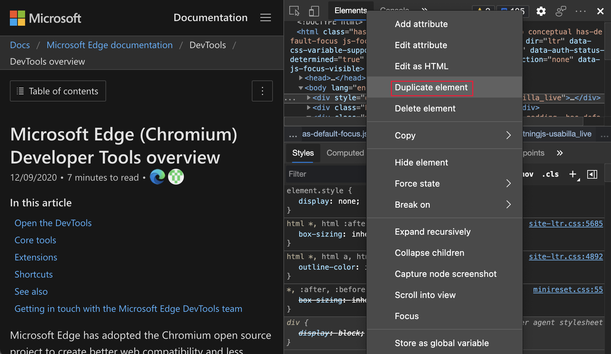
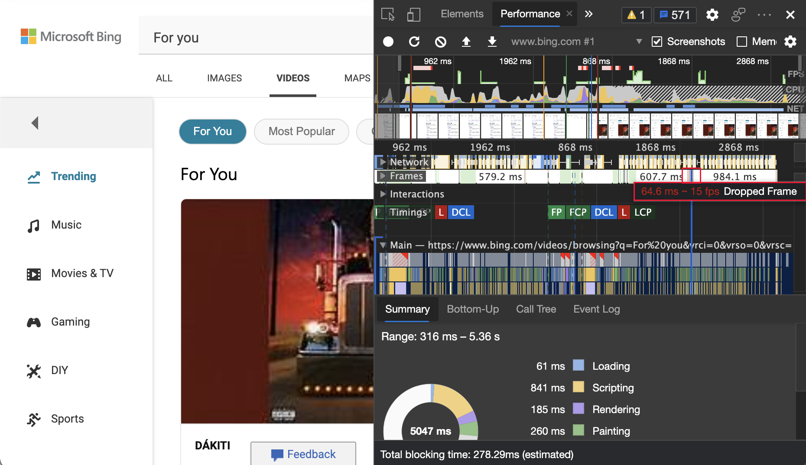
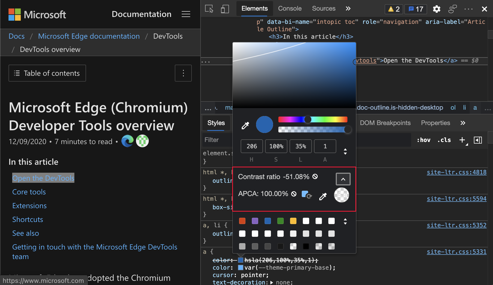

<!-- Copyright Jecelyn Yeen

   Licensed under the Apache License, Version 2.0 (the "License");
   you may not use this file except in compliance with the License.
   You may obtain a copy of the License at

       https://www.apache.org/licenses/LICENSE-2.0

   Unless required by applicable law or agreed to in writing, software
   distributed under the License is distributed on an "AS IS" BASIS,
   WITHOUT WARRANTIES OR CONDITIONS OF ANY KIND, either express or implied.
   See the License for the specific language governing permissions and
   limitations under the License.  -->
# DevTools 中的新增功能（Microsoft Edge 89）

[!INCLUDE [Microsoft Edge team note for top of What's New](../../includes/edge-whats-new-note.md)]

<!-- ====================================================================== -->
## “新增功能”工具现在为“欢迎”

<!--  Title: What's New is now Welcome  -->
<!--  Subtitle: The What's New tool now has a new appearance and a new name:  Welcome -->

Microsoft Edge DevTools 中的“**新增功能**”工具现在具有新的外观和新名称：“**欢迎**”。  “**欢迎**”工具仍会显示最新的 DevTools 新闻和更新。  它现在还包括指向 Microsoft Edge DevTools 文档的链接、提交反馈的方式等。  若要在每次更新 Microsoft Edge 后显示“**欢迎**”工具，请选中标题下的“**每次更新后打开选项卡**”旁边的复选框。

若要关闭“**欢迎**”工具，请单击选项卡标题右侧的 **X**。

更新：此功能已发布，不再处于实验性状态。<!-- If you prefer the original **What's New** tool, select [Settings](../../../customize/index.md#settings) > **Experiments** and then clear the checkbox next to **Enable Welcome tab**. -->

另请参阅：
* [欢迎工具](../../../welcome/welcome-tool.md)

<!-- ====================================================================== -->
## “样式”窗格中的可视字体编辑器

<!--  Title: Visual font editor in the Styles pane  -->
<!--  Subtitle: Visual font editor in the Styles pane -->

<!-- valid 05/13/2022 -->

在 CSS 中处理字体时，请使用新的可视字体编辑器。  你可以定义回退字体，并使用滑块定义字体粗细、大小、行高和间距：

**字体编辑器**可帮助你：

*  在不同字体属性的单位之间切换。
*  在不同字体属性的关键字之间切换。
*  转换单位。
*  生成准确的 CSS 代码。

若要启用此试验，请查看“[设置](../../../customize/index.md#settings)” > “**试验**”，然后选中“**在‘样式’窗格中启用新的字体编辑器工具**”旁边的复选框。

有关 Chromium 开源项目中此功能的历史记录，请参阅问题 [1093229](https://crbug.com/1093229)。

另请参阅：
* 在“_实验性功能_”中的[“样式”窗格中启用“字体编辑器”工具](../../../experimental-features/index.md#enable-the-font-editor-tool-within-the-styles-pane)。
* [在开发人员工具的“样式”窗格中编辑 CSS 字体样式和设置](../../../inspect-styles/edit-fonts.md)。

<!-- ====================================================================== -->
## CSS 弹性框调试工具

开发人员工具现在支持 Flexbox 布局和网格布局。

更新：此功能已发布，不再处于实验性状态。<!-- To turn on the experiment for the following two features, select [Settings](../../../customize/index.md#settings) > **Experiments** and then select the checkbox next to **Enable new CSS Flexbox debugging features**. -->

另请参阅：
* _使用“检查”工具从“分析”页_ 中的 [“检查”覆盖层获取元素信息](../../../css/inspect.md#getting-element-information-from-the-inspect-overlay)。
* [使用“检查”工具中的颜色突出显示来识别嵌套区域](../../../accessibility/test-inspect-tool.md#identify-nested-regions-using-color-highlighting)，_通过将鼠标悬停在网页上来检测辅助功能问题_。
* _使用开发人员工具在辅助功能测试概述_中[使用“检查”工具检测辅助功能问题](../../../accessibility/accessibility-testing-in-devtools.md#using-the-inspect-tool-to-detect-accessibility-issues)。
* [从“样式”选项卡中更新 .css 文件 (CSS 镜像编辑) ](../../../../visual-studio-code/microsoft-edge-devtools-extension/css-mirror-editing-styles-tab.md)。

网格：
* [CSS 网格](../../../css/grid.md)
* 改进了 _开发人员工具 (Microsoft Edge 87) 新增功能中的_[CSS 网格工具](../../2020/10/devtools.md#improved-css-grid-tooling)。
<!-- todo: doc flexbox, probably next to grid.md -->

MDN：
* [CSS 弹性框布局](https://developer.mozilla.org/docs/Web/CSS/CSS_Flexible_Box_Layout)
* [CSS 网格布局](https://developer.mozilla.org/docs/Web/CSS/CSS_Grid_Layout)

有关历史记录，请参阅 Chromium 开源项目中的问题 [1136394](https://crbug.com/1136394) 和 [1139949](https://crbug.com/1139949)。

<!-- ====================================================================== -->
### 新的弹性框 (flex) 图标有助于识别和显示 flex 容器

<!--  Title: Display Flexbox containers with Flexbox (flex) icon  -->
<!--  Subtitle: New Flexbox (flex) icon in the Elements tool help you identify Flexbox containers in your code.  When toggled, the adorner displays and hides outlines of the flex container to help you debug the layout -->

在“**元素**”工具中，新的**弹性框** (flex) 图标可帮助你识别代码中的弹性框容器。  单击**弹性框** (flex) 图标可打开或关闭显示弹性框容器轮廓的覆盖效果。  可在“**布局**”窗格中自定义覆盖的颜色，其位于“**样式**”和“**已计算**”旁边。

若要打开和关闭显示 Flexbox 容器的覆盖效果，请单击**弹性框** (`flex`) 图标。

可在“**样式**”和“**已计算**”旁边的“**布局**”窗格中自定义覆盖层的颜色。

突出显示的**弹性框**（`flex`）图标和网页：

“**布局**”窗格中突出显示的 **弹性框覆盖**：

更新：此功能已发布，不再处于实验性状态。<!-- valid. -->

另请参阅：
* _使用“检查”工具从“分析”页_ 中的 [“检查”覆盖层获取元素信息](../../../css/inspect.md#getting-element-information-from-the-inspect-overlay)。
* [使用“检查”工具中的颜色突出显示来识别嵌套区域](../../../accessibility/test-inspect-tool.md#identify-nested-regions-using-color-highlighting)，_通过将鼠标悬停在网页上来检测辅助功能问题_。
* [检查 CSS 网格](../../../css/grid.md)。

<!-- ====================================================================== -->
### 使用 CSS 属性更改弹性框布局时显示对齐图标和可视化向导

<!--  Title: Display alignment icons and visual guides for changes to Flexbox layouts from CSS properties -->
<!--  Subtitle:  CSS autocomplete in the Styles tool now displays icons next to Flexbox properties to help you see the effect a property has on your Flexbox layout. -->

当你编辑弹性框布局的 CSS 时，“**样式**”窗格中的 CSS 自动完成现在会在相关弹性框属性旁边显示有用的图标。  若要尝试此新功能，请打开“**元素**”工具并选择一个 flex 容器。  然后在“**样式**”窗格中添加或更改该容器上的属性。

自动完成菜单现在显示指示对齐属性效果的图标，例如 `align-content` 和 `align-items`。

此外，开发人员工具现在还会显示一条指导线，帮助你更好地查看 `align-items` CSS 属性。  `gap` CSS 属性也受支持。  在下图中，`gap` CSS 属性设置为 `gap: 12px;`，并显示每个间隙的阴影图案。

突出显示的以 `align-` 开头的 CSS 属性“自动完成”菜单：

突出显示的 CSS 属性和网页中的弹性框 `gap`：

更新：此功能已发布，不再处于实验性状态。<!-- valid. -->

另请参阅：
* _使用“检查”工具从“分析”页_ 中的 [“检查”覆盖层获取元素信息](../../../css/inspect.md#getting-element-information-from-the-inspect-overlay)。
* [使用“检查”工具中的颜色突出显示来识别嵌套区域](../../../accessibility/test-inspect-tool.md#identify-nested-regions-using-color-highlighting)，_通过将鼠标悬停在网页上来检测辅助功能问题_。
* [检查 CSS 网格](../../../css/grid.md)。

<!-- ====================================================================== -->
## 使用新的“更多工具”按钮快速添加工具

<!--  Title: Add tools quickly with new More Tools button  -->
<!--  Subtitle: A convenient way to open new tools in Microsoft Edge DevTools -->

现在，你有了一种在 Microsoft Edge 开发人员工具中打开更多工具的新方法。  **更多工具** 图标是主面板右侧的加号(`+`)。  若要显示可以添加到主面板的其他工具的列表，请选择“**更多工具**”(`+`)图标：

更新：此功能已发布，不再处于实验性状态。<!-- To turn on this experiment, see [Settings](../../../customize/index.md#settings) > **Experiments**, and then select the checkbox next to **Enable + button tab menus to open more tools**. -->

另请参阅：
* [关于工具列表](../../../about-tools.md)

<!-- ====================================================================== -->
## 辅助技术现在显示 CSS 建议的位置和计数

<!--  Title: Assistive technologies now announce position and count of CSS suggestions  -->
<!--  Subtitle: CSS suggestions are now easier to navigate using screen readers -->

编辑 CSS 规则时，你将获得功能的下拉列表。  辅助技术用户无法使用此功能，因为它是在 Microsoft Edge 版本 89 中公布的。  辅助技术用户现在可以在“**样式**”窗格中浏览 CSS 建议。  在 Microsoft Edge 版本 88 及更早版本中，辅助技术公布了 `Suggestion`，因为用户在“**导航**”窗格中编辑 CSS 时浏览了建议列表。

在 Microsoft Edge 版本 89 中，辅助技术用户现在可以听到当前建议的位置和计数。  当用户浏览建议列表时，每条建议都会公布，例如建议 3/5。  要详细了解如何在开发人员工具中编写 CSS，请参阅 [CSS 功能参考](../../../css/reference.md)。  要在 Chromium 开放源代码项目中查看此功能的历史记录，请参阅问题 [1157329](https://crbug.com/1157329)。

若要在启用此试验的情况下查看显示和朗读多条建议的视频，请查看 YouTube 上的“[Voiceover 公布 devtools 选项](https://youtu.be/9TcUpleEwwA)”。

另请参阅：
* 使用_辅助技术导航开发人员工具_ 中的[“样式”窗格](../../../accessibility/navigation.md#navigate-the-styles-pane)。
* [CSS 功能参考](../../../css/reference.md)

<!-- ====================================================================== -->
## 模拟 Surface Duo 和 Samsung Galaxy Fold

<!--  Title: Emulate new dual-screen and foldable devices  -->
<!--  Subtitle: Test the appearance and feel of your website or app with Surface Duo and Samsung Galaxy Fold emulators -->

在以下设备上的 Microsoft Edge 中测试你的网站或应用的外观。

* [Surface Duo](https://www.microsoft.com/surface/devices/surface-duo)
* [Samsung Galaxy Fold](https://www.samsung.com/us/mobile/galaxy-fold)

若要访问新的 CSS 媒体屏幕跨越功能和 `getWindowSegments` （现在 `visualViewport.segments`）JavaScript API，请转到 `edge://flags` ，然后切换**实验性 Web 平台功能**旁边的标志：<!-- present as of April 19, 2022: -->

为帮助增强用于双屏幕和可折叠设备的网站或应用，请在模拟设备时使用以下功能：

* [跨越](../../../device-mode/dual-screen-and-foldables.md#test-on-foldable-and-dual-screen-devices)，即你的网站（或应用）跨两个屏幕显示。
* [呈现接缝](/dual-screen/introduction#how-to-work-with-the-seam)，即两个屏幕之间的空间。

有关 Chromium 开源项目中此功能的历史记录，请参阅问题 [1054281](https://crbug.com/1054281)。

另请参阅：
* [模拟移动设备（设备仿真）](../../../device-mode/index.md)
* [CSS 视区段媒体查询用于双屏检测](/dual-screen/web/css-media-spanning) - CSS 媒体屏幕跨越功能。
* [适用于双屏设备的 JavaScript visualViewport.segments API](/dual-screen/web/javascript-getwindowsegments)。

<!-- ====================================================================== -->
## Microsoft Edge Developer Tools for Visual Studio Code 1.1.2 版

适用于 Microsoft Visual Studio Code 的 [Microsoft Edge Developer Tools for Visual Studio Code](https://marketplace.visualstudio.com/items?itemName=ms-edgedevtools.vscode-edge-devtools) 扩展版本 1.1.2 自上一个版本以来有以下更改。  Microsoft Visual Studio Code 会自动更新扩展。  若要手动更新到版本 1.1.2，请查看“[手动更新扩展](https://code.visualstudio.com/docs/editor/extension-gallery#_update-an-extension-manually)”。

*  为目标列表上的每个项目添加了“**关闭实例**”按钮 ([#248](https://github.com/microsoft/vscode-edge-devtools/pull/248))
*  将 [Microsoft Edge DevTools](../../../index.md) 版本从 84.0.522.63 升级到 [85.0.564.40](../../2020/06/devtools.md) ([#235](https://github.com/microsoft/vscode-edge-devtools/pull/235))
*  将 Microsoft Edge 调试程序作为依赖项包括在内 ([#233](https://github.com/microsoft/vscode-edge-devtools/pull/233))。  
<!-- todo: consult w SME on desired presentation here -->
<!-- old url: https://marketplace.visualstudio.com/items?itemName=msjsdiag.debugger-for-edge -->
*  已实施设置选项以更改扩展主题 ([#229](https://github.com/microsoft/vscode-edge-devtools/pull/229))

你可以在 [vscode-edge-devtools GitHub repo](https://github.com/microsoft/vscode-edge-devtools) 上提交问题并参与扩展的改进。

另请参阅：
* [用于 Visual Studio Code 的 Microsoft Edge DevTools 扩展](../../../../visual-studio-code/microsoft-edge-devtools-extension.md)

<!-- ====================================================================== -->
## 来自 Chromium 项目的公告

以下部分将公布 Microsoft Edge 中已组成开源 Chromium 项目的其他可用功能。

<!-- ====================================================================== -->
### 捕获视区以外的节点屏幕截图

在 Microsoft Edge 版本 89 中，节点屏幕截图更为准确，即使节点中的内容在视区中不可见，也能捕获完整节点。  在**元素**工具中，右键单击某个元素，然后选择**捕获节点屏幕截图**。

有关 Chromium 开源项目中此功能的历史记录，请参阅问题 [1003629](https://crbug.com/1003629)。

另请参阅：
* [使用“元素”工具上下文菜单的“封装”节点屏幕截图](../../2020/08/devtools.md#capture-node-screenshots-using-the-elements-tool-context-menu)_开发人员工具 (Microsoft Edge 86) 中的新增功能_

<!-- ====================================================================== -->
### “元素”工具更新

<!-- ====================================================================== -->
#### 支持强制 :target CSS 状态

在**元素**工具中，可以进行[：target](https://developer.mozilla.org/docs/web/css/:target) CSS 伪类。  当唯一元素（目标元素）具有与 URL 片段匹配的 `id` 时，将触发 `:target` 伪类。  例如，`http://www.example.com/index.html#section1` URL 在带有 `id="section1"` 的 HTML 元素上触发 `:target` 伪类。  若要尝试突出显示第 1 部分的演示，请参阅 [CSS ：target 演示](https://microsoftedge.github.io/Demos/devtools-target-pseudo/#section-1)。

突出显示网页，未强制 CSS：

`:target` 已强制 CSS 且突出显示网页：

有关 Chromium 开源项目中此功能的历史记录，请参阅问题 [1156628](https://crbug.com/1156628)。

另请参阅：
* 使用状态模拟在“_验证所有元素状态的可访问性_”中[模拟动画菜单项的悬停状态](../../../accessibility/test-inspect-states.md#use-state-simulation-to-simulate-the-hover-state-of-an-animated-menu-item)。

<!-- ====================================================================== -->
#### 使用“复制元素”复制元素

使用新的“**复制元素**”快捷方式克隆元素。  在**元素**工具中，右键单击某个元素，然后选择**重复元素**。  将在选定元素下创建一个新元素。  要通过使用键盘复制元素，请按 `Shift`++`Alt``Down Arrow` (Windows/Linux) 或 `Shift`+`Option`+`Down Arrow` (macOS)。

有关 Chromium 开源项目中此功能的历史记录，请参阅问题 [1150797](https://crbug.com/1150797)。

另请参阅：
* [使用 Elements 工具检查、编辑和调试 HTML 和 CSS](../../../elements-tool/elements-tool.md)

<!-- ====================================================================== -->
#### 自定义 CSS 属性的颜色选取器

“**样式**”窗格现在显示自定义 CSS 属性的颜色选取器。  若要循环浏览颜色值的 RGBA、HSLA 和 Hex 格式，请长按 `Shift` 并单击颜色选取器：

有关 Chromium 开源项目中此功能的历史记录，请参阅问题 [1147016](https://crbug.com/1147016)。

另请参阅：
* 使用 _CSS 功能参考_中的[颜色选择器更改颜色](../../../css/reference.md#change-colors-with-the-color-picker)

<!-- ====================================================================== -->
#### 复制 CSS 类和属性

现在，你可以使用右键单击菜单中的一些新选项更快地复制 CSS 属性。  在**元素**工具中，选择一个元素。  若要复制值，请在**样式**窗格中，右键单击 CSS 类或 CSS 属性，然后选择复制选项。

右键单击菜单中 CSS 类的复制选项：

| 选项 | 详细信息 |
|:--- |:--- |
| **复制选择器** | 复制当前选择器名称。 |
| **复制规则** | 复制当前选择器的规则。 |
| **复制所有声明** | 复制当前规则下的所有声明，包括无效和有前缀的属性。 |

右键单击菜单中 CSS 属性的复制选项：

| 选项 | 详细信息 |
|:--- |:--- |
| **复制声明** | 复制当前行的声明。 |
| **复制属性** | 复制当前行的属性。 |
| **复制值** | 复制当前行的值。 |

有关 Chromium 开源项目中此功能的历史记录，请参阅问题 [1152391](https://crbug.com/1152391)。

另请参阅：
* [CSS 功能参考](../../../css/reference.md)

<!-- ====================================================================== -->
### Cookie 更新

<!-- ====================================================================== -->
#### 用于显示 URL 解码的 Cookie 的新选项

现在，你可以在 **Cookie** 窗格中显示 URL 解码的 Cookie 值。  若要显示解码的 Cookie，请选择“**应用程序**” > “**Cookie**”，单击列表中的任何 Cookie，然后选中“**显示解码的 URL**”旁边的复选框：

有关 Chromium 开源项目中此功能的历史记录，请参阅问题 [997625](https://crbug.com/997625)。

另请参阅：
* [查看、编辑和删除 Cookie](../../../storage/cookies.md)

<!-- ====================================================================== -->
#### 筛选和清除可见的 Cookie

在 Microsoft Edge 版本 88 或更早版本中，“**应用程序**”工具只提供了一种使用“**清除所有 Cookie**”按钮清除所有 Cookie 的方法。  在 Microsoft Edge 版本 89 中，现在可以选择“**清除筛选的 Cookie**”以便仅删除筛选的 Cookie。

若要筛选 Cookie，请选择“**应用程序**” > “**Cookie**”，然后在“**筛选器**”文本框中键入。  若要删除显示的 Cookie，请单击“**清除筛选的 Cookie**”按钮。  若要显示所有其他 Cookie，请清除筛选器文本。

有关 Chromium 开源项目中此功能的历史记录，请参阅问题 [978059](https://crbug.com/978059)。

另请参阅：
* [查看、编辑和删除 Cookie](../../../storage/cookies.md)

<!-- ====================================================================== -->
#### “存储”窗格中用于清除第三方 Cookie 的新选项

默认情况下，DevTools 现在仅清除第一方 Cookie。  若要仅清除网站数据和第一方 Cookie，请在**应用程序**工具中左上角的**应用程序**部分，单击“**存储**”，然后单击“**清除网站数据**”按钮。

若要清除网站数据和所有 Cookie，请选择“**应用程序**” > “**存储**”。  选择“**包括第三方 Cookie**”旁边的复选框，然后单击“**清除网站数据**”：

有关 Chromium 开源项目中此功能的历史记录，请参阅问题 [1012337](https://crbug.com/1012337)。

另请参阅：
* [用于管理存储的应用程序工具](../../../storage/application-tool.md)

<!-- ====================================================================== -->
### 网络工具更新

另请参阅：
* [网络功能参考](../../../network/reference.md)

<!-- ====================================================================== -->
#### 保留“记录网络日志”设置

在 Microsoft Edge 版本 88 或更早版本中，当网页刷新时，DevTools 将重置“**记录网络日志**”设置。  在 Microsoft Edge 版本 89 中，DevTools 现在将保留“**记录网络日志**”设置：

有关 Chromium 开源项目中此功能的历史记录，请参阅问题 [1122580](https://crbug.com/1122580)。

另请参阅：
* 记录_网络功能引用_中的[网络请求](../../../network/reference.md#record-network-requests)。

<!-- ====================================================================== -->
#### “联机”选项现在是“无限制”选项

网络模拟选项“**联机**”现已重命名为“**无限制**”。

有关 Chromium 开源项目中此功能的历史记录，请参阅问题 [1028078](https://crbug.com/1028078)。

另请参阅：
* 在“_检查网络活动_”中[模拟较慢的网络连接](../../../network/index.md#simulate-a-slower-network-connection)。
* 模拟_网络功能参考_中的[慢速网络连接](../../../network/reference.md#emulate-slow-network-connections)。

<!-- ====================================================================== -->
### “控制台”工具、“源”工具和“样式”窗格中新的复制选项

<!-- ====================================================================== -->
#### 在“控制台”和“源”工具中复制对象

现在，你可以在“**控制台**”和“**源**”工具中复制对象值。  复制对象值的能力在处理大型对象时很有用。

在控制台**工具**中，右键单击某个对象，然后选择**复制对象**。

在**源**工具中，在断点处，将鼠标悬停在某个对象上，在“**对象**”弹出窗口中右键单击某个对象，然后选择“**复制对象**”。

有关 Chromium 开源项目中此功能的历史记录，请参阅问题 [1148353](https://crbug.com/1148353) 和 [1149859](https://crbug.com/1149859)。

另请参阅：
* [控制台概述](../../../console/index.md)
* [源工具概述](../../../sources/index.md)
<!-- 0 hits on "Copy object" -->

<!-- ====================================================================== -->
#### 在“源”工具和“样式”窗格中复制文件名

现在，可以使用右键单击菜单复制文件名。

在**源**工具中，右键单击文件名，然后选择**复制文件名**。

在**元素**工具 > **样式**窗格中，右键单击文件名，然后选择**复制文件名**。

有关 Chromium 开源项目中此功能的历史记录，请参阅问题 [1155120](https://crbug.com/1155120)。

另请参阅：
* [源工具概述](../../../sources/index.md)
* [使用 Elements 工具检查、编辑和调试 HTML 和 CSS](../../../elements-tool/elements-tool.md)
<!-- 0 hits on "Copy file name" -->

<!-- ====================================================================== -->
### 帧详细信息更新

在 **应用程序工具** 中，“ **框架** ”页具有以下更新。

<!-- ====================================================================== -->
#### 帧详细信息中的服务工作进程信息

**应用程序工具**现在会列出父框架下的专用服务辅助角色。  下图显示了服务工作进程的详细信息。  若要显示服务工作进程详细信息，请选择“**应用程序**” > “**帧**” > `top` > “**服务工作进程**”，然后单击一个服务工作进程。

有关 Chromium 开源项目中此功能的历史记录，请参阅问题 [1122507](https://crbug.com/1122507)。

另请参阅：
* [用于管理存储的应用程序工具](../../../storage/application-tool.md)

<!-- ====================================================================== -->
#### 帧详细信息中的“测量内存”信息

在**应用程序**工具的“**帧**”页中，`performance.measureMemory()` API 状态现在显示在“**API 可用性**”部分中。  新的 `performance.measureMemory()` API 估计整个网页的内存使用情况。

有关 Chromium 开源项目中此功能的历史记录，请参阅问题 [1139899](https://crbug.com/1139899)。

另请参阅：
* [用于管理存储的应用程序工具](../../../storage/application-tool.md)

<!-- ====================================================================== -->
### “性能”工具中丢弃的帧

当你在“性能”工具中分析负载性能时，“**帧**”部分现在会将丢弃的帧标记为红色。  若要显示帧速率，请将鼠标悬停在丢弃的帧上：

有关 Chromium 开源项目中此功能的历史记录，请参阅问题 [1075865](https://crbug.com/1075865)。

另请参阅：
* 记录_性能功能参考_中的[负载性能](../../../evaluate-performance/reference.md#record-load-performance)

<!-- ====================================================================== -->
#### 新的颜色对比度计算 - 高级感知对比度算法 (APCA)

<!-- valid 05/13/2022 -->

[高级感知对比度算法 (APCA)](https://w3c.github.io/silver/guidelines/methods/Method-font-characteristic-contrast.html) 取代了颜色选取器中的 [AA](https://www.w3.org/WAI/WCAG21/quickref#contrast-minimum)/[AAA](https://www.w3.org/WAI/WCAG21/quickref#contrast-enhanced) 准则对比率。  颜色选择器在“**元素**”工具的“**样式**”选项卡中使用。

APCA 是一种计算对比度的新方法。  它基于对颜色感知的新式研究。  与 AA/AAA 准则相比，APCA 更依赖于上下文。  对比度是根据文本、颜色和上下文的以下空间属性计算的。

*  文本的空间属性，包括字体粗细和大小。
*  颜色的空间属性，包括文本和背景之间的感知对比度。
*  上下文的空间属性，包括环境光线、周围环境和预期用途。

若要启用此试验，请选择“**设置**” > “**试验**”，然后选中“**启用新的高级感知对比度算法 (APCA) 以替换以前的对比率和 AA/AAA 准则**”旁边的复选框。  要在 Chromium 开放源代码项目中查看此功能的历史记录，请参阅问题 [1121900](https://crbug.com/1121900)。

另请参阅：
* 在_实验性功能_中[用启用新的高级感知对比度算法 (APCA) 替换以前的对比度和 AA/AAA 准则](../../../experimental-features/index.md#enable-new-advanced-perceptual-contrast-algorithm-apca-replacing-previous-contrast-ratio-and-aaaaa-guidelines)。
Edge 89）_.
* 使用 _CSS 功能参考_中的[颜色选择器更改颜色](../../../css/reference.md#change-colors-with-the-color-picker)。
* [使用颜色选取器测试文本颜色对比度](../../../accessibility/color-picker.md)

<!-- ====================================================================== -->
> [!NOTE]
> 此页面的某些部分是根据 [Google 创建和共享的](https://developers.google.com/terms/site-policies)作品所做的修改，并根据[ Creative Commons Attribution 4.0 International License ](https://creativecommons.org/licenses/by/4.0)中描述的条款使用。
> 原始页面位于 [此处](https://developer.chrome.com/blog/new-in-devtools-89)，并由 [Jecelyn Yeen](https://developers.google.com/web/resources/contributors#jecelyn-yeen)  \（开发人员支持者，Chrome DevTools\）制作。

本作品根据[ Creative Commons Attribution 4.0 International License ](https://creativecommons.org/licenses/by/4.0)获得许可。
