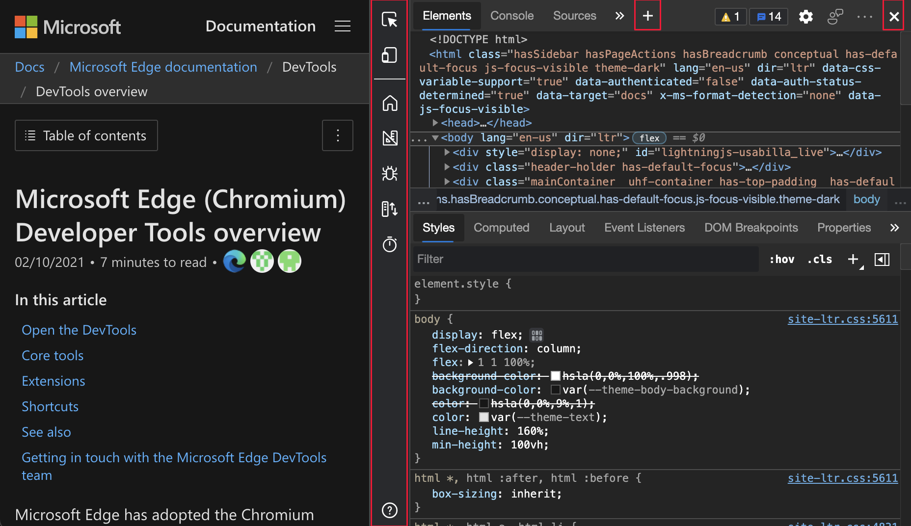
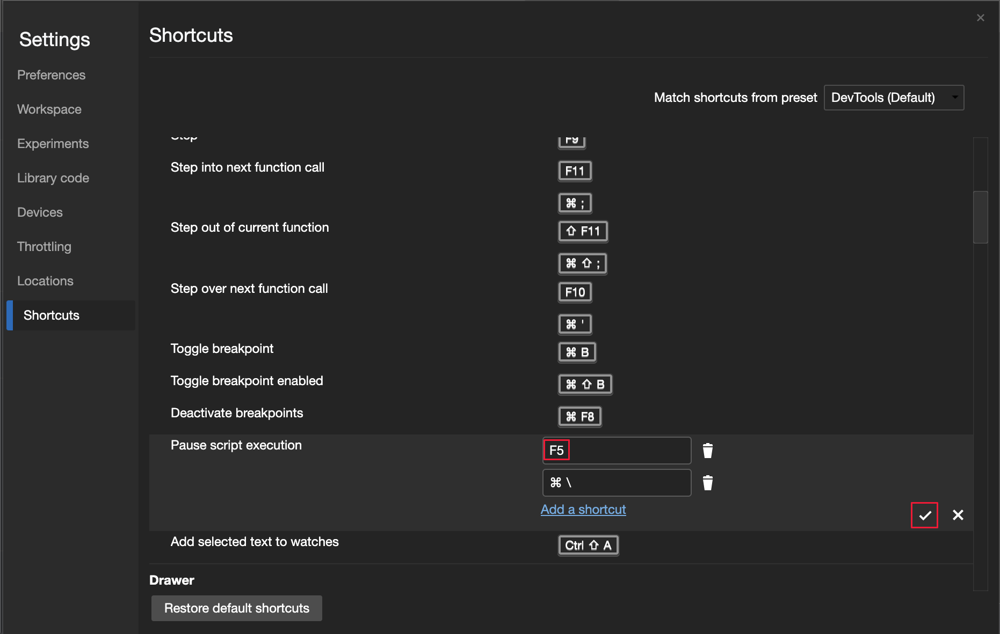
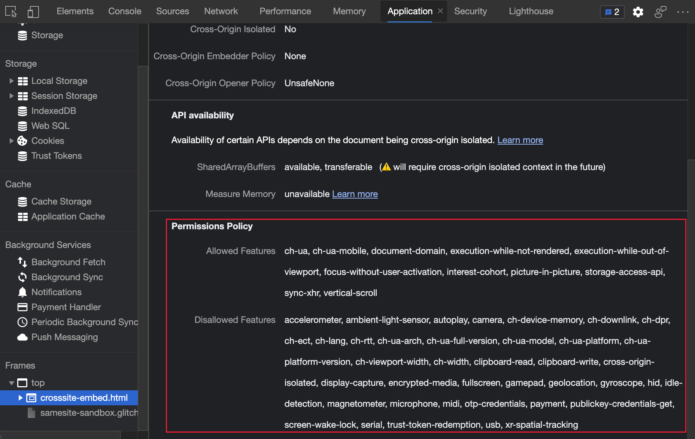
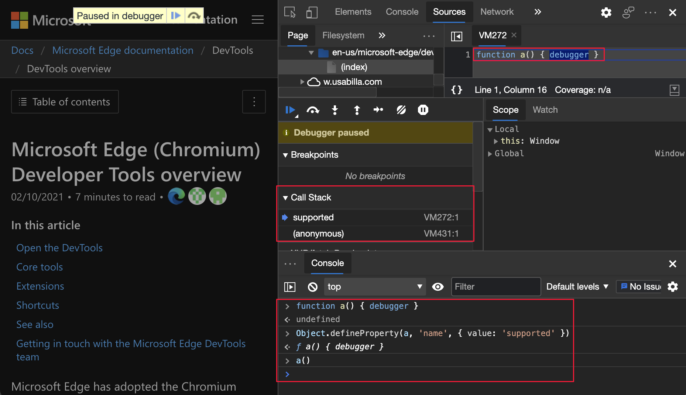
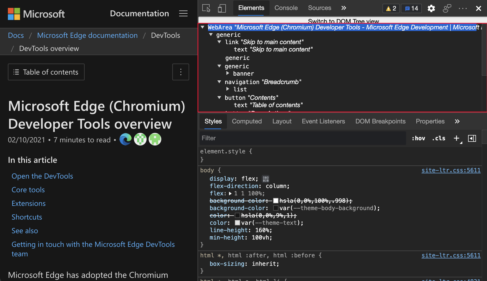

<!-- Copyright Jecelyn Yeen

   Licensed under the Apache License, Version 2.0 (the "License");
   you may not use this file except in compliance with the License.
   You may obtain a copy of the License at

       https://www.apache.org/licenses/LICENSE-2.0

   Unless required by applicable law or agreed to in writing, software
   distributed under the License is distributed on an "AS IS" BASIS,
   WITHOUT WARRANTIES OR CONDITIONS OF ANY KIND, either express or implied.
   See the License for the specific language governing permissions and
   limitations under the License.  -->
# DevTools 中的新增功能（Microsoft Edge 90）

[!INCLUDE [Microsoft Edge team note for top of What's New](../../includes/edge-whats-new-note.md)]

<!-- ====================================================================== -->
## 在焦点模式下将工具组合在一起

<!-- Title: Grouping the tools in Focus Mode  -->
<!-- Subtitle: Organize your favorite tools into groups with the new Focus Mode UI.  -->

焦点模式是一个试验界面，允许你根据自己的调试方案将不同工具组合在一起。  左侧显示的新“**活动栏**”包括预定义的工具组，如“**布局**”和“**调试**”。  若要自定义每个工具组，请使用“**关闭**”(`X`) 图标关闭工具，或使用“**更多工具**”(`+`) 图标添加新工具。

若要启用试验，请查看“[启用或禁用试验](../../../experimental-features/index.md#turning-an-experiment-on-or-off)”，然后选择“**焦点模式和 DevTools 工具提示**”和“**启用 + 按钮选项卡菜单以打开更多工具**”旁边的复选框。  有关此功能的详细信息，或者要用问题和想法进行评论，请查看 [DevTools：焦点模式 UI](https://github.com/MicrosoftEdge/DevTools/blob/main/explainers/FocusMode/explainer.md)。

请参阅[使用焦点模式简化开发工具](../../../experimental-features/focus-mode.md)。

<!-- ====================================================================== -->
## 通过信息丰富的工具提示了解 DevTools

<!-- Title: DevTools Tooltips  -->
<!-- Subtitle: Learn more about how to use DevTools with informative DevTools tooltips.  -->

DevTools 工具提示功能可帮助你了解所有不同的工具和窗格。  请将鼠标悬停在开发人员工具的每个概述区域上，以了解有关如何使用工具的更多信息。  若要打开工具提示，请执行以下操作之一： 

*  选择“**自定义和控制 DevTools** (`...`)”>“**帮助**” > “**切换 DevTools 工具提示**”。
*  按`Ctrl`+`Shift`+`H`（Windows/Linux）或 `Cmd`+`Shift`+`H` （macOS）。
*  [打开命令菜单](../../../command-menu/index.md#open-the-command-menu)，然后键入 `tooltips`。

然后将鼠标悬停在开发人员工具的每个概述区域上：

要关闭工具提示，请按“`Esc`”。  

更新：此功能已发布，不再处于实验性状态。<!-- valid. -->
<!-- To turn on the experiment, see [Turning an experiment on or off](../../../experimental-features/index.md#turning-an-experiment-on-or-off) and select the following checkboxes:
*  **Focus Mode**
*  **DevTools Tooltips**
*  **Enable + button tab menus to open more tools**
-->

注意：自 2022 年 5 月起，**活动栏**不支持工具提示；即，在[焦点模式](../../../experimental-features/focus-mode.md)下不支持工具提示。
<!--Click the Help (`?`) icon at the bottom of the **Activity Bar** to toggle tooltips in the DevTools.-->
<!--  -->
<!--
See also:
* [Focus Mode](../../../experimental-features/index.md#focus-mode) in _Experimental features_.
-->

另请参阅：
* 在 _开发人员工具概述_中[显示开发人员工具提示](../../../overview.md#display-devtools-tooltips)。

<!-- ====================================================================== -->
## 在“设置”中自定义键盘快捷方式

<!-- Title: Change keyboard shortcuts in Settings  -->
<!-- TODO:  Rachel's feedback is about the fact that this experimental feature is turned on by default, may have separate section in What's New for experimental features)  -->
<!-- Subtitle: Make DevTools work better for you by creating new keyboard shortcuts for any action in the DevTools.  -->

现在，你可以为 DevTools 中的任何操作自定义键盘快捷方式。

编辑键盘快捷方式：

1. 打开 DevTools，然后选择“**设置**” > “**快捷方式**”。

1. 选择要自定义的操作。

1. 单击“**编辑**”（）图标。

1. 按下要绑定到操作的按键。

1. 单击复选标记（) 图标。

有关自定义和编辑快捷方式的详细信息，请查看[在开发人员工具中自定义键盘快捷方式](../../../customize/shortcuts.md)。  有关 Chromium 开源项目中此功能的实时更新，请参阅问题 [174309](https://crbug.com/174309)。

<!-- ====================================================================== -->
## Microsoft Edge DevTools for Visual Studio Code 扩展更新 1.1.4

<!-- Title: Edge Devtools for Visual Studio code extension update 1.1.4  -->
<!-- Subtitle: Latest changes including a favicon is displayed next to each of the instances and console messages from the browser are displayed in the console of Visual Studio Code.  -->

适用于 Microsoft Visual Studio Code 的 [Microsoft Edge Developer Tools for Visual Studio Code](https://marketplace.visualstudio.com/items?itemName=ms-edgedevtools.vscode-edge-devtools) 扩展版本 1.1.4 现在在每个 DevTools 实例旁边显示一个网站图标。  来自 Microsoft Edge 的控制台消息现在显示在 Microsoft Visual Studio Code 的“**输出**”下的“**DevTools 控制台**”中。  Microsoft Visual Studio Code 会自动更新扩展。  若要手动更新到版本 1.1.4，请查看“[手动更新扩展](https://code.visualstudio.com/docs/editor/extension-gallery#_update-an-extension-manually)”。  你可以在 [vscode-edge-devtools](https://github.com/microsoft/vscode-edge-devtools) GitHub repo 上提交问题并参与扩展的改进。

下图显示了来自 Microsoft Edge“**控制台**”工具中记录的示例网页的消息：

下图显示了来自 Microsoft Visual Studio Code“**输出**”下“**DevTools 控制台**”中记录的示例网页的相同消息：

另请参阅：
* [用于 Visual Studio Code 的 Microsoft Edge DevTools 扩展](../../../../visual-studio-code/microsoft-edge-devtools-extension.md)

<!-- ====================================================================== -->
## 通过可视弹性框编辑器和多个覆盖改进了 CSS 弹性框编辑

<!-- Title: Try different CSS flexbox layouts with the visual flexbox editor  -->
<!-- Subtitle: In the Styles pane, click the icon that appears next to display: flex to try different layout properties for flex containers.  -->

DevTools 现在具有专用的 CSS 弹性框调试工具。  如果将 `display: flex` 或 `display: inline-flex` CSS 样式应用于 HTML 元素，则“**元素**”工具中该元素旁边将显示 `flex` 图标。  若要在网页上显示（或隐藏）弹性覆盖，请单击 `flex` 图标。

若要打开 **Flexbox** 编辑器，请在“**元素** ”工具中转到“**样式**”选项卡，然后单击 `display: flex` 或 `display: inline-flex` 样式旁边的新图标。  **弹性框**编辑器提供了一种快速编辑弹性框属性的方法：

此外，“**布局**”窗格中的“**弹性框**”部分将显示网页上的所有弹性框元素。  你可以切换每个元素的覆盖：

有关 Chromium 开源项目中此功能的历史记录，请参阅问题 [1166710](https://crbug.com/1166710) 和 [1175699](https://crbug.com/1175699)。

另请参阅：
* [在“样式”窗格中编辑 CSS 字体样式和设置](../../../inspect-styles/edit-fonts.md)
* _使用适用于 Visual Studio Code 的 Microsoft Edge 开发人员工具扩展_中的 [CSS 镜像编辑从样式工具同步实时更改](../../../../visual-studio-code/microsoft-edge-devtools-extension.md#syncing-live-changes-from-the-styles-tool-by-using-css-mirror-editing)。<!-- eg "flex-direction" is only mentioned in this extension article -->
<!-- todo: copy section content to regular docs -->

<!-- ====================================================================== -->
## 网络请求的键盘导航改进

<!-- Title: Navigate the request initiator chain in the Network tool with the keyboard  -->
<!-- Subtitle: The Initiator pane may now be expanded or collapsed with the arrow keys.  -->

以前，在“**发起程序**”窗格中，你无法使用键盘上的箭头键展开或折叠请求链，这与“**元素**”工具中的 DOM 不同。  当在“**网络**”工具中选择网络请求时，“**发起程序**”窗格将显示发起当前选定请求的请求链。

在 Microsoft Edge 版本 90 中，在“**发起程序**”窗格中，你可以使用键盘上的箭头键展开或折叠请求链。  链中的焦点网络请求现在也会突出显示。

单击“网络请求”，然后单击“**发起程序**”窗格：

展开或折叠请求发起程序链并执行突出显示的行：

若要在“**网络**”工具中了解有关发起程序的更多信息，请查看“[显示发起程序和依赖项](../../../network/reference.md#display-initiators-and-dependencies)”。

有关 Chromium 开源项目中此功能的历史记录，请参阅问题[1158276](https://crbug.com/1158276) 和 [1160637](https://crbug.com/1160637)。

<!-- ====================================================================== -->
## 控制台中的筛选更加一致

<!-- Title: Console improvements make filtering more consistent  -->
<!-- Subtitle: The Log Levels dropdown list is more clearly disabled when using filters in the Console sidebar.  -->

当使用[控制台边栏](../../../console/reference.md#open-the-console-sidebar)进行筛选时，“[日志级别](../../../console/reference.md#filter-by-log-level)”下拉列表中的筛选器不可用。  以前，“**日志级别**”下拉列表在你悬停时会突出显示，即使从**控制台边栏**中选择了筛选器也是如此。  在 Microsoft Edge 版本 90 中，当选择**控制台边栏**中的筛选器时，将鼠标悬停在**日志级别**下拉列表上时，将不再突出显示该列表。

若要详细了解**如何在控制台**中进行筛选，请参阅_控制台功能参考_中的“[筛选消息](../../../console/reference.md#filter-messages)”。

以前，如果打开“**控制台边栏**”并将鼠标悬停在“**默认级别**”上，它会突出显示：

从 Microsoft Edge 90 开始，如果你单击“**控制台边栏**”并将鼠标悬停在“**默认级别**”上，它将不会突出显示：

<!-- ====================================================================== -->
## 来自 Chromium 项目的公告

以下部分将公布 Microsoft Edge 中已组成开源 Chromium 项目的其他可用功能。

<!-- ====================================================================== -->
### 控制台现在可对双引号字符进行转义

以前，**控制台**不在 JavaScript 字符串中输出有效的双引号 (`"`) 字符。  从 Microsoft Edge 版本 90 开始，**控制台**将使用转义的双引号 (`"`) 字符输出 JavaScript 字符串：

有关 Chromium 开源项目中此功能的历史记录，请参阅问题 [1178530](https://crbug.com/1178530)。

另请参阅：
* [控制台功能参考](../../../console/reference.md)

<!-- ====================================================================== -->
### 模拟 CSS 色域媒体功能

[色域](https://www.chromestatus.com/feature/5354410980933632)媒体查询会模拟浏览器和你正在测试的设备支持的大致颜色范围。  “**模拟 CSS 媒体功能色域**”下的下拉列表包含 DevTools 可以模拟的颜色空间。  例如，若要触发 `color-gamut: p3` 媒体查询，请从下拉列表中选择“**色域：p3**”。

模拟 CSS 色域媒体功能：

1. 要打开 DevTools，请右击网页，然后选择“**检查**”。  或者，按“`Ctrl`+`Shift`+`I`”(Windows、Linux)或“`Command`+`Option`+`I`”(macOS)。  DevTools 随即打开。
1. 在开发人员工具的主工具栏上，选择“**呈现**”选项卡。 如果该选项卡不可见，请单击“ **更多选项卡** （）按钮，或者单击“**更多工具**”（）按钮。  已打开**渲染**工具。
1. 在“**仿真 CSS 媒体功能颜色范围**”下拉列表中，选择 **颜色域** 选项：

若要了解有关 `color-gamut` 功能的更多信息，请查看“[颜色显示质量：‘色域’功能](https://drafts.csswg.org/mediaqueries-4#color-gamut)”。
<!-- todo: add regular docs?  this link destination is a file listing, not user docs. -->

有关 Chromium 开源项目中此功能的历史记录，请参阅问题 [1073887](https://crbug.com/1073887)。

另请参阅：
* [呈现工具，查看具有不同显示选项或视觉缺陷的网页外观](../../../rendering-tools/rendering-tool.md)

<!-- ====================================================================== -->
### 改进了渐进式 Web 应用的工具

<!-- ====================================================================== -->
#### 控制台中的 PWA 可安装性警告

**控制台**现在显示渐进式 Web 应用 （PWA） 的更详细的可安装性警告消息，其中包含“[改进渐进式 Web 应用脱机支持检测](https://developer.chrome.com/blog/improved-pwa-offline-detection)”链接。

另请参阅：
* [渐进式 Web 应用 （PWA） 概述](../../../../progressive-web-apps-chromium/index.md)

<!-- ====================================================================== -->
#### “清单”窗格中的 PWA 说明长度警告

在**应用程序工具**中，如果清单说明超过 324 个字符，“ **清单** ”窗格现在会显示警告消息：

有关 Chromium 开源项目中此功能的历史记录，请参阅问题 [965802](https://crbug.com/965802)、 [1146450](https://crbug.com/1146450)和 [1169689](https://crbug.com/1169689)。

另请参阅：
* [用于管理存储的应用程序工具](../../../storage/application-tool.md)
<!-- todo: the Application tool seems under-doc'd; contrast the TOC > Tools > Application tool vs. the left-side tree in the tool:
https://docs.microsoft.com/microsoft-edge/devtools-guide-chromium/storage/application-tool -->

<!-- ====================================================================== -->
### “网络”工具中新的“远程地址空间”列

<!-- doesn't work in canary 90.0.813.0 -->
在“**网络**”工具中，新的“**远程地址空间**”列显示每个网络资源的网络 IP 地址空间。  若要显示新的“**远程地址空间**”列，请执行以下操作：

1. 在 DevTools 中，打开**网络**工具。

1. 在“请求”表（ **网络** 工具的主部分）中，右键单击标题行，然后选择“**远程地址空间**”：

   

   现在，“请求”表显示“**远程地址空间**”列：

   

要在 Chromium 开放源代码项目中查看此功能的历史记录，请参阅问题 [1128885](https://crbug.com/1128885)。

另请参阅：
* 在_网络功能参考_中[添加或删除列](../../../network/reference.md#add-or-remove-columns)。

<!-- ====================================================================== -->
### 在“框架详细信息”视图中显示允许和禁止的功能

在**应用程序工具**中，左下角的“**帧**”节点将打开“帧详细信息”视图。  “框架详细信息”视图现在包括“**权限策略**”部分，其中显示允许和不允许的浏览器功能列表：

此列表由权限策略 Web 平台 API 控制，该 API 允许网页使用或阻止网页在单个帧或框架嵌入的 iframe 中使用指定的浏览器功能。

有关 Chromium 开源项目中此功能的历史记录，请参阅问题 [1158827](https://crbug.com/1158827)。

另请参阅：
* [权限策略解释器](https://github.com/w3c/webappsec-permissions-policy/blob/main/permissions-policy-explainer.md)
* [用于管理存储的应用程序工具](../../../storage/application-tool.md)
<!-- todo: it seems like a new "Application > Webpage Frames" .md page is needed; many What's New items cover the Frame node/page in lower left of Application tool -->

<!-- ====================================================================== -->
### “Cookie”窗格中新的“SameParty”列

“**应用程序**”工具中的“**Cookie**”窗格现在显示每个 Cookie 的 `SameParty` 属性：

`SameParty` 属性是一个新的布尔属性，用于指示在对相同[第一方集](https://github.com/privacycg/first-party-sets)的起源的请求中是否包含 cookie。

有关 Chromium 开源项目中此功能的历史记录，请参阅问题 [1161427](https://crbug.com/1161427)。

另请参阅：
* [查看、编辑和删除 Cookie](../../../storage/cookies.md)

<!-- ====================================================================== -->
### “控制台”工具中的 fn.displayName 属性现已弃用

以前，`fn.displayName` 属性允许你控制要在 `error.stack` 和 DevTools 堆栈跟踪中显示的函数的调试名称。  从 Microsoft Edge 版本 90 开始，`fn.displayName` 属性现已弃用，并替换为 `fn.name` 属性：

使用标准 `Object.defineProperty` 方法定义 `fn.name` 属性。  若要详细了解`fn.name`，请参阅 [Function.name](https://developer.mozilla.org/docs/Web/JavaScript/Reference/Global_Objects/Function/name)。

有关 Chromium 开源项目中此功能的历史记录，请参阅问题 [1177685](https://crbug.com/1177685)。

另请参阅：
* [控制台功能参考](../../../console/reference.md)
* [控制台工具实用功能和选择器](../../../console/utilities.md)
<!-- todo: is this function a partial overlap w/ devtools console & JS Ref?  do we have similar doc'n? -->

<!-- ====================================================================== -->
### “元素”工具中的完整辅助功能树视图

<!-- valid 05/10/2022 -->

此试验在“**元素**”工具中提供**完整的辅助功能树视图**。  “**辅助功能**”选项卡（与“**样式**”选项卡同组）提供部分辅助功能树视图，该视图显示从根节点到已检查节点的直接上级链。  打开此试验并重新加载开发人员工具后，单击“**元素**”面板顶部的按钮区域，切换网页上所有元素在“元素”工具中的显示。

若要显示 DOM 树视图，请单击顶部的“**切换到 DOM 树视图**”按钮区域：

若要显示完整的辅助功能树，请单击顶部的“**切换到辅助功能树视图**”按钮：

<!-- todo: redo capture showing Accessibility tab (instead of Styles tab) for comparison and to clarify its behavior -->

若要启用试验，请查看“[启用或禁用试验](../../../experimental-features/index.md#turning-an-experiment-on-or-off)”，然后选择“**在‘元素’窗格中启用完整的辅助功能树视图**”旁边的复选框。

有关 Chromium 开源项目中此功能的历史记录，请参阅问题 [887173](https://crbug.com/887173)。

另请参阅：
* [使用"辅助功能"选项卡测试辅助功能](../../../accessibility/accessibility-tab.md)
* [使用 Elements 工具检查、编辑和调试 HTML 和 CSS](../../../elements-tool/elements-tool.md)

<!-- ====================================================================== -->
> [!NOTE]
> 此页面的某些部分是根据 [Google 创建和共享的](https://developers.google.com/terms/site-policies)作品所做的修改，并根据[ Creative Commons Attribution 4.0 International License ](https://creativecommons.org/licenses/by/4.0)中描述的条款使用。
> 原始页面位于 [此处](https://developer.chrome.com/blog/new-in-devtools-90)，并由 [Jecelyn Yeen](https://developers.google.com/web/resources/contributors#jecelyn-yeen)  \（开发人员支持者，Chrome DevTools\）制作。

本作品根据[ Creative Commons Attribution 4.0 International License ](https://creativecommons.org/licenses/by/4.0)获得许可。
