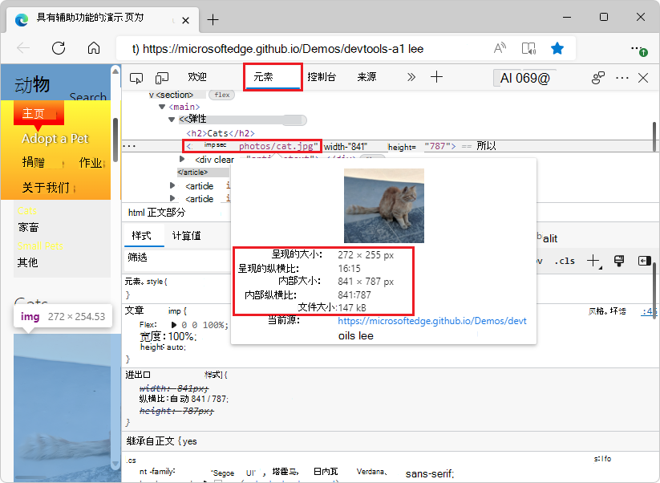
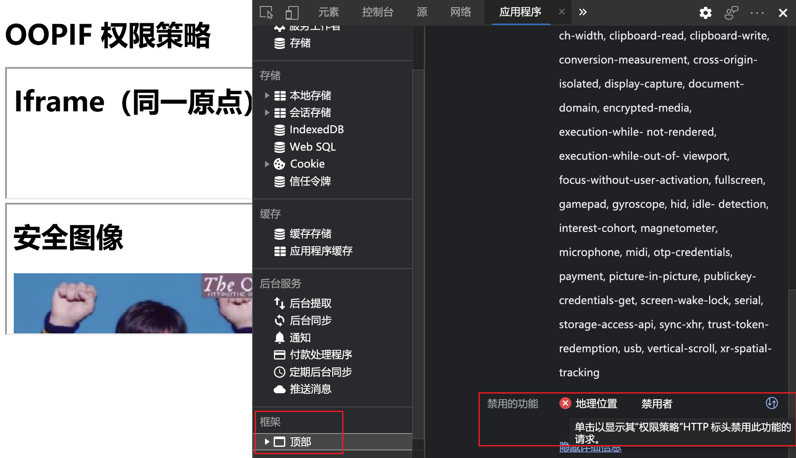

<!-- Copyright Jecelyn Yeen

   Licensed under the Apache License, Version 2.0 (the "License");
   you may not use this file except in compliance with the License.
   You may obtain a copy of the License at

       https://www.apache.org/licenses/LICENSE-2.0

   Unless required by applicable law or agreed to in writing, software
   distributed under the License is distributed on an "AS IS" BASIS,
   WITHOUT WARRANTIES OR CONDITIONS OF ANY KIND, either express or implied.
   See the License for the specific language governing permissions and
   limitations under the License.  -->
# <a name="whats-new-in-devtools-microsoft-edge-91"></a>DevTools (Microsoft Edge 91) 中的新增功能

[!INCLUDE [Microsoft Edge team note for top of What's New](../../includes/edge-whats-new-note.md)]


<!-- ====================================================================== -->
## <a name="wavy-underlines-highlight-code-issues-and-improvements-in-elements-tool"></a>波浪下划线突出显示元素工具中的代码问题和改进项

<!--  Title: Get code hints in Elements tool  -->
<!--  Subtitle: Wavy underlines like the ones you see in Visual Studio Code now display in the Elements tool.  Underlines alert you to code issues related to accessibility, compatibility, security, performance, and  so on.  -->

在大多数新式 IDE 中，文本下的波浪下划线指示语法错误。   在 Microsoft Edge 版本 91 或更高版本中，波浪下划线显示在 **元素** 工具的 **DOM** 视图中的 HTML 下。  波浪下划线指示与辅助功能、兼容性、性能等相关的代码问题和建议。

若要打开 **“问题** ”工具并详细了解问题及其解决方法：

* 按住 `Shift`，然后单击波浪下划线。

* 或者，右键单击波浪下划线，然后选择 **“在问题中显示**”。

在 **Elements** 工具中选择带下划线的错误：


在 **“问题** ”工具中显示错误详细信息：


另请参阅：
* [使用问题工具查找和修复问题](../../../issues/index.md)


<!-- ====================================================================== -->
## <a name="learn-about-devtools-with-informative-tooltips"></a>通过信息丰富的工具提示了解 DevTools

<!--  Title: Learn more about DevTools with DevTools Tooltips  -->
<!--  Subtitle: Informative overlays are now available in the default DevTools interface.  -->

DevTools 工具提示功能可帮助你了解所有不同的工具和窗格。  将鼠标悬停在 DevTools 的每个概述区域上，详细了解如何使用该工具。  若要打开工具提示，请执行以下任一操作： 

*  选择 **“自定义”并控制 DevTools** (`...`) > **帮助** > **切换 DevTools 工具提示**。
*  按 `Ctrl`++`Shift``H` (Windows/Linux) 或`H``Cmd`+`Shift`+ (macOS) 。
*  [打开命令菜单](../../../command-menu/index.md#open-the-command-menu)，然后键入 `tooltips`。

然后将鼠标悬停在 DevTools 的每个概述区域上：


若要关闭工具提示，请按 `Esc`。

更新：此功能已发布，不再具有实验性。<!-- valid. -->

注意：自 2022 年 5 月起， **活动栏**不支持工具提示;也就是说，在 [焦点模式下](../../../experimental-features/focus-mode.md)。
<!-- Also, if you turn on the [Focus Mode and DevTools Tooltips](../02/devtools.md#group-tools-together-in-focus-mode) experiment, you can also click the **Toggle the DevTools Tooltips** (`?`) button at the bottom of the **Activity Bar**. -->
<!--  -->

另请参阅：
* 在 _DevTools 概述_中[显示 DevTools 工具提示](../../../overview.md#display-devtools-tooltips)。

<!--
* [Learn about DevTools with informative tooltips](../02/devtools.md#learn-about-devtools-with-informative-tooltips) in _What's new in DevTools (Microsoft Edge 90)_.
-->


<!-- ====================================================================== -->
## <a name="service-worker-update-timeline"></a>服务工作进程更新日程表

<!--todo:  Update the linked [Service Worker improvements](../../../service-workers/index.md) article.  -->

<!--  Title: The tasks associated with your Service Worker  -->
<!--  Subtitle: Debug with Service Worker Update Cycle  -->

在 Microsoft Edge 版本 91 或更高版本中，如果你是渐进式 Web 应用或服务工作进程开发人员，请在 **应用程序** 工具中将服务工作进程的更新生命周期显示为日程表。  此功能可帮助你了解服务辅助角色在以下每个阶段花费的时间：

*  **安装**
*  **等待**
*  **激活**


有关Chromium开源项目中此功能的实时更新，请参阅[问题1066604](https://crbug.com/1066604)。

另请参阅：
* [服务辅助角色生命周期](../../../../progressive-web-apps-chromium/how-to/service-workers.md#the-service-worker-lifecycle)。
* [服务辅助角色改进](../../../service-workers/index.md) - 针对渐进式Web 应用和服务工作者的 DevTools 调试工具。


<!-- ====================================================================== -->
## <a name="progressive-web-apps-no-longer-display-warnings-for-non-square-icons"></a>渐进式 Web 应用不再显示非方形图标的警告

<!--  Title: Non-square icons in app manifest no longer produce warnings  -->
<!--  Subtitle: As long as square icons are included in the app manifest, non-square icons no longer produce warnings  -->

在 [Microsoft Edge 版本 90](../02/devtools.md) 或更早版本中，如果 PWA 的 Web 应用清单包含非方形图标，则在 **错误和警告** 部分中显示针对每个非方形图标的警告。  在 Microsoft Edge 版本 91 或更高版本中，如果至少提供了一个方形图标，则 **应用程序** 工具中的 **清单** 部分不显示任何警告。  如果未提供任何方形图标，将显示以下警告消息：

```output
Most operating systems require square icons.  Please include at least one square icon in the array.
```

在 Microsoft Edge 版本 90 或更早版本中，为非正方形的每个图标显示错误：


在 Microsoft Edge 版本 91 或更高版本中，提供至少一个方形图标时不会显示错误：


若要查看 Web 应用清单中的错误和警告， **请选择“** 应用程序”工具>“ **应用程序** ”部分> **清单**。  错误和警告列在 **错误和警告** 标题下。

有关Chromium开源项目中此功能的实时更新，[请参阅问题1185945](https://crbug.com/1185945)。

另请参阅：
* [使用 Web 应用清单将渐进式 Web 应用集成到操作系统](../../../../progressive-web-apps-chromium/how-to/web-app-manifests.md)
* [PWABuilder：映像生成器](https://www.pwabuilder.com/imageGenerator) - 为各种平台创建应用图标，以包含在 Web 应用清单中。


<!-- ====================================================================== -->
## <a name="localized-devtools-now-supported-in-chromium-based-browsers"></a>基于 Chromium 的浏览器现在支持本地化的 DevTools

<!--  Title: Localization for all  -->
<!--  Subtitle: Match browser language enabled to all Chromium-based browsers  -->

从 [Microsoft Edge 版本 81](../../2020/01/devtools.md#using-the-devtools-in-other-languages) 开始，Microsoft Edge DevTools UI 以你自己的语言显示。  许多开发人员使用开发人员工具（如 StackOverflow 和 Visual Studio Code）作为本机语言。  为了提供类似的 UI 语言灵活性，Microsoft Edge DevTools 团队、Chrome DevTools 团队和 Google Lighthouse 团队协作在所有基于Chromium的浏览器中提供相同的体验。


请参阅 [更改 DevTools 语言设置](../../../customize/localization.md)。

有关Chromium开源项目中此功能的协作的详细信息，请参阅问题[1136655](https://crbug.com/1136655)。


<!-- ====================================================================== -->
## <a name="use-the-keyboard-to-navigate-to-css-variables"></a>使用键盘导航到 CSS 变量

<!--  Title: Navigate to CSS variables with the arrow keys  -->
<!--  Subtitle: In the Styles pane, use the arrow keys to select CSS variables.  Press `Enter` to see the variable definition.  -->

从 [Microsoft Edge 版本 88](../../2020/11/devtools.md#css-variable-definitions-in-styles-pane) 开始，**样式** 窗格显示 CSS 变量，并直接提供指向每个变量定义的链接。  在 Microsoft Edge 版本 91 或更高版本中，可以使用箭头键轻松导航到 CSS 变量。  若要在“ **样式** ”窗格中打开定义，请将鼠标悬停在变量上，然后按下 `Enter`：


有关Chromium开源项目中此功能的实时更新，[请参阅问题1187735](https://crbug.com/1187735)。

另请参阅：
* [使用 CSS 自定义属性 (变量) ](https://developer.mozilla.org/docs/Web/CSS/Using_CSS_custom_properties)
* [CSS 功能参考](../../../css/reference.md)
<!-- todo: doc css variables in DevTools UI context, or rely on MDN? -->


<!-- ====================================================================== -->
## <a name="issues-are-automatically-sorted-by-severity"></a>问题按严重性自动排序

<!-- Title: Display Issues in severity order  -->
<!-- Subtitle: Entries in the Issues tool now display in severity order and allow you to focus your updates on the most important issues. -->

**Issue** 工具显示改进网站的建议，包括辅助功能、性能、安全性等。  根据用户反馈，问题现在会按严重性自动排序。  在每个反馈类别中，首先出现标记为 **“错误** ”的每个问题，关注标记为 **“警告**”的每个问题，然后将每个问题标记为 **提示**：


另请参阅：
* [使用问题工具查找和修复问题](../../../issues/index.md)


<!-- ====================================================================== -->
## <a name="microsoft-edge-developer-tools-for-visual-studio-code-version-117"></a>Microsoft Edge 开发人员工具 for Visual Studio Code 版本 1.1.7

<!-- Title: Microsoft Edge DevTools for Visual Studio version 1.1.7  -->
<!-- Subtitle: Increased target closure reliability, automatically update the side panel, new right-click menu for settings and Changelog, and more. -->

[Microsoft Edge 工具 for Visual Studio Code 扩展](https://marketplace.visualstudio.com/items?itemName=ms-edgedevtools.vscode-edge-devtools) 版本 1.1.7 提供 [Microsoft Edge 版本 88](../../2020/11/devtools.md) 中的 DevTools。  此扩展现在支持 ARM 设备，并且不再依赖于 Microsoft Edge 调试程序 扩展。
<!-- old url: https://marketplace.visualstudio.com/items?itemName=msjsdiag.debugger-for-edge -->
<!-- todo: consult w SME on desired presentation here -->

版本 1.1.7 包括以下 bug 修复和改进：

*  更新了目标关闭的可靠性。

*  更新了侧面板，以在调试创建或销毁的目标时自动刷新。

*  添加了一个新的右键单击菜单，可让你更快地访问扩展设置和最新的 Changelog。

*  更新并简化了扩展文档（包括最新功能）的发布。

若要手动更新到版本 1.1.7，请参阅 [手动更新扩展](https://code.visualstudio.com/docs/editor/extension-gallery#_update-an-extension-manually)。  你可以在 [vscode-edge-devtools GitHub repo](https://github.com/microsoft/vscode-edge-devtools) 上提交问题并参与扩展的改进。

另请参阅：
* [用于 Visual Studio Code 的 Microsoft Edge DevTools 扩展](../../../../visual-studio-code/microsoft-edge-devtools-extension.md)


<!-- ====================================================================== -->
## <a name="announcements-from-the-chromium-project"></a>来自 Chromium 项目的公告

以下部分将公布 Microsoft Edge 中已组成开源 Chromium 项目的其他可用功能。


<!-- ====================================================================== -->
### <a name="visualize-css-scroll-snap"></a>可视化 CSS 滚动贴靠

在 **“元素”** 工具中，现在可以切换 `scroll-snap` 锁屏提醒来检查 CSS 滚动快照对齐方式。  当网页上的 HTML 元素应用`scroll-snap-type`到它时，**元素**工具中会在它旁边显示一个`scroll-snap`锁屏提醒。  `scroll-snap`单击锁屏提醒以切换在网页上显示滚动贴贴。

有关示例网页，请参阅[滚动贴靠演示](https://mathiasbynens.github.io/css-dbg-stories/css-scroll-snap.html)。  在该示例中，点显示在快照边缘上。  滚动端口具有坚实的轮廓，而快照项具有虚线轮廓。  滚动填充以绿色填充，而滚动边距以橙色填充：


<!-- You can view the source files for the Scroll Snap demo at the [mathiasbynens/css-dbg-stories](https://github.com/mathiasbynens/css-dbg-stories) repo. -->

有关Chromium开源项目中此功能的历史记录，请参阅[问题 862450](https://crbug.com/862450)。

另请参阅：
* [检查 CSS 网格](../../../css/grid.md)
* [CSS 功能参考](../../../css/reference.md)
<!-- todo: it seems that related regular docs are needed for grid (has a page), flexbox, & scroll-snap.  the present section is all there is for scroll-snap per FTS of repo -->


<!-- ====================================================================== -->
### <a name="new-memory-inspector-tool"></a>新建内存检查器工具

使用新的 **内存检查器** 工具检查 `ArrayBuffer` JavaScript 和 Wasm 内存：


请参阅：
* [使用内存检查器工具检查 JavaScript ArrayBuffer](../../../memory-inspector/memory-inspector-tool.md)
* [使用调试器窗格调试 JavaScript 代码](../../../sources/index.md#using-the-debugger-pane-to-debug-javascript-code)

有关Chromium开源项目中此功能的历史记录，[请参阅问题1166577](https://crbug.com/1166577)。


<!-- ====================================================================== -->
### <a name="new-badge-settings-pane-in-the-elements-tool"></a>元素工具中的新建徽章设置窗格

现在，使用 **Elements** 工具中的**徽章设置**打开 (或关闭) 单个徽章。  在检查网页时，使用此功能自定义并对重要徽章保持关注。

1. 右键单击某个元素，然后单击 **“锁屏提醒”设置**。  锁屏提醒设置窗格在 **“元素** ”工具顶部打开：

   

1. 若要显示 (或隐藏) 徽章，请选择 (或清除徽章名称旁边的复选框) 。

<!--
For the history of this feature in the Chromium open-source project, see Issue [1066772](https://crbug.com/1066772).
-->

另请参阅：
* [使用 Elements 工具检查、编辑和调试 HTML 和 CSS](../../../elements-tool/elements-tool.md)
<!-- todo: create regular docs for Elements > Badge settings.  FTS 0 hits except this section. -->


<!-- ====================================================================== -->
### <a name="enhanced-image-preview-with-aspect-ratio-information"></a>使用纵横比信息增强的图像预览

在 **Elements** 工具中，增强了图像预览以显示详细信息，包括以下详细信息：

*  呈现的大小
*  呈现的纵横比
*  内部大小
*  内部纵横比
*  文件大小



此信息可帮助你更好地了解图像并应用优化。  当您单击作为图像的页面资源时， **网络** 工具中也提供了图像纵横比信息：


有关Chromium开源项目中此功能的历史记录，[请参阅问题1149832](https://crbug.com/1149832)和[1170656](https://crbug.com/1170656)。

另请参阅：
* [使用 Elements 工具检查、编辑和调试 HTML 和 CSS](../../../elements-tool/elements-tool.md)
* [检查网络活动](../../../network/index.md)


<!-- ====================================================================== -->
### <a name="new-options-to-configure-content-encodings-in-the-network-conditions-tool"></a>用于在网络条件工具中配置 Content-Encoding 的新选项

在 **“网络**”工具中，单击 **“限制**”下拉菜单旁边的新“**更多网络条件...**”按钮以打开 **“网络条件**”工具。  若要测试是否为不支持 [gzip](https://www.gnu.org/software/gzip/manual)、 [brotli](https://www.brotli.org) 或其他将来 `Content-Encoding`的浏览器正确编码服务器响应：

1. 打开 **“网络条件”** 工具。

1. 转到 **已接受的内容编码**。

1. 清除要测试的 `Content-Encoding` 复选框。


另请参阅：
* [网络条件工具](../../../network-conditions/network-conditions-tool.md)

有关Chromium开源项目中此功能的历史记录，[请参阅问题1162042](https://crbug.com/1162042)。


<!-- ====================================================================== -->
### <a name="styles-pane-enhancements"></a>样式窗格增强功能


<!-- ====================================================================== -->
#### <a name="new-shortcut-to-display-computed-value-in-the-styles-pane"></a>在样式窗格中显示计算值的新快捷方式

现在，若要在 **“元素**”工具的“**样式**”选项卡中显示计算的 CSS 值：

1. 右键单击 CSS 属性，然后选择 **“查看计算值**”：

   

另请参阅：
* [仅查看实际应用于 CSS](../../../css/reference.md#view-only-the-css-that-is-actually-applied-to-an-element) _功能引用中的元素的 CSS_。
* 在 _DevTools (Microsoft Edge 87) _的“样[式”窗格中查看“计算”边栏窗格](../../2020/10/devtools.md#view-the-computed-sidebar-pane-in-the-styles-pane)。
* 使用_辅助技术浏览 Navigate DevTools_ 中[的所有计算样式](../../../accessibility/navigation.md#explore-all-computed-styles)。

若要在Chromium开源项目中查看此功能的历史记录，请参阅问题[1076198](https://crbug.com/1076198)。


<!-- ====================================================================== -->
#### <a name="support-for-the-accent-color-keyword"></a>支持强调色关键字

**样式** 窗格的自动完成 UI 现在检测 `accent-color` CSS 关键字，这允许你为元素生成的 UI 控件指定强调色。  元素生成的 UI 控件示例包括复选框或单选按钮。


有关Chromium实现状态的详细信息，请参阅[功能：强调色 CSS 属性](https://chromestatus.com/feature/4752739957473280)。  若要启用此功能，请转到 `edge://flags#enable-experimental-web-platform-features` 复选框并将其设置为 **“已启用**”。

有关Chromium开源项目中此功能的历史记录，[请参阅问题1092093](https://crbug.com/1092093)。

另请参阅：
* [CSS 功能参考](../../../css/reference.md)
<!-- todo: fts "accent-color": 0 hits; doc this? -->


<!-- ====================================================================== -->
### <a name="display-details-about-blocked-features-in-the-frame-details-view"></a>在帧详细信息视图中显示有关被阻止功能的详细信息

权限策略是一个 Web 平台 API，它使网站能够允许或阻止在单个帧或其嵌入的 `iframe` 中使用浏览器功能。
若要显示阻止功能的原因的详细信息，请执行以下操作：

1. 转到 [OOPIF 权限策略](http://permission-policy-demo.glitch.me)。
1. 打开“**应用程序**”工具。
1. 单击帧。
1. 转到“ **权限策略** ”部分。
1. 找到 **“禁用功能** ”属性。
1. 单击 **“显示详细信息**”。
1. 单击每个策略旁边的图标，转到阻止该功能的 `iframe` 或网络请求。



另请参阅：
* [权限策略说明器](https://github.com/w3c/webappsec-permissions-policy/blob/main/permissions-policy-explainer.md)
* [用于管理存储的应用程序工具](../../../storage/application-tool.md)
<!-- todo: doc in Application tool > Frame (bottom left) docs, link to that instead of Application tool page -->

若要在Chromium开源项目中查看此功能的历史记录，请参阅问题[1158827](https://crbug.com/1158827)。


<!-- ====================================================================== -->
### <a name="filter-experiments-in-the-experiments-setting"></a>在试验设置中筛选试验

使用新的试验筛选器更快地查找试验。  例如，为代码问题启用新试验：

1. 在 DevTools 中，选择**设置** (设置) >**试验**。

1. 在 **“筛选器** ”文本框中，开始键入 **问题**：


另请参阅：
* [实验功能](../../../experimental-features/index.md)


<!-- ====================================================================== -->
### <a name="new-vary-header-column-in-the-cache-storage-pane"></a>缓存存储窗格中的新的变化标头列

**在应用程序**工具的 **“缓存存储**”窗格中，使用新`Vary Header`列显示 `Vary` HTTP 响应标头值：


有关Chromium开源项目中此功能的历史记录，[请参阅问题1186049](https://crbug.com/1186049)。

另请参阅：
* [](https://httpwg.org/specs/rfc7231.html#header.vary) _超文本传输协议 (HTTP/1.1) 中有所不同：语义和内容_。
* [查看缓存数据](../../../storage/cache.md)


<!-- ====================================================================== -->
### <a name="sources-tool-improvements"></a>源工具改进


<!-- ====================================================================== -->
#### <a name="support-for-new-javascript-features"></a>支持新的 JavaScript 功能

DevTools 现在支持新的 **专用品牌检查** a.k.a. `#foo in obj` JavaScript 语言功能。  **专用品牌检查**功能扩展了`in`操作员，以支持特定对象上的专用 (`#`) 类字段。  请在 **控制台** 和 **源** 工具中试用。

检查专用字段：

1. 在 **“源** ”工具中，转到 **调试器** 窗格。
1. 展开“ **作用域** ”部分：


另请参阅：
* [专用品牌检查 a.k.a. `#foo in obj`](https://v8.dev/features/private-brand-checks) 在 v8.dev。
* [MDN 中的运算符](https://developer.mozilla.org/docs/Web/JavaScript/Reference/Operators/in) 。
* v8.dev 的[专用类字段](https://v8.dev/features/class-fields#private-class-fields)。
<!-- todo: doc this lang support UI feature?  crossover of lang & UI -->

有关Chromium开源项目中此功能的历史记录，请参阅问题 [11374](https://crbug.com/v8/11374)。


<!-- ====================================================================== -->
#### <a name="enhanced-support-for-breakpoints-debugging"></a>对断点调试的增强支持

在 Microsoft Edge 版本 90 或更早版本中，DevTools 仅在单个捆绑包中设置断点。  在 Microsoft Edge 版本 91 或更高版本中，调试共享组件时，DevTools 会在多个捆绑包中正确设置断点。

Webpack 和[汇总](https://rollupjs.org)等[](https://webpack.js.org)新式 JavaScript 捆绑程序支持将代码拆分为捆绑包。  请参阅 [代码拆分](https://webpack.js.org/guides/code-splitting/)。

有关Chromium开源项目中此功能的历史记录，[请参阅问题1142705](https://crbug.com/1142705)、[979000](https://crbug.com/979000) 和[1180794](https://crbug.com/1180794)。

另请参阅：
* [使用断点暂停代码](../../../javascript/breakpoints.md)
<!-- todo: document bundles in DevTools docs?  FTS finds "bundles" but not found -->


<!-- ====================================================================== -->
#### <a name="support-hover-preview-with-bracket-notation"></a>支持使用括号表示法的悬停预览

**“源**”工具现在支持将**预览悬停在**使用该表示法的 `[]` JavaScript 成员表达式上：

![支持使用 [] 表示法的悬停预览。](../../media/2021/04/sources-page-pen.js-breakpoint-arr-i-a.msft.png)

有关Chromium开源项目中此功能的历史记录，[请参阅问题1178305](https://crbug.com/1178305)。

另请参阅：
* [JavaScript 调试功能](../../../javascript/reference.md)


<!-- ====================================================================== -->
#### <a name="improved-outline-of-html-files"></a>改进的 HTML 文件大纲

DevTools 现在对 `.html` 文件具有更好的大纲支持。  在 **源** 工具中，打开 `.html` 文件。  若要打开 (或关闭) 代码大纲，请按`Ctrl`++`Shift``O`Windows/Linux 或`O``Cmd`+`Shift`+macOS。  以前，DevTools 仅显示一些函数。  在下图中，DevTools 现在正确列出了大纲中的所有函数：


有关Chromium开源项目中此功能的历史记录，请[参阅问题761019](https://crbug.com/761019)和[1191465](https://crbug.com/1191465)。

另请参阅：
* _键盘快捷方式_中的[源工具键盘快捷方式](../../../shortcuts/index.md#sources-tool-keyboard-shortcuts)
* [使用“编辑器”窗格在](../../../sources/index.md#using-the-editor-pane-to-view-or-edit-files)_“源”工具概述_中查看或编辑文件


<!-- ====================================================================== -->
#### <a name="proper-error-stack-traces-for-wasm-debugging"></a>Wasm 调试的正确错误堆栈跟踪

在 Microsoft Edge 版本 90 或更早版本中，DevTools 仅在错误堆栈跟踪中显示泛型 Wasm 引用。  在 Microsoft Edge 版本 91 或更高版本中，DevTools 解析内联函数请求，并在 Wasm 调试的错误堆栈跟踪中显示源位置。  若要详细了解**控制台**中的错误堆栈跟踪，请参阅_控制台对象 API 参考_中[的错误](../../../console/api.md#error)。

在 Microsoft Edge 版本 91 或更高版本中，DevTools 解析内联函数请求，并显示 Wasm 调试的正确错误堆栈跟踪。

在 Microsoft Edge 版本 90 及更低版本中，源位置不会显示在错误堆栈跟踪中。  源位置包括 `dsquare`。  以前用于 Wasm 调试的错误堆栈跟踪：


在 Microsoft Edge 版本 91 及更高版本中，源位置显示在错误堆栈跟踪中。  用于 Wasm 调试的正确错误堆栈跟踪：


有关Chromium开源项目中此功能的历史记录，[请参阅问题1189161](https://crbug.com/1189161)。


<!-- ====================================================================== -->
> [!NOTE]
> 此页面的某些部分是根据 [Google 创建和共享的](https://developers.google.com/terms/site-policies)作品所做的修改，并根据[ Creative Commons Attribution 4.0 International License ](https://creativecommons.org/licenses/by/4.0)中描述的条款使用。
> 原始页面位于 [此处](https://developer.chrome.com/blog/new-in-devtools-91)，并由 [Jecelyn Yeen](https://developers.google.com/web/resources/contributors#jecelyn-yeen)  \（开发人员支持者，Chrome DevTools\）制作。

[](https://creativecommons.org/licenses/by/4.0)
本作品根据[ Creative Commons Attribution 4.0 International License ](https://creativecommons.org/licenses/by/4.0)获得许可。
