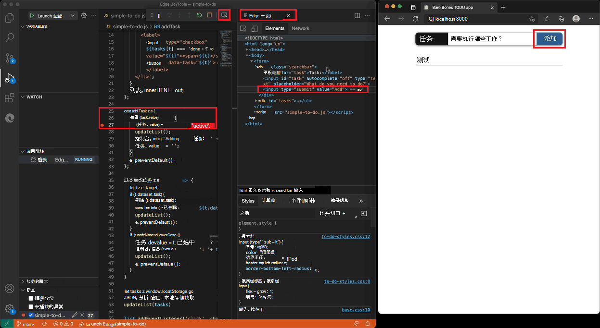
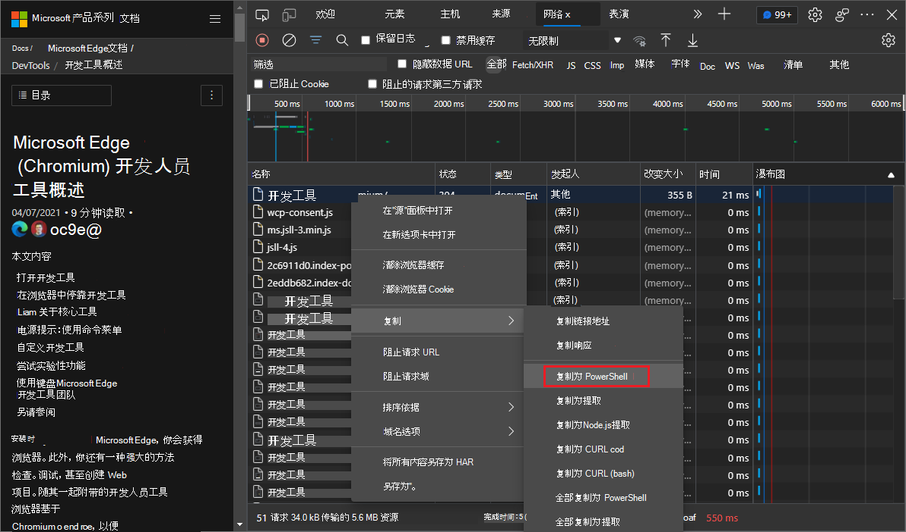

# DevTools (Microsoft Edge 93) 中的新增功能

[!INCLUDE [Microsoft Edge team note for top of What's New](../../includes/edge-whats-new-note.md)]

<!-- ====================================================================== -->
## 将主题从 Visual Studio Code 应用到 DevTools

<!-- Title: Apply themes from Visual Studio Code to DevTools -->
<!-- Subtitle: You can now use some of the most popular color themes from Visual Studio Code, such as Monokai and Solarized Dark, in Microsoft Edge DevTools. -->

除了现有的浅色和深色主题，Microsoft Edge DevTools 现在还支持Visual Studio Code中一些最常用的颜色主题。  若要选择颜色主题，请单击“DevTools **设置** () 按钮，然后从 **”主题** “下拉列表中选择一个主题。

支持的Visual Studio Code主题为：

浅色主题：
*  太阳能化光
*  安静光

深色主题：
*  深渊
*  金月深色
*  Monokai
*  Mono kai Dimmed
*  太阳能化深色
*  红色
*  明晚蓝色

请参阅 [将颜色主题应用于 DevTools](../../../customize/theme.md)。

<!-- ====================================================================== -->
## 使用新的分离元素工具调试 DOM 节点内存泄漏

<!-- Title: Introducing the Detached Elements tool -->
<!-- Subtitle: Use the Detached Elements tool to find and fix DOM node memory leaks. -->

DOM 节点被视为"已分离">当不再附加到 DOM 的任何元素，但仍被Microsoft Edge保留在内存中时。 浏览器无法对元素进行垃圾回收，因为某些 JavaScript 仍在引用该元素，即使该元素不再位于页面或 DOM 的一部分。

新的 **分离元素** 工具在页面上查找所有分离的元素并显示它们。 可以展开和折叠分离的元素，以查看同时保留的父节点和子节点。 可以通过选择**收集垃圾**来触发浏览器的垃圾回收，并验证在无法对分离的元素进行垃圾回收时是否存在内存泄漏。 最后，可以通过使用  **Analyze** 按钮拍摄堆快照，跳转到引用分离元素的 JavaScript。

更新：此功能已发布，不再处于实验性状态。<!-- To turn on this experiment, go to **Settings** > **Experiments** and select the checkbox next to **Detached Elements**. -->

另请参阅：
* [使用分离的元素工具调试 DOM 内存泄漏](../../../memory-problems/dom-leaks.md)

<!-- ====================================================================== -->
## Visual Studio Code调试器现在与 DevTools 扩展集成

<!-- Title: While debugging, launch the DevTools extension by selecting the Inspect button -->
<!-- Subtitle: Microsoft Edge DevTools for Visual Studio Code now integrates seamlessly with the JavaScript debugging workflow in the editor. -->

如果你在 Visual Studio Code 中使用 JavaScript 调试，你现在可以通过选择 **“检查”** 按钮来启动 **Visual Studio Code 扩展的 Microsoft Edge 开发人员工具**。

此功能将 DOM 和 CSS 调试与 Visual Studio Code 中的 JavaScript 调试集成。 如果未安装 DevTools 扩展，则在选择**Inspect**按钮时，Visual Studio Code提示你安装扩展。

其他新功能包括：
*  在不同的调试目标之间切换时，工具会自动刷新。
*  多个 Bug 修复。
*  扩展的更详细文档。

有关改进和修复的更多详细信息，请检查`vscode-edge-devtools`存储库中的[更改日志文件](https://github.com/microsoft/vscode-edge-devtools/blob/main/CHANGELOG.md)。

另请参阅：
* 将扩展与 Microsoft _Edge DevTools 扩展_中[用于Visual Studio Code的Visual Studio Code调试工作流配合使用](../../../../visual-studio-code/microsoft-edge-devtools-extension.md#use-the-extension-with-the-visual-studio-code-debugging-workflow)。

获取[Visual Studio Code扩展的Microsoft Edge 开发人员工具。](https://marketplace.visualstudio.com/items?itemName=ms-edgedevtools.vscode-edge-devtools)  Microsoft Visual Studio Code自动更新扩展;若要手动更新此扩展，请参阅[手动更新扩展](https://code.visualstudio.com/docs/editor/extension-gallery#_update-an-extension-manually)。

你可以在 [vscode-edge-devtools GitHub repo](https://github.com/microsoft/vscode-edge-devtools) 上提交问题并参与扩展的改进。

<!-- ====================================================================== -->
## DevTools 的新 Fluent UI 图标

<!-- Title: New look for buttons and menus in Microsoft Edge DevTools -->
<!-- Subtitle: DevTools has adopted Fluent UI, giving it a more modern look that better aligns with the rest of the Microsoft Edge browser. -->

Microsoft Edge DevTools 采用了[Fluent UI](https://developer.microsoft.com/fluentui), 为按钮和菜单提供更现代的外观，从而更好地与Microsoft Edge浏览器的其余部分保持一致。

<!-- ====================================================================== -->
## 直接从"设置"更改 DevTools 显示语言

<!-- Title: DevTools Settings now includes display language -->
<!-- Subtitle: You can now skip the browser settings and change the DevTools display language directly within DevTools Settings. -->

以前，若要更改 DevTools 中的显示语言，必须更改浏览器语言。  现在，你可以在 DevTools **设置**中轻松切换显示语言，而无需更改浏览器设置。  为此，请打开 **“设置”**，然后在 **“首选项**”中，从 **“语言** ”下拉列表中选择一种语言。

默认情况下，DevTools 与浏览器的显示语言匹配。  请参见 [更改开发工具语言设置](../../../customize/localization.md)。

有关Chromium开源项目中此功能的历史记录，[请参阅问题2882756](https://chromium-review.googlesource.com/c/devtools/devtools-frontend/+/2882756)。

<!-- ====================================================================== -->
## 在 CSS in-JS 库的"样式"窗格中复制声明

<!-- Title: Better support for CSS-in-JS libraries -->
<!-- Subtitle: Copy a single declaration or all declarations for a style rule from the Styles pane, formatted for JavaScript. -->

以前，使用 CSS in-JS 库时，无法复制为 JavaScript 设置格式的 CSS 声明（CSS 属性和值）。 必须编辑复制的 CSS 才能匹配 JavaScript 的语法。

现在，在 Microsoft Edge 版本 93 中，可以复制单个 CSS 声明或样式规则中的所有声明，并将其直接粘贴到 JavaScript 文件中，而不会出现语法问题。 若要尝试此功能，请执行以下操作：

1. 在 **“元素**”工具的“**样式**”窗格中，右键单击样式规则中的声明。

1. 选择**将声明复制为 JS** 或**将所有声明复制为 JS** 。

1. 将复制的 CSS 粘贴到文本编辑器中的 JavaScript 文件中，例如Visual Studio Code。  例如：`'--more-link': 'lime'`。

要详细了解如何在 DevTools 中编写 CSS，请参阅 [CSS 功能参考](../../../css/reference.md)。

<!-- ====================================================================== -->
## 更轻松地自定义用户代理客户端提示

<!-- Title: Send as many (or as few) Client Hints as you want -->
<!-- Subtitle: Updated UI for User-Agent Client Hints in Emulated Devices settings and in the Network conditions tool. -->

用户代理客户端提示使浏览器信息比以分号分隔的用户代理字符串更易于访问，并提高了站点兼容性。  最初，用户代理客户端提示在测试和调试时非常耗时。  对客户端提示的控制较少，并且必须正确填充客户端提示才能使窗体正常工作。

在此版本中，我们重新设计了调试体验，以便你可以通过包含多个单独字段和控件的 UI 轻松修改用户代理客户端提示。  此外，现在可以同时测试自定义用户代理客户端提示和用户代理字符串。  现在可以在 **设置** 或 **网络条件**工具中为自定义设备定义用户代理客户端提示。

有关在 **“设置”** 中定义提示的详细信息，请参 [阅“设置用户代理客户端提示](../../../device-mode/index.md#set-user-agent-client-hints)”。

还可以使用 **网络条件** 工具替代当前页面的用户代理客户端提示。

有关在 **网络条件** 工具中定义提示的详细信息，请 [参阅“设置用户代理客户端提示](../../../network/reference.md#set-user-agent-client-hints)”。

有关 Chromium 开源项目中此功能的历史记录，请参阅问题 [1174299](https://bugs.chromium.org/p/chromium/issues/detail?id=1174299)。

<!-- ====================================================================== -->
## 屏幕阅读器现在会在工具栏和控制台中读出错误、警告和问题

<!-- Title: Better support for errors, warnings, and issues with assistive technology -->
<!-- Subtitle: Screen readers now correctly announce the number and the type of notification for errors, warnings, and issues in the DevTools toolbar. -->

以前，屏幕阅读器用户只会听到 DevTools 工具栏中宣布的错误、警告或问题数。  未包括所宣布的通知类型的其他信息，例如 "错误>，"Warning>，或"问题">。 例如，如果 DevTools 报告了 3 个错误，则屏幕阅读器只会报出"3"。

现在，在 Microsoft Edge 版本 93 中，屏幕阅读器会正确地读出通知的类型和数量;错误、警告或问题。  例如，如果 DevTools 报告 3 个错误和 5 个警告，屏幕阅读器现在会报出 3 个错误，5 个警告。  此修补程序已应用于 DevTools 工具栏和控制台中的通知。

<!-- It'd be good to have a video of this a11y fix where the text that the screen reader announces is displayed -->

有关调试控制台错误的信息，请参阅 [修复控制台中报告的 JavaScript 错误](../../../console/console-debug-javascript.md)。  有关 DevTools 发现的问题以及可以对网页所做的改进的信息，请参阅 [使用“问题”工具查找和修复问题](../../../issues/index.md)。

有关Chromium开源项目中此功能的历史记录，[请参阅问题1223208](https://bugs.chromium.org/p/chromium/issues/detail?id=1223208)。

<!-- ====================================================================== -->
## 在网络工具中复制为 PowerShell 现在包括 Cookie

<!-- Title: Generate PowerShell commands for network requests in the Network tool -->
<!-- Subtitle: The Copy as PowerShell context menu option now correctly sets the user-agent string and cookies when generating PowerShell network requests. -->

以前，在**网络**工具中，为网络活动日志中的给定网络请求生成 PowerShell 命令时，"**复制 > 复制为 PowerShell**上下文菜单"选项不包括 Cookie。 **** 这意味着，如果需要 Cookie，则生成的 PowerShell 命令无法成功发出相同的网络请求。

现在，在 Microsoft Edge 版本 93 中，" **复制为 PowerShell"** 上下文菜单选项正确设置 DevTools 观察到的 User-Agent 字符串和 Cookie。  生成的 PowerShell 命令现在可以成功发出由 DevTools 观察到的相同网络请求，甚至可以向依赖于 Cookie 的服务器发出。

有关网络活动日志的详细信息，请参阅 [网络功能参考](../../../network/reference.md)。

有关此功能的历史记录，请参阅问题[932971](https://bugs.chromium.org/p/chromium/issues/detail?id=932971)。

<!-- ====================================================================== -->
> [!NOTE]
> 此页面的某些部分是根据 [Google 创建和共享的](https://developers.google.com/terms/site-policies)作品所做的修改，并根据[ Creative Commons Attribution 4.0 International License ](https://creativecommons.org/licenses/by/4.0)中描述的条款使用。
> 原始页面位于 [此处](https://developer.chrome.com/blog/new-in-devtools-93)，并由 [Jecelyn Yeen](https://developers.google.com/web/resources/contributors#jecelynyeen)  \（开发人员支持者，Chrome DevTools\）制作。

本作品根据[ Creative Commons Attribution 4.0 International License ](https://creativecommons.org/licenses/by/4.0)获得许可。
