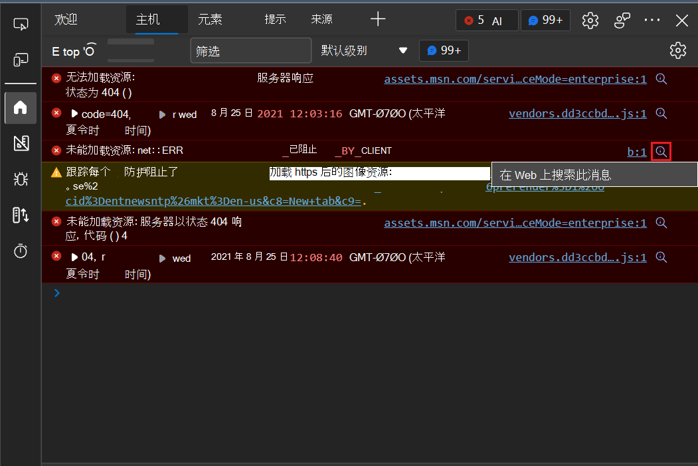
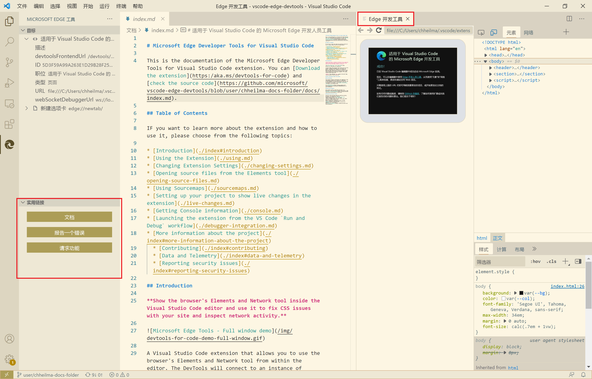
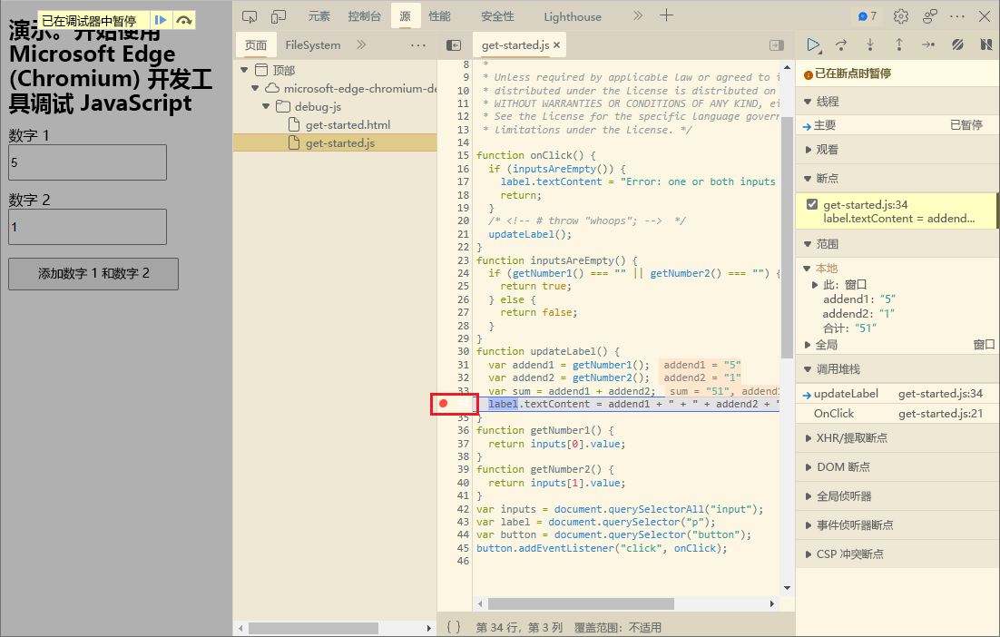
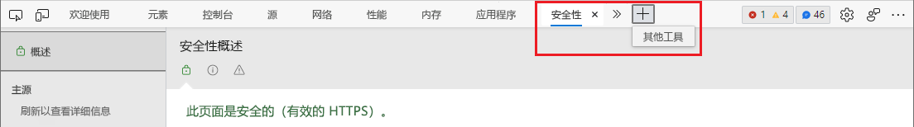

# DevTools (Microsoft Edge 94) 中的新增功能

[!INCLUDE [Microsoft Edge team note for top of What's New](../../includes/edge-whats-new-note.md)]

<!-- ====================================================================== -->
## 在 Web 上搜索主机错误

<!-- Title: Quickly debug console errors with our new integrated search feature -->
<!-- Subtitle: Now you can quickly search for console errors directly from the Console. -->

从 DevTools 中搜索 Web 上的**主机**错误。  在**主机**中，许多错误现在都有一个“**在 Web 上搜索此消息**”按钮，显示为放大镜。  在 Web 按钮 **上选择“搜索此消息** ”时，浏览器中将打开一个新选项卡，并显示错误的搜索结果：

请参阅 [在 Web 上搜索控制台错误消息字符串](../../../console/index.md#search-the-web-for-a-console-error-message-string)。

<!-- ====================================================================== -->
## 适用于 Visual Studio Code 的 DevTools 扩展包括最新工具、主题支持和有用链接

<!-- Title: Microsoft Edge DevTools for Visual Studio Code now supports themes and uses the most recent codebase -->
<!-- Subtitle: The Microsoft Edge DevTools extension for Visual Studio Code now uses the same version of the Developer Tools as your Microsoft Edge browser. We also added ways to learn more and for you to tell us what we could do better from within Visual Studio Code. -->

在适用于Visual Studio Code的最新版本的 Microsoft Edge DevTools 扩展中，我们发布了以下更新或新功能：
*  共享用于基于浏览器的 DevTools 的相同代码库。
*  支持 Visual Studio Code 随附的主题。
*  在 **Microsoft Edge 工具**边栏中添加“**有用链接**”部分，其中包含“**文档**”、“**报告错误**”和“**申请功能**”按钮。
*  在“**Microsoft Edge 工具**” > “**目标**”窗格中添加“**关闭实例**”(`X`) 按钮，以关闭扩展打开的浏览器。
*  添加对 JavaScript 调试器连接到远程工作区的支持。

在Visual Studio Code中运行的扩展，与Visual Studio Code的深色主题匹配，以及新的“有用链接”边栏：

还支持来自Visual Studio Code的光主题：

另请参阅：
* [用于 Visual Studio Code 的 Microsoft Edge DevTools 扩展](../../../../visual-studio-code/microsoft-edge-devtools-extension.md)

<!-- ====================================================================== -->
## 现在，使用 Visual Studio Code 主题时将显示断点图标

<!-- Title: Breakpoint icons are now displayed when using themes from Visual Studio Code -->
<!-- Subtitle: Setting, removing, and viewing breakpoints is now easier in Microsoft Edge. -->

在 Microsoft Edge 版本 93 中，可以将 Visual Studio Code 中使用的主题应用到 DevTools 扩展。  有关此功能详细信息，请参阅[将颜色主题应用到 DevTools](../../../customize/theme.md)。

以前，在 DevTools 中使用 Visual Studio Code 中的主题时，不会显示“**源**”工具中代码左边距上的断点图标。  从 Microsoft Edge 94 开始，断点图标现在按预期显示：

另请参阅：
* [使用断点暂停代码](../../../javascript/breakpoints.md)

<!-- ====================================================================== -->
## 使用键盘导航到“更多工具”按钮

<!-- Title: Use the arrow keys to navigate to the + button to open more tools -->
<!-- Subtitle: To open more tools, we have improved keyboard accessibility using the arrow keys on the main DevTools toolbar. -->

以前，如果工具栏具有焦点，则无法使用键盘上的箭头键导航到 DevTools 中的“**更多工具**”(`+`) 按钮。  使用箭头键时，到达工具栏中的最后一个工具后，焦点会循环回第一个工具，或者显示“**更多选项卡**”菜单。

从Microsoft Edge版本 93 开始，“**更多”选项卡** (`>>`) 按钮，当焦点位于工具栏上时，可以使用箭头键选择 **“更多工具**”按钮：

另请参阅：
* [键盘快捷方式](../../../shortcuts/index.md)

<!-- ====================================================================== -->
> [!NOTE]
> 此页面的某些部分是根据 [Google 创建和共享的](https://developers.google.com/terms/site-policies)作品所做的修改，并根据[ Creative Commons Attribution 4.0 International License ](https://creativecommons.org/licenses/by/4.0)中描述的条款使用。
> 原始页面位于 [此处](https://developer.chrome.com/blog/new-in-devtools-94)，并由 [Jecelyn Yeen](https://developers.google.com/web/resources/contributors#jecelynyeen)  \（开发人员支持者，Chrome DevTools\）制作。

本作品根据[ Creative Commons Attribution 4.0 International License ](https://creativecommons.org/licenses/by/4.0)获得许可。
