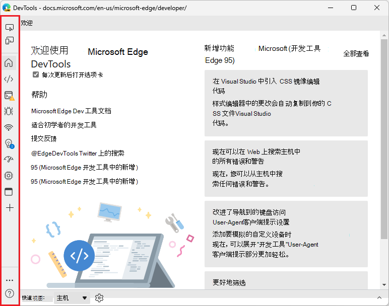
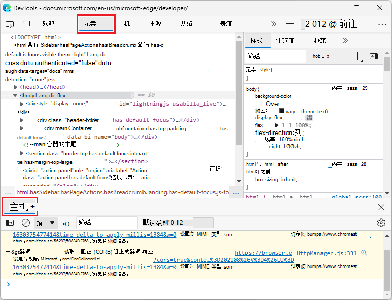
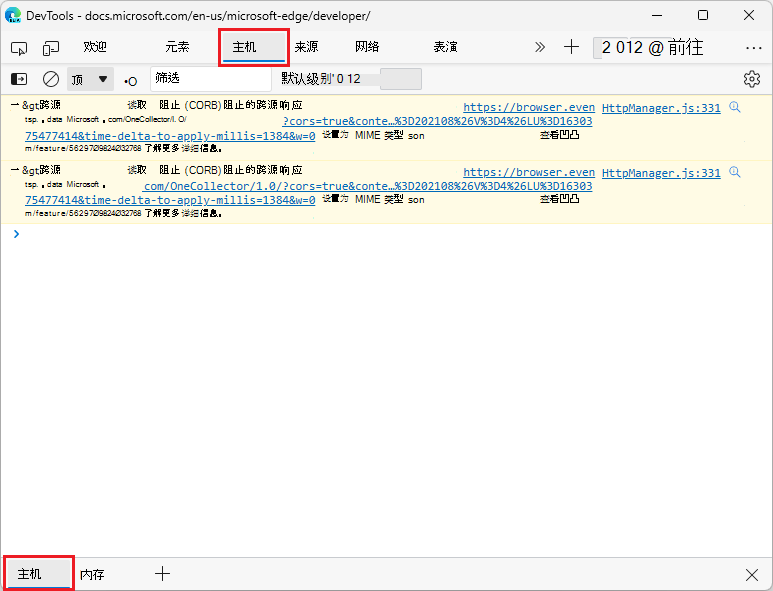
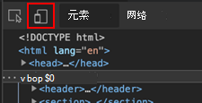
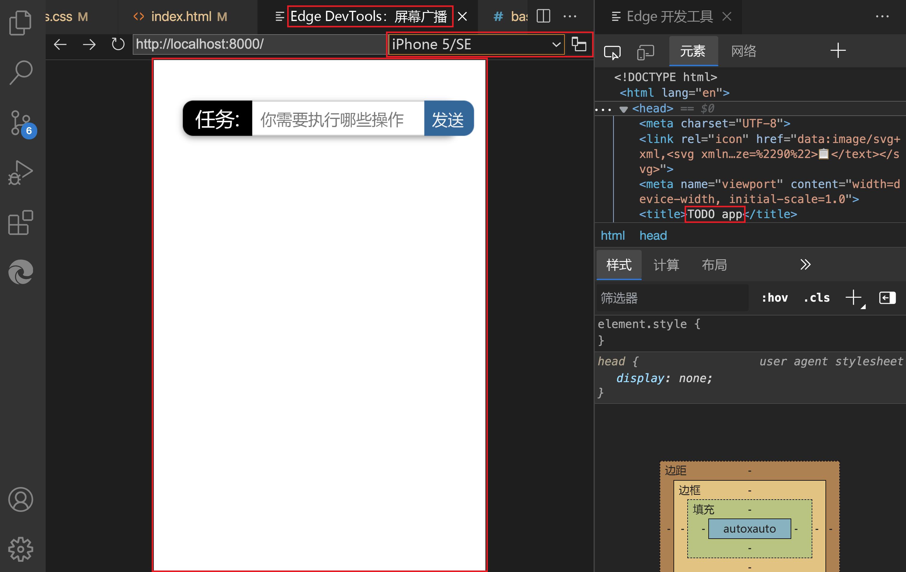
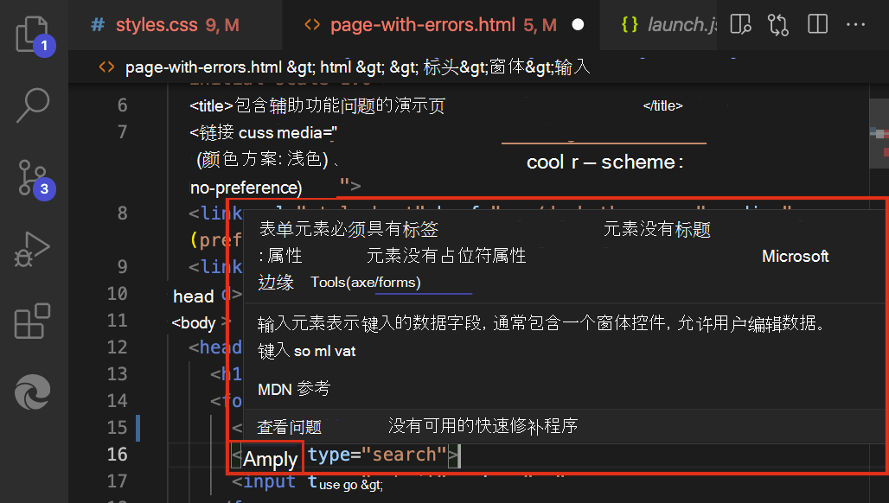
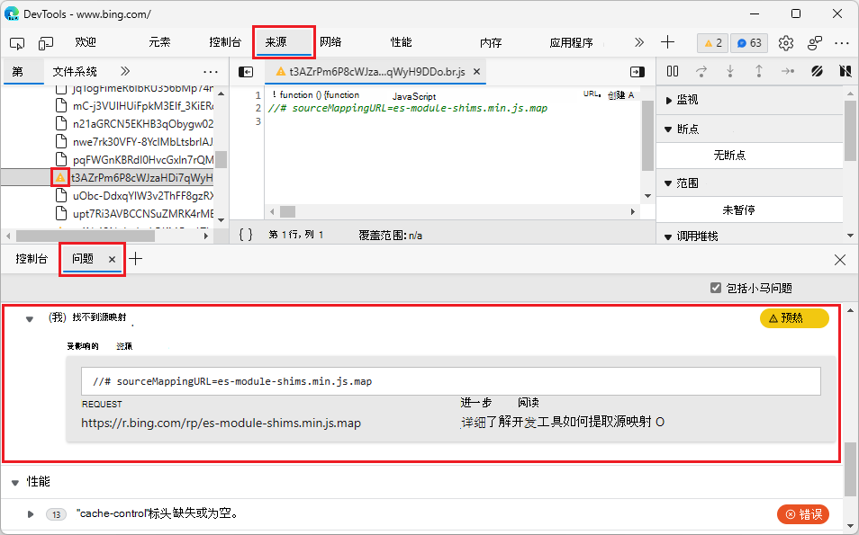
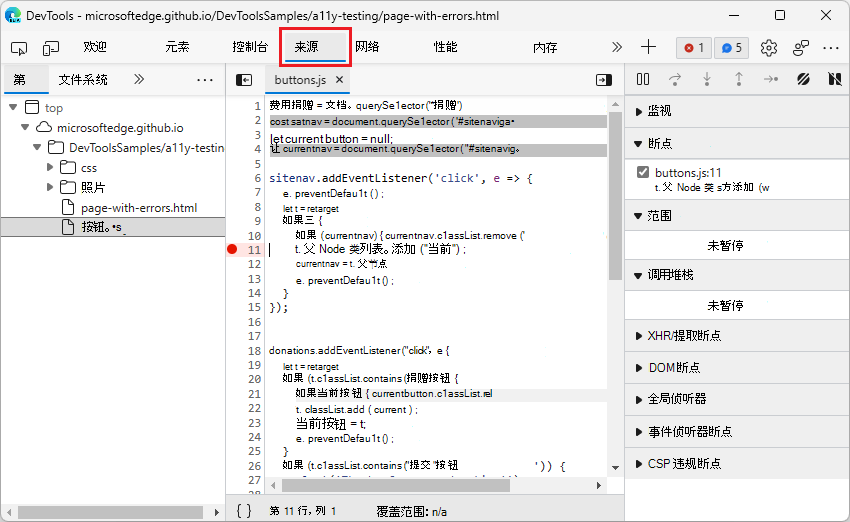
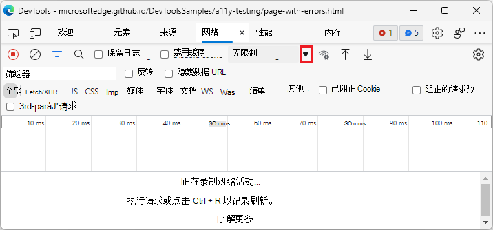

# DevTools 中的最近更新 (Microsoft Edge 96)

[!INCLUDE [Microsoft Edge team note for top of What's New](../../includes/edge-whats-new-note.md)]

<!-- ====================================================================== -->
## 新的 DevTools UI 已可用（预览版）

<!-- Title: New DevTools UI available (in preview) -->
<!-- Subtitle: A more minimal, modern UI is coming to Microsoft Edge DevTools. Enable the "Focus Mode" experiment to preview new UI features such a more compact toolbar that keeps DevTools uncluttered and better adapts to small window sizes. -->

Microsoft Edge DevTools 团队正在试验新的 DevTools UI：**焦点模式**。  通过更现代和简化的布局，焦点模式可减少干扰和混乱。  使用新的活动栏，可以将你喜欢的工具固定在水平或垂直工具栏中，以便更高效地使用屏幕空间。

要在 Microsoft Edge 版本 96 中试用此新 UI，请选择“**设置**”（）>“**试验**” > “**焦点模式**”。

从 Microsoft Edge 版本 96 开始，试验的复选框标记为“**焦点模式**”，而不是“**焦点模式和 DevTools 工具提示**”。

此 UI 仍处于开发状态，并且在将来版本的 Microsoft Edge 中可能发生更改。  我们期待收到你关于此新 DevTools UI 的反馈。  请通过发布推文 [@EdgeDevTools](https://twitter.com/edgedevtools) 向我们发送反馈。  或者在启用“**焦点模式**”试验的情况下，在“**活动栏**”底部选择“**帮助**”（）>“**反馈**”，可显示“**发送反馈**”窗口。

另请参阅：
*  [使用专注模式简化开发工具](../../../experimental-features/focus-mode.md)。
*  `MSEdgeExplainers` 存储库中的 [DevTools：焦点模式 UI](https://github.com/MicrosoftEdge/DevTools/blob/main/explainers/FocusMode/explainer.md)。

<!-- ====================================================================== -->
## 控制台可以再次显示在顶部和底部面板中

<!-- Title: Fix: Console can be quickly toggled in top or bottom panel -->
<!-- Subtitle: By popular demand, you can now easily show or collapse Console in the bottom panel without having to move the tool. -->

自 Microsoft Edge 版本 87 以来，你已能够在顶部和底部面板之间移动任何工具，包括控制台工具。  但是，我们从开发人员那里了解到，反复移动控制台工具非常麻烦。  截至 Microsoft Edge 版本 96，控制台工具的默认体验已还原，因此可以在控制台的全屏视图（在顶部面板中）和分屏视图（控制台显示在底部面板中）之间快速切换，而无需移动控制台工具。

在打开其他工具的同时，可以在底部面板（“**抽屉**”）中打开“**控制台**”：

在顶部面板中选择“**控制台**”时，如果底部面板显示“**控制台**”，则将自动最小化底部面板：

如果只希望允许在一个位置打开控制台工具，则可以配置控制台的行为:

1. 在主工具栏或“**抽屉**”工具栏中，右键单击“**控制台**”选项卡，然后选择“**配置控制台**”。  将显示“**设置**” > “**首选项**”页面。

1. 在“**控制台**”部分中，清除复选框“**在主面板和抽屉中显示控制台选项卡**”，然后单击“**关闭**”（“**x**”）。

另请参阅：
* _关于工具列表_ 中的 [面板工具与抽屉工具](../../../about-tools.md#panel-tools-vs-drawer-tools)。
* _在 DevTools 中的“新增功能”(Microsoft Edge 87)_ 中 [，在顶部和底部面板之间移动工具](../../2020/10/devtools.md#move-tools-between-top-and-bottom-panels)。

<!-- ====================================================================== -->
## Microsoft Edge DevTools Visual Studio Code 扩展

有关此扩展的常规信息，请参阅 [适用于 Visual Studio Code 的 Microsoft Edge DevTools 扩展](../../../../visual-studio-code/microsoft-edge-devtools-extension.md)。

<!-- Title: Dockable browser screencast, device emulation, and live issue reporting, and in Microsoft Edge DevTools for Visual Studio Code -->
<!-- Subtitle: Display your web project inside the editor, simulate different devices, and get notified about issues with your code while you develop it. --> 

### 在编辑器中显示 Web 项目，并模拟不同的设备

Microsoft Edge DevTools for Visual Studio Code 扩展现在具有可停靠的截屏视频和设备仿真：

可以在 Visual Studio Code 内专用选项卡中查看 Web 项目，还可以模拟各种设备：

有关设备仿真的详细信息，请参阅 [设备和状态仿真](../../../../visual-studio-code/microsoft-edge-devtools-extension/device-state-emulation.md)。

### 实时内联问题报告

该扩展现在还提供实时内联问题报告功能。  Visual Studio Code 并不在单独的工具中查找问题，而是突出显示源代码中的问题，并在输入代码时实时报告问题：

有关详细信息，请参阅[内联和实时问题分析](../../../../visual-studio-code/microsoft-edge-devtools-extension/inline-live-issue-analysis.md)。

<!-- ====================================================================== -->
## 现在，当无法加载源映射时，源工具将向你发出通知

<!-- Title: Get notified when DevTools cannot load your sourcemaps correctly -->
<!-- Subtitle: The Sources tool now provides several places in the UI when DevTools can't fetch or parse your sourcemaps. -->

现在，在 Microsoft Edge 版本 96 中，当 DevTools 无法加载源映射时，**源**工具在 UI 中提供了多个指示。  在“**源**”工具中“**导航器**”窗格内的“**页面**”选项卡中，DevTools 无法为其加载源映射的文件具有警告图标来代替文件图标。  

选择带有警告图标的文件将在“源”工具中打开文件，其中包含一个信息栏，指示 DevTools 无法从服务器正确提取源映射或无法正确分析源映射：

在信息栏中，可以通过选择“**在问题中打开**”按钮来了解有关问题的详细信息。  然后，将在“**抽屉**”中打开“**问题**”工具，并提供有关如何解决该问题以及如何在 DevTools 中正确加载源映射的信息：

要防止有关源映射的信息栏干扰“**源**”工具，请选择“**不再显示**”按钮。  要防止与源映射相关的问题干扰“**问题**”工具，请清除“**问题**”工具中的“**包括第三方问题**”复选框。

另请参阅：
* [将已处理的代码映射到原始源代码，以便进行调试](../../../javascript/source-maps.md)

<!-- ====================================================================== -->
## 现在，在 Visual Studio Code 中打开源文件可以更好地与源工具集成

<!-- Title: Open source files directly in Visual Studio Code from DevTools -->
<!-- Subtitle: The "Open source files in Visual Studio Code" experiment now works more intuitively with the Sources tool. -->

在早期版本的 Microsoft Edge 中，当你在 DevTools 中使用**源**工具时，启用“**在 Visual Studio Code 中打开源文件**”试验会出现意外行为。  设置断点会将你定向到 Visual Studio Code 或文档，以正确配置试验。

现在，在 Microsoft Edge 版本 96 中，**在 Visual Studio Code 中打开源文件** 试验可以更好地与**源**工具集成。

*  如果打开“**源**”工具，然后启用“**在Visual Studio Code 中打开源文件**”试验，则设置断点或打开文件现在将打开“**源**”工具，而不是将你定向到 Visual Studio Code 或文档以正确配置试验。

   

*  与早期版本的 Microsoft Edge 一样，如果“**源**”工具未在 DevTools 中打开，并且随后启用了“**在 Visual Studio Code 中打开源文件**”试验，则设置断点或从除“**源**”工具以外的工具中打开文件将在 Visual Studio Code 中打开该文件。

另请参阅：
* [在 Visual Studio Code 中打开源文件](../../../sources/opening-sources-in-vscode.md) - DevTools 如何与 Visual Studio Code 集成。

<!-- ====================================================================== -->
## 现在，在 DevTools UI 中选择下拉三角形图标将打开菜单

<!-- Title: Dropdown menus in the DevTools UI are now more intuitive -->
<!-- Subtitle: Select the triangle icon to expand any dropdown menu in the DevTools UI. -->

在早期版本的 Microsoft Edge DevTools 中，选择下拉菜单旁边的三角形图标不会显示下拉菜单。  要打开下拉菜单，必须单击三角形图标左侧当前选择的菜单项，例如“**无限制**”：

在 Microsoft Edge 版本 96 中，此问题已得到修复。  现在，选择 DevTools 中任何下拉菜单的三角形图标都将打开下拉菜单：

<!-- This fix applies to various tools, including:
* Performance
* Memory
* Network
* Console
* Device Emulation. -->
<!-- no See Also links needed -->

<!-- ====================================================================== -->
> [!NOTE]
> 此页面的某些部分是根据 [Google 创建和共享的](https://developers.google.com/terms/site-policies)作品所做的修改，并根据[ Creative Commons Attribution 4.0 International License ](https://creativecommons.org/licenses/by/4.0)中描述的条款使用。
> 来自 Chromium 项目公告的原始页面为“[DevTools 中的最近更新 (Chrome 96)](https://developer.chrome.com/blog/new-in-devtools-96)”，作者为 [Jecelyn Yeen](https://developers.google.com/web/resources/contributors#jecelynyeen)（Google 负责 Chrome DevTools 工作的开发人员大使）。

本作品根据[ Creative Commons Attribution 4.0 International License ](https://creativecommons.org/licenses/by/4.0)获得许可。
