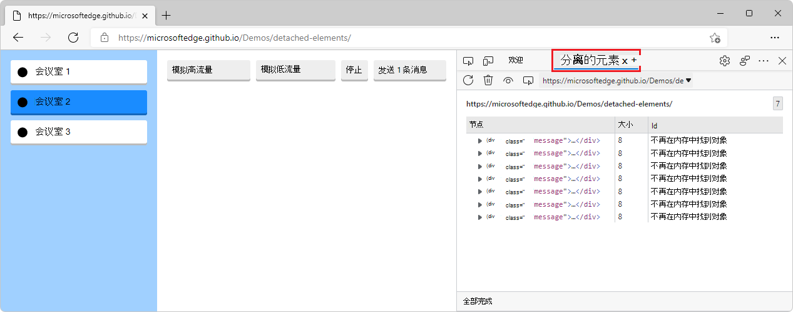
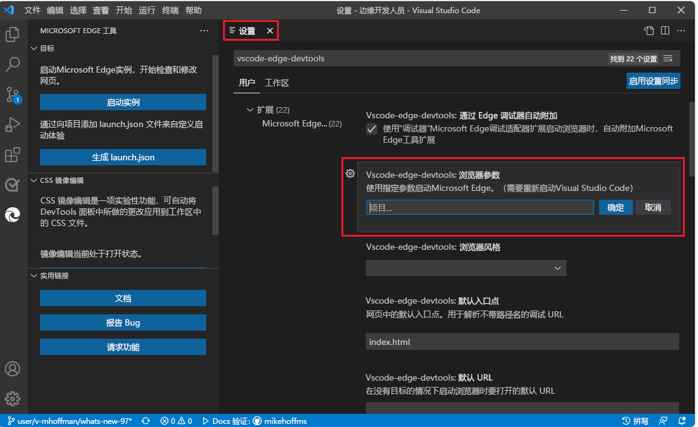
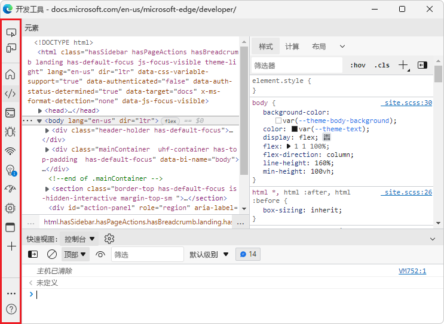
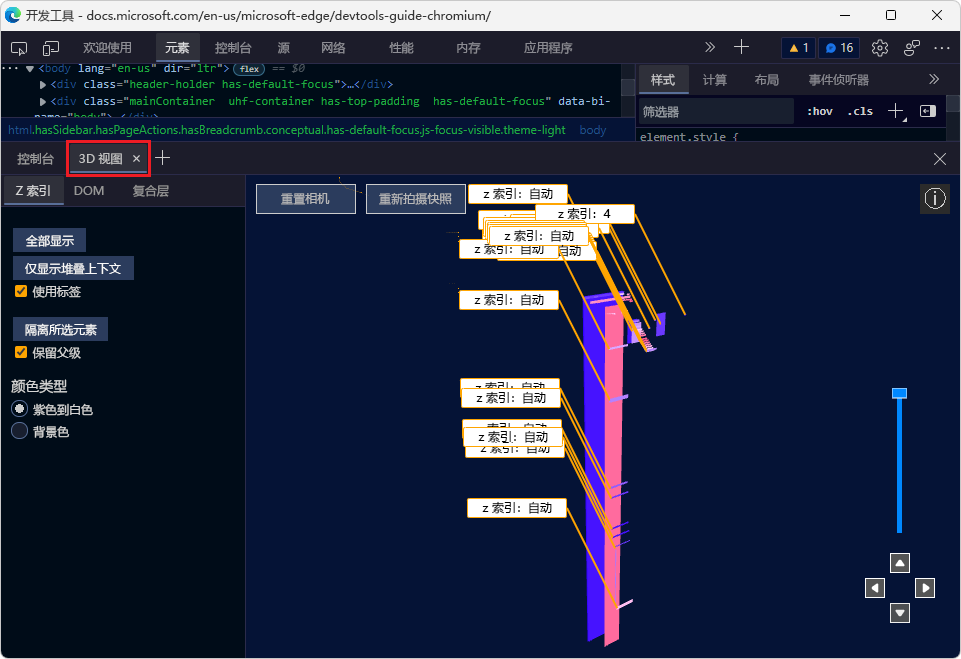

# DevTools (Microsoft Edge 97) 中的新增功能

[!INCLUDE [Microsoft Edge team note for top of What's New](../../includes/edge-whats-new-note.md)]

<!-- ====================================================================== -->
## 引入了“分离元素”工具

<!-- Title: Check out the new Detached Elements tool -->
<!-- Subtitle: The new Detached Elements tool is now available by default in Microsoft Edge 97. -->

当 DOM 节点不再附加到 DOM 的任何元素，但仍被 Microsoft Edge 保留在内存中时，它被视为_分离_。  浏览器无法对分离的元素进行垃圾回收，因为某些 JavaScript 对象仍在引用该元素，即使该元素不再位于页面上或不再是 DOM 的一部分。

新的 **分离元素** 工具在页面上查找所有分离的元素并显示它们。  可以展开和折叠分离的元素，以查看同时保留的父节点和子节点。  可以单击**收集垃圾**图标来触发浏览器的垃圾回收，并确认在无法对分离的元素进行垃圾回收时存在内存泄漏。  若要跳转到引用分离元素的 JavaScript 代码，请单击**分析**按钮以拍摄堆快照。

**分离元素**工具最初在 [Microsoft Edge版本 93](../../2021/07/devtools.md#debug-dom-node-memory-leaks-with-the-new-detached-elements-tool) 中作为试验提供。  该工具现在默认在 Microsoft Edge 版本 97 中可用。

<!--  -->
<!-- image too wide to be crisp inline; solution would be undock devtools then 1 or 2 images in series (DevTools then browser).  right-click works, but reverting to lightbox for now -->

另请参阅：
* [使用分离的元素工具调试 DOM 内存泄漏](../../../memory-problems/dom-leaks.md)
* [使用 Microsoft Edge 分离元素工具调试内存泄漏 - YouTube](https://www.youtube.com/watch?v=v2iy17ptmBk&ab_channel=MicrosoftEdge)

<!-- ====================================================================== -->
## 用于 Visual Studio Code 的 Microsoft Edge DevTools 扩展

有关此扩展的常规信息，请参阅 [适用于 Visual Studio Code 的 Microsoft Edge DevTools 扩展](../../../../visual-studio-code/microsoft-edge-devtools-extension.md)。

<!-- ====================================================================== -->
### Microsoft Edge 的屏幕截图增强功能、弃用警告和新的启动选项

<!-- Title: Screeencast improvements and launch options for Microsoft Edge in the Visual Studio Code extension -->
<!-- Subtitle: The correct list of emulated devices is shown for the screeencast, the correct device emulation is displayed, and there are now launch arguments for the browser. -->

适用于 Visual Studio Code 的 Microsoft Edge DevTools 扩展的当前版本修复了社区报告的几个问题：

*  屏幕广播中的仿真设备列表现在与浏览器中的仿真设备列表相同。

*  设备仿真现在会添加正确的用户代理字符串，以触发正确的显示。

*  现在，使用弃用的 Microsoft Edge 启动版本时会收到警告，表明你错过了功能。

*  现在可以为启动的浏览器实例提供参数，以防需要进行特殊设置：

<!-- no See also needed -->

<!-- ====================================================================== -->
## 针对焦点模式的改进和 bug 修复

<!-- Title: Have you tried Focus Mode? -->
<!-- Subtitle: To de-clutter and simplify the DevTools interface to focus on debugging web apps, enable Focus Mode in DevTools settings. -->

借助你早期的反馈，我们不断改进和修复适用于 Microsoft Edge DevTools 的新的专注模式界面上的 bug。  焦点模式是一个新的 UI 选项，可用于将工具停靠在 DevTools 窗口的顶部或侧面，并从工具栏中删除杂乱无章：

使用专注模式时，所有相同的工具和自定义主题与在现有 DevTools UI 中一样可用。  通过在 DevTools **设置** > **Experiments** 中启用焦点模式试验，为自己试用**焦点模式**。

另请参阅：
* _实验功能_中[的焦点模式](../../../experimental-features/index.md#focus-mode)
* [使用专注模式简化开发工具](../../../experimental-features/focus-mode.md)
* [将颜色主题应用于开发工具](../../../customize/theme.md)

<!-- ====================================================================== -->
## 3D 视图工具支持在 DevTools 中更改颜色主题

<!-- Title: 3D View better integrates with different themes in DevTools -->
<!-- Subtitle: The 3D View tool now works when you select a different color theme in DevTools. -->

在早期版本的 Microsoft Edge 中，更改 DevTools 中的主题，然后打开 3D 视图工具会导致空白面板。  此问题现已修复，Microsoft Edge 97：

另请参阅：
* [将颜色主题应用于开发工具](../../../customize/theme.md)
* [使用 3D 视图工具导航网页层、z 索引和 DOM](../../../3d-view/index.md)

<!-- ====================================================================== -->
## 来自 Chromium 项目的公告

Microsoft Edge 版本 97 还包括来自 Chromium 项目的以下更新：

* [在设备模式下刷新设备列表](https://developer.chrome.com/blog/new-in-devtools-97/#device)
* [以 HTML 形式编辑自动完成](https://developer.chrome.com/blog/new-in-devtools-97/#code-completion)
* [改进了代码调试体验](https://developer.chrome.com/blog/new-in-devtools-97/#debugging)

<!-- > [!NOTE]
> Portions of this page are modifications based on work created and [shared by Google](https://developers.google.com/terms/site-policies) and used according to terms described in the [Creative Commons Attribution 4.0 International License](https://creativecommons.org/licenses/by/4.0).
> The original page for announcements from the Chromium project is [What's New in DevTools (Chrome 97)](https://developer.chrome.com/blog/new-in-devtools-97) and is authored by [Jecelyn Yeen](https://developers.google.com/web/resources/contributors#jecelynyeen) (Developer advocate working on Chrome DevTools at Google).

This work is licensed under a [Creative Commons Attribution 4.0 International License](https://creativecommons.org/licenses/by/4.0). -->
