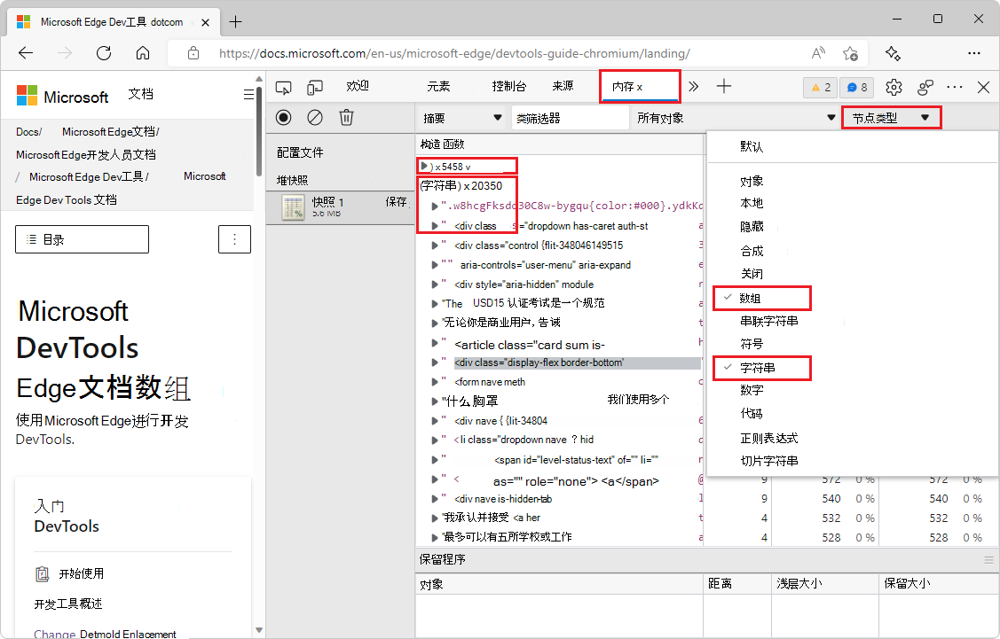

# DevTools 中的新增功能 (Microsoft Edge 100)

[!INCLUDE [Microsoft Edge team note for top of What's New](../../includes/edge-whats-new-note.md)]

<!-- ====================================================================== -->
## 在 GitHub 加入 Microsoft Edge DevTools 社区

<!-- Title: Head to the new DevTools repo at GitHub to send ideas, feedback, suggestions, and bugs -->
<!-- Subtitle: You can file feedback, ask questions, and have discussions about DevTools at our GitHub repo. -->

我们很高兴地宣布 GitHub 上新的 [MicrosoftEdge > DevTools](https://github.com/MicrosoftEdge/DevTools) 存储库！  此新存储库是开发人员社区向我们发送想法、反馈、建议和提示以改进 DevTools 的地方。  我们非常期待与你讨论 DevTools 如何更好地满足你的需求，并满足你在构建出色的 Web 体验时每天面临的挑战。

前往 GitHub 上的 DevTools 存储库，成为 Edge DevTools 社区的一部分。

<!-- ====================================================================== -->
## 按节点类型筛选堆快照摘要

<!-- Title: Use new filters to focus on specific parts of a heap snapshot -->
<!-- Subtitle: You can now filter by node type if, for example, you're only interested in the arrays or strings from the heap. -->

在“**内存**”工具中查看堆快照中的所有对象时，可能很难专注于特定对象或保留路径。  现在在 Microsoft Edge 100 中，在查看堆快照时可以使用新的“**节点类型**”筛选器，以仅关注特定类型的节点。  例如，若要仅查看堆中的数组和字符串对象，请在“**节点类型**”筛选器中选择“**数组**”和“**字符串**”条目：

另请参阅：
* [使用“内存”工具记录堆快照](../../../memory-problems/heap-snapshots.md) - 创建堆快照并分析堆。

<!-- ====================================================================== -->
## 使用捷克语和越南语的 DevTools

<!-- Title: DevTools: Now available in Czech and Vietnamese -->
<!-- Subtitle: Try out DevTools in your preferred language!  If we haven't supported it, yet, let us know. -->

自定义和简化开发人员体验包括使我们的工具可供所有人使用，而不考虑其首选语言。  我们已将两种新语言（捷克语和越南语）添加到支持的语言列表中，并将继续添加更多语言。  如果你的首选语言在 DevTools 中不受支持，请告诉我们！

另请参阅：
* [更改开发工具语言设置](../../../customize/localization.md)

<!-- ====================================================================== -->
## “网络”工具现在显示请求的完成方式

<!-- Title: You no longer have to wonder if a request was fulfilled by your service worker or cache -->
<!-- Subtitle: The "Fulfilled by" column in the Network tool tells you how a request was fulfilled. -->

在 Microsoft Edge 100 中，“**网络**”工具支持请求日志中新的“**完成方式**”列。  如果服务工作进程或缓存完成了请求，则该信息现在会在“**完成方式**”列中进行跟踪。  将请求日志导出或导入为 `HAR` 文件时，还会包含“**完成方式**”列中的信息。

<!--
If you don't have the **Fulfilled by** column, right-click the table headers in the request log and make sure **Fulfilled by** is checked.
-->

另请参阅：
* _网络功能参考_中的[按属性筛选请求](../../../network/reference.md#display-a-log-of-requests)。
* [服务工作进程改进](../../../service-workers/index.md)。

有关此功能的历史记录，请参阅[问题 #16](https://github.com/MicrosoftEdge/DevTools/issues/16)。

<!-- ====================================================================== -->
## 按严重性和浏览器目标筛选“问题”工具中的消息

<!-- Title: Filter issues in the Issues tool -->
<!-- Subtitle: New controls in the Issues tool allow you to filter messages by severity and browser target to help you focus on the most relevant feedback. -->

在“**问题**”工具中，新的“**严重性**”和“**浏览器**”下拉列表允许按严重性和浏览器目标筛选消息，以帮助你关注最相关的反馈。  可以选择或清除每个下拉列表中的选项。

若要查看所有相关消息，可能需要刷新页面。  如果出现提示，请在“**问题**”工具中单击“**重新生成问题**”按钮。
<!--
The top-of-panel message after you change checkmarks on the drop down lists:
"One or more settings have changed which require a panel reload to take effect.  [Regenerate issues]"
-->

默认情况下，“**严重性**”筛选器设置为仅显示警告和错误：

“**浏览器**”筛选器仅适用于浏览器兼容性反馈，如“**问题**”列表的“**兼容性**”部分所示。  默认情况下，“**浏览器**”筛选器显示顶级浏览器的消息，如[浏览器列表](https://github.com/browserslist/browserslist#queries)所定义：

在下面的示例中，已筛选掉有关 Firefox 和 Firefox for Android 的消息：

另请参阅：
* _使用问题工具查找和修复问题_中的[筛选问题](../../../issues/index.md#filter-issues)。

<!-- ====================================================================== -->
## 导入性能配置文件时，链接现在映射到原始代码

<!-- Title: Use sourcemaps from Azure Artifacts symbol server to better debug performance issues -->
<!-- Subtitle: Links from an imported performance profile now map to your original code because of source maps. -->

记录性能配置文件时，“**性能**”工具中的火焰图会显示从主线程上的每个事件到“**源**”工具中相应 JavaScript 函数的链接。  但是，导出和导入性能配置文件时，这些链接会断开。

在 Microsoft Edge 100 中，导入的性能配置文件中的链接现在使用来自 Azure Artifacts 符号服务器的源映射来映射回熟悉的原始源代码。  性能配置文件必须在 Microsoft Edge 100（或更高版本）中导出，以便配置文件包含在导出的性能跟踪中解析源映射所需的信息。

另请参阅：
* [将已处理的代码映射到原始源代码，以便进行调试](../../../javascript/source-maps.md)
* [通过将源映射发布到Azure Artifacts符号服务器来安全地调试原始代码](../../../javascript/publish-source-maps-to-azure.md)
* [使用Azure Artifacts符号服务器源映射安全地调试原始代码](../../../javascript/consume-source-maps-from-azure.md)

<!-- ====================================================================== -->
## 修复：“网络”工具中的瀑布视图现在与 Visual Studio Code 主题匹配

<!-- Title: Themes from Visual Studio Code now apply to the Waterfall view -->
<!-- Subtitle: The Waterfall view of requests in the Network tool now match the VS Code themes. -->

在早期版本的 Microsoft Edge 中，“**网络**”工具中请求的“**瀑布**”视图与适用于其余 DevTools 的 Visual Studio Code 主题不匹配。  在 Microsoft Edge 100 中，此问题已得到修复。

在 Microsoft Edge 100 之前，未在瀑布视图中应用所选主题：

现在在 Microsoft Edge 100 中，所选主题应用于“网络”工具中请求的瀑布视图：

另请参阅：
* [将颜色主题应用于 DevTools](../../../customize/theme.md) - 在 DevTools 中使用 Visual Studio Code 主题。
* _网络功能参考_中的[显示请求的计时关系](../../../network/reference.md#display-the-timing-relationship-of-requests) - “网络”工具中请求的瀑布视图。

<!-- ====================================================================== -->
## 来自 Chromium 项目的公告

Microsoft Edge 版本 100 还包括来自 Chromium 项目的以下更新：

* [在“样式”窗格中的规则中查看和编辑 @supports](https://developer.chrome.com/blog/new-in-devtools-100/#supports)
* [悬停时的预览类/函数属性](https://developer.chrome.com/blog/new-in-devtools-100/#properties)
* [“性能”面板中部分显示的帧](https://developer.chrome.com/blog/new-in-devtools-100/#perf)

<!-- ====================================================================== -->
<!-- uncomment if content is copied from developer.chrome.com to this page -->

<!-- > [!NOTE]
> Portions of this page are modifications based on work created and [shared by Google](https://developers.google.com/terms/site-policies) and used according to terms described in the [Creative Commons Attribution 4.0 International License](https://creativecommons.org/licenses/by/4.0).
> The original page for announcements from the Chromium project is [What's New in DevTools (Chrome 100)](https://developer.chrome.com/blog/new-in-devtools-100) and is authored by [Jecelyn Yeen](https://developers.google.com/web/resources/contributors#jecelynyeen) (Developer advocate working on Chrome DevTools at Google). -->

<!-- ====================================================================== -->
<!-- uncomment if content is copied from developer.chrome.com to this page -->

<!-- 
This work is licensed under a [Creative Commons Attribution 4.0 International License](https://creativecommons.org/licenses/by/4.0). -->
