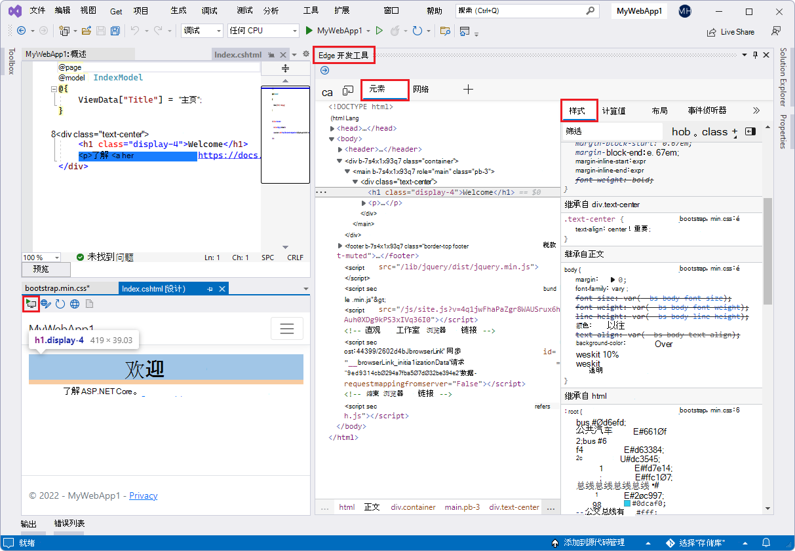
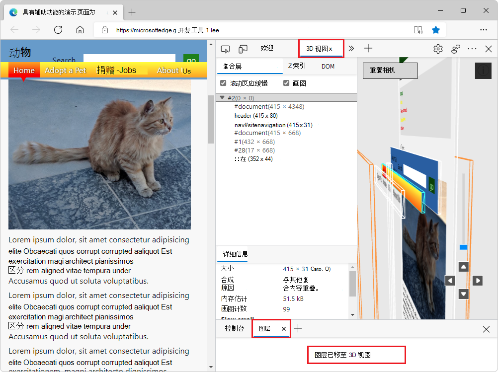
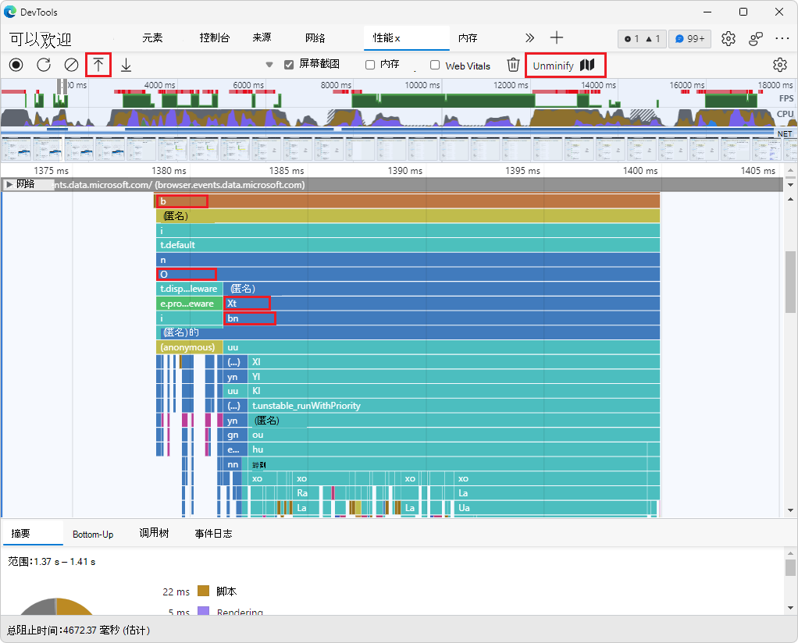
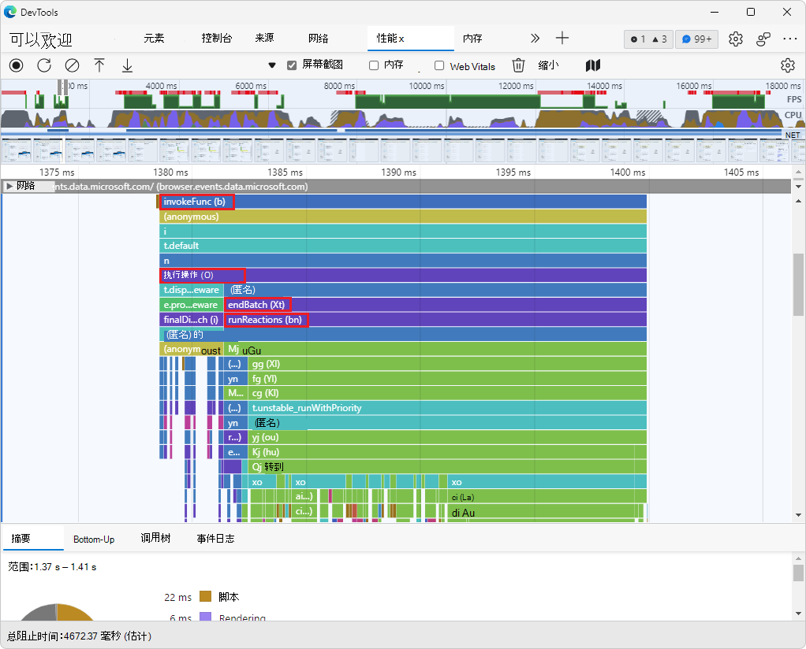
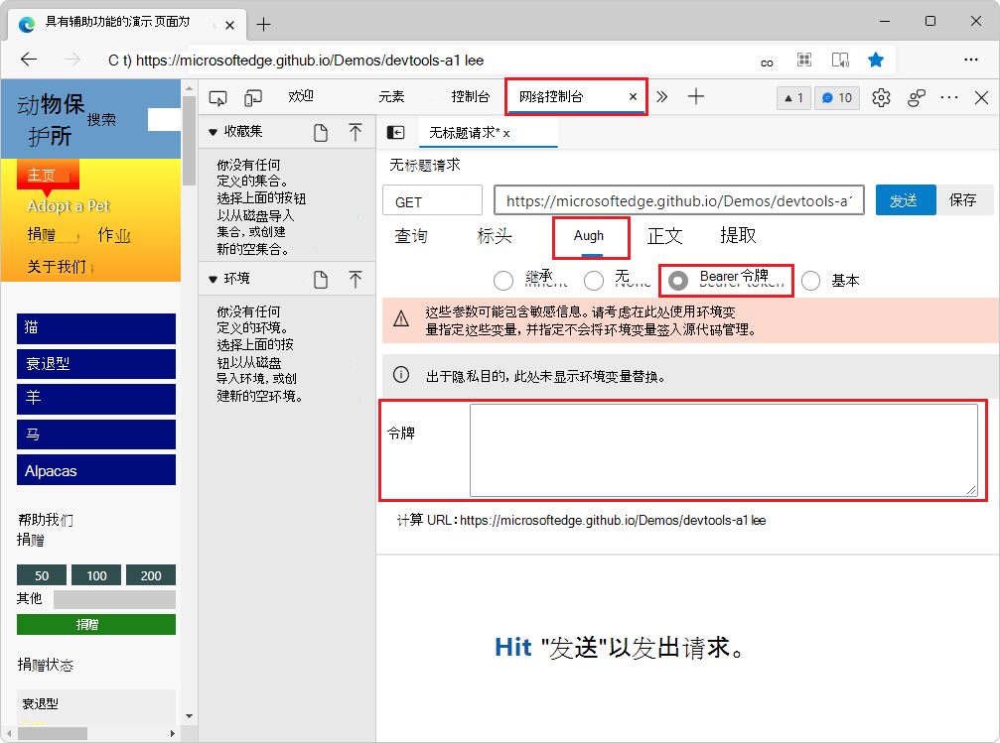
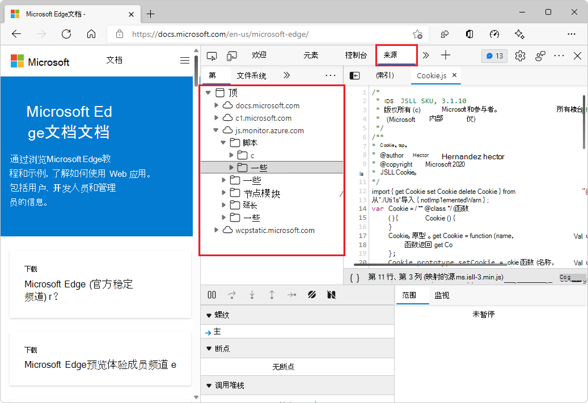

# DevTools (Microsoft Edge 99 中的新增) 

以下部分列出了 Microsoft Edge 开发人员工具团队的公告。  若要试用 Microsoft Edge Tools 的最新功能和适用于 Microsoft Visual Studio 和 Visual Studio Code 的边缘 DevTools 扩展，请阅读这些通知。  若要随时了解有关开发人员工具的最新和最强大功能，请下载 [Microsoft Edge 预览频道](https://www.microsoftedgeinsider.com/download) 并 [在 Twitter 上关注 Microsoft Edge 开发人员工具团队](https://twitter.com/EdgeDevTools)。

如果你使用的是 Windows、Linux 或 macOS，请考虑将 Microsoft Edge Canary 预览渠道用作默认开发浏览器。  通过预览渠道，可以访问 Microsoft Edge DevTools 的最新功能。

若要报告 DevTools 问题或请求新功能，请向开发人员工具反馈存储库Microsoft Edge[问题](https://github.com/MicrosoftEdge/DevTools)。

<!-- ====================================================================== -->
## 使用来自符号服务器的源映射安全调试Azure Artifacts代码

<!-- Title: Debug JavaScript with source maps more easily -->
<!-- Subtitle: Publish your source maps to Azure Artifacts Symbol Server and connect DevTools to it for an easier debugging experience. -->

Azure Artifacts符号服务器现在支持存储编译、缩小和捆绑代码时生成过程生成的源地图。  现在可以将源映射发布到安全符号服务器，而不是在公用服务器上Azure Artifacts映射。  然后，将 DevTools 连接到符号服务器，让 DevTools 自动提取源地图。 

通过使用源映射，可以在 DevTools 中查看和调试原始源代码，而无需使用服务器返回的已编译、缩小和捆绑的生产代码。  通过在 Azure Artifacts Symbol Server 上托管源地图，你可以安全地、私有地查看并处理源代码，而不是在服务器上放置源地图并公开原始代码。

若要尝试此功能，请执行以下操作：
1. [将源映射发布到Azure Artifacts符号服务器](../../../javascript/publish-source-maps-to-azure.md)。
1. 打开 DevTools **> 设置** > **Symbol Server**，然后输入 Azure DevOps 组织和个人访问令牌，将 DevTools 连接到 Azure Artifacts Symbol Server。

另请参阅：
*  [将已处理的代码映射到原始源代码，以便进行调试](../../../javascript/source-maps.md)
*  [通过将源映射发布到Azure Artifacts符号服务器来安全地调试原始代码](../../../javascript/publish-source-maps-to-azure.md)
*  [使用Azure Artifacts符号服务器源映射安全地调试原始代码](/javascript/consume-source-maps-from-azure.md)

<!-- ====================================================================== -->
## Microsoft Edge开发人员工具扩展Visual Studio

<!-- Title: Debug your ASP.NET projects in Visual Studio with the Edge Developer Tools -->
<!-- Subtitle: Get the Edge Developer Tools extension for VS today! -->

在成功进行 Visual Studio Code 集成后，你现在还可以在 Microsoft Visual Studio 中嵌入 Microsoft Edge 开发人员工具，以 ASP.NET 实时调试项目。  下载[Microsoft Edge开发人员工具Visual Studio](https://aka.ms/edgetools-for-vs)并试用。 

若要尝试此功能，请执行以下操作：
1. 确保Visual Studio 2022 和 ASP.NET 工作负载。
1. 将 Web Live Preview 设置为默认的 Web Forms Designer，如 Microsoft Edge [开发人员工具 for Visual Studio 中所述](https://aka.ms/edgetools-for-vs)。
1. 在 ASP.NET 中，在设计窗口中打开项目**的网页**。
1. 在"设计"窗口的**** 左上角，单击"打开**边缘开发**工具"图标。) 按钮：

将打开用于Visual Studio开发人员工具，并选中 **"元素**"工具：

**默认情况下，** 网络工具也可用：

检查**工具 (** ](../../media/2022/03/v-s-edge-devtools-inspect-tool-icon.png) 检查工具图标。) 和切换屏幕**视频 (** 图标](../../media/2022/03/v-s-edge-devtools-toggle-screencast-icon.png)。) 可用，"更多**工具" (**更多工具"图标。) 菜单提供"问题"、网络条件和网络请求阻止工具。

另请参阅：

* [开发人员博客上Visual Studio (预览) ](https://devblogs.microsoft.com/visualstudio/?p=237066&preview=1&_ppp=7aa7aef54f)开发人员Visual Studio工具。
* [适用于开发人员的边缘开发人员工具Visual Studio](../../../../visual-studio/index.md#edge-devtools-extension-for-visual-studio)。

<!-- ====================================================================== -->
## 3D 视图中的图层

<!-- Title: Layers in 3D View -->
<!-- Subtitle: The Layers tool isn't going away - find it in the 3D View tool today. -->

自 [Microsoft Edge 88](../../2020/11/devtools.md#composited-layers-are-now-in-3d-view) 以来，**3D 视图**工具已提供 Layers 工具的**改进**版本。  现在，在 Microsoft Edge 99 中，"图层"工具中的功能已删除，**** 而"图层"工具则包含一**** 个链接，将你重定向到 **3D** 视图工具中的"复合层"视图。  可以在 3D 视图工具中查找之前在"图层****"工具中提供**的所有功能，以及更多**功能。

<!-- work item > layersmove.gif -->

请参阅 [使用 3D 视图工具导航 z-index、DOM 和图层](../../../3d-view/index.md)。

<!-- ====================================================================== -->
## 使用源映射在性能配置文件中显示原始函数名称

<!-- Title: The Performance tool can now display unminified function names in the flame chart -->
<!-- Subtitle: Use the new Unminify button in the Performance tool to download an unminified version of the performance profile you recorded. -->

在"性能"工具中记录性能配置文件可生成缩小的柱形图。  在早期版本的 Microsoft Edge 中，即使在服务器上托管了源映射，图表也并未使用源映射来显示原始函数名称。

从 Microsoft Edge版本 99 开始，您可以在性能配置文件中显示原始函数名称，如下所示：
1. 在"性能"工具 **中记录** 配置文件。
1. 单击 **"取消 (**图标。单击) "按钮以创建和下载未缩小的性能配置文件。
1. Load (import)  () the unminified performance profile into the **Performance** tool.

" **取消缩小** "按钮将使用源映射（如果它们与生产代码并排托管）在性能工具的优化图表中取消函数 **名称** 。

性能工具中的绘制图表**** 最初显示函数名称 **b**、**O**、**Xt** 和 **bn**，取自 Web 服务器返回的缩小生产代码：

单击"**取消 (**) 然后加载**配置文件 (**  加载配置文件图标。) ，"性能"工具中的绘制图表现在显示那些标有有意义的名称的函数：**invokeFunc (b) **、**executeAction (O) **、**endBatch (Xt) **和 **runReactions (bn) **（从源映射检索）：

另请参阅：

* [Unminifyifying function names in DevTools performance profiles](https://blogs.windows.com/msedgedev/2022/02/03/unminifying-function-names-in-devtools-performance-profiles/) at the Microsoft Edge Blog.
* [在性能配置文件中显示原始函数名称](../../../evaluate-performance/unminify.md)。

<!-- ====================================================================== -->
## 改进了网络控制台和 3D 视图的辅助功能

<!-- Title: Improvements for using assistive technology with DevTools -->
<!-- Subtitle: Screen readers now announce better information in the Network Console and 3D View tools. -->

在早期版本的 Microsoft Edge 中，辅助技术在网络控制台工具中提供自定义 bearer 令牌时公布不正确的信息。  在 Microsoft Edge版本 99 中，此问题已修复。  选择提供自定义记分令牌的文本框时，辅助技术现在宣布"令牌编辑文本请求视图组"。

在早期版本的 Microsoft Edge 中，辅助技术将仅宣布 3D 视图工具中的单选按钮文本，而不会宣布该按钮所属的组名称。  在Microsoft Edge版本 99 中，这已修复。  例如，当焦点位于使用屏幕纹理**** 单选按钮时，辅助技术现在将宣布："颜色类型单选组，使用屏幕纹理，单选按钮，已选中"。

若要详细了解如何将辅助技术与 DevTools 一同使用，请阅读使用辅助技术导航 [DevTools](../../../accessibility/navigation.md)。

<!-- ====================================================================== -->
## "源"面板中改进的源文件夹树

在 **"** 源"工具的****"页面"选项卡中，源文件夹的树现已改进，文件夹的命名和大纲中的混乱程度更低。  不需要的路径前缀（如 和 `../` `./` ）已删除。  通过合并等效的重复文件夹简化了树结构。

有关开放源代码项目中此功能的Chromium，请参阅 Issue [1284737](https://crbug.com/1284737)。

<!-- https://developer.chrome.com/blog/new-in-devtools-99/#source-tree -->

<!-- ====================================================================== -->
## 来自 Chromium 项目的公告

Microsoft Edge版本 99 还包括来自 Chromium 项目的以下更新：

* [限制 WebSocket 请求](https://developer.chrome.com/blog/new-in-devtools-99/#websocket)
* ["应用程序"面板中的"新建报告 API"窗格](https://developer.chrome.com/blog/new-in-devtools-99/#reporting-api)
* [更好的控制台样式设置、格式设置和筛选](https://developer.chrome.com/blog/new-in-devtools-99/#console)
   * [使用 ANSI 转义码正确设置日志消息的样式](https://developer.chrome.com/blog/new-in-devtools-99/#console-styling)
   * [正确支持 %s、%d、%i 和 %f 格式说明符](https://developer.chrome.com/blog/new-in-devtools-99/#console-format)
* [源图改进](https://developer.chrome.com/blog/new-in-devtools-99/#sourcemap) <!-- redundant w/ above?-->
   * [使用源图文件调试扩展](https://developer.chrome.com/blog/new-in-devtools-99/#extension)
   * [在"源"面板中显示工作线程源文件](https://developer.chrome.com/blog/new-in-devtools-99/#worker-sourcemap)
* [触摸友好颜色选取器以及拆分窗格](https://developer.chrome.com/blog/new-in-devtools-99/#touch-friendly)

<!-- ====================================================================== -->
<!-- uncomment if content is copied from developer.chrome.com to this page -->

> [!NOTE]
> 此页面的某些部分是根据 [Google 创建和共享的](https://developers.google.com/terms/site-policies)作品所做的修改，并根据[ Creative Commons Attribution 4.0 International License ](https://creativecommons.org/licenses/by/4.0)中描述的条款使用。
> Chromium 项目中通知的原始页面是 [DevTools (Chrome 99) ](https://developer.chrome.com/blog/new-in-devtools-99) 中的新增功能，由 [Jecelyn Yeen](https://developers.google.com/web/resources/contributors#jecelynyeen) (Developer 支持者在 Google) 上处理 Chrome DevTools 创作。

<!-- ====================================================================== -->
<!-- uncomment if content is copied from developer.chrome.com to this page -->

本作品根据[ Creative Commons Attribution 4.0 International License ](https://creativecommons.org/licenses/by/4.0)获得许可。
