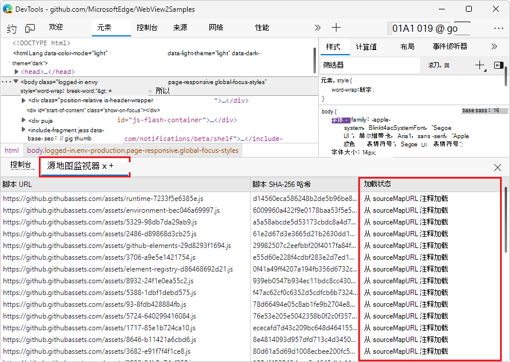
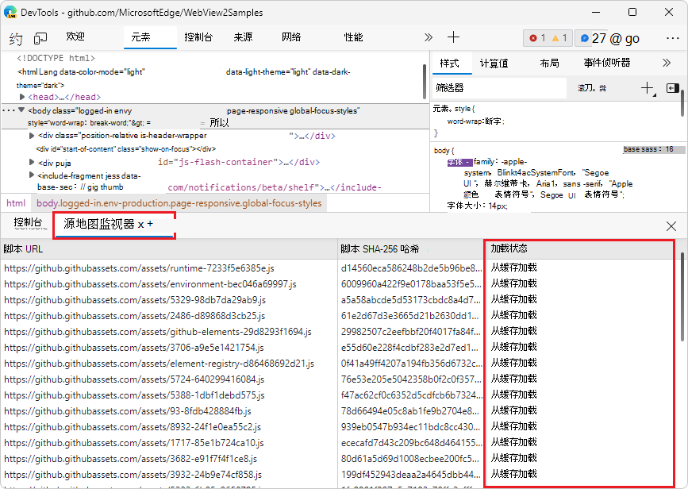
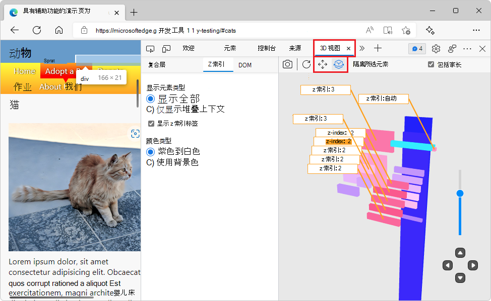
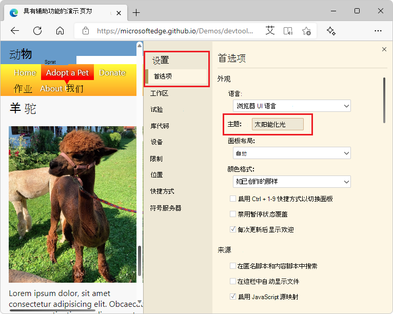

# DevTools (Microsoft Edge 101) 中的新增功能

以下部分列出了 Microsoft Edge 开发人员工具团队的公告。  请阅读这些公告，尝试Microsoft Edge DevTools 的最新功能以及适用于Microsoft Visual Studio和Visual Studio Code的 Microsoft Edge DevTools 扩展。

若要随时了解开发人员工具中最新和最出色的功能，请下载[Microsoft Edge预览频道](https://www.microsoftedgeinsider.com/download)。  Microsoft Edge (Beta、Dev 和 Canary) 的预览频道可让你访问 Microsoft Edge DevTools 的最新功能。  如果使用的是 Windows、Linux 或 macOS，请考虑使用 Microsoft Edge 的 Canary 预览频道作为默认开发浏览器。

有关最新公告，[请关注 Twitter 上Microsoft Edge DevTools 团队](https://twitter.com/EdgeDevTools)。  若要报告 DevTools 的问题或请求新功能，请查看新的 [MicrosoftEdge > DevTools](https://github.com/MicrosoftEdge/DevTools) 存储库。

<!-- ====================================================================== -->
## 控制台工具现已在Visual Studio Code中提供

<!-- Title: Visual Studio Code extension now with Console tool -->
<!-- Subtitle: See log messages, run JavaScript, and use Console APIs right next to your code in Visual Studio Code. -->

控制台是 DevTools 中最常用的工具之一。  现在可以访问 Microsoft Edge 开发人员工具扩展中用于Visual Studio Code的控制台工具。  借助此集成的 DevTools 控制台，可以在代码旁边查看日志消息。  使用控制台还可以：
*  试用一些 JavaScript 语句。
*  访问窗口对象。
*  调用对象的方法 `Console` ，如 [控制台对象 API 参考](../../../console/api.md)中所述。
*  使用控制台实用程序访问 DOM，如 [控制台工具实用工具函数和选择器](../../../console/utilities.md)中所述。

可以使用控制台作为主工具，或将其与 **元素** 和 **网络** 工具一起使用。

Visual Studio Code的 Microsoft Edge DevTools 扩展主工具栏中的控制台工具：

Visual Studio Code的 Microsoft Edge DevTools 扩展的抽屉中的控制台工具：

有关详细信息，请参阅 [Microsoft Edge Visual Studio Code > 控制台集成的 DevTools 扩展](../../../../visual-studio-code/microsoft-edge-devtools-extension.md#console-integration)。

<!-- ====================================================================== -->
## 现在使用 IndexedDB 缓存源映射

<!-- Title: Speed up debugging with cached source maps -->
<!-- Subtitle: DevTools now caches source maps with IndexedDB, reducing the need to fetch source maps on refresh. -->

在早期版本的Microsoft Edge中，如果在服务器上或[Azure Artifacts符号服务器](../../../javascript/publish-source-maps-to-azure.md)中托管大型源映射文件，则每次刷新页面时，DevTools 都会提取这些源映射。  提取这些源映射会反复为 DevTools 创建更多的网络请求，并放慢调试速度。

在 Microsoft Edge 101 中，DevTools 使用 IndexedDB 缓存源映射。  刷新页面时，源映射现在从 [IndexedDB](https://developer.mozilla.org/docs/Web/API/IndexedDB_API) 缓存提供，而不是再次从服务器或Azure Artifacts符号服务器请求。  使用[“源地图监视器”工具](../../../source-maps-monitor/source-maps-monitor-tool.md)中的 **“负载状态**”列验证是否正在从缓存加载源映射。  若要清除 IndexedDB 缓存并强制 DevTools 重新加载源映射，请在[命令菜单](../../../command-menu/index.md)中运行 **Clear source maps 缓存**命令。

首次加载网页时，“**源地图监视器**”工具显示源映射尚未缓存：

重新加载网页时，“**源地图监视器**”工具显示使用了缓存的源映射：

<!-- ====================================================================== -->
## 在导出 HAR 文件时跟踪挂起的网络请求

<!-- Title: Exporting HAR files from the Network tool now includes pending requests -->
<!-- Subtitle: Use the new "Status text" column and "Include pending requests in HAR files" option in the Network tool. -->

在 Microsoft Edge 101 中，新**状态文本**列已添加到**网络**工具。  “**状态”文本**列为“**状态”** 列中报告的 [HTTP 状态代码](https://developer.mozilla.org/docs/Web/HTTP/Status)提供人类可读的等效消息。

此外，还向网络工具添加了一个新设置： **在 HAR 文件中包含挂起的请求**。  如果在网络工具中导出 HAR 文件时需要记录 **挂起** 的网络请求，请在 **HAR 文件设置中打开“包括挂起的请求** ”。  **“状态”文本**列现在将包含任何挂起的网络请求的** (挂起) **状态。

若要详细了解请求日志中的可用列，请参 [阅网络功能参考>添加或删除列](../../../network/reference.md#add-or-remove-columns)。

<!-- ====================================================================== -->
## 更新了 3D 视图中的 UI 和相机控件

<!-- Title: Improvements to the 3D View tool -->
<!-- Subtitle: Check out 3D View for updates to the UI and smoother camera controls. -->

在 Microsoft Edge 101 **中，3D 视图**工具有两个新按钮：**平移视图** () 和**旋转视图** () 。  使用这些按钮在画布周围平移或旋转画布之间切换。  单击 **“平移视图** ”或 **“旋转视图”** 按钮，然后使用鼠标拖动所需的方向，或使用箭头键。

UI 现在提供更统一和直观的体验。  窗格的组织更加清晰，辅助功能问题已修复。

[使用 3D 视图工具查看导航网页层、z 索引和 DOM](../../../3d-view/index.md)。

<!-- ====================================================================== -->
## 切换主题不再需要重新加载 DevTools

<!-- Title: Switching themes in DevTools no longer requires reloading -->
<!-- Subtitle: Quickly try out themes from Visual Studio Code in DevTools. -->

在早期版本的Microsoft Edge中，在 DevTools 中切换主题需要重新加载 DevTools 才能应用新主题。  在 Microsoft Edge 101 中，可以快速尝试不同的主题，而无需重新加载 DevTools。

有关在 DevTools 中使用Visual Studio Code主题的详细信息，[请参阅向 DevTools 应用颜色主题](../../../customize/theme.md)。

<!-- ====================================================================== -->
## 来自 Chromium 项目的公告

Microsoft Edge 101 还包括Chromium项目的以下更新：

* [在“样式”窗格中查看级联层](https://developer.chrome.com/blog/new-in-devtools-101/#layer)<!-- checking -->
* [支持 hwb () 颜色函数](https://developer.chrome.com/blog/new-in-devtools-101/#hwb)
* [改进了私有属性的显示](https://developer.chrome.com/blog/new-in-devtools-101/#private-props)

<!-- ====================================================================== -->
<!-- uncomment if content is copied from developer.chrome.com to this page -->

<!-- > [!NOTE]
> Portions of this page are modifications based on work created and [shared by Google](https://developers.google.com/terms/site-policies) and used according to terms described in the [Creative Commons Attribution 4.0 International License](https://creativecommons.org/licenses/by/4.0).
> The original page for announcements from the Chromium project is [What's New in DevTools (Chrome 101)](https://developer.chrome.com/blog/new-in-devtools-101) and is authored by [Jecelyn Yeen](https://developers.google.com/web/resources/contributors#jecelynyeen) (Developer advocate working on Chrome DevTools at Google). -->

<!-- ====================================================================== -->
<!-- uncomment if content is copied from developer.chrome.com to this page -->

<!-- 
This work is licensed under a [Creative Commons Attribution 4.0 International License](https://creativecommons.org/licenses/by/4.0). -->
