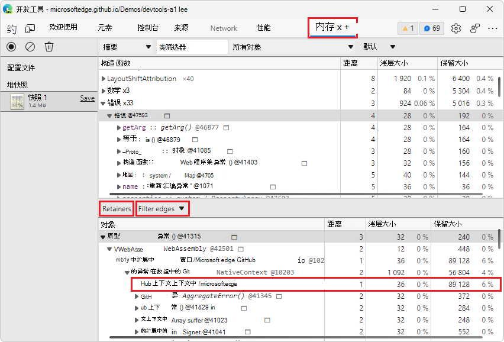

# DevTools (Microsoft Edge 102) 中的新增功能

[!INCLUDE [Microsoft Edge team note for top of What's New](../../includes/edge-whats-new-note.md)]

> [!TIP]
> **Microsoft Build 2022** 会议于 5 月 24-26 日召开。  在以下视频中详细了解 DevTools 中内存、性能和生产调试的新功能，以及 PVA Web 平台中的新功能：
> * [有关调试内存、性能、&生产问题的提示](https://www.youtube.com/watch?v=hdrR0QwXpuc)
> * [Microsoft Edge |内部版本 2022：使用 Web 的功能和影响力丰富桌面体验](https://www.youtube.com/watch?v=ahO5nePl4BQ)

<!-- ====================================================================== -->
## DevTools 扩展：具有设备和模式仿真和源映射支持的新浏览器

<!-- Title: New browser preview and sourcemap support in Visual Studio Code -->
<!-- Subtitle: Emulate devices and different rendering modes and debug Sass/React. -->

适用于Visual Studio Code的 Microsoft Edge DevTools 扩展现在有一个浏览器预览版，可用于模拟不同的设备。  单击新的 **模拟 CSS 媒体功能** () 按钮，以不同模式预览当前项目，如深色、浅色、打印和高对比度：

单击“模拟视觉缺陷”按钮 () 按钮可轻松测试辅助功能，例如显示网页中带有模糊视觉或颜色视觉缺陷的外观。

其他新功能包括一种更简单的切换 CSS 镜像的方法，该方法现在也支持源地图。  这意味着你可以在浏览器中实时调试和修改由 Sass、React 和其他抽象创建的 CSS，并查看源文件中的更改。

另请参阅：
* [设备和状态仿真](../../../../visual-studio-code/microsoft-edge-devtools-extension/device-state-emulation.md)
* [将已处理的代码映射到原始源代码，以便进行调试](../../../javascript/source-maps.md)
* [使用源图进行 CSS 镜像编辑：已知问题和反馈](https://github.com/microsoft/vscode-edge-devtools/issues/965)

<!-- ====================================================================== -->
## 将堆快照中的所有字符串保存到 JSON

<!-- Title: Export string objects from a heap snapshot -->
<!-- Subtitle: Use the new "Save all to file" button to save string objects to a JSON file. -->

在 Microsoft Edge 102 中，在 **内存** 工具中创建堆快照时，现在可以将快照中的所有字符串对象导出到 JSON 文件。  在 **“内存** ”工具的 **“构造函数** ”部分中，单击条目旁边的新 **“全部保存到文件** ” `(string)` 按钮。

**内存**工具导出一个 JSON 文件，其中包含堆快照中的所有字符串对象：

另请参阅：
* _使用内存工具_将[堆快照中的字符串保存并导出到记录](../../../memory-problems/heap-snapshots.md#save-and-export-strings-from-a-heap-snapshot-to-json)堆快照中的 JSON。

<!-- ====================================================================== -->
## 内存工具中用于保留器的新筛选器

<!-- Title: Debug retainers more easily in the Memory tool -->
<!-- Subtitle: Use new filters in the Retainers section of a heap snapshot to simplify retainer paths. -->

在早期版本的 Microsoft Edge 中，循环和内部节点显示在堆快照的 **“保留器** ”部分。
为了帮助简化保留器路径，在 Microsoft Edge 102 中，**内存**工具中的 **“保留器**”部分现在具有新的筛选器，用于隐藏周期和隐藏保留器路径中的内部节点。

在 **“保留器** ”部分中，循环节点通过灰显来指示。

在下图中，在 **“筛选器边缘** ”下拉菜单中，未选择 **“隐藏周期** ”，因此会显示)  (灰显的循环节点：

在下图中，在 **“筛选器边缘** ”下拉菜单中，选择了 **“隐藏循环** ”，因此不会显示循环节点：

_周期_ 是至少在保留器路径中显示两次的节点。
节点的一个外观早于保留器路径，该节点的其他外观稍后会出现在保留器路径中。
若要释放内存，最重要的是删除首先出现在保留器路径中的节点的出现。
节的第二个和可能的后续显示仍显示在 **“保留器** ”部分中。

_内部节点_ 是特定于 V8 (Microsoft Edge) 中的 JavaScript 引擎的对象。  内部节点也显示在 **“保留器** ”部分中。

另请参阅：
* _内存术语_中的[周期](../../../memory-problems/memory-101.md#cycles)。

<!-- ====================================================================== -->
## 现在可以保留“检查”元素工具提示，直到将其关闭

<!-- Title: Improving the Inspect element tooltip -->
<!-- Subtitle: The Inspect element tooltip now persists until you dismiss it, improving accessibility and ease of use. -->

以前，在 **“元素”** 工具中，你选择的节点的覆盖仅在使用“ **检查”工具** () 。  以前的设计很难与屏幕放大镜或其他辅助技术配合使用。

在 Microsoft Edge 102 中，使用 **“检查** ”工具并在呈现的网页周围移动时，可以保留当前 **的“检查** ”覆盖层。  在呈现的网页中四处移动时，按住 `Ctrl`+`Alt` (Windows、Linux) 或 `Ctrl`+`Option` (macOS) 。  将鼠标悬停在呈现网页的不同部分时，将显示 **“检查** ”工具的现有工具提示和网格颜色覆盖：

此外，现在可以在将鼠标指针移到呈现的网页上时按 `Ctrl` 下以隐藏“检查”工具的覆盖层。

有关Chromium开源项目中此功能的历史记录，[请参阅问题1316208](https://crbug.com/1316208)。

另请参阅：
*  _使用“检查”工具在“分析”页面_中[保留“检查”工具的工具提示和网格颜色覆盖](../../../css/inspect.md#persisting-the-inspect-tools-tooltip-and-grid-color-overlay)。
*  使用_辅助技术在 Navigate DevTools_ 中[保留检查工具的工具提示和网格颜色覆盖](../../../accessibility/navigation.md#persisting-the-inspect-tools-tooltip-and-grid-color-overlay)。

<!-- ====================================================================== -->
## 改进了高对比度模式下下菜单、按钮和图标的呈现

<!-- Title: Accessibility improvements for high contrast mode -->
<!-- Subtitle: Dropdown menu in the Issues tool, buttons in the Detached Elements tool, and the activity bar in Focus Mode now display better in high contrast. -->

在早期版本的 Microsoft Edge 中，以下项目在高对比度模式下未正确呈现：
*  **“问题**”工具中的下拉菜单。
*  **分离**元素工具中的按钮。
*  处于焦点模式 **的活动栏** 。

在 Microsoft Edge 102 中，这些问题已得到解决。

**问题**工具的菜单在高对比度模式下正确显示：

**分离元素**工具的 UI 在高对比度模式下正确显示：

焦点模式) **的活动栏** 和 **快速视图** (在高对比度模式下正确显示：

另请参阅：
* [使用辅助技术导航开发工具](../../../accessibility/navigation.md)
* [Windows 高对比度模式](/fluent-ui/web-components/design-system/high-contrast)
* [使用专注模式简化开发工具](../../../experimental-features/focus-mode.md)

<!-- ====================================================================== -->
## 从“设置”了解 DevTools 中的试验

<!-- Title: Help icons for Experiments checkboxes -->
<!-- Subtitle: In Settings > Experiments page, each experimental feature's checkbox has a Help (?) icon next to it for more information.. -->

在 **“设置****试验**” > 页中，每个试验现在都有一个 **“帮助** () 按钮：

若要获取有关实验性功能的详细信息，请单击相应的 **“帮助** () 按钮。  “ **帮助** ”按钮显示 [实验功能](../../../experimental-features/index.md) 文章的相关部分。

<!-- ====================================================================== -->
## 在缩小时更好地布局网络设置

<!-- Title: Better support for the Network tool in narrow layouts -->
<!-- Subtitle: The settings in the Network tool no longer overlap when the DevTools are narrow. -->

在早期版本的 Microsoft Edge 中，当 DevTools 非常窄时，使用**网络**工具中的齿轮图标打开**网络设置**会重叠：

在 Microsoft Edge 102 中，此问题已修复。  单个设置现在在窄布局中显示得更好：

另请参阅：
* 在_网络功能参考_中的[页面加载期间捕获](../../../network/reference.md#capture-screenshots-during-page-load)有关网络工具的可配置设置的屏幕截图。

<!-- ====================================================================== -->
## 来自 Chromium 项目的公告

Microsoft Edge 102 还包括Chromium项目的以下更新：

* [模拟浅色和深色主题的新快捷方式](https://developer.chrome.com/blog/new-in-devtools-102/#emulation)
* [提高了“网络预览”选项卡上的安全性](https://developer.chrome.com/blog/new-in-devtools-102/#network-preview)
* [改进了断点重载](https://developer.chrome.com/blog/new-in-devtools-102/#debugger)
* [控制台更新](https://developer.chrome.com/blog/new-in-devtools-102/#console)
   * [在控制台中处理脚本执行错误](https://developer.chrome.com/blog/new-in-devtools-102/#errors)
   * [使用 Enter 提交实时表达式](https://developer.chrome.com/blog/new-in-devtools-102/#live-expression)
* [在“样式”窗格中显示继承的突出显示伪元素](https://developer.chrome.com/blog/new-in-devtools-102/#pseudo)
* [[实验]复制 CSS 更改](https://developer.chrome.com/blog/new-in-devtools-102/#copy)
* [[实验]在浏览器外部选取颜色](https://developer.chrome.com/blog/new-in-devtools-102/#color-picker)

<!-- ====================================================================== -->
<!-- uncomment if content is copied from developer.chrome.com to this page -->

<!-- > [!NOTE]
> Portions of this page are modifications based on work created and [shared by Google](https://developers.google.com/terms/site-policies) and used according to terms described in the [Creative Commons Attribution 4.0 International License](https://creativecommons.org/licenses/by/4.0).
> The original page for announcements from the Chromium project is [What's New in DevTools (Chrome 102)](https://developer.chrome.com/blog/new-in-devtools-102) and is authored by [Jecelyn Yeen](https://developers.google.com/web/resources/contributors#jecelynyeen) (Developer advocate working on Chrome DevTools at Google). -->

<!-- ====================================================================== -->
<!-- uncomment if content is copied from developer.chrome.com to this page -->

<!-- 
This work is licensed under a [Creative Commons Attribution 4.0 International License](https://creativecommons.org/licenses/by/4.0). -->
