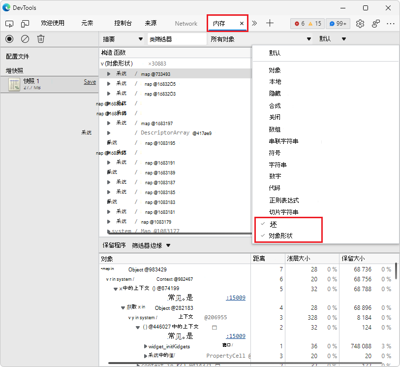
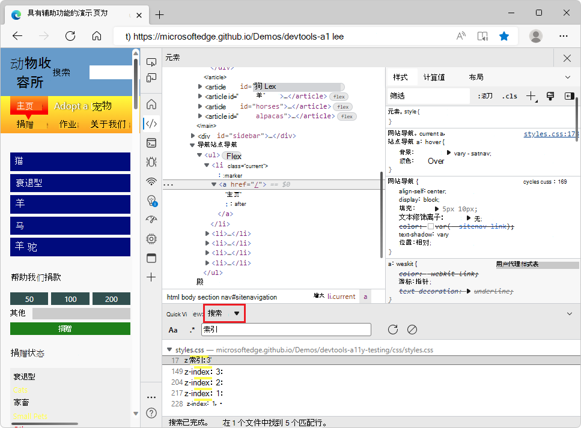

# DevTools (Microsoft Edge 103) 中的新增功能

[!INCLUDE [Microsoft Edge team note for top of What's New](../../includes/edge-whats-new-note.md)]

<!-- ====================================================================== -->
## 内存工具中的新节点类型

<!-- Title: New "object shape" and "BigInt" node types in the Memory tool -->
<!-- Subtitle: When taking a heap snapshot, you can now filter to new node types representing hidden classes and descriptor arrays in V8, the JavaScript engine of Microsoft Edge. -->

在 Microsoft Edge 103 中，在 **内存** 工具中拍摄堆快照时，有两个新节点类型：
*  **BigInt** - 用于表示和操作太大而不能由 **数字** 节点类型表示的值。  请参阅 [BigInt](https://developer.mozilla.org/docs/Web/JavaScript/Reference/Global_Objects/BigInt)。
*  **对象形状** - 指 V8 (Microsoft Edge JavaScript 引擎) 用来理解和索引对象属性的隐藏类和描述符数组。  请参阅 _V8 中 Fast 属性中的_ [HiddenClasses 和 DescriptorArrays](https://v8.dev/blog/fast-properties#hiddenclasses-and-descriptorarrays)。

有关历史记录，请参阅 [问题 12769：改进堆快照中对象的分类](https://bugs.chromium.org/p/v8/issues/detail?id=12769)。

另请参阅：
* [构造函数 (组) ](../../../memory-problems/heap-snapshots.md#constructor-group-entries-in-the-heap-profiler)_使用内存工具在记录堆快照_中的堆探查器中的条目。

<!-- ====================================================================== -->
## 从 HTML 文件启动浏览器，并在Visual Studio Code中使用应用程序工具

<!-- Title: DevTools for Visual Studio Code: Right-click to launch, and Application tool -->
<!-- Subtitle: Use the context menu on any HTML document in Visual Studio Code to launch a new instance of the Microsoft Edge browser and DevTools. -->

若要更轻松地从Visual Studio Code内部启动 Microsoft Edge 的新嵌入实例，在**资源管理器**中右键单击 HTML 文件时，现在有一个 **Open with Edge** 子菜单，该子菜单具有“**打开浏览器**”和“**使用 DevTools 打开浏览器**”的命令：

现在还可以**使用应用程序工具**深入了解项目的存储和服务辅助角色信息，而无需保留Visual Studio Code：

另请参阅：
* [用于 Visual Studio Code 的 Microsoft Edge DevTools 扩展](../../../../visual-studio-code/microsoft-edge-devtools-extension.md)
<!-- * [Microsoft Edge DevTools for Visual Studio Code](https://aka.ms/devtools-for-code) at Marketplace -->

<!-- ====================================================================== -->
## 焦点模式 UI 的 Bug 修复

<!-- Title: Bug fixes for Focus Mode UI -->
<!-- Subtitle: Various bugs impacting DevTools controls and keyboard shortcuts were fixed in the new Focus Mode UI. -->

在新的 **焦点模式** DevTools UI 中，已解析影响 DevTools 控件和键盘快捷方式的各种 bug：
*  改进了可折叠窗格的行为，例如**元素**工具中的**样式**。
*  修复了打开的工具的名称不可见的某些实例。
*  提高了 **快速视图** 控件的可靠性。
*  改进了使用键盘快捷方式打开 DevTools 的行为。
*  修复了使用键盘快捷方式导航到 **“源** ”工具中的特定代码行的问题。
*  还原了在**快速视图**中打开**搜索**的键盘快捷方式，该`Shift``F`++`Ctrl`快捷方式 (Windows、Linux) 或 `Command`+`Option`+`F` (macOS) ：

另请参阅：
* [使用专注模式简化开发工具](../../../experimental-features/focus-mode.md)

<!-- ====================================================================== -->
## 3D 视图工具在窄布局中响应更好

<!-- Title: 3D View: Now with more responsive design -->
<!-- Subtitle: The 3D View toolbar now wraps around in a narrower window. -->

在早期版本的 Microsoft Edge 中， **3D 视图** 工具在窄布局中未正确显示。  当 DevTools 较窄时，工具栏选项被切断。  在 Microsoft Edge 103 中，此问题已修复。  当 DevTools 窗口的宽度降低时， **3D 视图** 中的工具栏选项现在会堆积起来：

另请参阅：
* [使用 3D 视图工具导航网页层、z 索引和 DOM](../../../3d-view/index.md)

<!-- ====================================================================== -->
## 修复：DevTools 的“关闭”按钮现在可在高对比度模式下访问

<!-- Title: Fix: In high contrast mode, the Close button for DevTools is now accessible -->
<!-- Subtitle: In previous versions of Microsoft Edge, the Close button wasn't visible in high contrast mode, but this issue has been fixed in Microsoft Edge 103. -->

在早期版本的 Microsoft Edge 中，DevTools 的 **“关闭** ”按钮在高对比度模式下无法正确呈现。  在 Microsoft Edge 103 中，此问题已修复。  **“关闭** (DevTools 的) 按钮在高对比度模式下正确显示：

另请参阅：
* [使用辅助技术导航开发工具](../../../accessibility/navigation.md)
* [Windows 高对比度模式](/fluent-ui/web-components/design-system/high-contrast)

<!-- ====================================================================== -->
## 重新设计的欢迎工具

<!-- Title: Welcome tool has expanded content and videos -->
<!-- Subtitle: The redesigned Welcome tool has expanded Learn and What's New sections, including a new video series. -->

在 Microsoft Edge 103 中， **欢迎** 工具具有改进和扩展内容的新式新式设计。  查找文档、视频以及有关新功能和 bug 修复的信息比以往更容易。

*  在 **“学习”** 部分中，使用链接快速跳转到 DevTools 中常见任务的文档。

*  在“ **新增功能”** 部分中，了解最新更改、新功能和 bug 修复。

*  在这两个部分中，通过我们的新视频系列（ [有关使用 Microsoft Edge 进行 Web 开发的视频](../../../../dev-videos/index.md)）了解现有和新的 Web 开发功能。

另请参阅：
* [欢迎工具](../../../welcome/welcome-tool.md)

<!-- ====================================================================== -->
## 来自 Chromium 项目的公告

Microsoft Edge 103 还包括来自Chromium项目的以下更新：

* [“元素”面板中的“重新排序”窗格](https://developer.chrome.com/blog/new-in-devtools-103/#reorder-pane)
* [在浏览器外部选取颜色](https://developer.chrome.com/blog/new-in-devtools-103/#color)
* [在调试期间改进了内联值预览](https://developer.chrome.com/blog/new-in-devtools-103/#inline-preview)
* [支持虚拟身份验证器的大型 Blob](https://developer.chrome.com/blog/new-in-devtools-103/#webauthn)
* [“源”面板中的新键盘快捷方式](https://developer.chrome.com/blog/new-in-devtools-103/#shortcuts)
* [源图改进](https://developer.chrome.com/blog/new-in-devtools-103/#sourcemaps)

<!-- ====================================================================== -->
<!-- uncomment if content is copied from developer.chrome.com to this page -->

<!-- > [!NOTE]
> Portions of this page are modifications based on work created and [shared by Google](https://developers.google.com/terms/site-policies) and used according to terms described in the [Creative Commons Attribution 4.0 International License](https://creativecommons.org/licenses/by/4.0).
> The original page for announcements from the Chromium project is [What's New in DevTools (Chrome 103)](https://developer.chrome.com/blog/new-in-devtools-103) and is authored by [Jecelyn Yeen](https://developers.google.com/web/resources/contributors#jecelynyeen) (Developer advocate working on Chrome DevTools at Google). -->

<!-- ====================================================================== -->
<!-- uncomment if content is copied from developer.chrome.com to this page -->

<!-- 
This work is licensed under a [Creative Commons Attribution 4.0 International License](https://creativecommons.org/licenses/by/4.0). -->
