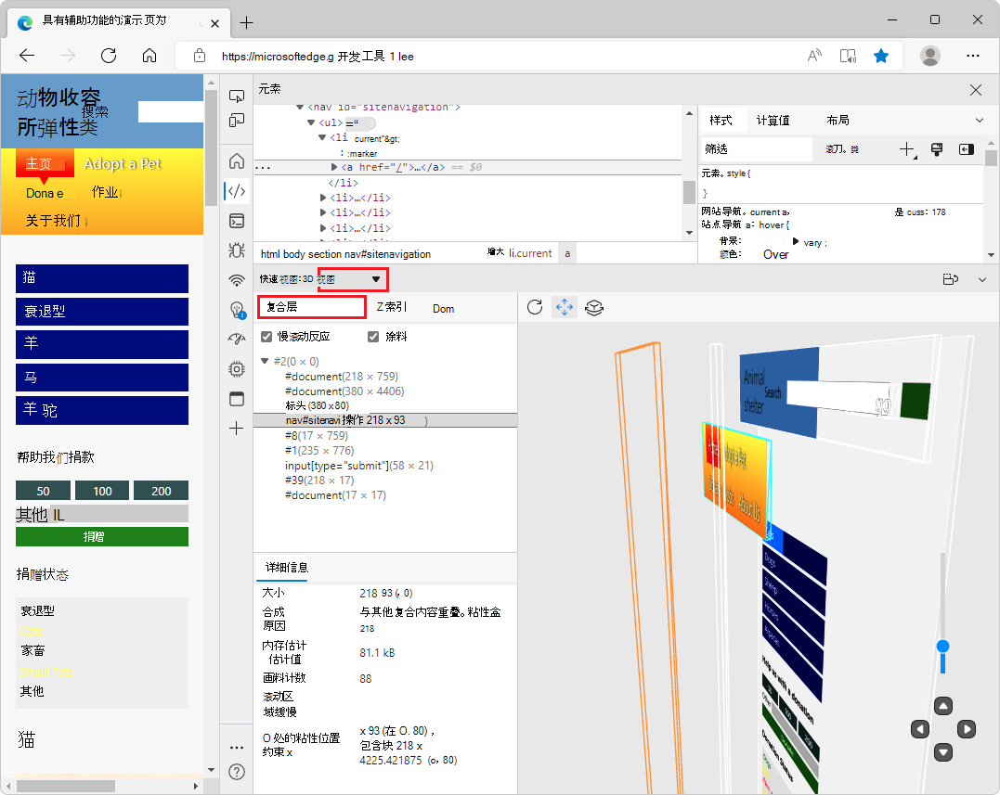
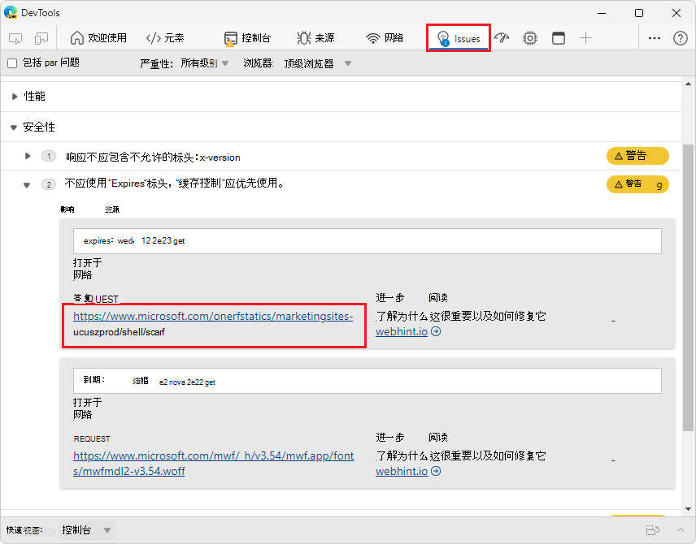
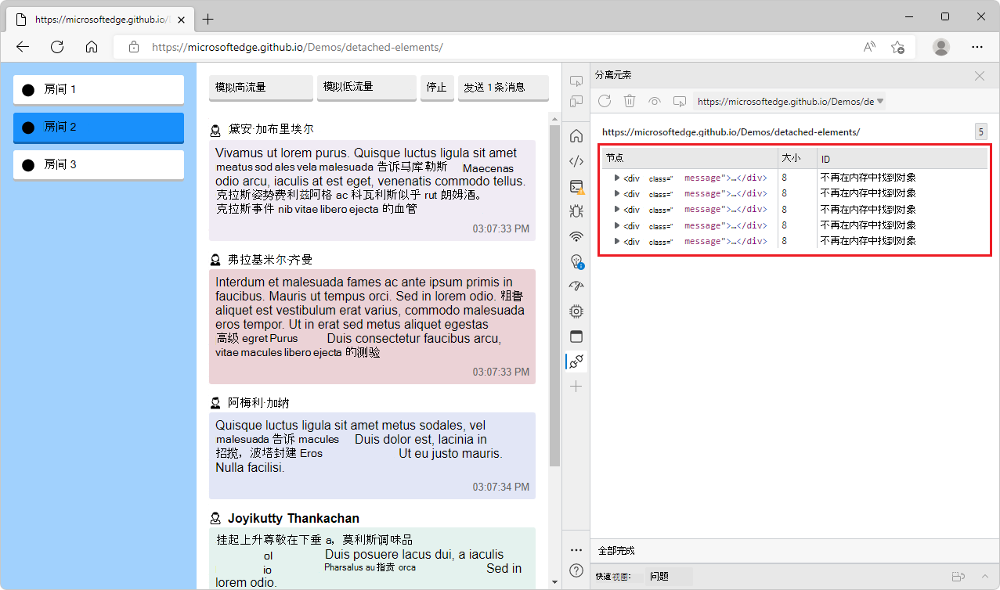
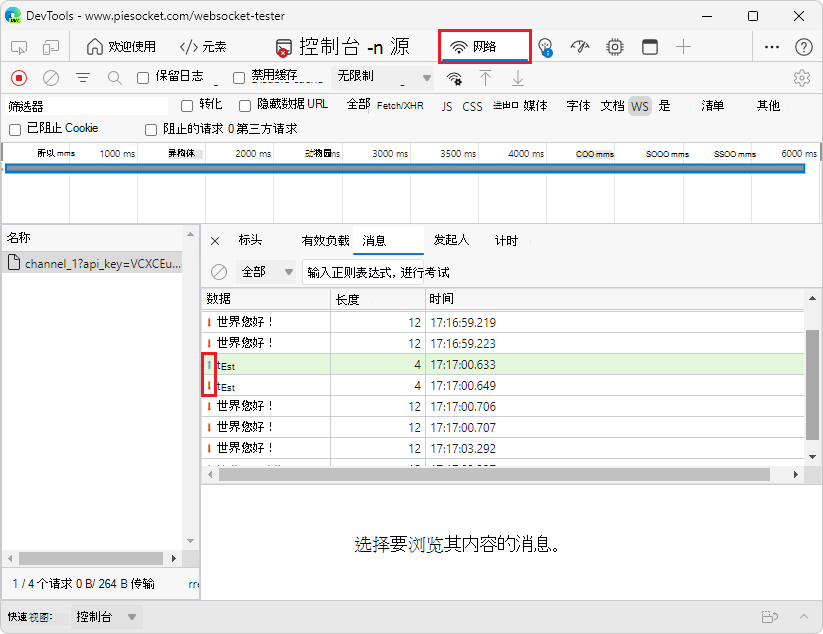

# DevTools (Microsoft Edge 104) 中的新增功能

[!INCLUDE [Microsoft Edge team note for top of What's New](../../includes/edge-whats-new-note.md)]

<!-- ====================================================================== -->
## 在 3D 视图中使用层

<!-- Title: Where did Layers go? -->
<!-- Subtitle: Layers isn't a stand-alone tool anymore, it's wrapped up in the comprehensive 3D View; a tool for all your visual debugging needs. -->

Microsoft Edge 版本 104 中已删除独立 **层** 工具。  在早期版本的 Microsoft Edge 中， **Layers** 工具将用户重定向到 **3D 视图** 工具。

在 **3D 视图** 工具中， **复合层** 视图具有你喜欢从 **“图层** ”工具获得的所有功能，以及一些更新。  **复合层**视图现在由另外两个可视调试窗格（**DOM** 和 **Z 索引）补充**。  将这些附加视图与 **复合层** 视图组合在一起，以便进行更好的调试。

另请参阅：
* [使用 3D 视图工具以 3D 调试 Web](https://blogs.windows.com/msedgedev/2022/06/21/debug-the-web-in-3d-with-the-3d-view-tool/)
* [使用 3D 视图工具导航网页层、z 索引和 DOM](../../../3d-view/index.md)

<!-- ====================================================================== -->
## 在“问题”工具中，已缩短长请求 URL

<!-- Title: In Issues tool, long request URLs have been shortened -->
<!-- Subtitle: Links to network request URLs have been truncated, making issues easier to read. -->

“ **问题** ”工具提供了改进网页辅助功能、性能、安全性等的建议。  其中一些建议包括指向 **网络工具中** 打开的网络请求的链接。

以前，与网络请求相关的问题显示网络请求的整个 URL。  当这些 URL 很长时，它们占用了大量空间，使得问题列表难以浏览。  在 Microsoft Edge 104 中，这些长请求 URL 链接已被截断，以占用更少的空间。  这些链接仍直接指向 **网络** 工具的相关部分。

在以前版本的 Microsoft Edge 中：

在 Microsoft Edge 版本 104 中：

另请参阅：
* [使用问题工具查找和修复问题](../../../issues/index.md)

<!-- ====================================================================== -->
## 改进了分离元素工具的辅助功能

<!-- Title: The Detached Elements tool now works better with assistive technology -->
<!-- Subtitle: In Microsoft Edge 104, Screen readers announce the name of the table of detached elements in the tool. -->

在早期版本的 Microsoft Edge 中，在 **分离元素** 工具中选择分离元素表时，辅助技术仅宣布“表”以及行数和列数。  在 Microsoft Edge 版本 104 中，此问题已修复。  在分离 **元素工具中** 选择分离元素的表时，辅助技术现在会报出“分离元素列表、表”以及行数和列数。

另请参阅：
* [使用分离的元素工具调试 DOM 内存泄漏](../../../memory-problems/dom-leaks.md)
* [使用辅助技术导航开发工具](../../../accessibility/navigation.md)

<!-- ====================================================================== -->
## 修复：表示 Web 套接字流量的箭头现在在网络工具中正确呈现

<!-- Title: Use the Network tool to understand web socket traffic -->
<!-- Subtitle: Arrows representing messages from the server or client now display correctly in the Network tool. -->

在以前版本的 Microsoft Edge 中，在检查网络工具中的 Web 套接字流量时，表示是否从客户端或服务器发送消息的箭头呈现不正确。  在 Microsoft Edge 104 中，此问题已修复。  感谢你向我们发送有关此问题的反馈！
*  绿色向上箭头 () 表示客户端发送的消息。
*  红色向下箭头 () 表示服务器发送的消息。

另请参阅：
* [网络功能参考](../../../network/reference.md)

<!-- ====================================================================== -->
## 来自 Chromium 项目的公告

Microsoft Edge 104 还包括来自Chromium项目的以下更新：

* [调试期间重启帧](https://developer.chrome.com/blog/new-in-devtools-104/#restart-frame)
* [按“源”面板中的“创作”/“部署”对文件进行分组](https://developer.chrome.com/blog/new-in-devtools-104/#authored-deployed)
* [“性能见解”面板中的新用户计时跟踪](https://developer.chrome.com/blog/new-in-devtools-104/#performance)
* [显示元素的分配槽](https://developer.chrome.com/blog/new-in-devtools-104/#slot)
* [模拟性能录制的硬件并发](https://developer.chrome.com/blog/new-in-devtools-104/#simulate)
* [自动完成 CSS 变量时预览非颜色值](https://developer.chrome.com/blog/new-in-devtools-104/#css-var)
* [在“后/向”缓存窗格中标识阻止帧](https://developer.chrome.com/blog/new-in-devtools-104/#bfcache)
* [改进了 JavaScript 对象的自动完成建议](https://developer.chrome.com/blog/new-in-devtools-104/#autocomplete)
* [源图改进](https://developer.chrome.com/blog/new-in-devtools-104/#sourcemaps)

<!-- ====================================================================== -->
<!-- uncomment if content is copied from developer.chrome.com to this page -->

<!-- > [!NOTE]
> Portions of this page are modifications based on work created and [shared by Google](https://developers.google.com/terms/site-policies) and used according to terms described in the [Creative Commons Attribution 4.0 International License](https://creativecommons.org/licenses/by/4.0).
> The original page for announcements from the Chromium project is [What's New in DevTools (Chrome 104)](https://developer.chrome.com/blog/new-in-devtools-104) and is authored by [Jecelyn Yeen](https://developers.google.com/web/resources/contributors#jecelynyeen) (Developer advocate working on Chrome DevTools at Google). -->

<!-- ====================================================================== -->
<!-- uncomment if content is copied from developer.chrome.com to this page -->

<!-- 
This work is licensed under a [Creative Commons Attribution 4.0 International License](https://creativecommons.org/licenses/by/4.0). -->
