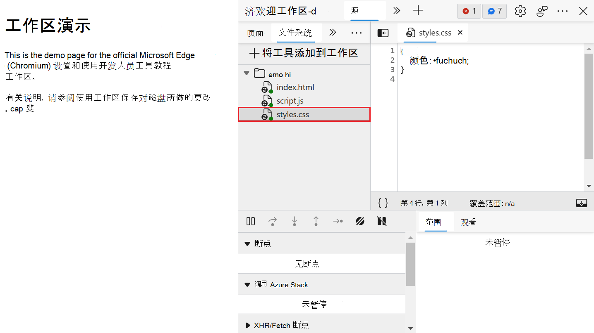

<!-- Copyright Kayce Basques

   Licensed under the Apache License, Version 2.0 (the "License");
   you may not use this file except in compliance with the License.
   You may obtain a copy of the License at

       https://www.apache.org/licenses/LICENSE-2.0

   Unless required by applicable law or agreed to in writing, software
   distributed under the License is distributed on an "AS IS" BASIS,
   WITHOUT WARRANTIES OR CONDITIONS OF ANY KIND, either express or implied.
   See the License for the specific language governing permissions and
   limitations under the License.  -->
# <a name="edit-files-with-workspaces-filesystem-tab"></a>使用工作区编辑文件（“文件系统”选项卡）

本教程提供有关设置和使用工作区的实践。  将文件添加到工作区后，在 DevTools 中的源代码中所做的更改将保存在本地计算机上，并在刷新网页后保留。

在开始本教程之前，你应该知道如何执行以下操作：
* [使用 html、CSS 和 JavaScript 生成网页](https://developer.mozilla.org/docs/Learn/Getting_started_with_the_web)
* [使用 DevTools 对 CSS 进行基本更改](../css/index.md)
* [运行本地 HTTP Web 服务器](https://developer.mozilla.org/docs/Learn/Common_questions/set_up_a_local_testing_server#Running_a_simple_local_HTTP_server)


<!-- ====================================================================== -->
## <a name="overview"></a>概述

通过工作区，可以将 Devtools 中所做的更改保存到计算机上同一文件的本地副本。  在本教程中，应在计算机上设置以下设置。

* 桌面上有站点的源代码。

* 你正在从源代码目录运行本地 Web 服务器，以便可访问 `localhost:8080`站点。

* 在Microsoft Edge中打开`localhost:8080`，并且使用 DevTools 更改站点的 CSS。

启用工作区后，在 DevTools 中所做的 CSS 更改将保存到桌面上的源代码。


<!-- ====================================================================== -->
## <a name="limitations"></a>限制

如果使用的是新式框架，它可能会将源代码从易于维护的格式转换为优化为尽快运行的格式。

工作区通常可以在 [源映射](https://blog.teamtreehouse.com/introduction-source-maps)的帮助下将优化的代码映射回原始源代码。  但是，对于每个框架如何使用源映射，框架之间有很多差异。  Devtools 不支持所有变体。

工作区功能不适用于创建React应用框架。

<!-- If you run into issues while using Workspaces with your framework of choice, or you get it working after some custom configuration, please [start a thread in the mailing list](https://groups.alphabet.com/forum/#!forum/alphabet-browser-developer-tools) or [ask a question on Stack Overflow](https://stackoverflow.com/questions/ask?tags=alphabet-browser-devtools) to share your knowledge with the rest of the DevTools community.  -->


<!-- ====================================================================== -->
## <a name="related-feature-local-overrides"></a>相关功能：本地替代

**本地替代** 是另一个类似于工作区的 DevTools 功能。  若要尝试对网页进行更改，并且需要在网页加载之间显示更改，请使用本地替代，但不考虑将更改映射到网页的源代码。

<!--Todo: add section when content is ready  -->


<!-- ====================================================================== -->
## <a name="step-1-set-up"></a>步骤 1：设置

我们将设置演示，然后设置 DevTools。

### <a name="set-up-the-demo"></a>设置演示

1. [打开演示源代码](https://github.com/MicrosoftEdge/Demos/tree/main/workspaces)。

1. 在 `app` 桌面上创建目录。  将演示源代码中的副本`index.html``styles.css`和`script.js`文件保存到`app`目录。  在本教程的其余部分中，该目录称为 `~/Desktop/app`目录。

1. "开始"菜单本地 Web 服务器。`~/Desktop/app`  下面是一些用于启动 `SimpleHTTPServer`的示例代码，但你可以使用任何你喜欢的服务器。

   ```bash
   cd ~/Desktop/app
   python -m SimpleHTTPServer # Python 2
   ```
   
   ```bash
   cd ~/Desktop/app
   python -m http.server # Python 3
   ```

1. 在Microsoft Edge中打开一个选项卡，并导航到站点的本地托管版本。  应该能够使用 URL（如`localhost:8080``http://0.0.0.0:8080`或 ）访问它。  确切 [的端口号](https://en.wikipedia.org/wiki/Port_(computer_networking)#Use_in_URLs) 可能不同。

   

### <a name="set-up-devtools"></a>设置 DevTools

1. 按 `Ctrl``Shift``J`++ (Windows、Linux) 或`Command``Option`++`J` (macOS) 打开 DevTools 的**控制台**面板。

   

1. 导航到 **“源** ”工具。

1. 在左)  (导航 **器** 窗格中，单击“ **文件系统** ”选项卡。

   

1. 单击 **“将文件夹添加到工作区**”。

1. 键入 `~/Desktop/app`。

1. 单击 **“允许** ”以授予 DevTools 读取和写入目录的权限。

在 **“文件系统**”选项卡中，现在旁边`index.html`会显示一个绿点，`styles.css``script.js`  绿色点指示 DevTools 已在页面的网络资源与文件之间 `~/Desktop/app`建立映射。


<!-- ====================================================================== -->
## <a name="step-2-save-a-css-change-to-disk"></a>步骤 2：将 CSS 更改保存到磁盘

1. 打开 `styles.css`。  元素 `color` 的 `h1` 属性设置为 `fuchsia`。

   

1. 选择 **“元素”** 工具。

1. 将元素属性 `color` 的值更改为你喜欢的 `<h1>` 颜色。  为此，请选择 `<h1>` **DOM 树**中的元素。

   应用于元素的 `<h1>` CSS 规则显示在“ **样式** ”窗格中。  旁边的 `styles.css:1` 绿点意味着你所做的任何更改都映射到 `~/Desktop/app/styles.css`。

   

1. 在文本编辑器中再次打开 `styles.css` 。  该 `color` 属性现在设置为你喜欢的颜色。

1. 刷新页面。

元素的 `<h1>` 颜色仍设置为你喜欢的颜色。  更改将保留在刷新中，因为在进行更改时，DevTools 会将更改保存到磁盘。  然后，刷新页面时，本地服务器会从磁盘中提供文件的修改副本。


<!-- ====================================================================== -->
## <a name="step-3-save-an-html-change-to-disk"></a>步骤 3：将 HTML 更改保存到磁盘

可以使用 Elements 工具更改 HTML 标记，但为了能够保存编辑，我们将使用“源”工具。


### <a name="change-html-from-the-elements-panel"></a>从元素面板更改 HTML

可以在元素工具中对 HTML 内容进行更改，但对 DOM 树所做的更改不会保存到磁盘，只会影响当前浏览器会话。

DOM 树不是 HTML 源标记。

<!--### Try changing HTML from the Elements panel

> [!WARNING]
> The workflow that you are about to try doesn't work.  You are trying it now so that you don't waste time later trying to figure out why it isn't working.

1. Select the **Elements** tool.
1. Select and edit the text content of the `h1` element, which says `Workspaces Demo`, and replace it with `I ❤️  Cake`.

   

1. Open `~/Desktop/app/index.html` in a text editor.  The change that you just made doesn't appear.
1. Refresh the page.  The page reverts to the original title.

#### Optional: Why it isn't working

> [!NOTE]
> This section describes why the workflow from [Try changing html from the Elements panel](#try-changing-html-from-the-elements-panel) doesn't work.  You should skip this section if you don't care why.

*  The tree of nodes that are displayed on the **Elements** tool represents the [DOM](https://developer.mozilla.org/docs/Web/API/Document_Object_Model/Introduction) of the page.
*  To display a page, a browser fetches html over the network, parses the html, and then converts it into a tree of DOM nodes.
*  If the page has any JavaScript, that JavaScript can add, delete, or change DOM nodes.  CSS can change the DOM, too, by using the [`content`](https://developer.mozilla.org/docs/Web/CSS/content) property.
*  The browser eventually uses the DOM to determine what content it should present to browser users.
*  Therefore, the final state of the webpage displayed for users may be very different from the HTML that the browser fetched.
*  This makes it difficult for DevTools to resolve where a change made in the **Elements** tool should be saved, because the DOM is affected by HTML, JavaScript, and CSS.

In short, the **DOM Tree** `!==` HTML.
-->

### <a name="change-html-from-the-sources-tool"></a>从源工具更改 HTML

如果要保存对网页 HTML 的更改，请使用 **“源** ”工具。

1. 导航到 **“源** ”工具。

1. 在左侧)  (**导航器** 窗格中，单击 **“页面** ”选项卡。

1. 单击 ** (索引) **。  页面的 HTML 随即打开。

1. 将`<h1>Workspaces Demo</h1>`替换为`<h1>I ❤️  Cake</h1>`。  查看下图。

1. 按`Ctrl`+`S` (Windows、Linux) 或`Command`+`S` (macOS) 保存更改。

1. 刷新页面。  刷新页面后，该 `<h1>` 元素将继续显示新文本。

   

1. 打开 `~/Desktop/app/index.html`。  该 `<h1>` 元素包含新文本。


<!-- ====================================================================== -->
## <a name="step-4-save-a-javascript-change-to-disk"></a>步骤 4：将 JavaScript 更改保存到磁盘

使用 DevTools 代码编辑器的主要位置是 **“源** ”工具。  但有时需要在编辑文件时访问其他工具，例如 **“元素”** 工具或 **控制台** 面板。  **快速源**工具仅提供**源**工具中的编辑器，而任何工具都是打开的。

若要与其他工具一起打开 DevTools 代码编辑器，

1. 导航到 **“元素”** 工具。

1. 按`Ctrl`+`Shift`+`P`（Windows、Linux）或 `Command`+`Shift`+`P` （macOS）。  **命令菜单**随即打开。

1. 键入 `quick` ，然后选择“**显示快速源**”。  在 DevTools 窗口底部，将显示 **“快速源** ”工具，其中显示内容 `index.html`，这是你在 **“源** ”工具中编辑的最后一个文件。

   

1. 按`Ctrl`+`P` (Windows、Linux) 或+`Command``P` (macOS) 打开 **“打开文件”** 对话框，如下所示。

1. 键入 `script`，然后选择 **应用/script.js**。

   

   > [!NOTE]
   > 演示 `Save Changes To Disk With Workspaces` 中的链接会定期设置样式。

1. 使用**快速源**工具将以下代码添加到**script.js**底部。

    ```javascript
    console.log('greetings from script.js');
    document.querySelector('a').style = 'font-style:italic';
    ```

1. 按`Ctrl`+`S` (Windows、Linux) 或`Command`+`S` (macOS) 保存更改。

1. 刷新页面。  页面上的链接现在已斜体化。


<!-- ====================================================================== -->
## <a name="next-steps"></a>后续步骤

使用本教程中所学到的内容在自己的项目中设置工作区。


<!-- ====================================================================== -->
> [!NOTE]
> 此页面的某些部分是根据 [Google 创建和共享的](https://developers.google.com/terms/site-policies)作品所做的修改，并根据[ Creative Commons Attribution 4.0 International License ](https://creativecommons.org/licenses/by/4.0)中描述的条款使用。
> 原始页面位于[此处](https://developers.google.com/web/tools/chrome-devtools/workspaces/index)，由 [Kayce Basques](https://developers.google.com/web/resources/contributors#kayce-basques)\（Chrome DevTools 和 Lighthouse 的技术作家）撰写。

[](https://creativecommons.org/licenses/by/4.0)
本作品根据[ Creative Commons Attribution 4.0 International License ](https://creativecommons.org/licenses/by/4.0)获得许可。
