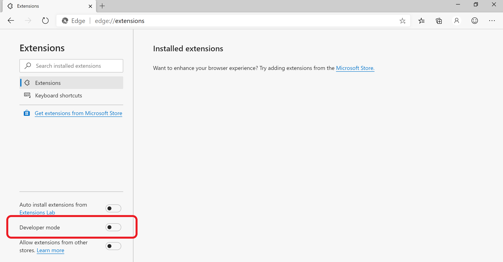

# 旁加载扩展

在开发过程中，可以使用Microsoft Edge浏览器安全运行和调试扩展。  通过在浏览器本地旁加载扩展，可以运行和测试扩展。  本文介绍如何将扩展旁加载到Microsoft Edge。

旁加载扩展：

1. `edge://extensions`通过选择浏览器顶部的三个点，然后选择 **“扩展**”打开页面。

   

1. 在扩展管理页上 `edge://extensions`，使用页面左下角的切换打开 **开发人员模式** 。

   

1. 首次安装扩展时，请选择 **“卸包负载**”。  系统会提示输入包含扩展源文件的目录。  扩展安装在浏览器中，类似于从存储区安装的扩展。

   

在开发过程中，可能还需要执行以下操作：

* 更新扩展。  转到 `edge://extensions`，然后选择 **“重新加载** ”以更新扩展。

* 从浏览器中删除扩展。  转到 `edge://extensions`，然后在扩展上选择 `Remove` 。
