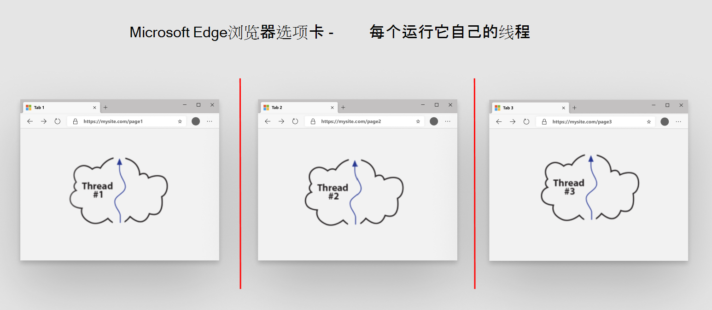
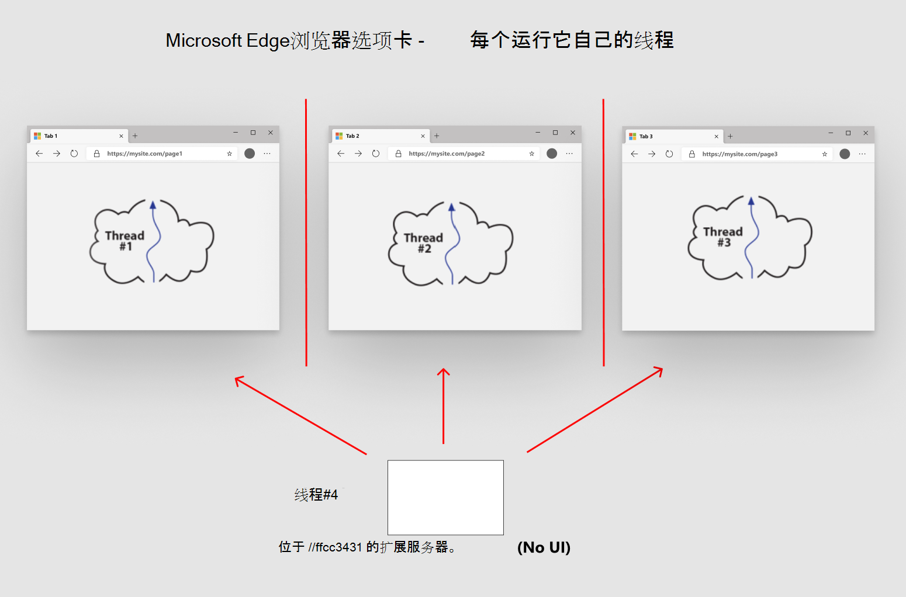

# 扩展概念和体系结构

本文介绍有关生成Microsoft Edge扩展的概念。  请继续了解多选项卡浏览器的工作原理。

Microsoft Edge*扩展*是一个小程序，用于添加或修改Microsoft Edge的功能。  有关简介，请参阅[Microsoft Edge扩展概述](../index.md)。

<!-- ====================================================================== -->
## 了解浏览器的工作原理

下面的列表概述了在生成扩展之前要了解的有用信息。

### 浏览器选项卡是独立线程

每个浏览器选项卡与所有其他选项卡隔离。 每个选项卡在独立线程中运行，该线程与其他浏览器选项卡和线程隔离。

### 每个选项卡处理一个 GET 请求

每个选项卡处理一个 GET 请求。  每个选项卡使用 URL 获取单个数据流，这通常是 HTML 文档。  该单个流或页面包括 JavaScript 等说明，包括标记、图像引用、CSS 引用等。  所有资源都下载到该选项卡页，然后在选项卡中呈现该页面。

### 每个选项卡和远程服务器之间发生通信

在每个选项卡和远程服务器之间进行通信。  每个选项卡在隔离的环境中运行。  每个选项卡仍连接到 Internet，但每个选项卡都与其他选项卡隔离。  选项卡可以运行 JavaScript 以与服务器通信。  服务器是输入到选项卡 URL 栏中的第一个 GET 请求的发起服务器。

### 通信模型

扩展模型使用不同的通信模型。  与选项卡页类似，扩展在独立于其他选项卡页线程的单个线程中运行。  选项卡将单个 GET 请求发送到远程服务器，然后呈现页面。  但是，扩展的工作方式类似于远程服务器。  在浏览器中安装扩展会在浏览器中创建独立的 Web 服务器。  扩展与所有选项卡页隔离。

<!-- ====================================================================== -->
## 扩展体系结构

以下列表概述了与扩展的体系结构相关的有用信息。

### 扩展 Web 服务器捆绑包

扩展是一组 Web 资源。  Web 资源类似于 (Web 开发人员) 发布到 Web 服务器的其他资源。  生成扩展时，可将 Web 资源捆绑到 zip 文件中。

zip 文件包括 HTML、CSS、JavaScript 和图像文件。  在 zip 文件的根目录中还需要一个文件。  另一个文件是命名 `manifest.json`的清单文件。  清单文件是扩展的蓝图，包括扩展的版本、游戏、运行扩展所需的权限等。

### 启动扩展服务器

Web 服务器包含 Web 捆绑包。  浏览器导航到服务器上的 URL，并下载要在浏览器中呈现的文件。  浏览器使用证书、配置文件等进行导航。  `index.html`如果指定了文件，则该文件存储在 Web 服务器上的特殊位置。

使用扩展时，浏览器的选项卡页将使用扩展运行时访问扩展的 Web 捆绑包。  扩展运行时为 URL `extension://{some-long-unique-identifier}/index.html`中的文件提供服务，其中 `{some-long-unique-identifier}` 在安装期间分配给扩展的唯一标识符。  每个扩展使用不同的唯一标识符。  每个标识符都指向在浏览器中安装的 Web 捆绑包。

### 与选项卡和浏览器工具栏的通信

扩展可以与选项卡和浏览器工具栏通信。  扩展可以与浏览器的工具栏交互。  每个扩展在单独的线程中管理运行的选项卡页，并且每个选项卡页上的 DOM 操作是隔离的。  扩展使用扩展 API 在扩展页和选项卡页之间通信。  扩展 API 提供额外的功能，包括通知管理、存储管理等。

与 Web 服务器一样，扩展在浏览器打开时等待通知。  扩展页和选项卡页在彼此隔离的线程中运行。  若要允许扩展使用任何选项卡页，请使用扩展 API 并在清单文件中设置权限。

### 安装时选择加入权限

扩展在安装时提供选择加入权限。  在文件中 `manifest.json` 指定扩展权限。  当用户安装扩展时，将显示有关扩展所需的权限的信息。  根据所需的权限类型，扩展可以从浏览器中提取和使用信息。

<!-- ====================================================================== -->
## 后续步骤

有关扩展入门的信息，请参阅 [“创建扩展教程”第 1 部分](part1-simple-extension.md)。
