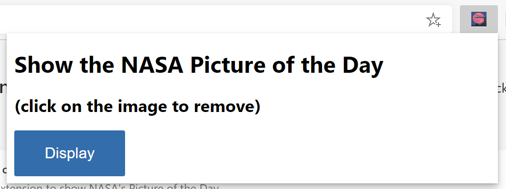
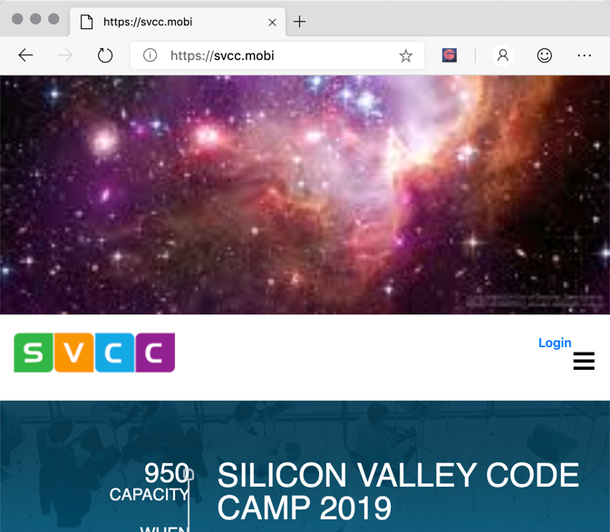

# <a name="create-an-extension-tutorial-part-2"></a>创建扩展教程，第 2 部分

若要查看本教程的这一部分的已完成扩展包源，请转到 [MicrosoftEdge-Extensions 存储库>扩展入门部分 2](https://github.com/microsoft/MicrosoftEdge-Extensions/tree/main/Extension%20samples/extension-getting-started-part2/extension-getting-started-part2)。  

源代码已从清单 V2 更新到清单 V3。

本教程介绍以下扩展技术：
*   将 JavaScript 库注入扩展。
*   将扩展资产公开到浏览器选项卡。
*   在现有浏览器选项卡中包括内容页。
*   让内容页侦听弹出窗口中的消息并做出响应。

你将了解如何更新弹出菜单，将静态星形图像替换为标题和标准 HTML 按钮。  选中该按钮时，将明星图像传递到内容页面。  此映像现在嵌入到扩展中，并插入到活动浏览器选项卡中。下面是步骤。

## <a name="step-1-remove-the-image-from-the-pop-up-and-replace-it-with-a-button"></a>步骤 1：从弹出窗口中删除图像，并将其替换为按钮。

`popup.html`使用显示标题和按钮的简单标记更新文件。  稍后将在其他步骤中对该按钮进行编程，但现在包括对空 JavaScript 文件 `popup.js`的引用。  下面是更新了 HTML 的示例：

```html
<html>
    <head>
        <meta charset="utf-8" />
        <style>
            body {
                width: 500px;
            }
            button {
                background-color: #336dab;
                border: none;
                color: white;
                padding: 15px 32px;
                text-align: center;
                font-size: 16px;
            }
        </style>
    </head>
    <body>
        <h1>Display the NASA picture of the day</h1>
        <h2>(select the image to remove)</h2>
        <button id="sendmessageid">Display</button>
        <script src="popup.js"></script>
    </body>
</html>
```

更新并打开扩展后，将打开带有显示按钮的弹出窗口。



<!--![popup.html display after selecting the Extension icon] -->

## <a name="step-2-update-strategy-to-display-image-at-the-top-of-the-browser-tab"></a>步骤 2：更新策略以在浏览器选项卡顶部显示图像

添加按钮后，下一个任务是使其在活动选项卡页顶部显示 `images/stars.jpeg` 图像文件。

每个选项卡页 (和扩展) 在其自己的线程中运行。 创建注入选项卡页的内容脚本。  然后，将弹出窗口中的消息发送到选项卡页上运行的内容脚本。 内容脚本将接收消息，该消息描述应显示哪个图像。


<!-- ====================================================================== -->
## <a name="step-3-create-the-pop-up-javascript-to-send-a-message"></a>步骤 3：创建弹出的 JavaScript 以发送消息

`popup/popup.js`创建文件并添加代码，以便将消息发送到尚未创建的内容脚本，必须暂时创建该脚本并将其注入浏览器选项卡中。 为此，以下代码将事件`onclick`添加到弹出窗口 **“显示”** 按钮：

```javascript
const sendMessageId = document.getElementById("sendmessageid");
if (sendMessageId) {
  sendMessageId.onclick = function() {
    // do something
  };
}
```

在该 `onclick` 事件中，找到当前浏览器选项卡。 然后，使用 `chrome.tabs.sendmessage` 扩展 API 将消息发送到该选项卡。

在该消息中，必须包含要显示的图像的 URL。  此外，请确保发送唯一 ID 以分配给插入的图像。

若要发送要分配给插入的图像的唯一 ID，可以使用几种不同的方法：
*  方法 1：让内容插入 JavaScript 生成该映像 ID。  我们不会在此处使用这种方法，原因在以后会变得明显。
*  方法 2：在此 `popup.js`处生成该唯一 ID，然后将该 ID 传递给尚未创建的内容脚本。  我们将使用此方法。

以下代码概述了更新后的代码 `popup/popup.js`。  你还将传递当前选项卡 ID，本文稍后将使用该 ID：

#### [<a name="manifest-v2"></a>清单 V2](#tab/v2)

```javascript
const sendMessageId = document.getElementById("sendmessageid");
if (sendMessageId) {
    sendMessageId.onclick = function() {
        chrome.tabs.query({ active: true, currentWindow: true }, function(tabs) {
            chrome.tabs.sendMessage(
                tabs[0].id,
                {
                    url: chrome.extension.getURL("images/stars.jpeg"),
                    imageDivId: `${guidGenerator()}`,
                    tabId: tabs[0].id
                },
                function(response) {
                    window.close();
                }
            );
            function guidGenerator() {
                const S4 = function () {
                    return (((1 + Math.random()) * 0x10000) | 0).toString(16).substring(1);
                };
                return (S4() + S4() + "-" + S4() + "-" + S4() + "-" + S4() + "-" + S4() + S4() + S4());
            }
        });
    };
}
```

#### [<a name="manifest-v3"></a>清单 V3](#tab/v3)

```javascript
const sendMessageId = document.getElementById("sendmessageid");
if (sendMessageId) {
    sendMessageId.onclick = function() {
        chrome.tabs.query({ active: true, currentWindow: true }, function(tabs) {
            chrome.tabs.sendMessage(
                tabs[0].id,
                {
                    url: chrome.runtime.getURL("images/stars.jpeg"),
                    imageDivId: `${guidGenerator()}`,
                    tabId: tabs[0].id
                },
                function(response) {
                    window.close();
                }
            );
            function guidGenerator() {
                const S4 = function () {
                    return (((1 + Math.random()) * 0x10000) | 0).toString(16).substring(1);
                };
                return (S4() + S4() + "-" + S4() + "-" + S4() + "-" + S4() + "-" + S4() + S4() + S4());
            }
        });
    };
}
```

---


<!-- ====================================================================== -->
## <a name="step-4-make-your-starsjpeg-available-from-any-browser-tab"></a>步骤 4：在 `stars.jpeg` 任何浏览器选项卡中提供

传递 `images/stars.jpeg`后，必须使用 `chrome.runtime.getURL` API (或 `chrome.extension.getURL` 使用清单 V2) ，而不是只传入相对 URL，而无需像上一部分那样使用额外的前缀。  附加图像后会返回 `getUrl` 该额外前缀，如下所示：

```http
extension://inigobacliaghocjiapeaaoemkjifjhp/images/stars.jpeg
```

原因是要使用 `src` 元素的属性 `img` 将图像注入内容页。  内容页在一个与运行扩展的线程不同的唯一线程上运行。  必须将静态映像文件公开为 Web 资产才能正常工作。

在文件中 `manifest.json` 添加另一个条目，声明图像可用于所有浏览器选项卡。  该条目如下 (在添加即将) 的内容脚本声明时，应在下面的完整 `manifest.json` 文件中看到该条目：

#### [<a name="manifest-v2"></a>清单 V2](#tab/v2)

```json
"web_accessible_resources": [
    "images/*.jpeg"
]
```

#### [<a name="manifest-v3"></a>清单 V3](#tab/v3)

```json
"web_accessible_resources": [
    {
      "resources": ["images/*.jpeg"],
      "matches": ["<all_urls>"]
    }
  ]
```

---

现在，你已在文件中 `popup.js` 编写代码，将消息发送到嵌入在当前活动选项卡页上的内容页，但尚未创建并注入该内容页。  立即执行此操作。


<!-- ====================================================================== -->
## <a name="step-5-update-your-manifestjson-for-content-and-web-access"></a>步骤 5：更新 `manifest.json` 内容和 Web 访问

已更新`manifest.json`，其中包括和`content-scripts``web_accessible_resources`如下所示：

#### [<a name="manifest-v2"></a>清单 V2](#tab/v2)

```json
{
    "name": "NASA picture of the day viewer",
    "version": "0.0.0.1",
    "manifest_version": 2,
    "description": "An extension to display the NASA picture of the day.",
    "icons": {
        "16": "icons/nasapod16x16.png",
        "32": "icons/nasapod32x32.png",
        "48": "icons/nasapod48x48.png",
        "128": "icons/nasapod128x128.png"
    },
    "browser_action": {
        "default_popup": "popup/popup.html"
    },
    "content_scripts": [
        {
            "matches": [
              "<all_urls>"
            ],
            "js": ["lib/jquery.min.js","content-scripts/content.js"]
        }
    ],
    "web_accessible_resources": [
        "images/*.jpeg"
    ]
}
```

#### [<a name="manifest-v3"></a>清单 V3](#tab/v3)

```json
{
    "name": "NASA picture of the day viewer",
    "version": "0.0.0.1",
    "manifest_version": 3,
    "description": "An extension to display the NASA picture of the day.",
    "icons": {
        "16": "icons/nasapod16x16.png",
        "32": "icons/nasapod32x32.png",
        "48": "icons/nasapod48x48.png",
        "128": "icons/nasapod128x128.png"
    },
    "action": {
        "default_popup": "popup/popup.html"
    },
    "content_scripts": [
        {
            "matches": [
              "<all_urls>"
            ],
            "js": ["lib/jquery.min.js","content-scripts/content.js"]
        }
    ],
    "web_accessible_resources": [
        {
            "resources": ["images/*.jpeg"],
            "matches": ["<all_urls>"]
        }
    ]
}
```

---

该 `matches` 属性设置为 `<all_urls>`，这意味着在 `content_scripts` 加载每个选项卡时，所有文件都注入到所有浏览器选项卡页中。  可以注入的允许文件类型是 JavaScript 和 CSS。  你还添加了 `lib\jquery.min.js`。  可以从节顶部提到的下载中包含该内容。

#### <a name="add-jquery"></a>添加 jQuery

在要注入的内容脚本中，计划使用 jQuery (`$`) 。  你添加了一个已缩小的 jQuery 版本，并将其放入扩展包中。`lib\jquery.min.js`  这些内容脚本在单个沙盒中运行，这意味着注入页面的 `popup.js` jQuery 不会与内容共享。

#### <a name="understanding-the-thread"></a>了解线程

请记住，即使浏览器选项卡在加载的网页上运行 JavaScript，注入的任何内容也无法访问该 JavaScript。  注入的 JavaScript 仅有权访问在该浏览器选项卡中加载的实际 DOM。


<!-- ====================================================================== -->
## <a name="step-6-add-the-content-script-message-listener"></a>步骤 6：添加内容脚本消息侦听器

下面是`content-scripts\content.js`根据你的`manifest.json``content-scripts`部分将该文件注入到每个浏览器选项卡页中：

```javascript
chrome.runtime.onMessage.addListener(function(request, sender, sendResponse) {
    $("body").prepend(
        ` `
    );
    $("head").prepend(
        `<style>
          .slide-image {
              height: auto;
              width: 100vw;
          }
        </style>`
    );
    $(`#${request.imageDivId}`).click(function() {
        $(`#${request.imageDivId}`).remove(`#${request.imageDivId}`);
    });
    sendResponse({ fromcontent: "This message is from content.js" });
});
```

请注意，上述所有 JavaScript 都是使用`chrome.runtime.onMessage.addListener`扩展 API 方法注册`listener`的。  此侦听器等待消息，如前面`chrome.tabs.sendMessage`所述的扩展 API 方法发送`popup.js`的消息。

该方法的第一个参数 `addListener` 是一个函数，其第一个参数请求是传入的消息的详细信息。  请记住，使用 `popup.js`该方法时 `sendMessage` ，第一个参数的这些属性是 `url` 和 `imageDivId`。

侦听器处理事件时，将运行第一个参数的函数。  该函数的第一个参数是具有分配的属性的 `sendMessage`对象。  该函数只处理三个 jQuery 脚本行。

*   第一个脚本行在浏览器选项卡下方`body`追加一个`img`元素，该元素分配了`slide-image`类以及`imageDivId`该映像元素的 ID。

*   第二个脚本行动态插入到 DOM 标头中， **\<style\>** 该节必须将其分配为元素的 `slide-image` 类 `img` 。

*   第三个脚本行添加了一个 `click` 事件，该事件涵盖整个图像，允许用户在图像的任意位置进行选择，并且该图像从页面 (以及事件侦听器) 中删除。

8. 添加功能以在选择时删除显示的图像

现在，浏览到任何页面并选择 **“扩展** ”图标时，弹出菜单将如下所示：


选择按 `Display` 钮时，将获得以下内容。  如果选择图像上的 `stars.jpeg` 任意位置，则会删除该图像元素并折叠选项卡页<!--todo: check "tab pages collapses"--> 返回到最初显示的内容：



祝贺你！  你已创建一个扩展，该扩展已成功从扩展图标弹出窗口发送消息，并在浏览器选项卡上动态插入作为内容运行的 JavaScript。 注入的内容设置图像元素以显示静态星 `.jpeg` 形文件。
