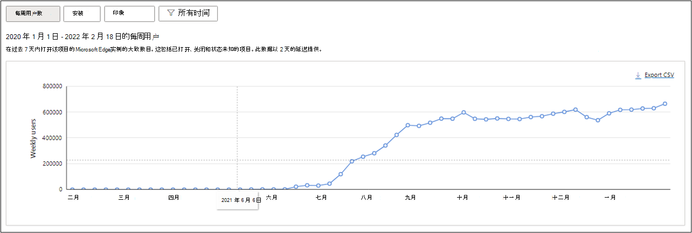

# 查看Microsoft Edge扩展分析仪表板

Microsoft 于 2021 年 9 月 8 日宣布推出扩展分析仪表板。 有关详细信息，请参阅博客 [“跟踪加载项的性能：扩展分析”现已在合作伙伴中心提供](https://techcommunity.microsoft.com/t5/articles/track-your-add-on-s-performance-extension-analytics-now/m-p/2733351)。

可以从[合作伙伴中心仪表板](https://partner.microsoft.com/dashboard/microsoftedge/overview)查看扩展指标，并从[Microsoft Edge加载项](https://microsoftedge.microsoft.com/addons/Microsoft-Edge-Extensions-Home)评估扩展的性能。

例如，可以确定扩展的安装数在过去 3 个月中增加的区域。 还可以将此报表导出为 CSV 文件。

按照以下步骤查看扩展的分析仪表板：  

1. 导航到合作伙伴中心帐户并选择扩展。

1. 在左侧面板中，单击 **“扩展概述** > **分析** ”以查看扩展指标。

<!-- ====================================================================== -->
## 分析仪表板指标

在分析仪表板中，可以查看**上个月**、**3 个月**、**6 个月**或自扩展发布到 Microsoft Edge 加载项存储) 以来的所有**时间** (指标。

### 每周用户数

**“每周用户**”指标跟踪在过去七天Microsoft Edge启用、关闭扩展和状态未知的用户数。

下图显示了从扩展发布到今天为止的 **每周用户** 。

#### 已启用与已禁用

**“启用与已禁用**”报表显示每个用户启用或禁用的扩展的实例数。

下图显示了在同一时间段内启用和禁用扩展的 **每周用户** 。 可从 **“全部** / **取消选择**”、“ **已禁**用”和 **“已启用** ”视图中进行选择。

> [!div class="mx-imgBorder"]
> 

<!-- ====================================================================== -->

### 安装次数

**“安装”** 指标显示每天从Microsoft Edge加载项存储成功安装扩展的总数。

下图显示了上个月的每日成功安装。

### 曝光数

“**印象”** 指标捕获Microsoft Edge加载项存储上扩展产品页面的页面视图和用户访问总数。 数据点基于每周或每日总计，具体取决于所选时间范围。

下图显示了过去 3 个月扩展页 **的印象** 。

<!-- ====================================================================== -->
## 按区域、OS 和语言进行优化

可以根据区域、OS 和语言进一步优化扩展每周用户、安装和印象的视图。

### 区域

“区域”筛选器涵盖扩展用户的地理分布，指示每个区域中的用户群。

下图显示了用户总访问量。

### 操作系统

OS (操作系统) 筛选器突出显示了扩展的所有安装请求的 OS 使用情况分布。

下图显示了过去 30 天内按操作系统列出的每周用户。

> [!div class="mx-imgBorder"]
> 

### 语言

语言筛选器显示扩展用户的语言分发。

下图显示了过去 6 个月的按语言安装。

> [!div class="mx-imgBorder"]
> 

分析仪表板可帮助你更好地了解扩展用户并与之互动。 有关合作伙伴中心上启动的其他功能的信息，请参阅 [Microsoft Edge 加载项的发布功能 - Microsoft Edge开发|Microsoft Docs](/microsoft-edge/extensions-chromium/whats-new/released-features)。

在 Twitter [@MSEdgeDev](https://twitter.com/msedgedev/)或通过  [TechCommunity Microsoft Edge 预览体验论坛](https://techcommunity.microsoft.com/t5/articles/manifest-v3-changes-are-now-available-in-microsoft-edge/m-p/1780254)与团队分享反馈、问题和评论。
