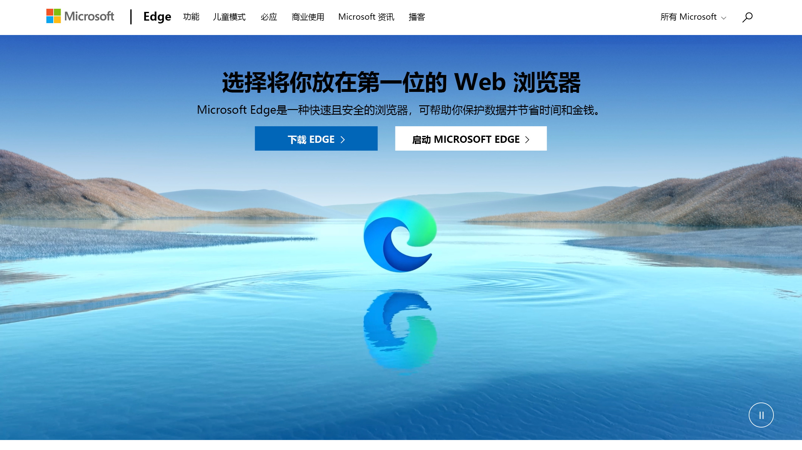

# <a name="use-playwright-to-automate-and-test-in-microsoft-edge"></a>在 Microsoft Edge 中使用 Playwright 自动执行和测试

Playwright 库通过单个 API 提供跨浏览器自动化。

[Playwright](https://playwright.dev/docs/intro) 是一个[Node.js](https://nodejs.org)库，用于使用单个 API 自动[Chromium](https://www.chromium.org/Home)、[Firefox](https://www.mozilla.org/firefox) 和 [WebKit](https://webkit.org)。  Playwright 旨在启用常绿、有能力、可靠且快速的跨浏览器 Web 自动化。  由于[Microsoft Edge是基于开源Chromium Web 平台构建](https://blogs.windows.com/windowsexperience/2018/12/06/microsoft-edge-making-the-web-better-through-more-open-source-collaboration)的，因此 Playwright 也能够自动执行Microsoft Edge。

Playwright 默认启动 [无头浏览器](https://en.wikipedia.org/wiki/Headless_browser) 。  无头浏览器不显示 UI，因此必须使用命令行。  还可以将 Playwright 配置为完全运行 (非无头) Microsoft Edge。


<!-- ====================================================================== -->
## <a name="install-playwright-and-browsers"></a>安装 Playwright 和浏览器

> [!NOTE]
> [剧作家](https://playwright.dev/docs/intro) 需要Node.js版本 12 或更高版本。 从命令行运行 `node -v` ，以确保具有兼容版本的Node.js。  Chromium、Firefox 和 WebKit 的浏览器二进制文件可跨 Windows、macOS 和 Linux 工作。 有关详细信息，请参阅 [Playwright 系统要求](https://playwright.dev/docs/library#system-requirements)。

首先，安装 [Playwright Test](https://playwright.dev/docs/intro) 以测试网站或应用：

```console
npm i -D @playwright/test
```

若要安装浏览器，请运行以下命令，该命令下载[Chromium](https://www.chromium.org/Home)、[Firefox](https://www.mozilla.org/firefox) 和 [WebKit](https://webkit.org)：

```console
npx playwright install 
```


<!-- ====================================================================== -->
## <a name="run-a-basic-test"></a>运行基本测试

Playwright 使用的方法对其他浏览器测试框架（如 [WebDriver](../webdriver-chromium/index.md) 或 [Puppeteer）](../puppeteer/index.md)的用户很熟悉。  可以创建浏览器实例，在浏览器中打开页面，然后使用 [Playwright API](https://playwright.dev/docs/api/class-playwright) 操作页面。

[剧作家测试](https://playwright.dev/docs/intro)，这是剧作家的测试运行程序，启动浏览器和上下文给你。 然后，一个独立页面将传递到每个测试中，如以下基本测试所示：

```typescript
// tests/foo.spec.ts
import { test, expect } from '@playwright/test';

test('basic test', async ({ page }) => {
  await page.goto('https://playwright.dev/');
  const title = page.locator('.navbar__inner .navbar__title');
  await expect(title).toHaveText('Playwright');
});
```

现在运行测试，如下所示：

```console
npx playwright test
```

有关运行测试的详细信息，请参阅 [Playwright >入门](https://playwright.dev/docs/intro)。


<!-- ====================================================================== -->
## <a name="run-tests-in-microsoft-edge"></a>在Microsoft Edge中运行测试

若要在Microsoft Edge中运行测试，需要为 Playwright Test 创建配置文件，例如`playwright.config.ts`。  在配置文件中，使用Microsoft Edge创建一个项目。

```typescript
// playwright.config.ts
import { PlaywrightTestConfig } from '@playwright/test';

const config: PlaywrightTestConfig = {
  projects: [
    {
      name: 'Microsoft Edge',
      use: {
        // Supported Microsoft Edge channels are: msedge, msedge-beta, msedge-dev, msedge-canary
        channel: 'msedge',
      },
    },
  ],
};

export default config
```

如果系统上尚未安装Microsoft Edge，请通过 Playwright 进行安装，如下所示：

```console
npx playwright install msedge
```

使用上述`playwright.config.ts`文件时，Playwright Test 使用Microsoft Edge运行测试，如下所示：

```console
npx playwright test --headed
```


<!-- ====================================================================== -->
## <a name="use-playwright-as-a-library"></a>将 Playwright 用作库

还可以使用 Playwright 作为库，如以下代码所示。  此方法允许使用其他测试运行程序。

```javascript
// example.js
const playwright = require('playwright');

(async () => {
  const browser = await playwright.chromium.launch({
    channel: 'msedge',
  });
  const context = await browser.newContext();
  const page = await context.newPage();
  await page.goto('https://www.microsoft.com/edge');
  await page.screenshot({ path: 'example.png' });

  await browser.close();
})();
```



`example.js` 是 Playwright 启用的自动化和测试方案的简单演示。  若要在其他 Web 浏览器中拍摄屏幕截图，请将上述代码从 `await playwright.chromium.launch` 以下代码更改为：

火狐： 

```javascript
  const browser = await playwright.firefox.launch({
```

Webkit： 

```javascript
  const browser = await playwright.webkit.launch({
```

有关剧作家和剧作家测试的详细信息，请转到 [Playwright 网站](https://playwright.dev/docs/intro)。  查看GitHub上的 [Playwright 存储库](https://github.com/microsoft/playwright)。  若要与 Playwright 共享有关自动执行和测试网站或应用的反馈， [请提交问题](https://github.com/microsoft/playwright/issues/new/choose)。
