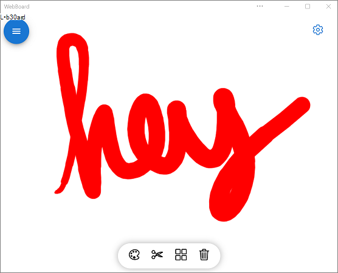
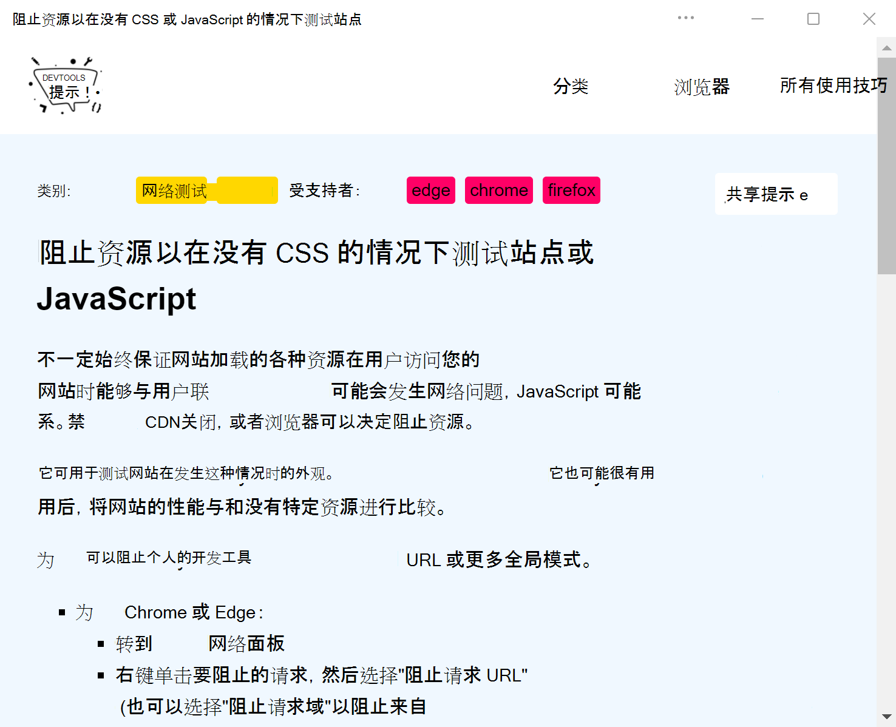
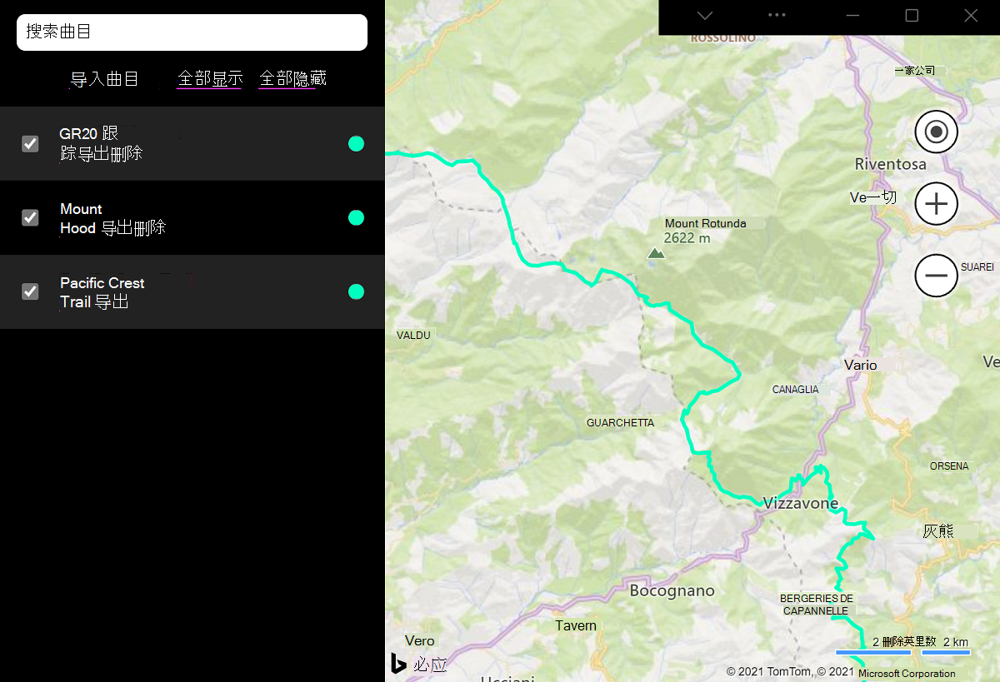
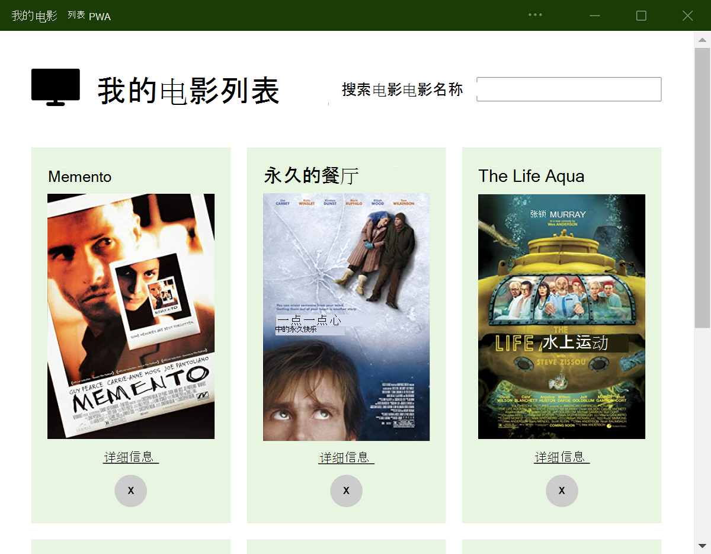
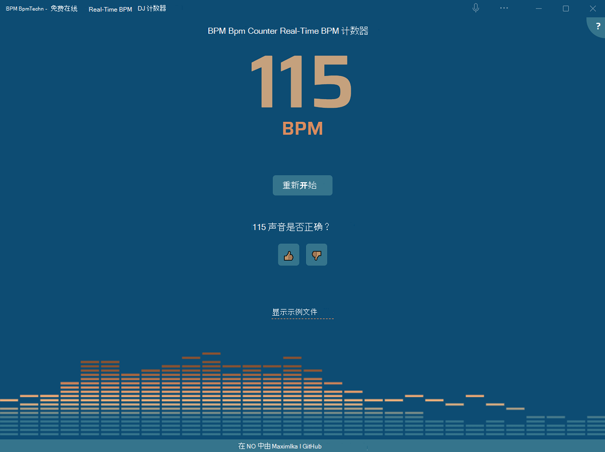
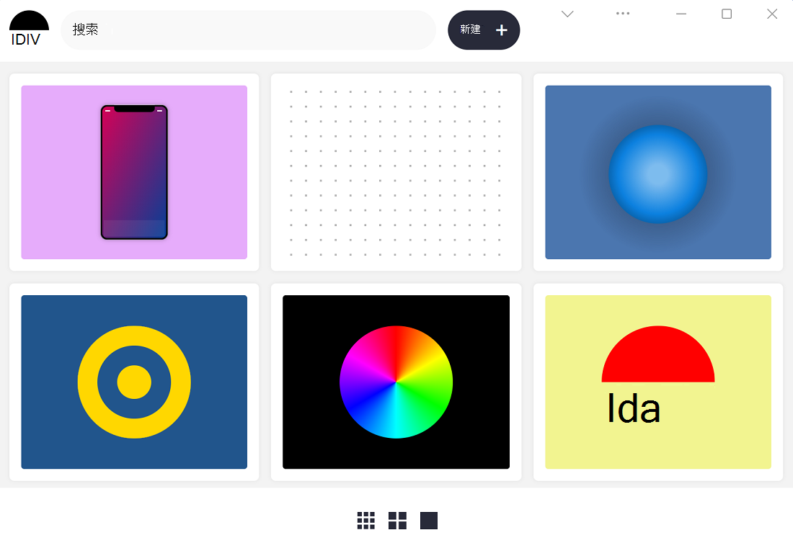

# 示例 PWA

使用这些示例渐进式Web 应用 (PVA) 了解如何使用 PVA 的功能和 API。

<!-- ====================================================================== -->
## PWAmp

桌面音乐播放器应用。

[应用](https://microsoftedge.github.io/Demos/pwamp/)、 [源代码和自述文件](https://github.com/MicrosoftEdge/Demos/tree/main/pwamp)。

特征：

*  [窗口控件覆盖](how-to/window-controls-overlay.md)
*  [协议处理](how-to/handle-protocols.md)
*  [文件处理](how-to/handle-files.md)
*  [Web 共享](how-to/share.md#sharing-content)
*  [共享目标](how-to/share.md#receiving-shared-content)

<!-- ====================================================================== -->
## Webboard

智能白板应用。

[应用](https://webboard.app/)、 [源代码和自述文件](https://github.com/pwa-builder/web-whiteboard)。

特征：

*  [快捷方式](how-to/shortcuts.md)
*  [Web 共享](how-to/share.md#sharing-content)
*  [共享目标](how-to/share.md#receiving-shared-content)

<!-- ====================================================================== -->
## DevTools 提示

显示 DevTools 的提示和技巧列表。

[应用](https://devtoolstips.org)、 [源代码和自述文件](https://github.com/captainbrosset/devtools-tips)。

特征：

*  [Web 共享](how-to/share.md#sharing-content)
*  [URL 处理](how-to/handle-urls.md)
*  [后台同步](how-to/background-syncs.md#use-the-background-sync-api-to-synchronize-data-with-the-server)
*  [定期后台同步](how-to/background-syncs.md#use-the-periodic-background-sync-api-to-regularly-get-fresh-content)
*  [通知](how-to/notifications-badges.md#display-notifications-in-the-action-center)

<!-- ====================================================================== -->
## 我的曲目

用于可视化 GPS 轨迹的渐进式 Web 应用。

[应用](https://captainbrosset.github.io/mytracks/)、 [源代码和自述文件](https://github.com/captainbrosset/mytracks)。

特征：

*  [窗口控件覆盖](how-to/window-controls-overlay.md)
*  [协议处理](how-to/handle-protocols.md)
*  [快捷方式](how-to/shortcuts.md)
*  [文件处理](how-to/handle-files.md)

<!-- ====================================================================== -->
## 我的电影

用于搜索和存储电影的渐进式 Web 应用。

[应用](https://quirky-rosalind-ac1e65.netlify.app/)， [源代码](https://github.com/captainbrosset/movies-db-pwa)。<!-- todo: link to readme -->

特征：

*  [后台同步](how-to/background-syncs.md#use-the-background-sync-api-to-synchronize-data-with-the-server)
*  [通知](how-to/notifications-badges.md#display-notifications-in-the-action-center)

<!-- ====================================================================== -->
## BPM Techno

BPM) 计数器 (每分钟实时节拍。

[应用](https://bpmtech.no/)、 [源代码和自述文件](https://github.com/webmaxru/bpm-counter)。

特征：

*  [快捷方式](how-to/shortcuts.md)
*  [URL 处理](how-to/handle-urls.md)
*  [文件处理](how-to/handle-files.md)
*  [协议处理](how-to/handle-protocols.md)
*  [共享目标](how-to/share.md#receiving-shared-content)

<!-- ====================================================================== -->
## 1DIV

CSS 操场。

[应用](https://microsoftedge.github.io/Demos/1DIV/dist/)、 [源代码和自述文件](https://github.com/MicrosoftEdge/Demos/tree/main/1DIV)。

特征：

*  [窗口控件覆盖](how-to/window-controls-overlay.md)

