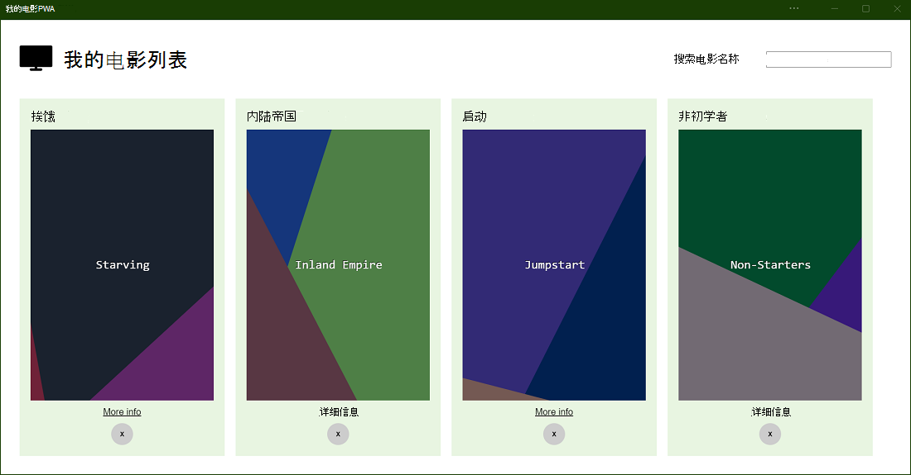
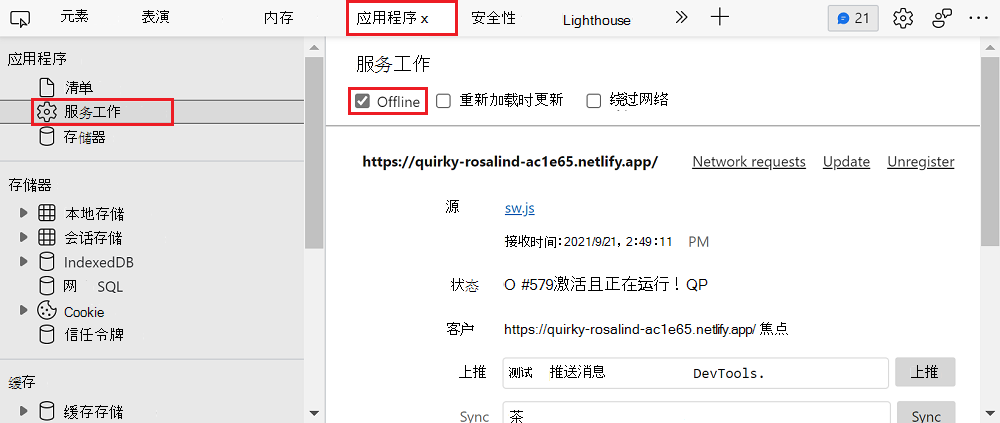
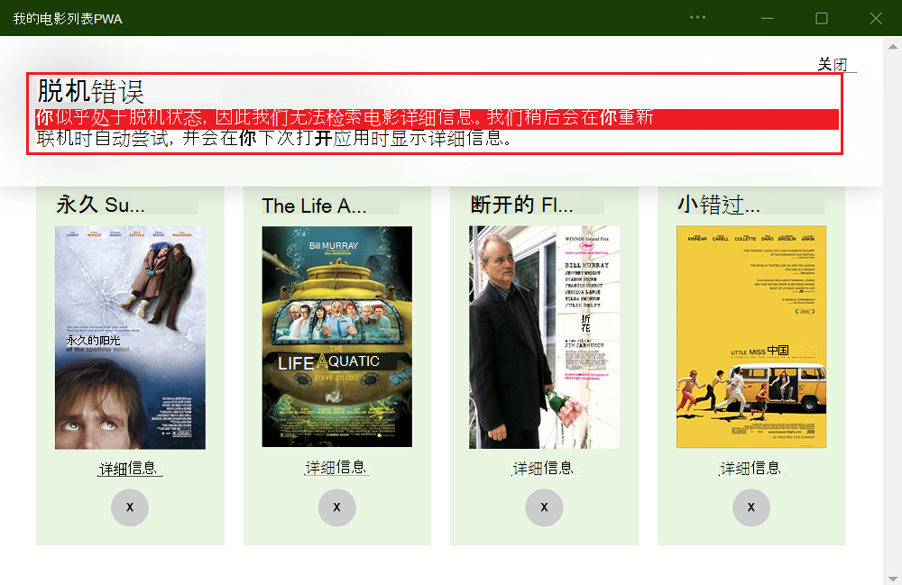
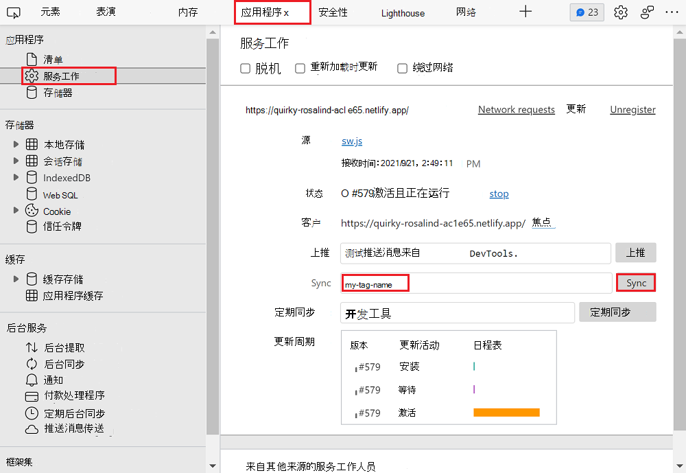
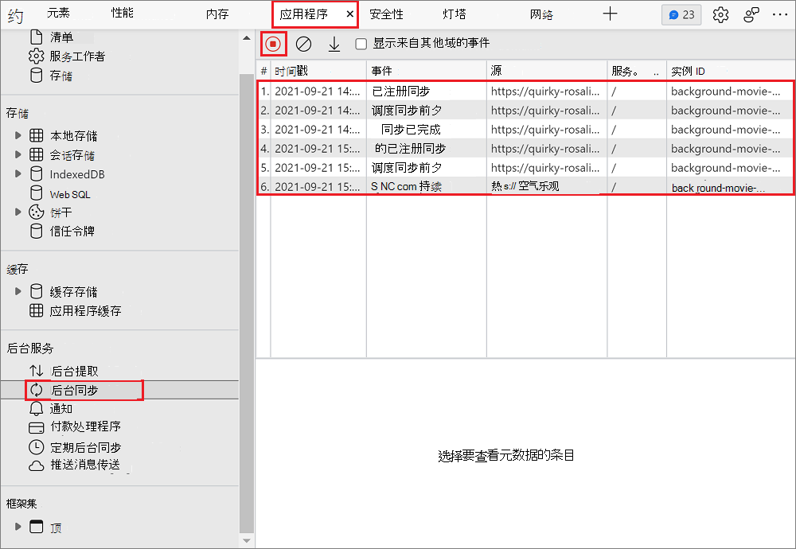
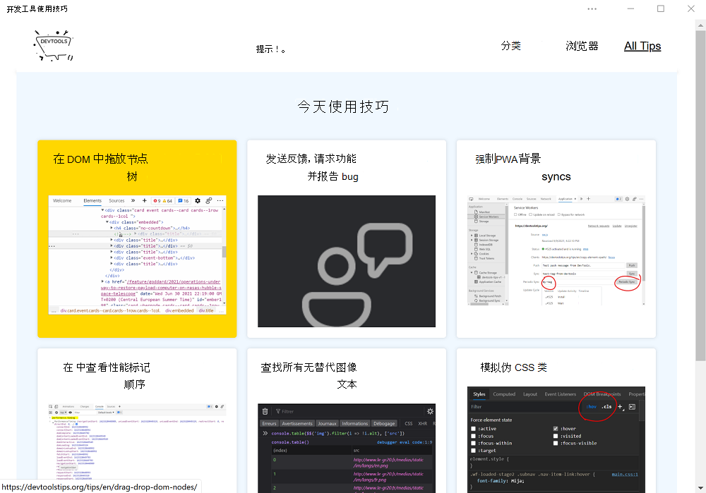
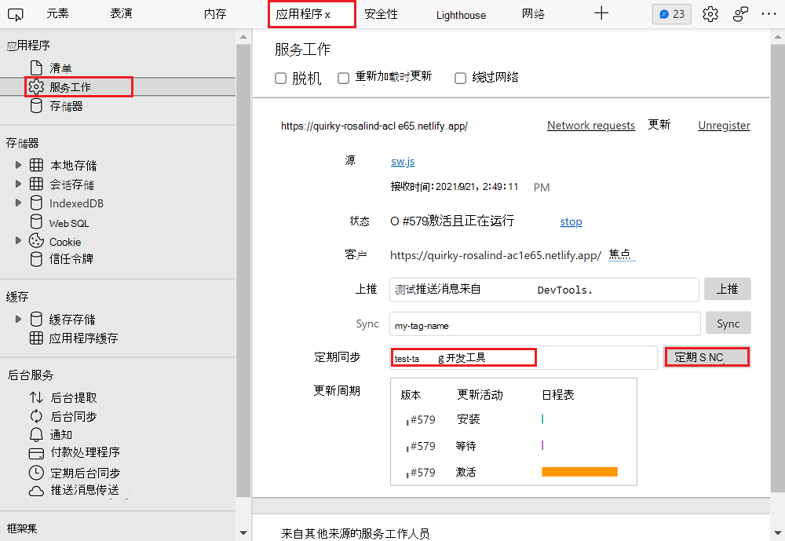
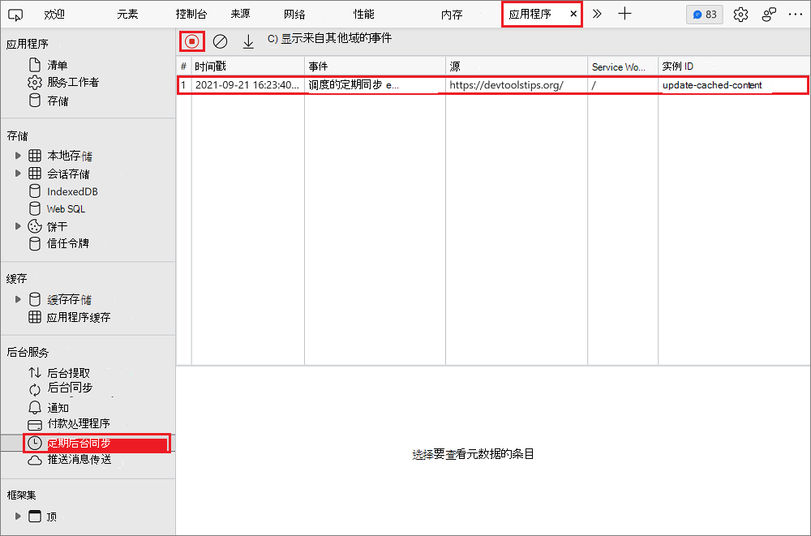

# <a name="synchronize-and-update-a-pwa-in-the-background"></a>在后台同步和更新PWA

使用服务辅助角色，渐进式 Web 应用 (PWA) 也可以在后台工作，即使用户未使用该应用。  服务工作者过去是为本机应用保留的，但现在它们也可用于 PVA，从而提供更好的脱机体验。

请考虑以下用例：
*  一个电子邮件应用，允许用户随时撰写和发送邮件，即使在脱机时。
*  每天提取新文章的新闻应用，供用户在打开应用时稍后阅读。
*  允许用户下载歌曲以脱机收听的音乐应用。

通过使用以下 API，PVA 可以使用以下三种用例：
*  后台同步 API
*  定期后台同步 API
*  后台提取 API

虽然这些 API 具有相似的名称，但其性质不同。


<!-- ====================================================================== -->
## <a name="use-the-background-sync-api-to-synchronize-data-with-the-server"></a>使用后台同步 API 将数据与服务器同步

使用后台同步 API 允许用户在脱机时继续使用应用并执行操作。

例如，电子邮件应用可以让其用户随时撰写和发送消息。  应用前端可以尝试立即发送消息，如果设备处于脱机状态，则服务辅助角色可以捕获失败的请求，并使用后台同步 API 将任务延迟到连接为止。

使用后台同步 API 的另一个示例是在后台为用户加载内容。

> [!NOTE]
> 后台同步 API 应用于少量数据。  后台同步 API 要求服务辅助角色在数据传输的整个持续时间内保持活动状态。  后台同步 API 不应用于提取大型文件，因为设备可以决定终止服务工作者，以保持电池续航时间。  请改用 [后台提取 API](#use-the-background-fetch-api-to-fetch-large-files-when-the-app-or-service-worker-isnt-running)。

### <a name="check-for-support"></a>检查支持

后台同步 API 在 Microsoft Edge 中可用，但应确保在应用运行的其他浏览器和设备中支持后台同步 API。  若要确保支持后台同步 API，请测试对象是否 `ServiceWorkerRegistration` 具有 `sync` 属性：

```javascript
navigator.serviceWorker.ready.then(registration => {
    if (registration.sync) {
        // Background Sync is supported.
    } else {
        // Background Sync isn't supported.
    }
});
```

若要了解有关接口的 `ServiceWorkerRegistration` 详细信息，请参阅 MDN 上的 [ServiceWorkerRegistration](https://developer.mozilla.org/docs/Web/API/ServiceWorkerRegistration) 。

### <a name="request-a-sync"></a>请求同步

要执行的第一件事是请求同步。这可由应用前端或服务辅助角色完成。

*  如果要让用户负责以后同步或以后不进行同步，从前端请求同步是有好处的。
*  如果希望该同步对用户透明，则从服务辅助角色请求同步是不错的。 在这种情况下，服务辅助角色可以检测失败的提取请求，并立即请求同步。

若要请求同步，需要一个和一个 `ServiceWorkerRegistration` 标记名称。 在应用前端代码中，执行以下操作：

```javascript
async function requestBackgroundSync() {
    const registration = await navigator.serviceWorker.ready;
    await registration.sync.register('my-tag-name');
}
```

或者，从服务辅助角色改为执行此操作：

```javascript
async function requestBackgroundSync() {
    await self.registration.sync.register('my-tag-name');
}
```

上面的 `my-tag-name` 字符串应该是标识此同步请求的唯一标记，以便可以执行多个请求。

### <a name="react-to-the-sync-event"></a>同步事件React

一旦可以使用连接并且服务辅助角色正在运行，就会向服务辅助角色发送事件 `sync` ，该事件可以使用它来同步所需的数据。 `sync`可以使用以下代码来侦听事件：

```javascript
self.addEventListener('sync', event => {
    if (event.tag === 'my-tag-name') {
        event.waitUntil(doTheWork());
    }
});
```

在上面的示例代码中， `sync` 在服务辅助角色中添加事件侦听器。 调用侦听器时，代码会检查标记是否是在前端注册的标记，然后调用 `doTheWork`。 此函数应返回 Promise。

通常，函 `doTheWork` 数会将信息发送到用户脱机时无法发送的服务器。 从前端将此信息存储在 [IndexedDB](https://developer.mozilla.org/docs/Web/API/IndexedDB_API) 存储中可能很有用，以便稍后在执行时 `doTheWork` 可以从服务辅助角色中检索该信息。

有关 `Sync` 事件、 `ServiceWorkerRegistration`和接口的 `SyncManager` 详细信息，请参阅 [后台同步草稿规范](https://wicg.github.io/background-sync/spec/) 和 [后台同步 API 文档](https://developer.mozilla.org/docs/Web/API/Background_Synchronization_API)。

### <a name="demo-app"></a>演示应用

[我的电影列表PWA](https://quirky-rosalind-ac1e65.netlify.app/)是一个演示应用，如果用户处于脱机状态，则使用后台同步 API 在以后提取电影信息。



测试后台同步：

1.  安装应用。

1.  使用搜索输入字段搜索电影。

1.  脱机。  为此，请打开 DevTools (**F12**) ，然后**选中** > 应用程序**服务辅助角色** > **脱机**复选框。

    

1.  在其中一个电影结果中，选择 **“更多信息**”。

1.  应用中会显示一条消息，告知你处于脱机状态，并且稍后会自动检索电影详细信息。

    

1.  联机。  为此，请在 DevTools **中** > 清除应用程序**服务辅助角色** > **脱机**复选框。

1.  重新加载应用。 现在将显示电影详细信息。

若要查看示例代码，请查看 [movies-db-pwa](https://github.com/captainbrosset/movies-db-pwa/) 存储库。

### <a name="debug-background-syncs-with-devtools"></a>调试后台同步与 DevTools

若要测试后台同步代码，无需脱机，然后联机，然后等待Microsoft Edge触发`sync`事件。  使用 DevTools 可以模拟后台同步事件。

`sync`模拟事件：

1. 打开 DevTools (**F12**) 。
1. 选择 **应用程序** > **服务辅助角色**。
1. 键入在 **同步输入字** 段中注册同步时使用的标记名称。
1. 选择 **“同步”** 按钮。



还可以在 DevTools 中记录应用生成的后台同步活动，如下所示：

1. 打开 DevTools (**F12**) 。
1. 选择 **应用程序** > **背景同步**。
1. 选择 **"开始"菜单录制事件**。

同步注册和调度显示在事件日志表中：




<!-- ====================================================================== -->
## <a name="use-the-periodic-background-sync-api-to-regularly-get-fresh-content"></a>使用定期后台同步 API 定期获取新内容

定期后台同步 API 允许 PVA 在后台定期检索新内容，以便用户可以在以后再次打开应用时立即访问它。

使用定期后台同步 API，当用户使用应用时，PVA 无需下载新内容 (，例如) 的新文章。  下载内容可能会降低体验速度，因此，请在更方便的时间检索内容。

> [!NOTE]
> 只有当设备位于已知网络 (（即设备在) 之前已连接到的网络）上时，才会发生定期同步。  Microsoft Edge限制同步的频率，以匹配用户使用应用的频率。

### <a name="check-for-support"></a>检查支持

若要检查应用运行的浏览器和设备中是否支持此 API，请测试该对象是否 `ServiceWorkerRegistration` 具有属性 `periodicSync` ：

```javascript
navigator.serviceWorker.ready.then(registration => {
    if (registration.periodicSync) {
        // Periodic Background Sync is supported.
    } else {
        // Periodic Background Sync isn't supported.
    }
});
```

### <a name="ask-the-user-for-permission"></a>向用户请求权限

定期后台同步需要用户的权限。  对于给定的应用程序，仅发生一次请求此权限。

若要向用户请求执行定期后台同步的权限，请使用权限 API，如下所示：

```javascript
const status = await navigator.permissions.query({name: 'periodic-background-sync'});
if (status.state === 'granted') {
  // Periodic background sync can be used.
} else {
  // Periodic background sync cannot be used.
}
```

若要详细了解权限 API，请参阅 MDN [中的权限 API](https://developer.mozilla.org/docs/Web/API/Permissions_API) 。

### <a name="register-a-periodic-sync"></a>注册定期同步

若要注册定期同步，需要定义最小间隔和唯一标记名称。  唯一标记名称允许注册多个定期后台同步。

```javascript
async function registerPeriodicSync() {
    await registration.periodicSync.register('get-daily-news', {
        minInterval: 24 * 60 * 60 * 1000
    });
}
```

`minInterval`上述代码中使用的对应于 1 天（毫秒）。 这只是最小间隔，Microsoft Edge在向服务工作者发出定期同步事件（例如网络连接以及用户是否定期与应用进行交互）之前考虑其他因素。

### <a name="react-to-periodic-sync-events"></a>React定期同步事件

当Microsoft Edge确定是运行定期同步的好时机时，Microsoft Edge向服务工作者发送`periodicsync`事件。 可以使用注册同步时指定的相同标记名称来处理此 `periodicsync` 事件。

```javascript
self.addEventListener('periodicsync', event => {
    if (event.tag === 'get-daily-news') {
        event.waitUntil(getDailyNewsInCache());
    }
});
```

该 `getDailyNewsInCache` 函数是服务辅助角色可以从服务器中提取新内容并将其存储在缓存中的位置。 此函数应返回一个 Promise，该承诺指示同步是成功还是失败。

有关 `PeriodicSync` 事件、 `ServiceWorkerRegistration`和接口的 `PeriodicSyncManager` 详细信息，请参阅：

* [Web 定期后台同步](https://wicg.github.io/periodic-background-sync/) - 草稿规范。
* [Web 定期后台同步 API](https://developer.mozilla.org/docs/Web/API/Web_Periodic_Background_Synchronization_API)。

### <a name="demo-app"></a>演示应用

[DevTools 使用技巧](https://devtoolstips.org/)是使用定期后台同步 API 的PWA。  [DevTools 使用技巧] PWA每天提取新的开发人员工具提示并将其存储在缓存中，以便用户可以在下次打开应用时访问它们，无论他们是否处于联机状态。



转到[GitHub上的源代码](https://github.com/captainbrosset/devtools-tips/)。 特别是，应用在 [registerPeriodicSync](https://github.com/captainbrosset/devtools-tips/blob/a4a5277ee6b67e5cc61eee642bf3d9c68130094f/src/layouts/home.njk#L72) 函数中注册定期同步。  [服务辅助角色代码](https://github.com/captainbrosset/devtools-tips/blob/ebfb2c7631464149ce3cc7700d77564656971ff4/src/sw.js#L115)是应用侦`periodicsync`听事件的位置。

### <a name="debug-periodic-background-syncs-with-devtools"></a>调试与 DevTools 的定期后台同步

可以使用 DevTools 来模拟 `periodicsync` 事件，而不是等待最小间隔。

若要模拟事件，请执行以下操作：

1. 打开 DevTools (**F12**) 。
1. 选择 **应用程序** > **服务辅助角色**。
1. 键入在定期 **同步输入字** 段中注册定期同步时使用的标记名称。
1. 选择 **“定期同步** ”按钮。



还可以记录应用在 DevTools 中生成的定期后台同步活动：

1. 打开 DevTools (**F12**) 。
1. 选择 **应用程序** > **定期后台同步**。
1. 选择 **"开始"菜单录制事件**。

定期同步注册和调度显示在事件日志表中。




<!-- ====================================================================== -->
## <a name="use-the-background-fetch-api-to-fetch-large-files-when-the-app-or-service-worker-isnt-running"></a>当应用或服务辅助角色未运行时，使用后台提取 API 提取大型文件

后台提取 API 允许 PVA 将下载大量数据完全委托给浏览器引擎。 这样，应用和服务辅助角色就不必在下载过程中运行。

此 API 对于允许用户下载大型文件 (（例如音乐、电影或播客）的应用非常有用，) 用于脱机用例。 由于下载委托给浏览器引擎，而浏览器引擎知道如何处理片状连接，甚至完全失去连接，因此它可以在必要时暂停并恢复下载。

### <a name="check-for-support"></a>检查支持

若要检查是否支持此 API，请测试全局对象上是否 `BackgroundFetchManager` 存在构造函数：

```javascript
if (self.BackgroundFetchManager) {
    // Background Fetch is supported.
} else {
    // Background Fetch isn't supported.
}
```

### <a name="start-a-background-fetch"></a>"开始"菜单后台提取

若要启动后台提取，请执行以下操作：

```javascript
navigator.serviceWorker.ready.then(async registration => {
    const fetch = await registration.backgroundFetch.fetch('my-download-id', 
                                                           fileUrls, options);
});
```

`my-download-id`上图应是此后台提取的唯一字符串标识符。 `fileUrls` 是要下载的文件列表，这将是字符串 URL 的数组。 并且 `options` 是一个对象，可用于自定义浏览器中下载活动的外观。

有关该函数的 `fetch` 详细信息，请参阅 [BackgroundFetchManager.fetch () ](https://developer.mozilla.org/docs/Web/API/BackgroundFetchManager/fetch) 和 [Background Fetch 简介](https://developers.google.com/web/updates/2018/12/background-fetch)。


<!-- ====================================================================== -->
## <a name="use-the-app-badging-api-and-notifications-api-to-re-engage-users"></a>使用应用损坏 API 和通知 API 重新吸引用户

使用应用损坏 API 和通知 API 让用户知道后台任务、下载或新鲜内容已完成，而不会中断其工作流。  使用锁屏提醒和通知可以增加用户对应用的重新参与度。

使用Microsoft Edge时，任务栏中的应用图标上会显示徽章，通知会与系统通知中心集成。

若要了解如何使用这些 API，请参阅 [使用徽章、通知和推送消息重新吸引用户](notifications-badges.md)。
