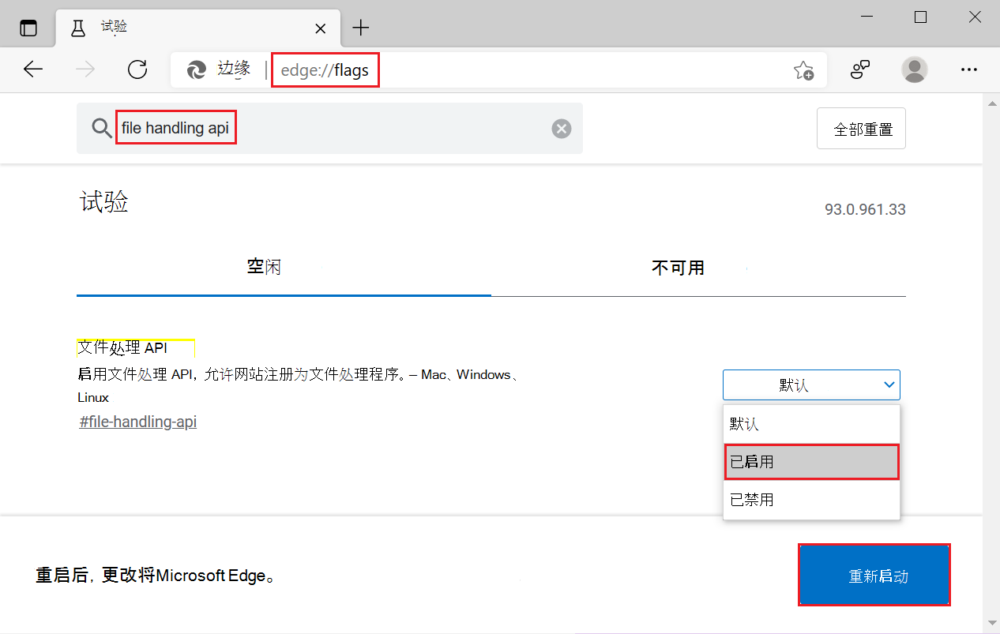
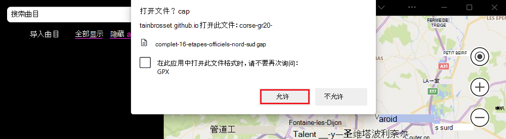
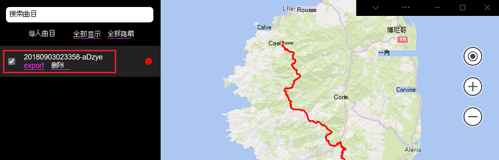

# <a name="handle-files-in-progressive-web-apps"></a>处理渐进式Web 应用中的文件

可以处理文件的渐进式Web 应用对用户更本机，并且更能集成到操作系统中。

网站已经可以允许用户 [使用 `<input type="file">` 或拖放](https://developer.mozilla.org/docs/Web/API/File/Using_files_from_web_applications)上传文件，但 PVA 会更进一步，并可在操作系统上注册为文件处理程序。

当PWA注册为某些文件类型的文件处理程序时，当用户打开这些文件时，操作系统可以自动启动应用，类似于Microsoft Word处理`.docx`文件的方式。


<!-- ====================================================================== -->
## <a name="enable-the-file-handling-api"></a>启用文件处理 API

文件处理功能是实验性的。

若要启用文件处理功能，请执行以下操作：

1.  转到`edge://flags`Microsoft Edge。
1.  选择 **搜索标志** 并键入“文件处理 API”。
1.  选择 **“已启用** > **默认** > **重启**”。

    


<!-- ====================================================================== -->
## <a name="define-which-files-your-app-handles"></a>定义应用处理的文件

要执行的第一件事是声明应用处理的文件类型。 这会在应用 [清单文件](web-app-manifests.md)中使用 `file_handlers` 数组成员完成。

数组中的 `file_handlers` 每个条目都需要有两个属性：

*  `action`：启动PWA时操作系统应导航到的 URL。
*  `accept`：接受的文件类型的对象。 键是 MIME 类型 (使用通配符符号 `*`的部分类型) 接受，值是接受的文件扩展名的数组。

请考虑以下示例：

```json
{
    "file_handlers": [
        {
            "action": "/openFile",
            "accept": {
                "text/*": [
                    ".txt"
                ]
            }
        }
    ]
}
```

在此示例中，应用注册接受文本文件的单个文件处理程序。 `.txt`例如，当用户通过双击桌面上的图标打开文件时，操作系统将使用 `/openFile` URL 启动应用。


<!-- ====================================================================== -->
## <a name="detect-whether-the-file-handling-api-is-available"></a>检测文件处理 API 是否可用

在处理文件之前，应用需要检查设备和浏览器上是否提供文件处理 API。

若要检查文件处理 API 是否可用，请测试对象是否 `launchQueue` 存在，如下所示：

```javascript
if ('launchQueue' in window) {
    console.log('File Handling API is supported!');
} else {
    console.error('File Handling API is not supported!');
}
```


<!-- ====================================================================== -->
## <a name="handle-files-on-launch"></a>在启动时处理文件

打开文件后，OS 启动应用时，可以使用该 `launchQueue` 对象访问文件内容。

使用以下 JavaScript 代码处理文本内容：

```javascript
if ('launchQueue' in window) {
    console.log('File Handling API is supported!');

    launchQueue.setConsumer(launchParams => {
        handleFiles(launchParams.files);
    });
} else {
    console.error('File Handling API is not supported!');
}

async function handleFiles(files) {
    for (const file of files) {
        const blob = await file.getFile();
        blob.handle = file;
        const text = await blob.text();

        console.log(`${file.name} handled, content: ${text}`);
    }
}
```

对象 `launchQueue` 将所有启动的文件排队，直到使用者设置 `setConsumer`。 若要了解有关这些对象和`launchParams`对象的`launchQueue`详细信息，请转到[文件处理解释器](https://github.com/WICG/file-handling/blob/main/explainer.md#launch)。


<!-- ====================================================================== -->
## <a name="demo"></a>演示版

我的跟踪是一个PWA演示应用，它使用文件处理功能来处理`.gpx`文件。 若要尝试使用此演示应用的功能，

*  在Microsoft Edge中[启用该功能](#enable-the-file-handling-api)。
*  转到 [“我的轨道](https://captainbrosset.github.io/mytracks/) ”并安装应用。
*  在计算机上下载 GPX 文件。 可以使用此 [测试 GPX 文件](https://www.visugpx.com/download.php?id=okB1eM4fzj)。
*  打开下载的 GPX 文件。

请注意，应用会自动启动，Microsoft Edge请求你处理此文件的权限。



如果允许应用处理文件，则应用的边栏中会显示一个新条目，你可以单击它旁边的复选框来可视化相应的 GPS 轨道。



可以在[“我的跟踪”GitHub存储库](https://github.com/captainbrosset/mytracks)中访问此应用的源代码。

* [manifest.json](https://github.com/captainbrosset/mytracks/blob/main/mytracks/manifest.json) 源文件使用数`file_handlers`组请求处理`.gpx`文件。
* [file.js](https://github.com/captainbrosset/mytracks/blob/main/src/file.js)源文件使用`launchQueue`该对象来处理传入文件。
