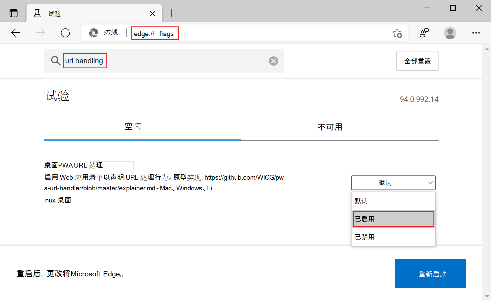

# <a name="handle-urls-in-progressive-web-apps"></a>处理渐进式 Web 应用中的 URL

许多操作系统上的本机应用程序都可以与 URL 相关联。 当激活关联的 URL 时，它们可以请求启动，而不是浏览器。

渐进式 Web (PBA) 也可以以相同方式处理 URL，以创建更具吸引力的体验。

> [!NOTE]
> 对实验清单成员 `url_handlers` 的支持（如下文所述）正在逐步淘汰。清单 `url_handlers` 成员将由新的 `handle_links` 清单成员取代，该成员当前正在标准化和实施。
> 请参阅解释`handle_links`[者](https://github.com/WICG/pwa-url-handler/blob/main/handle_links/explainer.md)。


<!-- ====================================================================== -->
## <a name="enable-url-handling"></a>启用 URL 处理

URL 处理是一项实验性功能。 若要启用 URL 处理实验，

1. 在Microsoft Edge中，转到 `edge://flags`。

1. 在" **搜索标志** "文本框中，键入"url handling"。  将显示**桌面PWA URL 处理**设置。

1. 将设置从 **"默认"** 更改为" **已启用**"，然后单击" **重启"** 按钮。

   > [!div class="mx-imgBorder"]
   > 

URL 处理是 Microsoft Edge 中的一项Microsoft Edge。 了解如何 [在源试用版中注册网站](./origin-trials.md#enroll-your-site-in-an-origin-trial)。


<!-- ====================================================================== -->
## <a name="define-which-urls-your-app-handles"></a>定义应用处理哪些 URL

首先要声明应用处理哪些 URL。 此操作在应用清单[文件中使用](./web-app-manifests.md)`url_handlers`数组成员完成。

数组的每个条目 `url_handlers` 都包含一个 `origin` 字符串，该字符串是匹配原点的模式。

```json
{
    "url_handlers": [
        {
            "origin": "https://contoso.com"
        },
        {
            "origin": "https://*.contoso.com"
        },
        {
            "origin": "https://conto.so"
        }
    ]
}
```

在以上示例中， `contoso.com` 注册应用以处理其源设置为 或其任何子域以及 的 URL `conto.so`。


<!-- ====================================================================== -->
## <a name="verify-the-origin-ownership"></a>验证源所有权

Microsoft Edge验证渐进式 Web 应用对已处理 URL 的所有权，以成功启动该应用。 当处理的 URL 和渐进式 Web (PWA) 位于同一源上时和不在同一源上时，这是必需的。 在大多数情况下，PWA将处理同一来源的 URL，但这不是必需的。

源所有权通过 `web-app-origin-association` JSON 文件建立，该 JSON 文件Microsoft Edge验证客户端和 URL 之间的PWA握手。

让我们以尝试处理和 URL PWA托管`https://app.contoso.com` `https://contoso.com` `https://partnerapp.com`的示例。

*  若要建立PWA`contoso.com`源的所有权，以下 JSON 内容需要在 中提供`https://contoso.com/.well-known/web-app-origin-association`。

    ```json
    {
        "web_apps": [
            {
                "manifest": "https://app.contoso.com/manifest.json",
                "details": {
                    "paths": [
                        "/*"
                    ]
                }
            }
        ]
    }
    ```

*  若要建立PWA`partnerapp.com`源的所有权，需要在 中提供相同的 JSON 内容`https://partnerapp.com/.well-known/web-app-origin-association`。

    ```json
    {
        "web_apps": [
            {
                "manifest": "https://app.contoso.com/manifest.json",
                "details": {
                    "paths": [
                        "/*"
                    ]
                }
            }
        ]
    }
    ```

若要详细了解 中的有效成员 `web-app-origin-association`，请参阅 [URL 处理程序解释器](https://github.com/WICG/pwa-url-handler/blob/main/explainer.md#web-app-origin-association-file)。


<!-- ====================================================================== -->
## <a name="testing-url-handling"></a>测试 URL 处理

从 Web 浏览器测试应用的 URL 处理将不起作用，因为浏览器内页面导航不会触发操作系统级别的 URL 处理。

若要测试该功能，请将自己的 URL 发送到聊天消息应用或桌面电子邮件客户端（如 Windows Mail）。 还可使用"运行Windows应用：

1. 按 `Windows logo key`+`R`。
1. 输入应用处理的 URL。
1. 按 `Enter`。

> [!NOTE]
> 目前，只有从默认系统浏览器安装的 PWA 可以处理 URL。


<!-- ====================================================================== -->
## <a name="demo"></a>演示版

[DevTools 使用技巧](https://devtoolstips.org/)是一个演示渐进式 Web 应用 (PWA) ，用于处理其自己的域的 URL，以便应用在使用其域的 URL 时打开而不是网站。

若要在 DevTools 使用技巧上测试 URL 处理：

1. [在网站中启用 URL](#enable-url-handling) Microsoft Edge。

1. 转到 [DevTools 使用技巧](https://devtoolstips.org/) PWA。

1. 单击**可用的应用。安装 DevTools 使用技巧** (。) 栏中的图标以在本地安装 DevTools 使用技巧应用。

1. 按`Windows logo key` + `R`以打开"Windows **"** 对话框。

1. 输入网站上提示之一的 URL，例如 https://devtoolstips.org/tips/en/find-css-changes/。

1. 按 `Enter`。

Windows你的应用可以处理 URL，但由于可能有其他应用可以处理 URL，Windows询问要使用哪个应用。 选择 **DevTools 使用技巧**应用。 如果希望避免每次看到此对话框，请选择" **记住我的选择"**。

> [!div class="mx-imgBorder"]
> 

DevTools 使用技巧启动并显示使用技巧页面。

您可以在该代码中[找到GitHub](https://github.com/captainbrosset/devtools-tips/)。
* DevTools 使用技巧应用在 [manifest.json](https://github.com/captainbrosset/devtools-tips/blob/main/src/manifest.json) 文件中注册已处理的 URL。
* 网站在 [Web-app-origin-association 文件中建立应用的所有权](https://github.com/captainbrosset/devtools-tips/blob/main/src/.well-known/web-app-origin-association) 。


<!-- ====================================================================== -->
## <a name="see-also"></a>另请参阅

*  [在 PWA 视频中处理 URL](https://www.youtube.com/watch?v=jYc7ih9Xwqw)。
*  [作为 URL 处理程序的 PWA](https://web.dev/pwa-url-handler/)。
