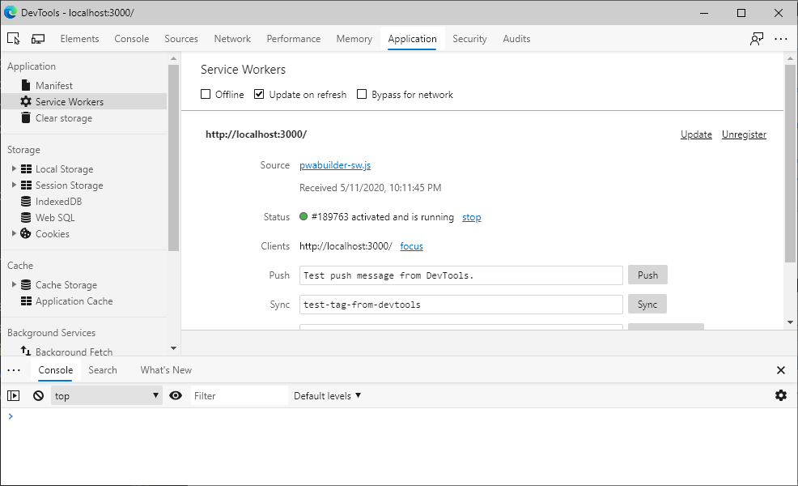
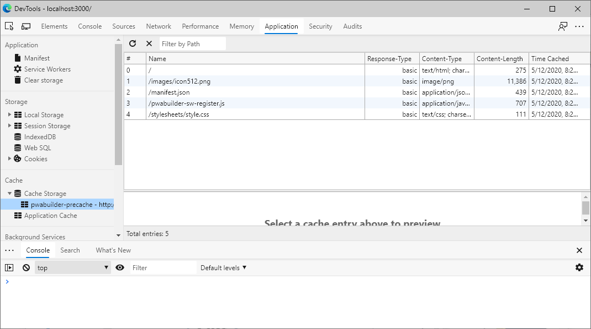
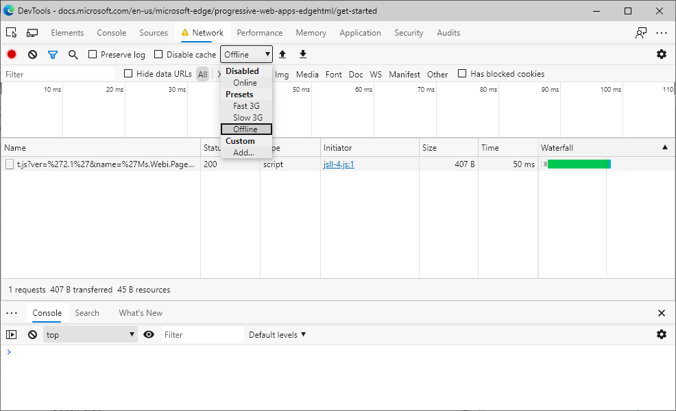

# <a name="get-started-with-progressive-web-apps"></a>渐进式 Web 应用入门

渐进式Web 应用 (PVA) 是[逐步增强的](https://en.wikipedia.org/wiki/Progressive_enhancement)网站。  渐进式增强功能包括类似应用的功能，例如安装、脱机支持和推送通知。

还可以为应用商店打包 PWA，例如 Microsoft Store、Google Play 和 Mac App Store。  Microsoft Store 是内置于Windows 10及更高版本的商业应用商店。

在此 PWA 基础知识概述中，你将创建一个简单的网站并将其扩展为 PWA。  完成的项目适用于新式浏览器。

> [!TIP]
> 可以使用 [PWABuilder](https://www.pwabuilder.com) 创建新的 PWA、增强现有的 PWA 或打包应用商店的 PWA。

<!-- link is placed here per https://github.com/MicrosoftDocs/edge-developer/issues/1974 -->
若要在 Windows 上安装或运行 PWA，请参阅在 _PWA 的用户体验_中[安装 PWA](../ux.md#installing-a-pwa)。


<!-- ====================================================================== -->
## <a name="prerequisites"></a>必备条件

*   安装[Visual Studio Code](https://code.visualstudio.com)以编辑 PWA 源代码。
*   安装 [Node.js](https://nodejs.org) 将其用作本地 Web 服务器。


<!-- ====================================================================== -->
## <a name="creating-a-basic-website"></a>创建基本网站

在此步骤中，你将创建一个简单的 HTML 页面来创建基本网站，并启动本地 Web 服务器以访问浏览器中的网站。

1. 创建在计算机上调用 `MySamplePWA` 的新目录。

1. 打开Visual Studio Code，选择 **“文件** > **打开文件夹**”，然后选择`MySamplePWA`目录以打开新项目。

1. 按下 `Ctrl+N`、添加以下内容并在项目中创建新文件，并将文件保存为 `index.html`：

   ```html
   <!DOCTYPE html>
   <html lang="en-US" dir="ltr">
     <head>
       <meta charset="UTF-8" />
       <meta name="viewport" content="width=device-width,initial-scale=1" />
       <link rel="shortcut icon" href="https://c.s-microsoft.com/favicon.ico?v2" />
       <title>My Sample PWA</title>
     </head>
     <body>
       <h1>My Sample PWA</h1>
     </body>
   </html>
   ```

1. 使用 `http-server` Node.js库启动本地 Web 服务器：

   ```shell
   cd path\to\MySamplePWA
   npx http-server
   ```
  
   在上述命令中，替换 `path\to\MySamplePWA` 为创建 `MySamplePWA` 文件夹的实际路径。

你现在有一个在本地 Web 服务器上运行的简单功能网站。

现在浏览以 `http://localhost:8080` 查看新网站。


<!-- ====================================================================== -->
## <a name="getting-started-building-a-pwa"></a>开始生成 PWA

现在，你有一个简单的网站，通过添加 PVA 的三个要求，将其扩展为渐进式 Web 应用 (PWA) ：

*  [HTTPS](#step-1---use-https)。
*  [Web 应用清单](#step-2---create-a-web-app-manifest)。
*  [服务辅助角色](#step-3---add-a-service-worker)。


<!-- ====================================================================== -->
## <a name="step-1---use-https"></a>步骤 1 - 使用 HTTPS

渐进式Web 应用平台的关键部分（如[服务辅助角色）](https://developer.mozilla.org/docs/Web/API/Service_Worker_API)需要使用 HTTPS。  当 PWA 上线时，必须将其发布到 HTTPS URL。  许多主机现在默认提供 HTTPS，但如果主机不提供 HTTPS， [让我们加密](https://letsencrypt.org/) 提供创建必要证书的免费替代方法。

例如，可以创建 [Azure 免费帐户](https://azure.microsoft.com/free)。  如果在 [Microsoft Azure 应用服务](https://azure.microsoft.com/services/app-service/web) 上托管网站，则默认情况下会通过 HTTPS 提供该网站。

还可以在支持 HTTPS 的 [GitHub Pages](https://pages.github.com/) 上托管网站。

出于调试目的，Microsoft Edge 还允许 `localhost` Web 服务器在没有 HTTPS 的情况下使用 PWA API。  在本教程中，你将使用 `http://localhost:8080` 它来生成 PWA。


<!-- ====================================================================== -->
## <a name="step-2---create-a-web-app-manifest"></a>步骤 2 - 创建 Web 应用清单

[Web 应用清单](https://developer.mozilla.org/docs/Web/Manifest)是一个 JSON 文件，其中包含有关应用的元数据，例如名称、说明、图标等。

若要向网站添加应用清单，请执行以下操作：

1.  在Visual Studio Code中，按`Ctrl`+`N`下列内容创建新文件，并将文件另存为。`manifest.json`

    ```json
    {
        "lang": "en-us",
        "name": "My Sample PWA",
        "short_name": "SamplePWA",
        "description": "A sample PWA for testing purposes",
        "start_url": "/",
        "background_color": "#2f3d58",
        "theme_color": "#2f3d58",
        "orientation": "any",
        "display": "standalone",
        "icons": [
            {
                "src": "/icon512.png",
                "sizes": "512x512"
            }
        ]
    }
    ```

1.  向项目添加 512x512 像素应用图标图像 `icon512.png` 。 可以将 [示例映像](../media/progressive-web-app.png) 用于测试目的。

1.  在Visual Studio Code中，打开`index.html`并添加标记中的`<head>`以下代码。

    ```html
    <link rel="manifest" href="/manifest.json">
    ```

   上面的代码片段将新的 Web 应用清单文件链接到您的网站。

你的 VS Code 项目现在应如下所示：


<!-- ====================================================================== -->
## <a name="step-3---add-a-service-worker"></a>步骤 3 - 添加服务辅助角色

服务工作者是 PVA 背后的关键技术。  服务工作者启用以前仅限于本机应用的方案，包括：

*  脱机支持。
*  高级缓存。
*  运行后台任务。

服务工作者是专门的 [Web 辅助角色](https://developer.mozilla.org/docs/Web/API/Web_Workers_API) ，可以截获来自 PWA 的网络请求。  即使 PWA 未运行，服务工作者也可以运行任务，包括：

*   从缓存中提供请求的资源。
*   发送推送通知。
*   运行后台提取任务。
*   损坏图标。

服务辅助角色在特殊 JavaScript 文件中定义，在 [使用服务辅助角色](https://developer.mozilla.org/docs/Web/API/Service_Worker_API/Using_Service_Workers) 和 [服务辅助角色 API](https://developer.mozilla.org/docs/Web/API/Service_Worker_API) 中进行了说明。

若要在项目中添加服务辅助角色，请执行以下操作：

1. 在 VS Code 中，创建新文件 () `Ctrl`+`N` ，添加以下内容，并将文件保存为：`sw.js`

    ```javascript
    const CACHE_NAME = `my-sample-app-cache-v1`;
    
    // Use the install event to pre-cache all initial resources.
    self.addEventListener('install', event => {
      event.waitUntil((async () => {
        const cache = await caches.open(CACHE_NAME);
        cache.addAll(['/']);
      })());
    });
    
    self.addEventListener('fetch', event => {
      event.respondWith((async () => {
        const cache = await caches.open(CACHE_NAME);
    
        try {
          // Try to fetch the resource from the network.
          const fetchResponse = await fetch(event.request);
    
          // Save the resource in the cache.
          cache.put(event.request, fetchResponse.clone());
    
          // And return it.
          return fetchResponse;
        } catch (e) {
          // Fetching didn't work get the resource from the cache.
          const cachedResponse = await cache.match(event.request);
    
          // And return it.
          return cachedResponse;
        }
      })());
    });
    ```

   该 `sw.js` 文件将充当 PWA 的服务辅助角色。 上面的代码侦听事件， `install` 并使用它将请求缓存到主页。 代码还会截获 `fetch` 每次应用向服务器发送请求时发生的事件，并应用网络优先策略。 服务辅助角色将请求中继到服务器，并缓存结果。 当网络请求失败时，将改用缓存的响应。

1.  在标记末尾`<body>`打开`index.html`并添加以下代码以注册服务器辅助角色：

    ```html
    <script>
    if('serviceWorker' in navigator) {
      navigator.serviceWorker.register('/sw.js', { scope: '/' });
    }
    </script>
    ```

若要确认服务辅助角色正在运行，请执行以下操作：

1.  转到 Web 应用 `http://localhost:8080`。

1.  在 Microsoft Edge 中，按 `F12` 下以打开 DevTools。  打开 **应用程序工具** ，然后 **打开服务辅助角色** 以查看服务辅助角色。  如果未显示服务辅助角色，请刷新页面。

    

1.  通过扩展 **缓存存储** 并选择 **my-sample-app-cache-v1** 来查看服务辅助角色缓存。  应显示服务辅助角色缓存的所有资源。  服务辅助角色缓存的资源包括应用图标、应用清单和初始页面。

    

1.  尝试将 PWA 用作脱机应用。 在 DevTools 中，打开 **网络** 工具，并将 **限制** 值更改为 **脱机**。

1.  刷新应用。 它仍应使用服务辅助角色提供的缓存资源在浏览器中正确显示。

    


<!-- ====================================================================== -->
## <a name="install-the-app"></a>安装应用

现在，简单网站具有 Web 应用清单和服务辅助角色，支持浏览器可以将其安装为 PWA。

在 Microsoft Edge 中，刷新应用后，地址栏中会显示“ **应用可用** ”按钮。 单击 **“应用可用** ”按钮会提示你在本地安装应用。


单击 **“安装** ”以在本地安装应用。 安装完成后，应用将显示在自己的窗口中，并在 Taskbar 中显示自己的应用程序图标。


若要详细了解如何安装 PVA，请 [参阅 PVA 的用户体验](../ux.md)。


<!-- ====================================================================== -->
## <a name="best-practices-and-next-steps"></a>最佳做法和后续步骤

若要构建可靠的、真实的 PWA，请考虑以下 Web 应用开发的最佳做法。

### <a name="cross-browser-compatibility"></a>跨浏览器兼容性

测试应用是否具有 [跨浏览器兼容性](https://developer.mozilla.org/docs/Learn/Tools_and_testing/Cross_browser_testing)。  通过在不同的浏览器和环境中测试 PWA，确保 PWA 正常工作。  请参阅 _Microsoft Edge 开发人员_处的[工具](https://developer.microsoft.com/microsoft-edge/tools/)。

### <a name="responsive-design"></a>响应式设计

使用流畅的布局和灵活的图像。  [响应式设计](https://en.wikipedia.org/wiki/Responsive_web_design) 包括以下将 UX 适应用户设备的元素：

*   CSS [网格](https://developer.mozilla.org/docs/Web/CSS/CSS_Grid_Layout)。
*   [Flexbox](https://developer.mozilla.org/docs/Web/CSS/CSS_Flexible_Box_Layout)。
*   [媒体查询](https://developer.mozilla.org/docs/Web/CSS/Media_Queries)。
*   [响应式图像](https://developer.mozilla.org/docs/Learn/HTML/Multimedia_and_embedding/Responsive_images)。

若要在本地测试应用，请使用浏览器中的 [设备仿真工具](../../devtools-guide-chromium/device-mode/testing-other-browsers.md) 。  若要直接在目标设备上测试应用，请在 [Windows](../../devtools-guide-chromium/remote-debugging/windows.md) 或 [Android](../../devtools-guide-chromium/remote-debugging/index.md) 上创建远程调试会话。

### <a name="support-deep-linking"></a>支持深度链接

支持 [深度链接](https://en.wikipedia.org/wiki/Deep_linking)。  将网站的每一页路由到唯一 URL，以便现有用户可以通过社交媒体共享帮助你吸引更广泛的受众。

### <a name="provide-a-rich-offline-experience"></a>提供丰富的脱机体验

提供丰富的 [脱机体验](offline.md)。  即使用户的设备处于脱机状态，应用也可正常工作。  提供自定义脱机页，而不是使用浏览器的默认脱机页。

### <a name="use-validation-and-testing-practices"></a>使用验证和测试做法

使用软件验证和测试做法。  使用 [Webhint](https://webhint.io) 等代码质量工具优化应用的效率、可靠性、安全性和辅助功能。  使用 [Playwright](https://playwright.dev/) 等自动化测试工具为应用创建可靠的端到端测试。


<!-- ====================================================================== -->
## <a name="see-also"></a>另请参阅

*   [MDN Web 文档上的渐进式Web 应用](https://developer.mozilla.org/Apps/Progressive)
*   [web.dev 上的渐进式Web 应用](https://developers.google.com/web/progressive-web-apps)
*   [黑客新闻读者作为渐进式Web 应用](https://hnpwa.com) - 比较实现示例 PWA 的不同框架和性能模式。
*   [神话破坏 PVA](https://www.davrous.com/2019/10/18/myth-busting-pwas-the-new-edge-edition)
*   [渐进式 Web 应用的渐进式路线图](https://cloudfour.com/thinks/a-progressive-roadmap-for-your-progressive-web-app)
*   [带渐进式Web 应用的脱机 POST](https://medium.com/web-on-the-edge/offline-posts-with-progressive-web-apps-fc2dc4ad895)
*   [PWA Q&A](https://www.aaron-gustafson.com/notebook/pwa-qa)
*   [在 Web 上投注](https://joreteg.com/blog/betting-on-the-web)
*   [命名渐进式Web 应用](https://fberriman.com/2017/06/26/naming-progressive-web-apps)
*   [设计和构建没有框架的渐进式 Web 应用程序 (第 1 部分) ](https://www.smashingmagazine.com/2019/07/progressive-web-application-pwa-framework-part-1)
*   [设计和构建没有框架的渐进式 Web 应用程序 (第 2 部分) ](https://www.smashingmagazine.com/2019/07/progressive-web-application-pwa-framework-part-2)
*   [设计和生成没有框架的渐进式 Web 应用程序 (第 3 部分) ](https://www.smashingmagazine.com/2019/07/progressive-web-application-pwa-framework-part-3)
