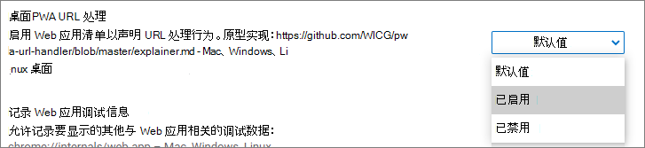

# 实验性功能和源试用版

Microsoft Edge中的一些PWA功能仍是实验性的。 可通过两种方式使用实验性功能：

*   通过在Microsoft Edge中启用相应的标志。
*   通过在源试用版中注册站点，以便与用户一起测试生产中的功能。

<!-- ====================================================================== -->
## 切换实验功能

打开或关闭实验性功能：

1.  打开 Microsoft Edge。
1.  转到 `edge://flags`。
1.  导航到相关试验。
1.  选择实验说明旁边的下拉菜单，然后选择 **“启用** 以打开功能”或“ **禁用** ”将其关闭。

    

<!-- ====================================================================== -->
## 在源试用版中注册站点

Microsoft Edge有时使用源试验来测试特定域或网站的功能。 你可能希望使用网站的源试用版来应用特定功能。 如果你是网站所有者，则可以注册源试用版。 源试用版为访问网站的Microsoft Edge用户的百分比提供功能。

有关源试用版的详细信息，请参阅[Microsoft Edge源试用版开发人员控制台](https://developer.microsoft.com/microsoft-edge/origin-trials)。

<!-- ====================================================================== -->
## 可用于测试的功能

以下列表介绍可用于在Microsoft Edge上测试和验证的实验性 Web 应用功能。 若要启用它们，请转到 [切换实验功能](#toggle-experimental-features)。

| 功能 | 平台 |
|:--- |:--- |
| [URI 协议处理](handle-protocols.md) | Windows和 Linux |
| [URL 链接处理](handle-urls.md) | Windows |
| [桌面应用的窗口控件覆盖](window-controls-overlay.md) | 全部 |
| [文件处理](handle-files.md) | 所有桌面 |

<!-- Links -->
