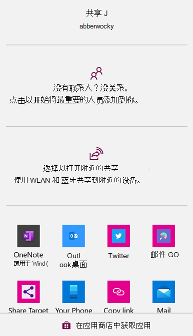
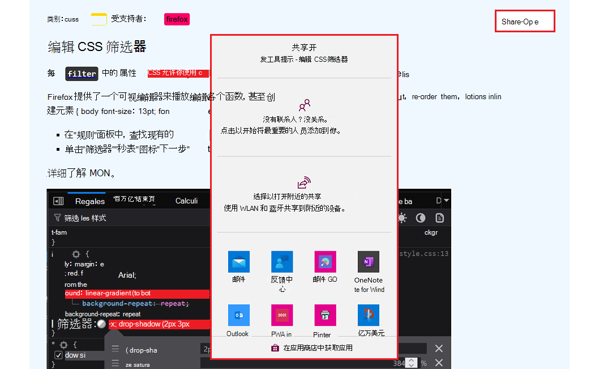

# <a name="share-content-with-other-apps"></a>与其他应用共享内容

在应用之间共享内容受到移动设备的欢迎，其中操作文件或复制内容的直观性不如桌面操作系统。  例如，在移动设备上，通常通过发送短信与朋友共享图像。  但是，共享内容并不保留给移动设备;也可以在Windows上的应用之间共享。

共享内容有两个方向，两个方向均可由渐进式Web 应用 (PVA) 处理：

| Direction | 描述 |
|---|---|
| 共享内容 | 若要共享内容，PWA生成内容 (（如文本、链接或文件）) 并将共享内容交给操作系统。  通过操作系统，用户可以决定要使用哪个应用来接收该内容。 |
| 接收共享内容 | 若要接收内容，PWA充当内容目标。  PWA在操作系统中注册为内容共享目标。 |

注册为共享目标的 PVA 本机集成到 OS 中，并且对用户更具吸引力。


<!-- ====================================================================== -->
## <a name="sharing-content"></a>共享内容

PVA 可以使用 [Web 共享 API](https://developer.mozilla.org/docs/Web/API/Web_Share_API) 触发显示操作系统共享对话框。

> [!NOTE]
> Web 共享仅适用于通过 HTTPS 服务的站点 (这是 PVA) 的情况，并且只能在响应用户操作时调用。

若要共享链接、文本或文件等内容，请使用此 `navigator.share` 函数，如下所示。  该 `navigator.share` 函数接受至少应具有以下属性之一的对象：

*   `title`：共享内容的简短标题。
*   `text`：共享内容的更长说明。
*   `url`：要共享的资源的地址。
*   `files`：要共享的文件数组。

```javascript
function shareSomeContent(title, text, url) {
  if (!navigator.share) {
    return;
  }

  navigator.share({title, text, url}).then(() => {
    console.log('The content was shared successfully');
  }).catch(error => {
    console.error('Error sharing the content', error);
  });
}
```

在上面的代码中，我们首先通过测试是否 `navigator.share` 定义浏览器来检查浏览器是否支持 Web 共享。  该 `navigator.share` 函数返回一个 [Promise](https://developer.mozilla.org/docs/Web/JavaScript/Reference/Global_Objects/Promise) 对象，该对象在共享成功时解析，并在发生错误时拒绝。

由于此处使用了 Promise，因此可将上述代码重写为函 `async` 数，如下所示：

```javascript
async function shareSomeContent(title, text, url) {
  if (!navigator.share) {
    return;
  }

  try {
    await navigator.share({title, text, url});
    console.log('The content was shared successfully');
  } catch (e) {
    console.error('Error sharing the content', e);
  }
}
```

Windows时，上述代码将触发共享对话框，允许用户选取应用以接收共享内容。  共享对话框如下所示：



用户选择一个应用以接收共享内容后，由此应用以它选择的任何方式处理它。  例如，电子邮件应用可能使用 `title` 电子邮件主题，并使用电子邮件 `text` 正文。


### <a name="sharing-files"></a>共享文件

该 `navigator.share` 函数还接受一个 `files` 数组，以与其他应用共享文件。

在共享文件之前，请务必测试浏览器是否支持共享文件。 若要检查是否支持共享文件，请使用该 `navigator.canShare` 函数：

```javascript
function shareSomeFiles(files) {
  if (navigator.canShare && navigator.canShare({files})) {
    console.log('Sharing files is supported');
  } else {
    console.error('Sharing files is not supported');
  }
}
```

共享 `files` 对象成员必须是对象数组 `File` 。 详细了解 [文件接口](https://developer.mozilla.org/docs/Web/API/File)。

构造 `File` 对象的一种方法是：
1. 首先，使用 `fetch` API 请求资源。
1. 然后，使用返回的响应创建新的 `File`响应。

此方法如下所示。

```javascript
async function getImageFileFromURL(imageURL, title) {
  const response = await fetch(imageURL);
  const blob = await response.blob();
  return new File([blob], title, {type: blob.type});
}
```

在上面的代码中：
1. 该 `getImageFileFromURL` 函数使用 URL 提取图像。
1. 该 `response.blob()` 函数将映像转换为 BLOB)  (二进制大型对象。
1. 代码使用 BLOB 创建 `File` 对象。


### <a name="demo-of-sharing-content"></a>共享内容的演示

[DevTools 使用技巧](https://devtoolstips.org/)是使用函数共享文本和链接的`navigator.share`PWA。

若要测试此功能，请执行以下操作：

1. 转到 [DevTools 使用技巧](https://devtoolstips.org/)。
2. 选择提示。
3. 单击 **“共享提示**”。

将显示“Windows**共享**”对话框。  用户选择要在其中共享内容的应用：



可以在[GitHub上找到源代码](https://github.com/captainbrosset/devtools-tips/)。  应用在 [share.js](https://github.com/captainbrosset/devtools-tips/blob/main/src/assets/share.js#L38) 源文件中使用 Web 共享 API。


<!-- ====================================================================== -->
## <a name="receiving-shared-content"></a>接收共享内容

通过使用 [Web 共享目标](https://w3c.github.io/web-share-target/level-2/) API，PWA可注册为在系统共享对话框中显示为应用。  然后，PWA可以使用 Web 共享目标 API 来处理来自其他应用的共享内容。

> [!NOTE]
> 只有已安装的 PVA 才能注册为共享目标。

### <a name="register-as-a-target"></a>注册为目标

若要接收共享内容，首先要将PWA注册为共享目标。  若要注册，请使用 `share_target` 清单成员。  安装应用后，操作系统使用该 `share_target` 成员将应用包含在系统共享对话框中。  操作系统知道当用户选取应用以共享内容时该怎么办。

该 `share_target` 成员必须包含系统将共享内容传递到应用所需的信息。  请考虑以下清单代码：

```json
{
    "share_target": {
        "action": "/handle-shared-content/",
        "method": "GET",
        "params": {
            "title": "title",
            "text": "text",
            "url": "url",
        }
    }
}
```

当用户选择应用作为共享内容的目标时，将启动PWA。  向 `GET` 属性指定 `action` 的 URL 发出 HTTP 请求。  共享数据作为`title``text``url`查询参数传递。  发出以下请求： `/handle-shared-content/?title=shared title&text=shared text&url=shared url`.

如果现有代码使用其他查询参数名称，则可以将默认`title``text`值和`url`查询参数映射到其他名称。  在以下示例中`title``text``url`，将映射到`subject``body`查询参数和查询参数，`address`

```json
{
    "share_target": {
        "action": "/handle-shared-content/",
        "method": "GET",
        "params": {
            "title": "subject",
            "text": "body",
            "url": "address",
        }
    }
}
```

### <a name="handle-get-shared-data"></a>处理 GET 共享数据

若要处理PWA代码中通过 GET 请求共享的数据，请使用`URL`构造函数提取查询参数：

```javascript
window.addEventListener('DOMContentLoaded', () => {
    console url = new URL(window.location);

    const sharedTitle = url.searchParams.get('title');
    const sharedText = url.searchParams.get('text');
    const sharedUrl = url.searchParams.get('url');
});
```

### <a name="handle-post-shared-data"></a>处理 POST 共享数据

如果共享数据旨在以任何方式更改应用，例如通过更新存储在应用中的某些内容，则必须使用该 `POST` 方法并使用以下内容定义编码类型 `enctype`：

```json
{
    "share_target": {
        "action": "/post-shared-content",
        "method": "POST",
        "enctype": "multipart/form-data",
        "params": {
            "title": "title",
            "text": "text",
            "url": "url",
        }
    }
}
```

The `POST` HTTP request contains the shared data, encoded as `multipart/form-data`.  可以使用服务器端代码在 HTTP 服务器上访问此数据，但在用户脱机时，此操作将不起作用。  若要提供更好的体验，可以使用 `fetch` 事件侦听器访问服务辅助角色中的数据，如下所示：

```javascript
self.addEventListener('fetch', event => {
    const url = new URL(event.request.url);

    if (event.request.method === 'POST' && url.pathname === '/post-shared-content') {
        event.respondWith((async () => {
            const data = await event.request.formData();

            const title = data.get('title');
            const text = data.get('text');
            const url = data.get('url');

            // Do something with the shared data here.

            return Response.redirect('/content-shared-success', 303);
        })());
    }
});
```

在上面的代码中：

1. 服务辅助角色截获请求 `POST` 。

1. 以某种方式使用数据 (，例如在本地) 存储内容。

1. 将用户重定向到成功页面。  这样，即使网络关闭，应用也能正常工作。  当连接还原 (（例如使用 [后台同步](background-syncs.md)) ）时，应用可以选择仅在本地存储内容，也可以稍后将内容发送到服务器。

### <a name="handle-shared-files"></a>处理共享文件

应用还可以处理共享文件。 若要处理PWA中的文件，必须使用`POST`该方法和`multipart/form-data`编码类型。 此外，必须声明应用可以处理的文件类型。

```json
{
    "share_target": {
        "action": "/store-code-snippet",
        "method": "POST",
        "enctype": "multipart/form-data",
        "params": {
            "title": "title",
            "files": [
                {
                    "name": "textFile",
                    "accept": ["text/plain", "text/html", "text/css", 
                               "text/javascript"]
                }
            ]
        }
    }
}
```

上面的清单代码告诉系统，你的应用可以接受具有各种 MIME 类型的文本文件。  文件扩展名（例如 `.txt`）也可以在数组中 `accept` 传递。

若要访问共享文件，请像以前一样使用请求 `formData` 并使用 a `FileReader` 读取内容，如下所示：

```javascript
self.addEventListener('fetch', event => {
    const url = new URL(event.request.url);

    if (event.request.method === 'POST' && url.pathname === '/store-code-snippet') {
        event.respondWith((async () => {
            const data = await event.request.formData();

            const filename = data.get('title');
            const file = data.get('textFile');

            const reader = new FileReader();
            reader.onload = function(e) {
                const textContent = e.target.result;

                // Do something with the textContent here.

            };
            reader.readAsText(file);

            return Response.redirect('/snippet-stored-success', 303);
        })());
    }
});
```


<!-- ====================================================================== -->
## <a name="see-also"></a>另请参阅

*  [与 OS 共享 UI 与 Web 共享 API 集成](https://web.dev/web-share/)
*  [使用 Web 共享目标 API 接收共享数据](https://web.dev/web-share-target/)
