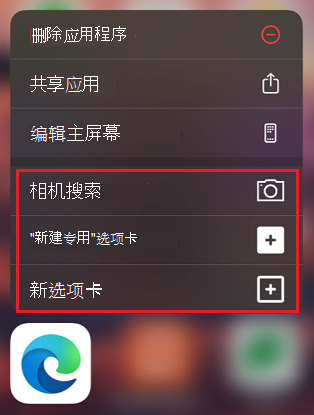
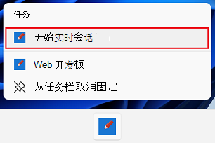

# <a name="define-app-shortcuts"></a>定义应用快捷方式

应用快捷方式使用户能够更快、更轻松地完成常见任务，并可以提升他们对应用的参与度。

在移动设备上，快捷方式通常可以通过长按应用图标来访问。  在Windows，快捷方式作为 Jumplist 集成。  Jumplists 定义在右键单击磁贴或右键单击任务栏中的"开始"菜单时出现的弹出菜单。

下图显示了 iOS 上Microsoft Edge快捷方式：



下图显示了 Webboard 应用上的 Jumplist，位于Windows：



渐进式 Web (PBA) 还可以在 Web 应用清单中将常见任务定义为 [快捷方式](web-app-manifests.md)。


<!-- ====================================================================== -->
## <a name="define-shortcuts"></a>定义快捷方式

使用清单成员定义 `shortcuts` 快捷方式。  此成员是一个可以包含多个快捷方式的数组。  每个快捷方式实质上都是在使用快捷方式和启动应用时请求的 URL。

```json
{
    "shortcuts" : [
        {
            "name": "Today's agenda",
            "url": "/today",
            "description": "List of events planned for today"
        },
        {
            "name": "New event",
            "url": "/create/event"
        },
        {
            "name": "New reminder",
            "url": "/create/reminder"
        }
    ]
}
```

可以使用下列属性：

| 属性 | 详细信息 |
|---|---|
| `name` | 在跳转列表或上下文 **菜单上向** 用户显示的字符串。 |
| `short_name` | 当空间不足，无法显示快捷方式的完整名称时显示的字符串。 |
| `description` | 一个描述快捷方式用途的字符串。  该字符串可通过辅助技术访问。 |
| `url` | 激活快捷方式时打开的 Web 应用中的 URI。 |
| `icons` | 一组表示快捷方式的图标。 |

若要了解 [更多信息，请参阅](https://developer.mozilla.org/docs/Web/Manifest/shortcuts) MDN 的快捷方式。


<!-- ====================================================================== -->
## <a name="debug-shortcuts"></a>调试快捷方式

通过使用 DevTools 的应用程序面板，可以测试快捷方式是否正确配置。****

若要测试是否正确配置了快捷方式：

1. 在Microsoft Edge中，转到你的应用。

1. 若要打开 DevTools，请右键单击该网页，然后选择"检查 **"**。  或者，按 `Ctrl`++`Shift``I` (Windows、Linux) 或 (`I` `Command`+`Option`+macOS) 。  将打开 DevTools。

1. 在 DevTools 中，在主工具栏上，选择"**应用程序"** 选项卡。 如果该选项卡不可见，请单击"更多选项卡" (**** 更多选项卡"图标](../../devtools-guide-chromium/media/more-tabs-icon-light-theme.png)。****) 按钮 ![

1. 在" **应用程序"** 工具中，选择" **清单"**。

1. 向下滚动以显示快捷方式列表。

   > [!div class="mx-imgBorder"]
   > 

若要了解有关使用应用程序面板调试 PWA 的信息，请参阅 Debug [Progressive Web Apps (PWA) ](../../devtools-guide-chromium/progressive-web-apps/index.md)。
