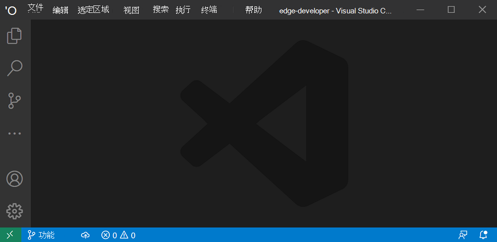

# <a name="display-content-in-the-title-bar"></a>在标题栏中显示内容

PWA 可以使用 Web 应用清单文件中的 [显示](https://developer.mozilla.org/docs/Web/Manifest/display) 成员定义应如何在移动平台上显示它。  但是，若要创建沉浸式本机式体验， _桌面_ PVA 可以使用另一种方法。

默认情况下，桌面上安装的 PWA 可以在保留标题栏区域下方立即开始的区域中显示内容：


显示标题栏通常位于其中的内容可帮助 PVA 感觉更本机。  许多桌面应用程序（如 Visual Studio Code、Microsoft Teams 和 Microsoft Edge）都已执行此操作：



窗口控件覆盖 API 执行以下操作：
*  允许在应用的整个外围显示 Web 内容。
*  将关键系统所需的窗口控件移动到覆盖层中。
*  使内容能够远离此覆盖。


<!-- ====================================================================== -->
## <a name="enable-the-window-controls-overlay-in-your-app"></a>在应用中启用窗口控件覆盖

首先要在应用的 [Web 应用清单文件](web-app-manifests.md)中启用窗口控件覆盖功能。  为此，请在清单文件中设置 `display_override` 属性：

```json
{
  "display_override": ["window-controls-overlay"]
}
```


<!-- ====================================================================== -->
## <a name="toggle-the-title-bar"></a>切换标题栏

启用窗口控件覆盖功能后，用户可以通过单击标题栏切换按钮来选择标题栏：


代码不能假定显示窗口控件覆盖，因为：
*  用户可以选择是否显示标题栏。
*  你的应用还可以在 Web 浏览器或移动设备上运行，也可以作为桌面应用运行。

因此，代码需要对标题栏几何图形更改做出反应。  若要了解详细信息，请参阅[React覆盖更改](#react-to-overlay-changes)。


<!-- ====================================================================== -->
## <a name="use-css-environment-variables-to-stay-clear-of-the-overlay"></a>使用 CSS 环境变量远离覆盖层

[`env()`](https://developer.mozilla.org/docs/Web/CSS/env) CSS 函数可用于访问用户代理定义的环境变量。

窗口控件覆盖功能添加了四个环境变量：

| 变量 | 说明 |
|:--- |:---
| `titlebar-area-x` | 从窗口左侧标题栏通常占用的区域的距离（以 `px`内） |
| `titlebar-area-y` | 从窗口顶部的标题栏通常占用的区域的距离（以 `px`内） |
| `titlebar-area-width` | 标题栏区域的宽度，在 `px` |
| `titlebar-area-height` | 标题栏区域的高度，在 `px` |

当禁用窗口控件覆盖功能时，可以使用这些环境变量来定位和调整游戏栏通常显示的内容的大小：

```css
#title-bar {
  position: fixed;
  left: env(titlebar-area-x, 0);
  top: env(titlebar-area-y, 0);
  height: env(titlebar-area-height, 50px);
  width: env(titlebar-area-width, 100%);
}
```

使用 `position: fixed;` 可确保标题栏不会随内容的其余部分一起滚动，而是与窗口控件覆盖保持一致。

了解覆盖位置以及覆盖层有多大非常重要。  覆盖层可能并不总是位于窗口的同一侧;在 macOS 上，覆盖位于左侧，但在 Windows 上，覆盖位于右侧。  此外，覆盖层可能并不总是相同的大小。

`env()` CSS 函数采用第二个参数，用于在窗口控件覆盖功能缺失或禁用时定义应用内容的位置。


<!-- ====================================================================== -->
## <a name="make-regions-of-your-app-drag-handlers-for-the-window"></a>为窗口创建应用拖动处理程序的区域

隐藏标题栏时，只有系统关键窗口控件在最大 **化**、 **最小化**、 **关闭**和 **应用信息** 图标)  (保持可见。  这意味着用户几乎没有空间可以移动应用程序窗口。

可以使用 `-webkit-app-region` CSS 属性为用户提供更多拖动应用的方法。  例如，如果你的应用有自己的标题栏，则可以将其标题栏转换为窗口拖动处理程序：

```css
#title-bar {
  position: fixed;
  left: env(titlebar-area-x, 0);
  top: env(titlebar-area-y, 0);
  height: env(titlebar-area-height, 50px);
  width: env(titlebar-area-width, 100%);
  -webkit-app-region: drag;
}
```


<!-- ====================================================================== -->
## <a name="react-to-overlay-changes"></a>覆盖更改的React

用户可以在应用运行时切换标题栏或更改窗口维度。  了解这些事情何时发生对你的应用来说可能很重要。  你的应用可能需要重新排列标题栏中显示的某些内容，或重新排列页面上其他位置的布局。

若要侦听更改，请在对象上`navigator.windowControlsOverlay`使用`geometrychange`该事件。  若要检测标题栏是否可见，请使用 `visible` 对象上的 `navigator.windowControlsOverlay` 属性。

请注意， `geometrychange` 当用户调整窗口大小时，触发频率非常高。  为了避免过于频繁地运行更改布局的代码并在应用中造成性能问题，请使用函 `debounce` 数限制事件的处理次数。  请参阅 [限制和取消限制之间的区别](https://css-tricks.com/the-difference-between-throttling-and-debouncing/)。

```javascript
const debounce = (func, wait) => {
  let timeout;
  return function executedFunction(...args) {
    const later = () => {
      clearTimeout(timeout);
      func(...args);
    };
    clearTimeout(timeout);
    timeout = setTimeout(later, wait);
  };
};

if ('windowControlsOverlay' in navigator) {
  navigator.windowControlsOverlay.addEventListener('geometrychange', debounce(e => {
    // Detect if the Window Controls Overlay is visible.
    const isOverlayVisible = navigator.windowControlsOverlay.visible;

    // Get the size and position of the title bar area.
    const titleBarRect = e.titlebarAreaRect;

    console.log(`The overlay is ${isOverlayVisible ? 'visible' : 'hidden'}, the title bar width is ${titleBarRect.width}px`);
  }, 200));
}
```


<!-- ====================================================================== -->
## <a name="demo-app"></a>演示应用

1DIV 是使用窗口控件覆盖功能的 PWA 演示应用。

1. 在 Microsoft Edge 中，转到 [1DIV](https://microsoftedge.github.io/Demos/1DIV/dist/) 并安装应用。

1. 单击应用 **标题栏中的“隐藏标题栏** ”。

   应用现在一直显示内容到窗口框架的顶部，其中的标题栏曾经是。  应用的顶部区域是一个拖动处理程序，允许用户移动窗口。

   

此演示应用的源代码位于 [1DIV](https://github.com/MicrosoftEdge/Demos/tree/main/1DIV) 存储库中。

* [manifest.json](https://github.com/MicrosoftEdge/Demos/blob/main/1DIV/dist/manifest.json) 源文件声明应用使用窗口控件覆盖功能。

* [app.js](https://github.com/MicrosoftEdge/Demos/blob/main/1DIV/src/app.js)源文件使用该`navigator.windowControlsOverlay`对象。

* [app.css](https://github.com/MicrosoftEdge/Demos/blob/main/1DIV/dist/app.css) 源文件使用 `titlebar-area-*` CSS 环境变量。


<!-- ====================================================================== -->
## <a name="see-also"></a>另请参阅

*   [窗口控件覆盖视频教程](https://www.youtube.com/watch?v=NvClp35dFVI)
*   [自定义 PWA 标题栏的窗口控件覆盖](https://web.dev/window-controls-overlay/)
*   [打破框框](https://alistapart.com/article/breaking-out-of-the-box/)
