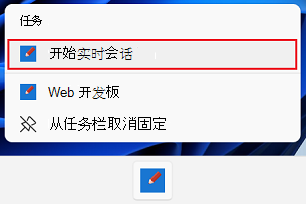
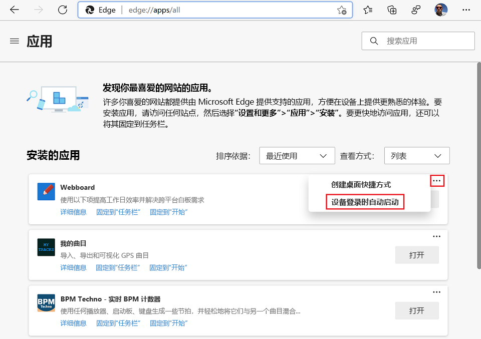
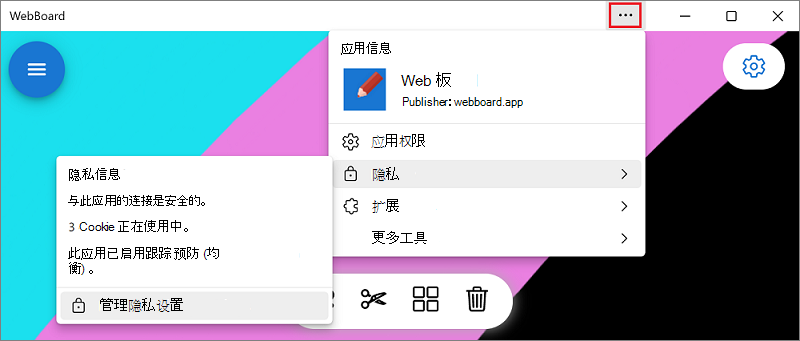

# PWA 的用户体验

Windows，渐进式Web 应用 (PVA) 与其他应用一样。  运行Microsoft Edge的任何设备都可以完全访问渐进式Web 应用的技术和特征。

<!-- ====================================================================== -->
## 安装PWA

当Microsoft Edge确定网站是可安装的渐进式 Web 应用 (PWA) 时，**可用的应用** (地址栏中将显示) 图标。

1.  单击 **“可用应用**”图标](media/app-available-icon.png) (

<!-- ====================================================================== -->
## 管理 PVA

若要在Microsoft Edge中查找已安装的渐进式Web 应用 (PVA) 列表，请转到 `edge://apps`。  在此页面上，可以通过单击“ **打开**”打开任何应用。  若要详细了解应用或卸载它，请单击 **“详细信息**”。

还可以像其他Windows应用一样，在**应用&功能**系统设置中管理 PVA。

1.  在Windows中，选择 **"开始"菜单** > **设置**。
1.  在“ **查找设置** 搜索”字段中键入“应用”，然后选择 **“添加或删除程序**”。
1.  在应用列表中查找要管理的PWA，然后选择它以查找更多信息或将其删除。

<!-- ====================================================================== -->
## Windows 集成

渐进式Web 应用 (PVA) 显示为Windows上的本机应用。 它们显示在任务栏 (中，可以在其中固定) 、"开始"菜单或在应用`Alt`+`Tab`之间切换时。

PVA 和本机应用可以并排驻留在任务栏中， (此处用红色框指示 PVA) ：

使用 (PVA 在窗口 `Alt`+`Tab` 之间切换时，会显示 PVA 和本机应用，此处用红色框) ：

PVA 还可以将常见任务作为应用右键单击菜单中显示的快捷方式向用户公开：

详细了解 [如何定义快捷方式](how-to/shortcuts.md)。

PVA 还可以在操作系统自己的通知服务中显示通知。 这可帮助用户重新参与你的应用。 详细了解 [如何使用通知、推送消息和徽章](how-to/notifications-badges.md)。

### 用户登录时启动 PVA

Windows上的 PVA 可以在用户登录时自动启动，以便他们可以立即与应用互动。

若要将已安装的PWA设置为在登录到Windows时自动启动：

1.  打开 Microsoft Edge。
1.  转到 `edge://apps`。  “ **应用** ”页列出已安装的应用。
1.  在要配置的应用上，单击“ **更多选项** ” () 按钮，然后 **在设备登录时选择“自动启动**”。

在安装PWA期间，用户还有机会设置自动启动的PWA。

若要将PWA设置为在登录到Windows时自动启动，同时安装PWA：

1.  在安装应用期间，在帖子安装对话框中，在**设备登录时选择“自动启动**”：

<!-- ====================================================================== -->
## 应用信息菜单

当用户在渐进式Web 应用 (PWA) 的标题栏中选择省略号 (**...**) 按钮时，将显示 **“应用信息**”菜单：

**“应用信息**”菜单包含有关应用的有用信息，例如：

*  应用图标、名称和发布者。
*  已授予的各种应用权限。
*  隐私信息，例如使用的 Cookie 数。
*  可在应用中使用的扩展和工具列表。
