# 渐进式 Web 应用中的新增功能

此页列出了从Microsoft Edge Web 应用团队) 和Web 应用的渐进式Web 应用 (PVA 的更新。  若要尝试新功能，请阅读这些公告。  若要随时了解最新和最出色的功能，请 (Beta、Dev 和 Canary) 下载[Microsoft Edge预览频道](https://www.microsoftedgeinsider.com/download)。

<!-- ====================================================================== -->
## Microsoft Edge 100 中的新增功能

Microsoft Edge Dev和金丝雀频道于 2022 年 2 月 9 日移至版本 100。  在此里程碑中，我们将测试以下新的 Web 应用功能。  我们预计这些新功能会在测试期后推出到“稳定”。

### 应用同步

支持收藏夹、设置、历史记录等功能的同步服务已展开，包括已安装的 Web 应用（即作为应用安装的 PVA 和网站）。  登录到配置文件并选择进行同步时，同步服务会正常工作。

随着我们在未来几周内测试并逐步发布此功能，选择同步的用户将开始在页面中`edge://apps`看到 **“你的可用应用**”部分和重新设计的 **“应用**”菜单。

### “ _可用应用_ ”部分

“**可用应用**”部分将显示你在其他设备上安装的任何应用，这些应用具有相同的登录配置文件，当前未安装在所使用的Microsoft Edge实例中。  可用应用将显示在其自己的部分，其中带有灰色图标。  单击应用上的 **“安装** ”按钮以在该设备上安装应用：

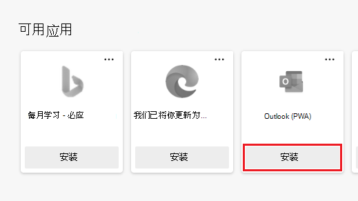

在此阶段，应用同步仅在桌面设备上可用。  若要使应用在设备之间保持同步，在一台设备上添加应用会将其添加到其他设备上的 **“可用应用** ”部分。  在一台设备上卸载应用会将其从其他设备中删除。

### 重新设计的“应用”菜单

在Microsoft Edge中，正在重新设计**设置和更多**菜单中的 **Apps** 命令：
*  可以将 **“应用** ”菜单图标添加到工具栏，以便快速访问。
*  弹出菜单可以固定为边栏，以显示 Web 内容旁边的应用。
*  添加了可自定义视图和排序选项，以及“ **我的可用应用** ”部分以支持应用同步功能。

用户可以在工具栏上显示 **“应用** ”菜单图标，以便快速访问：

> [!div class="mx-imgBorder"]
> 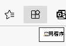

用户可以将 **“应用”** 菜单固定为边栏：

> [!div class="mx-imgBorder"]
> 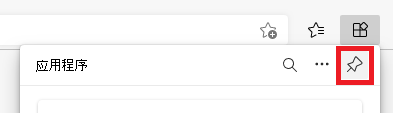

用户可以在列表或网格视图之间进行选择：

> [!div class="mx-imgBorder"]
> 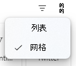

用户可以选择其应用的排序顺序：

> [!div class="mx-imgBorder"]
> 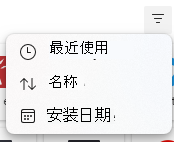

<!-- ====================================================================== -->
## 97 Microsoft Edge新增功能

Microsoft Edge版本 96 计划于 2021 年 11 月 18 日成为稳定版。  Microsoft Edge版本 97 将在该日期之后从 Dev 移动到 Beta 预览频道。

### Microsoft Store注册为 URL 处理程序的应用隐藏自定义选项卡 UI 

当从PWA的域重定向到具有不同顶级域的匹配域 (TLD) 时，参与 [URL 处理程序源试](#url-handlers-origin-trial)用的Microsoft Store安装的 PVA 将不再显示 Chrome 自定义选项卡 (CCT) 。 这种重定向通常发生在具有特定于区域设置的域的应用中;例如，从加拿大的用户重定`contoso.com`向。`contoso.ca`

<!-- ====================================================================== -->
## 96 Microsoft Edge新增功能

### URL 协议处理程序移动到稳定

原点审判已经结束。  URL 协议处理程序功能现在以 Microsoft Edge 96 Stable 提供。

另请参阅：
*  [协议处理程序源试用](#protocol-handlers-origin-trial)
*  [处理渐进式Web 应用中的协议](../how-to/handle-protocols.md)
*  [PVA 的 URL 协议处理程序注册](https://web.dev/url-protocol-handler/)

### 用于管理已安装 Web 应用的新中心设计

Microsoft Edge Canary 于 2021 年 10 月 5 日达到版本 96。  我们使用部分用户来测试新设计，以便更好地管理已安装的 Web 应用。  当你在浏览器中转到 `edge://apps` 时，它现在会显示一个重新设计的中心，该中心将已安装的 PVA 和网站列为应用。

#### 排序顺序

可以按以下任一方式对应用进行排序：
*  最近使用。
*  按标题按字母顺序排列。
*  安装日期。

#### 列表视图或网格视图

可以使用 **视图作为** 下拉列表在列表或网格视图中排列应用。  在此图像中，选择了 **“网格** ”视图：

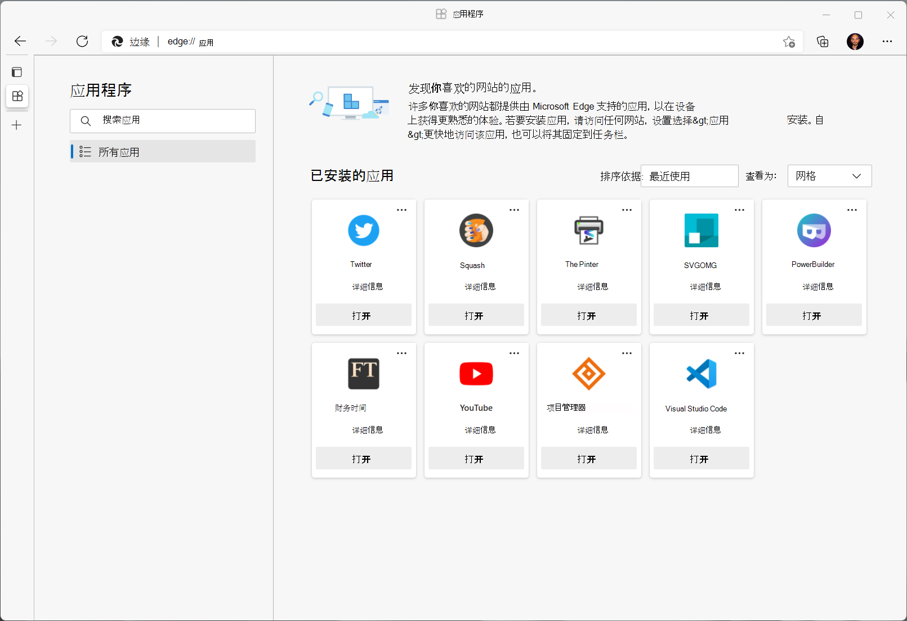

_若要缩放：右键单击>在新选项卡中打开图像。_

#### 固定应用、创建应用快捷方式、在登录时运行应用

可以轻松地将应用固定到任务栏或 **"开始"菜单**菜单。  可以创建快捷方式，并允许应用在用户登录时运行。

#### 应用详细信息页

现在有一个应用详细信息页，它提供了轻松访问以下内容的方法：
*  关联来源的权限和隐私详细信息。
*  有关应用程序的更多详细信息。

应用详细信息页：

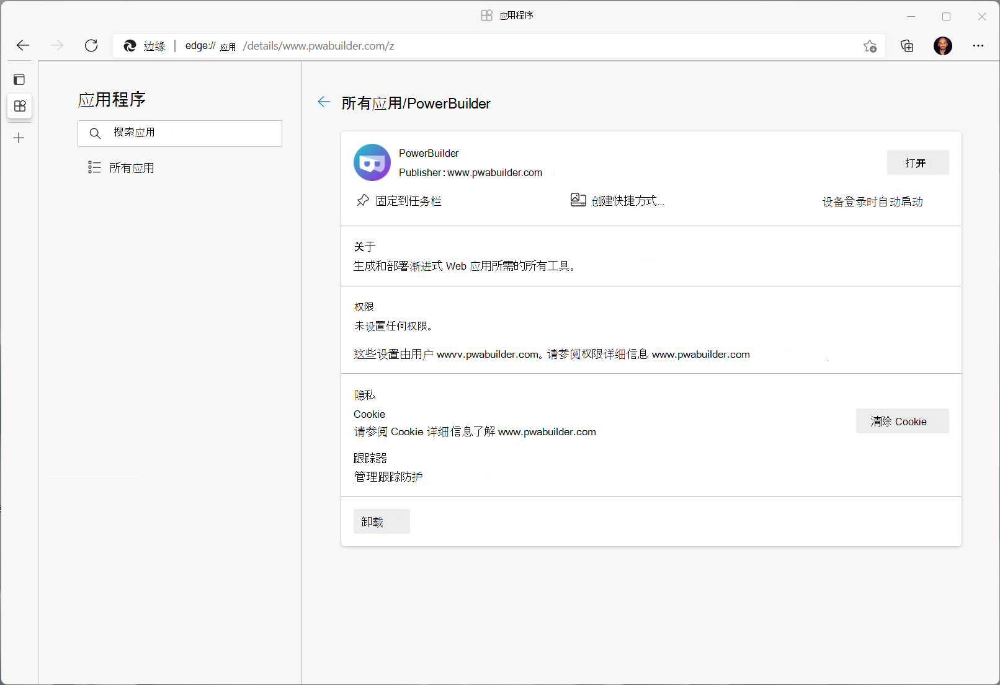

<!-- ====================================================================== -->
## 95 Microsoft Edge新增功能

Microsoft Edge版本 95 于 2021 年 9 月 28 日移至 Beta 频道。  源试验对于以下功能仍保持活动状态：
*  [桌面 PVA 的窗口控件覆盖](#window-controls-overlay-origin-trials)。
*  [URL 处理程序](#url-handlers-origin-trial)。

我们预计 [协议处理程序源试用](#protocol-handlers-origin-trial) 会在 2021 年 10 月 21 日结束。

<!-- ====================================================================== -->
## 94 Microsoft Edge新增功能

Microsoft Edge版本 94 于 2021 年 9 月 23 日移至稳定版。 此发布周期很短 - 只是<!-- em dash --> 从 Microsoft Edge 93 稳定到 Microsoft Edge 94 稳定 3 周， 因为我们抢购到新的 [4 周发布周期](https://blogs.windows.com/msedgedev/2021/03/12/new-release-cycles-microsoft-edge-extended-stable/)。  此新发布节奏与Chromium里程碑的新节奏相匹配，在[加速 Chrome 的发布周期](https://blog.chromium.org/2021/03/speeding-up-release-cycle.html)中进行了介绍。

由于Microsoft Edge版本 94 的发布周期缩短，我们专注于稳定发布周期物流，并将功能开发转移到Microsoft Edge版本 95。

源试验对于以下功能仍保持活动状态：
*  [桌面 PVA 的窗口控件覆盖](#window-controls-overlay-origin-trials)。
*  [URL 处理程序](#url-handlers-origin-trial)。

我们预计[协议处理程序源试用](#protocol-handlers-origin-trial)以Microsoft Edge版本 94 结束，因为我们接受最终反馈并准备好将协议处理程序功能移动到稳定。  如果你已注册协议处理程序的源试用版，我们计划在Microsoft Edge版本 94 后结束试用期。  然后，我们将确定此功能何时变为稳定。

<!-- ====================================================================== -->
## 93 Microsoft Edge新增功能

Microsoft Edge版本 93 于 2021 年 9 月 2 日成为Microsoft Edge的稳定频道。 本文列出了从开发人员和使用者角度) 对渐进式Web 应用 (PVA 进行的更新。

### 度量已安装Microsoft Store PWA的使用情况

Microsoft Edge现在包含一个引用器标头，其中包含Microsoft Store安装PWA的第一个导航请求。

此功能首次在版本 91 中引入Microsoft Edge，我们在版本 93 中提供了 bug 修复Microsoft Edge。

在[将渐进式 Web 应用发布到Microsoft Store中](../how-to/microsoft-store.md#measure-usage-of-your-pwa-installed-from-the-microsoft-store)了解详细信息。

### 窗口控件覆盖源试验

若要更好地控制当前在独立显示模式下显示的标题栏区域，可能需要尝试使用窗口控件覆盖。 窗口控件覆盖 (WCO) 是一组功能，可协同工作，仅提供应用窗口所需的基本控件。 此布局为 Web 内容层释放了更多空间。 WCO 可用于已安装的桌面 PVA。

详细了解如何在[渐进式Web 应用 (PVA) 中试验实验功能的](../how-to/window-controls-overlay.md)窗口控件覆盖。

在我们的[源试用版开发人员控制台](https://developer.microsoft.com/en-us/microsoft-edge/origin-trials/web-app-window-controls-overlay/registration/)上注册 **Web 应用窗口控件覆盖**试用版的源。<!-- temp keep /en-us, delete it later when omitting it ends up at right url -->

### URL 处理程序源试用

开发人员现在可以在源试用版中使用实验性功能 Web 应用 URL 处理程序。 此功能允许注册已安装的PWA以打开引用其作用域的其他应用的链接。

详细了解如何在[渐进式Web 应用 (PVA) 的实验功能中](../how-to/handle-urls.md)试验 URL 处理程序。

在[源试用版开发人员控制台](https://developer.microsoft.com/en-us/microsoft-edge/origin-trials/web-app-url-handlers/registration/)中注册 **Web 应用 URL 处理程序**试用版的域。<!-- temp keep /en-us, delete it later when omitting it ends up at right url -->

### 支持macOS上的共享 API

我们已实现对 `navigator.share` macOS API 的支持。 该功能将在未来几周内在macOS上向稳定Microsoft Edge浏览器推出。

详细了解 [navigator.share () API](https://developer.mozilla.org/docs/Web/API/Navigator/share)。

<!-- ====================================================================== -->
## 92 Microsoft Edge新增功能

2021年7月22日，Microsoft Edge版本92成为Microsoft Edge的稳定通道。 本文列出了从开发人员和使用者角度) 对渐进式Web 应用 (PVA 进行的更新。

### 协议处理程序源试用

现在可以注册PWA，以便在主机操作系统中处理特定协议。 协议处理程序的Windows试用版现已推出。 可以在[源试用版注册页](https://developer.microsoft.com/en-us/microsoft-edge/origin-trials/web-app-protocol-handler-registration/registration)上注册 **Web 应用协议处理程序**试用版的源。<!-- temp keep /en-us, delete it later when omitting it ends up at right url -->

详细了解如何在渐进式Web 应用 ([PVA) 中的实验功能中](../how-to/handle-protocols.md)将协议处理程序与PWA配合使用。

### 简化的应用信息菜单

当用户在应用的标题栏中选择省略号 (**...**) 按钮时，将显示 **“应用信息** ”菜单。  我们更新了 **“应用信息** ”菜单，并通过以下方式简化了用户体验，以提供与浏览器 UI 更类似于桌面应用的用户体验：

*  将应用**Publisher**信息移动到顶层，并使其成为用户看到的第一件事：

   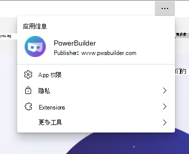

*  将隐私信息和控件移动到专用的二级 **隐私** 菜单中：

   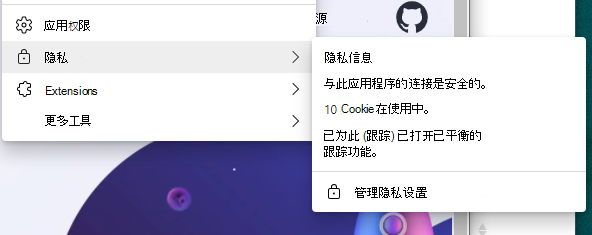

*  将内容相关工具移动到专用的二级 **更多工具** 菜单中：

   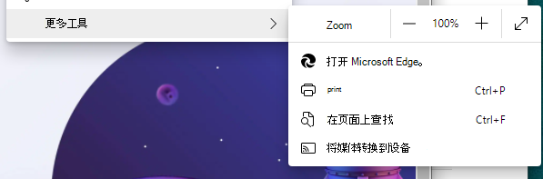

### 安装后浮出控件对话框

从Windows上的Microsoft Edge浏览器安装PWA后，用户现在可以从四个选项中进行选择，轻松启动其应用：
*  **固定到任务栏**
*  **固定到“开始”**
*  **创建桌面快捷方式**
*  **在设备登录时自动启动**

为方便起见，首次启动应用时会显示此浮出对话框：

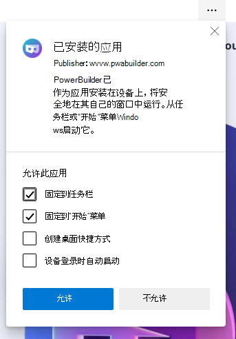

此功能正逐步向所有用户推出。  同时，如果要使用此功能，请转到`edge://flags`并启**用“安装后”对话框Web 应用**标志。

### 还原Web 应用

在意外关闭之前运行的已安装站点和 PVA 现在将还原 (即，系统恢复时，这些站点和 PVA 将在) 重新启动。

由于进程故障、系统重启或停电，可能会发生意外关闭。 在此更改之前，已安装的站点和 PVA 在系统还原时具有不确定的行为。
