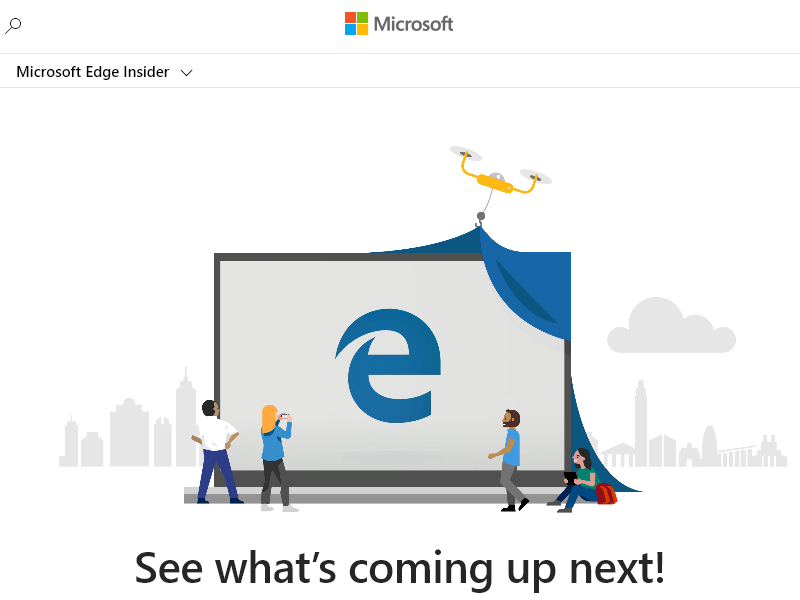

# <a name="puppeteer-overview"></a>Puppeteer 概述

[Puppeteer](https://pptr.dev) 库提供了一个高级 API，用于使用 [DevTools 协议](https://chromedevtools.github.io/devtools-protocol)控制基于Chromium的浏览器（包括Microsoft Edge）。

Puppeteer 默认启动 [无头浏览器](https://en.wikipedia.org/wiki/Headless_browser) 。  无头浏览器不显示用户界面 (UI) ，因此必须使用命令行。  还可以将 Puppeteer 配置为运行完整 (非无头) Microsoft Edge。

默认情况下，在安装 Puppeteer 时，安装程序会下载最新版本的 [Chromium](https://www.chromium.org/Home)，Microsoft Edge的开源浏览器[也是基于该版本构建的](https://blogs.windows.com/windowsexperience/2018/12/06/microsoft-edge-making-the-web-better-through-more-open-source-collaboration)。

如果已安装Microsoft Edge，则可以使用 [puppeteer-core](https://pptr.dev/#?product=Puppeteer&version=v2.0.0&show=api-puppeteer-vs-puppeteer-core)。  `puppeteer-core` 是一个轻型版本的 Puppeteer，可启动现有的浏览器安装，如Microsoft Edge。  若要下载Microsoft Edge，请转到[“下载Microsoft Edge内部频道](https://www.microsoftedgeinsider.com/download)”。

Puppeteer 是 [节点](https://nodejs.org) 库。


<!-- ====================================================================== -->
## <a name="installing-puppeteer-core"></a>安装 puppeteer-core

可以使用以下命令之一添加 `puppeteer-core` 到网站或应用：

```shell
npm i puppeteer-core
```

```shell
yarn add puppeteer-core
```


<!-- ====================================================================== -->
## <a name="launch-microsoft-edge-with-puppeteer-core"></a>使用 puppeteer-core 启动Microsoft Edge

`puppeteer-core` 类似于其他浏览器测试框架，如 [WebDriver](../webdriver-chromium/index.md)。  创建浏览器实例，打开网页，然后使用 Puppeteer API 操作网页。

若要用于`puppeteer-core`启动Microsoft Edge：

1.  `puppeteer-core` 需要节点 v8.9.0 或更高版本。  请确保具有兼容版本的Node.js。  为此，请从命令行运行 `node -v` 。  此外，下面的示例使用 `async`/`await`，仅在 Node v7.6.0 或更高版本中受支持。

1.  在下面的代码示例中，`puppeteer-core`启动Microsoft Edge、转到`https://www.microsoftedgeinsider.com`并保存屏幕截图。`example.png`  复制以下代码片段并将其保存为 `example.js`：

    ```javascript
    const puppeteer = require('puppeteer-core');
    
    (async () => {
      const browser = await puppeteer.launch({
        executablePath: 'C:\\Program Files (x86)\\Microsoft\\Edge Dev\\Application\\msedge.exe'
      });
      const page = await browser.newPage();
      await page.goto('https://www.microsoftedgeinsider.com');
      await page.screenshot({path: 'example.png'});
    
      await browser.close();
    })();
    ```
    
1.  按照后续步骤查找可执行路径，然后更改`executablePath`为指向安装Microsoft Edge。  例如，在macOS时，`executablePath`应将Microsoft Edge Canary 设置`/Applications/Microsoft\ Edge\ Canary.app/`为 。

1.  若要查找， `executablePath`一个简单的手动方法是在该页上转到 `edge://version` 并复制 **可执行文件路径** 。

1.  或者，若要以编程方式查找可执行路径，请先运行以下命令之一安装 [边缘路径](https://www.npmjs.com/package/edge-paths) 包：

    ```shell
    npm i edge-paths
    ```
    
    ```shell
    yarn add edge-paths
    ```
    
1.  然后，如果用于 `edge-paths` 查找可执行路径，请运行如下示例所示的代码。 它使用[边缘路径](https://www.npmjs.com/package/edge-paths)包以编程方式查找在 OS 上安装Microsoft Edge的路径：

    ```javascript
    const edgePaths = require("edge-paths");
    
    const EDGE_PATH = edgePaths.getEdgePath();
    ```
    
1.  现在，你已找到可执行路径 (手动或以编程方式) ，在设置`executablePath: EDGE_PATH`中`example.js`。  保存更改。

1.  从命令行运行 `example.js` ：

    ```shell
    node example.js
    ```

    `puppeteer-core` 启动Microsoft Edge、转到`https://www.microsoftedgeinsider.com`和保存网页的屏幕截图。  可以通过调用 [page.setViewport () ](https://pptr.dev/#?product=Puppeteer&version=v2.0.0&show=api-pagesetviewportviewport)自定义屏幕截图大小。

     `example.png`以下文件由以下内容`example.js`生成：

     

前面的示例演示了基本的自动化和测试方案，你可以使用 Puppeteer 和 `puppeteer-core`。  有关 Puppeteer 及其工作原理的详细信息，请查看 [Puppeteer](https://pptr.dev)。


<!-- ====================================================================== -->
## <a name="see-also"></a>另请参阅

*  [WebDriver](../webdriver-chromium/index.md)
*  [WebDriver (EdgeHTML)](/archive/microsoft-edge/legacy/developer/webdriver/index)
*  [GitHub上的 Chrome DevTools 协议查看器](https://chromedevtools.github.io/devtools-protocol)
*  [Microsoft Edge：通过 Microsoft 体验博客上的更多开放源代码协作，使 Web 变得更好](https://blogs.windows.com/windowsexperience/2018/12/06/microsoft-edge-making-the-web-better-through-more-open-source-collaboration)
*  [下载 Microsoft Edge Insider Channels](https://www.microsoftedgeinsider.com/download)
*  [Chromium项目的Chromium](https://www.chromium.org/Home)
*  [Node.js](https://nodejs.org)
*  [Puppeteer](https://pptr.dev)
*  [puppeteer vs. puppeteer-core](https://pptr.dev/#?product=Puppeteer&version=v2.0.0&show=api-puppeteer-vs-puppeteer-core)
*  [Puppeteer 上的 page.setViewport () ](https://pptr.dev/#?product=Puppeteer&version=v2.0.0&show=api-pagesetviewportviewport)
*  [Wikipedia 上的无头浏览器](https://en.wikipedia.org/wiki/Headless_browser)
*  [请联系Microsoft Edge DevTools 团队](../devtools-guide-chromium/contact.md)，发送有关使用 Puppeteer、puppeteer-core 和 Microsoft Edge 的反馈。