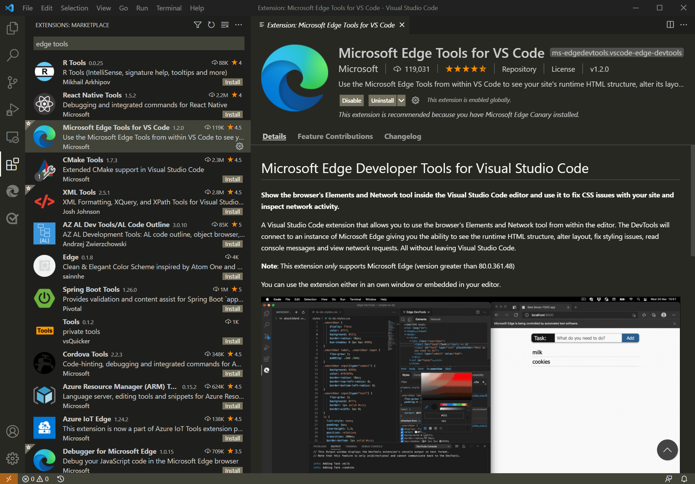

# 用于 Web 开发的Visual Studio Code

Visual Studio Code JavaScript、TypeScript 和 Node.js支持，因此对于 Web 开发人员来说，这是一个很好的工具。  Visual Studio Code是一款轻型但强大的源代码编辑器，可用于 Windows、Linux 和 macOS。

本文概述了为开发人员工具Visual Studio Code用户添加功能的Microsoft Edge扩展。

<!-- ====================================================================== -->
## 用于 Visual Studio Code 的 Microsoft Edge DevTools 扩展

使用 **Microsoft Edge 开发人员**工具扩展Visual Studio Code，可以在 Visual Studio Code 内使用 Microsoft Edge 浏览器的 Elements Visual Studio Code。****  使用"元素"工具可以：
*   附加到实例或启动实例Microsoft Edge。
*   显示运行时 HTML 结构。
*   更新布局。
*   修复样式设置问题。

the Visual Studio Marketplace 提供了有关 Microsoft Edge [Tools for Visual Studio Code。](https://marketplace.visualstudio.com/items?itemName=ms-edgedevtools.vscode-edge-devtools)

若要使用扩展，请参阅 [Microsoft Edge DevTools 扩展了解Visual Studio Code](microsoft-edge-devtools-extension.md)。

### 安装扩展

若要安装 Microsoft Edge DevTools 扩展：

1. 在Visual Studio Code中，导航到 **"扩展"**。  为此，你可以按 `Ctrl`++`Shift``X` Windows/Linux`X` `Command`+`Shift`+或 macOS。

1. 在 Marketplace 中搜索扩展Microsoft Edge **Tools for VS Code**，选择扩展，然后选择"安装 **"**。

<!-- ====================================================================== -->
## webhint 扩展Visual Studio Code

使用 Webhint（一种可自定义的 Lint 工具）可改进网站的功能，包括：

*   辅助功能。
*   性能。
*   跨浏览器兼容性。
*   PWA兼容性。
*   安全性。

webhint 检查代码的最佳实践和常见错误。  识别并修复文件（包括 HTML、CSS、JavaScript 和 TypeScript）中的问题。  提示在文本编辑器中显示为波浪下划线，并汇总在"问题 **"** 窗格中：

请参阅 [Webhint 扩展了解Visual Studio Code](webhint.md)。

<!-- ====================================================================== -->
## 另请参阅

*  [下载Visual Studio Code](https://code.visualstudio.com)
*  [入门](https://code.visualstudio.com/Docs) - Visual Studio Code。
