# <a name="microsoft-edge-devtools-extension-for-visual-studio-code"></a>用于 Visual Studio Code 的 Microsoft Edge DevTools 扩展

<!-- lexicon (except when quoting a UI string):
Microsoft Edge DevTools extension for Visual Studio Code
Microsoft Edge DevTools extension
-->

Visual Studio Code的 Microsoft Edge DevTools 扩展允许你从Visual Studio Code中使用浏览器的 **Elements** 工具和**网络**工具。  无需离开Visual Studio Code，请使用 Microsoft Edge DevTools 连接到具有以下功能的Microsoft Edge实例：
* 查看运行时 HTML 结构。
* 更改布局。
* 更改 CSS)  (样式。
* 读取控制台消息。
* 查看网络请求。

> [!NOTE]
> Microsoft Edge DevTools 扩展需要Microsoft Edge。  Microsoft Edge版本 80.0.361.48 及更高版本支持此扩展。

在Visual Studio Code中，可以通过多种方式打开 Microsoft Edge DevTools 扩展：
* 从 **活动栏**。
* 从 JavaScript 调试器。

在Visual Studio Code中，此扩展由多个变体引用：
*  **Microsoft Edge开发人员工具Visual Studio Code** - 完整名称，如**扩展市场**中的详细信息所示。
*  **Microsoft Edge用于VS Code的工具** - **在扩展市场**中搜索时列出的扩展。
*  **Microsoft Edge工具** - **活动栏**中的图标工具提示。
*  **Edge DevTools** - 选项卡名称。

本文使用名称“Microsoft Edge DevTools 扩展”，UI 文本除外。


<!-- ====================================================================== -->
## <a name="installing-the-microsoft-edge-devtools-extension"></a>安装 Microsoft Edge DevTools 扩展

若要从Visual Studio Code内部安装扩展，请参阅 [Visual Studio Code 中用于 Web 开发的 Visual Studio Code 的 Microsoft Edge DevTools 扩展](index.md#microsoft-edge-devtools-extension-for-visual-studio-code)。__

或者，可以从[Visual Studio市场下载 Microsoft Edge DevTools 扩展](https://marketplace.visualstudio.com/items?itemName=ms-edgedevtools.vscode-edge-devtools)。  可以在GitHub查看[源代码](https://github.com/microsoft/vscode-edge-devtools)。

### <a name="updating-the-extension"></a>更新扩展

Microsoft Visual Studio Code 会自动更新扩展。  若要手动更新扩展，请 [参阅手动更新扩展](https://code.visualstudio.com/docs/editor/extension-gallery#_update-an-extension-manually)。


<!-- ====================================================================== -->
## <a name="opening-microsoft-edge-devtools-within-visual-studio-code"></a>在 Visual Studio Code 中打开 Microsoft Edge DevTools

若要打开工具面板，请在**活动栏**中选择 **“Microsoft Edge工具”** 图标。

借助 Microsoft Edge DevTools 扩展，可以轻松启动 Edge 实例或生成`launch.json`文件以自动执行调试工作流：

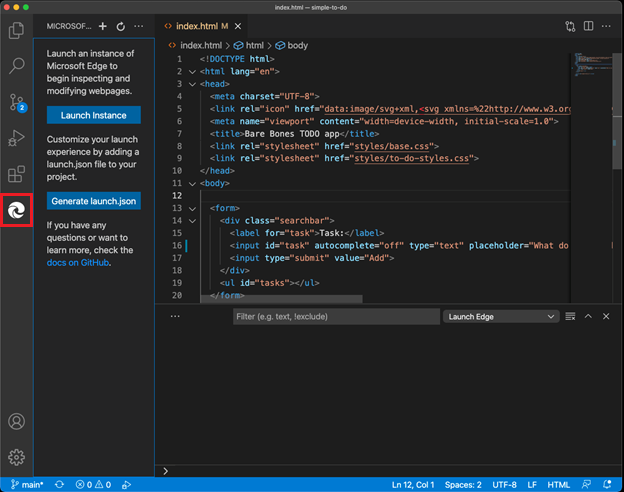

选择 **“启动实例**”将打开浏览器窗口，并在Visual Studio Code中打开 **“Edge DevTools**”选项卡：

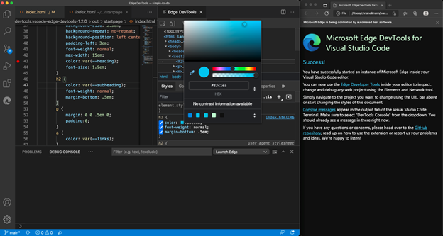

使用Visual Studio Code中的 Microsoft Edge DevTools 扩展检查 Microsoft Edge 中的 HTML 元素。 例如，单击 **“成功！** 在浏览器中打开“ **元素** ”工具，并展开 DOM 树：

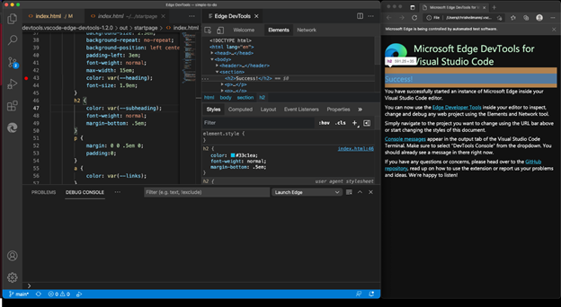


<!-- ====================================================================== -->
## <a name="modes-for-using-microsoft-edge-devtools-in-visual-studio-code"></a>在 Visual Studio Code 中使用 Microsoft Edge DevTools 的模式

可以在以下三种模式之一中使用此扩展：
* 在新窗口中启动Microsoft Edge，然后转到 Web 应用程序。
* 附加到正在运行的Microsoft Edge实例。
* 在Visual Studio Code中打开Microsoft Edge的新实例。

每个模式都需要从本地 Web 服务器（从Visual Studio Code任务或命令行启动）为 Web 应用程序提供服务。  使用文件内的 `launch.json` URL 参数告诉Visual Studio Code要打开哪个 URL。


<!-- ====================================================================== -->
## <a name="opening-a-new-browser-instance"></a>打开新的浏览器实例

若要从Visual Studio Code打开浏览器实例：

1. 在**活动栏**上，选择**Microsoft Edge工具**。

1. 在 **“Microsoft Edge工具：目标”** 面板上，选择 **“启动实例**”。  Microsoft Edge打开，显示一个默认页面，其中包含有关详细信息的指南。  此外，**Edge DevTools** 选项卡和面板显示在Visual Studio Code中，其中包含**欢迎**、**元素**和**网络**工具：

   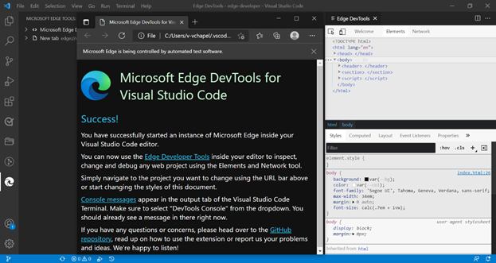

1. 在Microsoft Edge地址栏中，转到要调试的项目 URL。


<!-- ====================================================================== -->
## <a name="changing-the-default-page-to-your-project-website"></a>将默认页面更改为项目网站

若要调试项目，可能需要更改在Visual Studio Code Microsoft Edge中打开的默认页面。  若要将默认页面更改为项目的网站，请执行以下操作：

1. 在Visual Studio Code中，选择 **“****FileNew** >  窗口”。  请注意，未打开任何文件夹。

1. 在**活动栏**上，选择**Microsoft Edge工具**。

1. 在 **“Microsoft Edge工具：目标”** 面板中，选择**打开的文件夹**链接。

1. 在Visual Studio Code中开始调试时，选择项目文件夹，其中包含要显示的新默认页面。

   首次打开文件夹时，必须确认信任此文件夹中文件的作者。  还可以选中 **“信任父文件夹中所有文件的作者”** 复选框：

   

   首次完成此过程时，还必须再次选择**Microsoft Edge工具**。

   **Microsoft Edge工具：目标**面板现在显示两个按钮：**启动实例**和**生成 launch.json**：

   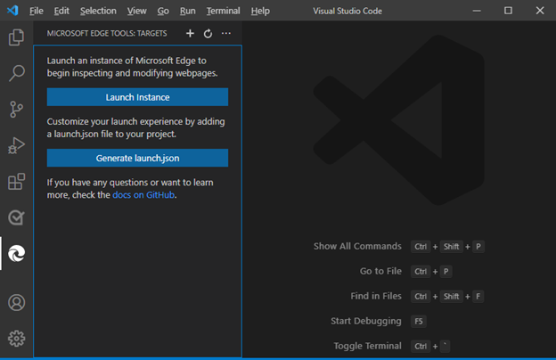

1. 选择 **“生成 launch.json** ”以在项目中创建一个 `launch.json` 。

1. 在 `launch.json`其中，添加项目的 URL。 如果将 URL 留空，则会显示默认页面。

1. 保存 `launch.json`。

1. 选择 **“启动Project**验证Microsoft Edge是否打开并显示输入的 URL。  此外，DevTools 将在Visual Studio Code中打开。


<!-- ====================================================================== -->
## <a name="changing-the-extension-settings"></a>更改扩展设置

可以在Visual Studio Code扩展中自定义 DevTools。

自定义设置：

1. 在Visual Studio Code中，在**活动栏**上，选择**Microsoft Edge工具**。

1. 在**Microsoft Edge** **ToolsTargets** >  中，选择“目标 **”一**词右侧的“**更多操作** (...) ”，然后选择 **“打开设置**”。

   如果使用鼠标，若要访问 **“更多操作** ” (...) ，请选择 **“目标** ”窗格或将其悬停在上面：

   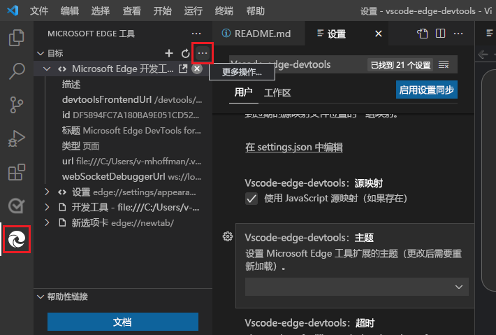


### <a name="reloading-the-extension-after-changing-settings"></a>更改设置后重新加载扩展

某些设置具有一个说明，用于读 ** 取更改) 后所需的 (重载 **。  若要使此类设置生效：

1. 关闭由扩展打开的浏览器，或在 **“Microsoft Edge** **ToolsTargets** > ”窗格中，选择 **“关闭**”实例 (`X`) 。  此操作也会自动关闭 **Edge DevTools** 选项卡。

1. 在 **“Microsoft Edge** **ToolsTargets** > ”窗格中，选择 **“启动实例**”按钮。  Microsoft Edge打开，并显示 **“Edge DevTools”** 选项卡。


<!-- ====================================================================== -->
## <a name="viewing-the-changelog-for-changes-made-to-the-extension"></a>查看对扩展所做的更改的更改日志

可以查看对扩展所做的更改。

若要查看更改日志，请执行以下操作：

1. 在Visual Studio Code中，在**活动栏**上，选择**Microsoft Edge工具**。

1. 在 **Microsoft Edge** **ToolsTargets** >  中，选择“目标 **”一**词右侧的“**更多操作** (...) ”，然后选择 **“查看更改日志**”：

   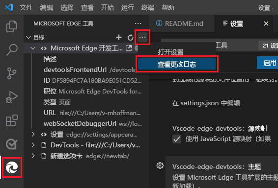

或者，在浏览器中，转到存储库中的 `vscode-edge-devtools` [changelog 文件](https://github.com/microsoft/vscode-edge-devtools/blob/main/CHANGELOG.md)。


<!-- ====================================================================== -->
## <a name="changing-to-headless-mode"></a>更改为无头模式

默认情况下，扩展在新窗口中启动Microsoft Edge，该窗口在任务栏上显示另一个浏览器图标。

若要在代码编辑器中显示浏览器，或隐藏浏览器（如果已显示）：

1. 单击 **“切换屏幕广播** ”按钮：

   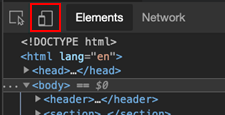


若要仅在Visual Studio Code中使用屏幕广播浏览器，请执行以下操作：

1. 选择**设置** > **无头模式**：

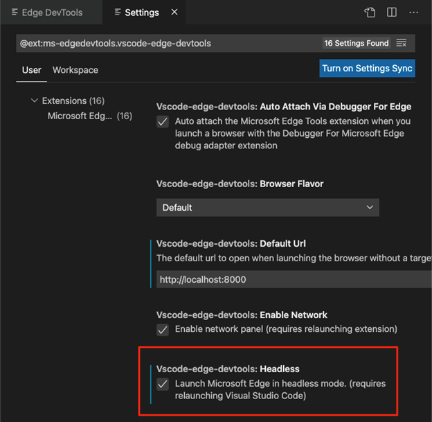


<!-- ====================================================================== -->
## <a name="opening-source-files-from-the-elements-tool"></a>从 Elements 工具打开源文件

**Elements** 工具的一个功能是显示将样式和事件处理程序应用于 DOM 树中选定节点的源文件。  源文件以指向 URL 的链接的形式显示。  选择链接将在Visual Studio Code编辑器中打开该文件：


<!-- ====================================================================== -->
## <a name="setting-up-your-project-to-show-live-changes-in-the-extension"></a>设置项目以显示扩展中的实时更改

默认情况下，Microsoft Edge DevTools 扩展不会在编写时跟踪对代码的实时更改。  如果希望浏览器在更改文件时自动刷新，请设置 _实时重载_ 环境，如下所示。

此示例显示硬盘驱动器上调用 `my-project`的生产文件的文件夹。  在以下步骤中，如果文件夹名称不同，请更改 `my-project` 为文件夹名称。

安装Node.js和 `reload` npm 包，如下所示：

1. 下载并安装 [Node.js](https://www.nodejs.org)。

1. 若 [要安装重新加载 npm 包](https://www.npmjs.com/package/reload?activeTab=readme)，请打开命令提示符并运行 `npm install reload -g` 以全局安装包。

   接下来，将扩展附加到实时重载项目：

1. 导航到 `my-project` 终端窗口中的文件夹并运行 `reload` 以启动本地服务器。

1. 在Visual Studio Code中`my-project`，打开文件夹。

1. 转到扩展并启动Microsoft Edge浏览器实例。

1. 在Microsoft Edge，去`localhost:8080/{file name you want to open}`。

保存在此文件夹中的所有更改现在都会触发浏览器刷新。


<!-- ====================================================================== -->
## <a name="syncing-live-changes-from-the-styles-tool-by-using-css-mirror-editing"></a>使用 CSS 镜像编辑从样式工具同步实时更改

Microsoft Edge DevTools 中的 Styles 工具非常适合调试和调整 CSS 属性样式。  一个问题是，尽管这些更改在浏览器中实时显示，但它们不会反映在源文件中。  这意味着，在 CSS 调试会话结束时，需要将更改的内容复制并粘贴回源文件中。

CSS 镜像编辑是解决该问题的Microsoft Edge DevTools 扩展的实验性功能。  打开镜像编辑时，DevTools 的 Styles 工具中所做的任何更改也会更改工作区中的文件。

在以下示例中，我们当前已`index.html`在 Visual Studio Code 中打开，并且 Microsoft Edge DevTools 扩展处于打开状态。  在 CSS 选择器中`.searchbar`选择弹性框图标并将其更改`flex-direction`为`column`时，我们不仅会在浏览器和 DevTools 中看到更改，而且Visual Studio Code还会自动导航到正确的样式表文件和相应的行号，并插入 `flex-direction: column` CSS 代码：

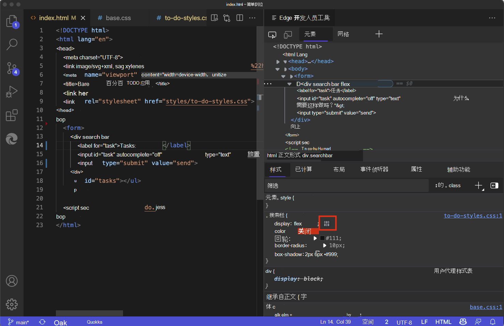

更改 CSS 设置在正确的 CSS 源文件中创建了一个新代码行：


可以在 Styles 工具中编辑任何选择器或创建新选择器，所有更改都会在正确的 CSS 源文件中进行镜像。 扩展仅更改文件，不会自动将更改保存回硬盘驱动器。 这是一种安全措施，可确保不会意外覆盖任何代码。

可以通过单击扩展 **目标窗格** 中的按钮，或者使用命令菜单并查找 `mirror`：

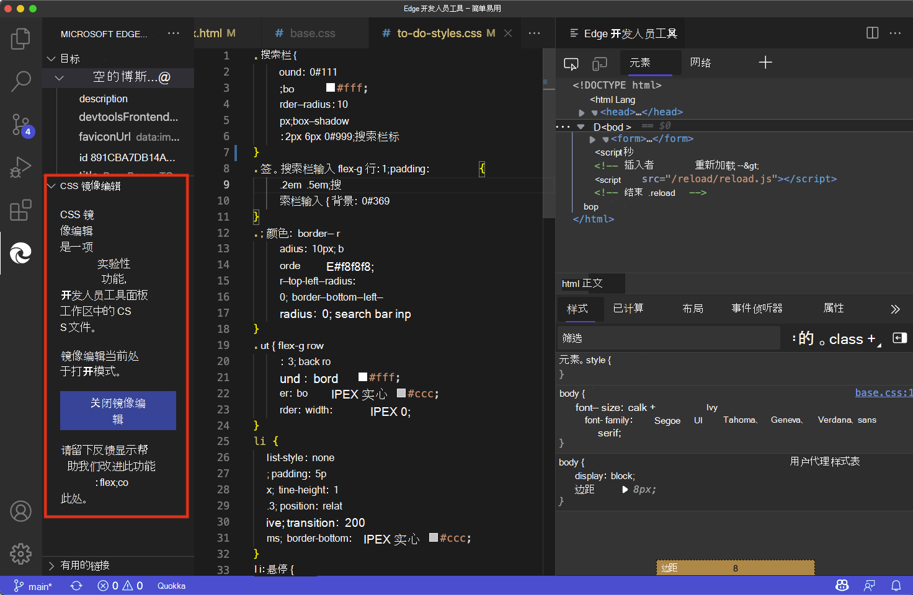

使用命令菜单打开或关闭 CSS 镜像编辑：

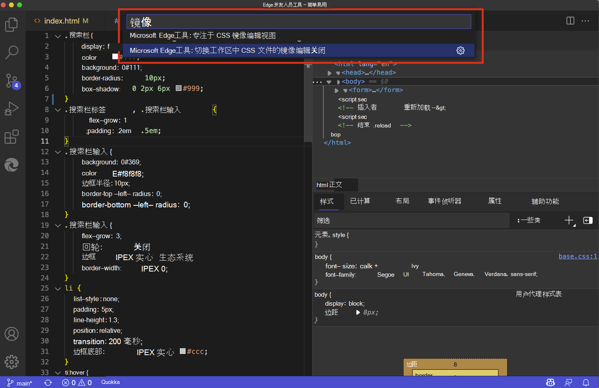

我们正在继续改进此功能，并在 [CSS 镜像编辑](https://github.com/microsoft/vscode-edge-devtools/issues/476)GitHub上设置了跟踪问题，欢迎你提供反馈。


<!-- ====================================================================== -->
## <a name="device-emulation-in-the-screencast"></a>屏幕广播中的设备仿真

设备仿真是编辑器中屏幕广播浏览器的一项功能。  这样便可以模拟手机或平板电脑等设备。  这对于在不同设备上测试网站布局非常有用：


你可以从不同设备的列表中进行选择，以便在地址栏旁边的屏幕广播中进行模拟：


默认设备是桌面计算机。  如果选择模拟的设备是触摸设备，则屏幕广播会自动切换到触摸屏模式。 可以通过单击列表旁边的按钮来旋转模拟设备的方向：


<!-- ====================================================================== -->
## <a name="inline-and-live-issue-analysis"></a>内联和实时问题分析

源代码中的问题用波浪下划线突出显示。 可以检查问题并获取有关问题所在内容、如何解决该问题以及在何处查找详细信息的详细信息。  若要检查问题，请选择具有波浪下划线的代码：


若要查看文件中的所有问题，请选择 **“查看问题**”：


下面板中的 **“问题** ”选项卡列出了当前项目中找到的所有问题：


编辑代码时会实时评估问题。  键入时，你将获得有关找到的任何问题以及如何解决这些问题的反馈：


<!-- ====================================================================== -->
## <a name="browser-debugging-with-microsoft-edge-devtools-integration-in-visual-studio-code"></a>在 Visual Studio Code 中使用 Microsoft Edge DevTools 集成进行浏览器调试

JavaScript 调试内置为Visual Studio Code。  可以在 Chrome、Microsoft Edge 或Node.js中进行调试，而无需安装任何其他扩展。  如果使用Microsoft Edge进行调试，则可以从 JavaScript 调试器开始Microsoft Edge DevTools。

1. 若要开始调试，请执行以下任一操作：
   *  按 **F5** 或在菜单栏上选择 **“调试** ”图标，然后选择 **“运行并调试**”。
   *  打开Visual Studio Code命令面板，然后选择 **“调试：打开链接**”。
    
   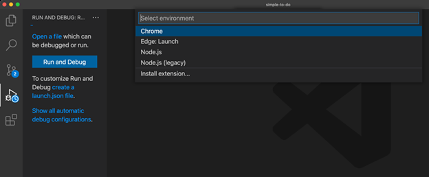

1. 选择 **Edge**。  在调试工具栏上，请注意“ **检查** ”按钮：

   

1. 选择 **“检查**”打开Visual Studio Code内Microsoft Edge DevTools。

   第一次选择 **“检查**”时，编辑器会提示你安装扩展，[Microsoft Edge开发人员工具进行Visual Studio Code](https://marketplace.visualstudio.com/items?itemName=ms-edgedevtools.vscode-edge-devtools)。

   安装 Microsoft Edge DevTools 扩展后，选择 **“检查**”时，Microsoft Edge DevTools 将在Visual Studio Code内部打开：

   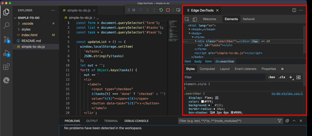

   现在，可以检查 DOM、更改 CSS，并查看在浏览器中运行的项目网络请求，而无需保留Visual Studio Code。

   还可以使用编辑器中的调试控制台与浏览器中的文档交互。  可以完全访问窗口对象，并可以使用 [控制台实用工具 API](/microsoft-edge/devtools-guide-chromium/console/utilities)：

   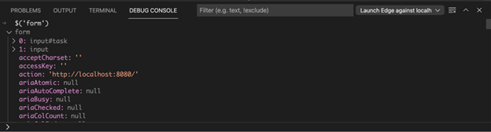


### <a name="automatically-attaching-to-microsoft-edge-and-launching-devtools-in-visual-studio-code"></a>在 Visual Studio Code 中自动附加到Microsoft Edge并启动 DevTools

1. 如果要在Visual Studio Code中自动附加到 Microsoft Edge 并启动 Microsoft Edge DevTools，请执行上述步骤，然后创建如下`launch.json`所示的文件。

   选择**Microsoft Edge**作为调试类型。  `launch.json`在文件中，指定`pwa-msedge`为类型：

   ```json
   {
      "version": "0.2.0",
      "configurations": [
         {
               "type": "pwa-msedge",
               "request": "launch",
               "name": "Launch Edge",
               "url": "http://localhost:8080",
               "webRoot": "${workspaceFolder}"
         }
      ]
   }
   ```

1. 更改 `http://localhost:8080` 上述代码，并确保变量 `{workspaceFolder}` 解析。

1. 选择“ **检查** ”图标。  如果尚未为Visual Studio Code安装 Microsoft Edge DevTools 扩展，则“**扩展”** 选项卡将打开并自动显示要安装的扩展。

#### <a name="see-also"></a>另请参阅

* 在Visual Studio Code调_试_文章中[启动配置](https://code.visualstudio.com/Docs/editor/debugging#_launch-configurations)。


<!-- ====================================================================== -->
## <a name="console-integration"></a>控制台集成

[控制台](/microsoft-edge/devtools-guide-chromium/console/)工具在扩展中可用，你可以在浏览器中使用 DevTools 时执行所用的一切操作。 


可以查看 [日志消息](/microsoft-edge/devtools-guide-chromium/console-log)、访问 `window` 对象并使用 [DOM 交互便利方法](/microsoft-edge/devtools-guide-chromium/console-dom-interaction)。 还可以 [筛选控制台](/microsoft-edge/devtools-guide-chromium/console-filters) 并设置 [实时表达式](/microsoft-edge/devtools-guide-chromium/live-expressions)。 

如果在下层面板中打开控制台，还可以将控制台与元素工具一起使用：


如果从运行和调试工作流启动扩展，[Visual Studio Code调试控制台](https://code.visualstudio.com/Docs/editor/debugging)将提供 Visual Studio Code 内 DevTools [控制台](/microsoft-edge/devtools-guide-chromium/console/)的大部分函数，但没有筛选选项和更基本的结果显示：

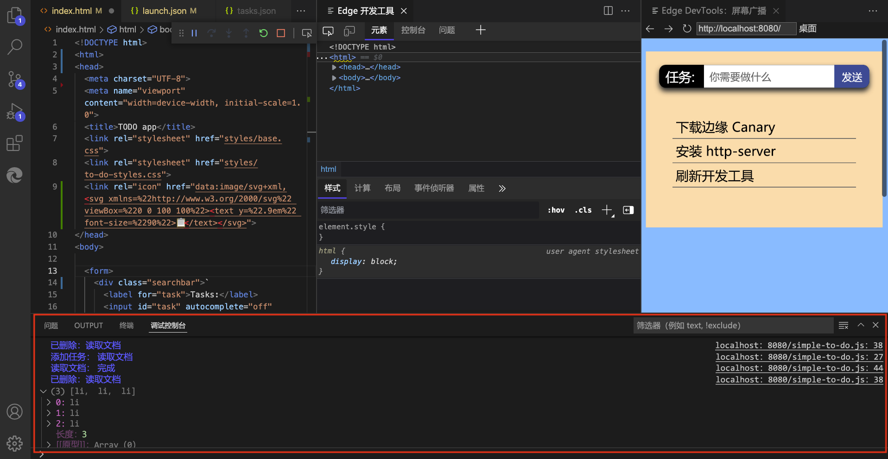


**启用此预览版功能：**

<!-- todo: delete temp note: -->
从 2022 年 4 月 20 日起，若要使**控制台**工具可见，请将 Microsoft Edge 的 Canary 版本作为目标。  若要实现此目的，请执行以下操作：

1. 在Visual Studio Code中，在左侧的活动栏中，单击 **“Microsoft Edge工具”** 按钮。  “MICROSOFT EDGE 工具”窗格随即打开。

1. 将鼠标悬停在**目标**右侧，然后单击 **“打开设置 (****...**) 。

1. 在 **Vscode-edge-devtools：Browser Flavor** 下拉列表中，选择 **Canary**。  稍后，你将能够选择任何版本。

1. 单击 **x** 关闭**设置**。


<!-- ====================================================================== -->
## <a name="getting-in-touch-with-the-microsoft-edge-devtools-extension-team"></a>与 Microsoft Edge DevTools 扩展团队取得联系

通过在存储库中`vscode-edge-devtools`[提交问题](https://github.com/Microsoft/vscode-edge-devtools/issues/new)来发送反馈。

欢迎你的贡献，以帮助改进 Microsoft Edge DevTools 扩展。  在 [vscode-edge-devtools](https://github.com/Microsoft/vscode-edge-devtools) 存储库中查找入门所需的所有内容。
