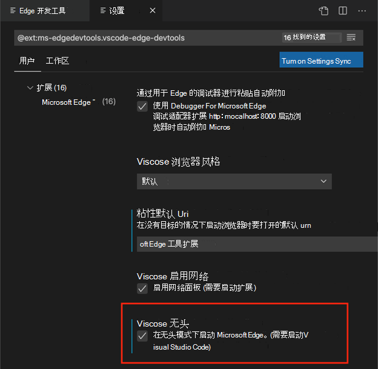
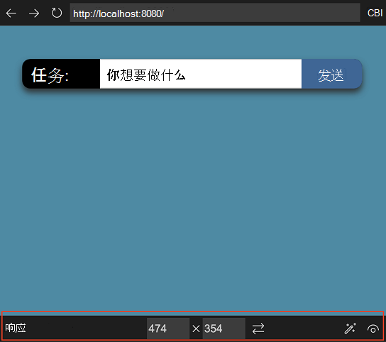
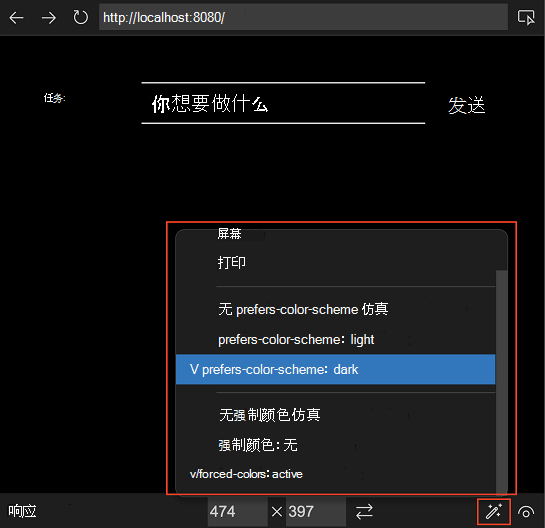
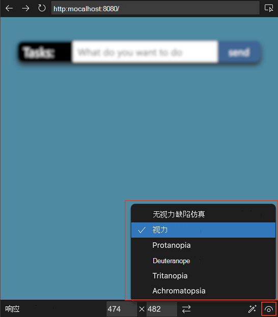
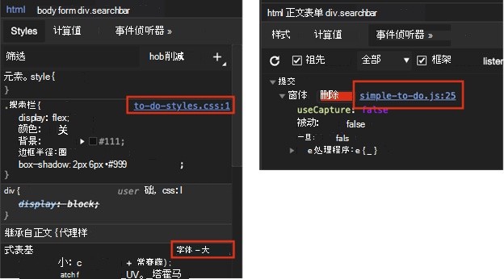

# 用于 Visual Studio Code 的 Microsoft Edge DevTools 扩展

<!-- heading convention in this file: skip h3's; tag subheadings as h4's instead -->

<!-- lexicon (except when quoting a UI string):
Microsoft Edge DevTools extension for Visual Studio Code
Microsoft Edge DevTools extension
CSS Mirroring
CSS mirror editing (lowercased in UI, initcapped at gh)
-->

适用于[Visual Studio Code的 Microsoft Edge DevTools 扩展](https://aka.ms/devtools-for-code)允许你直接从Visual Studio Code中使用 Microsoft Edge 浏览器和开发人员工具。  Visual Studio Code包括对 JavaScript、TypeScript 和 Node.js 的内置支持，因此它是 Web 开发人员的绝佳工具。  Visual Studio Code是适用于 Windows、Linux 和 macOS 的轻型但功能强大的源代码编辑器。

扩展允许执行以下操作：

| 任务 | 部分 |
|---|---|
| 获取源代码中问题的实时分析。 | [内联和实时问题分析](#inline-and-live-issue-analysis) |
| 使用项目的 DevTools 启动新的浏览器实例。 | [在扩展中打开浏览器实例](#opening-a-browser-instance-in-the-extension) |
| 模拟不同的设备，并在不同的显示模式下查看项目。 | [设备和状态仿真](#device-and-state-emulation) |
| 使用 **Elements** 工具查看页面的运行时 DOM 结构和布局。 | [从 Elements 工具打开源文件](#opening-source-files-from-the-elements-tool) |
| 使用项目的源文件的实时预览和实时更改来分析和更改项目的 CSS 样式。 | [使用 CSS 镜像编辑从 Styles 工具同步实时更改](#syncing-live-changes-from-the-styles-tool-by-using-css-mirror-editing) |
| 使用 **网络** 工具分析站点流量。 | [网络工具集成](#network-tool-integration) |
| 记录信息，试用 JavaScript，并使用 **控制台** 工具访问 Window/DOM。 | [控制台集成](#console-integration) |
| 使用 **应用程序工具** 检查存储和服务辅助角色。 | [应用程序工具集成](#application-tool-integration) |
| 使用Visual Studio Code调试工作流中的扩展。 | [在Visual Studio Code中调试时自动打开浏览器和 DevTools](#automatically-opening-the-browser-and-devtools-when-debugging-in-visual-studio-code) |

<!-- ====================================================================== -->
## 安装 Microsoft Edge DevTools 扩展

若要从Visual Studio Code中安装 Microsoft Edge DevTools 扩展，

1. 在Visual Studio Code中，导航到 **“扩展**”。  为此，可以在 Windows/Linux 或`X``Shift`++`Command` macOS 上按`X``Ctrl`+`Shift`+下。

1. 在市场中搜索 **适用于 VS Code 的扩展 Microsoft Edge Tools**，选择扩展，然后选择 **“安装**”：

   

或者，可以从 Visual Studio 市场 [下载 Microsoft Edge DevTools 扩展](https://marketplace.visualstudio.com/items?itemName=ms-edgedevtools.vscode-edge-devtools) 。

<!-- ====================================================================== -->
## 内联和实时问题分析

源代码中的问题突出显示了波浪下划线。 可以检查问题并获取有关问题所在内容、如何解决该问题以及在何处查找详细信息的详细信息。  若要检查问题，请选择具有波浪下划线的代码：

若要查看文件中的所有问题，请选择 **“查看问题**”：

下面板中的 **“问题** ”选项卡列出了当前打开的文件中的所有问题：

#### 实时更新报告的问题

编辑代码时会实时评估问题。  键入时，你将获得有关找到的任何问题以及如何解决这些问题的反馈：

#### 自动快速修复和问题筛选

<!--
bold "Quick Fix" when focusing on the UI
the UI label string is "Quick Fix", not "Quick Fixes"
-->

适用于Visual Studio Code的 Microsoft Edge DevTools 扩展包括**快速修复**功能。  通过使用快速修复，可以自定义扩展的错误报告以满足当前项目的需求。

将鼠标悬停在有问题的元素上时，会收到一个灯泡图标，指示有可用的快速修复：

单击灯泡图标会显示选项列表。 例如，如果添加了具有协议相对 URL 的链接，则可从以下 **快速修复** 列表中进行选择：

可以选择要使用哪种 **快速修复** 来解决问题或停止将其报告为问题：

* **修复了“no-protocol-relative-urls”问题** - 将缺少的 URL 前缀 `https://` 添加到链接。

* **在此项目中禁用“no-protocol-relative-url”提示** - 在项目文件夹中创建 `.hintrc` 配置文件，并告知扩展不再报告此问题。

* **编辑此项目的 .hintrc** - 打开 `.hintrc` 配置文件，以便可以对其进行编辑以自定义扩展的错误报告。

<!-- ====================================================================== -->
## 在 Visual Studio Code 中使用 Microsoft Edge DevTools 的模式

可以在以下三种模式之一中使用此扩展：

* 在新窗口中启动 Microsoft Edge，然后转到 Web 应用程序。

* 附加到正在运行的 Microsoft Edge 实例。

* 在Visual Studio Code中打开 Microsoft Edge 的新实例。

<!-- ====================================================================== -->
## 在扩展中打开浏览器实例

可通过多种方式在扩展中启动新的浏览器会话，如下小节中所述。

#### 通过右键单击资源管理器中的 HTML 文件

在Visual Studio Code资源**管理器**中，右键单击 HTML 文件，选择 **“使用 Edge 打开**”，然后选择 **“打开浏览器**”或 **“使用 DevTools 打开浏览器**”：
    

#### 单击“启动实例”按钮

另一种打开浏览器实例的方法：

1. 单击**活动栏**中的 **Microsoft Edge Tools** 图标。  这使你能够启动 Edge 实例或生成文件 `launch.json` 以自动执行调试工作流：

1. 然后单击 **“启动实例** ”按钮。  浏览器预览窗口和 **Edge DevTools** 选项卡在Visual Studio Code中打开：

#### 在调试会话中打开浏览器

打开浏览器实例的另一种方法是打开浏览器作为调试会话的一部分。  请参阅[将扩展与下面的Visual Studio Code调试工作流配合使用](#use-the-extension-with-the-visual-studio-code-debugging-workflow)。

扩展在Visual Studio Code中以嵌入式浏览器的身份打开新的浏览器。 此 **Devtools：浏览器预览** 选项卡可在编辑器中的任意位置移动。 可以与源代码并行使用此选项卡，或拆分窗格，并在代码下方提供浏览器预览：

#### 打开外部浏览器窗口 (无头模式) 

如果想要具有外部浏览器窗口，可以更改默认设置。 选择 **“设置** > **无头”模式** ，然后选中复选框，在无头模式下打开浏览器：

<!-- ====================================================================== -->
## 设备和状态仿真

在“Edge DevTools：浏览器预览”选项卡中，底部的仿真工具栏使你能够模拟不同的环境：

#### 模拟设备下拉菜单
<!-- toolbar item 1. Emulate devices -->

在 **“模拟设备”** 下拉菜单中，你可以从许多不同的设备中进行选择。  选择设备时，视区将调整为正确的度量值，并模拟触摸界面。  例如，有多个模拟的 iPhone 布局：

#### 宽度和高度下拉菜单
<!-- toolbar item 2. Width -->
<!-- toolbar item 3. Height -->

单击 **“宽度** ”和 **“高度** ”下拉菜单可更改视区维度： 

#### “旋转”按钮
<!-- toolbar item 4. Rotate -->

单击“ **旋转** ”按钮 () 旋转视区。

#### “模拟 CSS 媒体功能”按钮
<!-- toolbar item 5. Emulate CSS media features -->

若要模拟 CSS 媒体查询，请单击 **模拟 CSS 媒体功能** () 按钮。  使用此按钮可以测试产品在打印模式下的外观。  可以在深色和浅色模式之间切换，并模拟强制颜色：

#### 模拟视觉缺陷按钮
<!-- toolbar item 6. Emulate vision deficiencies -->

单击“模拟 **视觉** 缺陷”按钮 () ，尝试体验具有不同视觉缺陷的当前 Web 项目。  使用此按钮，可在模糊模式或不同颜色缺陷下测试产品：

<!-- ====================================================================== -->
## 从 Elements 工具打开源文件

**Elements** 工具的一个功能是显示将样式和事件处理程序应用于 DOM 树中选定节点的源文件。  源文件以指向 URL 的链接的形式显示。  单击文件名链接会在Visual Studio Code编辑器中打开该文件：

<!-- ====================================================================== -->
## 使用 CSS 镜像编辑从 Styles 工具同步实时更改

Microsoft Edge DevTools 中的 **Styles** 工具非常适合调试和调整 CSS。  一个问题是，尽管这些更改在浏览器中实时显示，但它们不会反映在源文件中。  这意味着，在 CSS 调试会话结束时，需要将更改的内容复制并粘贴回源文件中。

CSS 镜像编辑是 Microsoft Edge DevTools 扩展的一项功能，可解决此问题。 在 **Styles** 工具中所做的任何更改也会更改工作区中的文件。  默认情况下，会在扩展中启用 CSS 镜像编辑。

可以在 **Styles** 工具中编辑任何选择器或创建新的选择器，并且所有更改都会在正确的 CSS 源文件中自动镜像。 扩展名仅更改文件的下载副本;它不会自动将更改保存回硬盘驱动器。 这是一种安全措施，可确保不会意外覆盖任何代码。

#### 从 Styles 工具到 CSS 源文件的镜像更改示例

在以下示例中，我们当前已`index.html`在Visual Studio Code中打开，并且 Microsoft Edge DevTools 扩展处于打开状态。  在 CSS 选择器中 `.searchbar` 选择弹性框图标，然后将该 `flex-direction` 图标更改为 `column`。  因此，我们不仅会在浏览器和 DevTools 中看到更改 (下) 的第一个图像，而且Visual Studio Code还会自动导航到正确的样式表文件和相应的行号，并将 CSS 代码插入`flex-direction: column` (下面的第二个图像) ：

更改 CSS 设置在正确的 CSS 源文件中创建了一个新代码行：

#### 启用 CSS 镜像编辑

若要启用和禁用 CSS 镜像编辑，请执行以下操作：

1. 在 **“Edge DevTools** ”选项卡中，转到 **“元素”** 工具，然后转到“ **样式”** 面板。

1. 选中或清除 **CSS 镜像编辑** 复选框。

或者，打开命令菜单，开始键入 **“镜像**”一词，然后选择 **“Microsoft Edge Tools：切换镜像编辑|在工作区中对 CSS 文件进行关闭**：

#### Sourcemap 支持

在设置项目以生成源地图时，CSS 镜像还支持 Sass 或 CSS in-JS 等抽象。 我们在 GitHub 上存在跟踪问题，并欢迎有关如何改进此功能的任何反馈： [使用源图进行 CSS 镜像编辑：已知问题和反馈](https://github.com/microsoft/vscode-edge-devtools/issues/965)。

<!-- ====================================================================== -->
## 网络工具集成

使用**网络**工具可以监视网络流量，并直接在Visual Studio Code内更改应用程序的网络条件。 

使用 **网络** 工具执行以下操作：

* 分析网络流量，找出某些资源未加载的原因。

* 模拟不同的网络条件，例如脱机或连接速度缓慢。

* 禁用任何可能难以调试应用程序的缓存。

* 模拟不同的用户代理，查看产品在搜索引擎机器人或无法测试的浏览器中如何显示。

<!-- ====================================================================== -->
## 控制台集成

[控制台](/microsoft-edge/devtools-guide-chromium/console/)工具在扩展中可用，你可以在浏览器中使用 DevTools 时执行所用的一切操作。 

可以查看 [日志消息](/microsoft-edge/devtools-guide-chromium/console-log)、访问 `window` 对象并使用 [DOM 交互便利方法](/microsoft-edge/devtools-guide-chromium/console-dom-interaction)。 还可以 [筛选控制台](/microsoft-edge/devtools-guide-chromium/console-filters) 并设置 [实时表达式](/microsoft-edge/devtools-guide-chromium/live-expressions)。 

#### 与其他工具并排控制台

如果在下层面板中打开**控制台**，还可以将**控制台**与**元素**工具一起使用：

#### 运行和调试期间的控制台

如果从运行和调试工作流启动扩展，[Visual Studio Code调试控制台](https://code.visualstudio.com/Docs/editor/debugging)将提供 Visual Studio Code 内 DevTools [控制台](/microsoft-edge/devtools-guide-chromium/console/)的大部分函数，但没有筛选选项和更基本的结果显示：

<!-- ====================================================================== -->
## 应用程序工具集成

**使用应用程序**工具可以检查应用程序的各个部分。 

使用 **应用程序工具** 执行以下操作：

* 检查不同的存储选项，例如 Cookie、LocalStorage、SessionStorage 和 IndexedDB。

* 分析应用程序的缓存。

* 分析通知、付款处理程序或后台同步等服务。

<!-- ====================================================================== -->
## 将扩展与Visual Studio Code调试工作流配合使用

JavaScript 调试内置为Visual Studio Code。  可以在 Chrome、Microsoft Edge 或 Node.js 中进行调试，而无需安装任何其他扩展。  如果使用 Microsoft Edge 进行调试，则可以从 JavaScript 调试器启动 Microsoft Edge DevTools。

1. 若要开始调试，请执行以下任一操作：
   *  按 **F5**。
   *  在菜单栏上，单击 **“调试** ”图标，然后单击 **“运行和调试** ”按钮，如下所示。
   *  打开Visual Studio Code命令面板，开始键入“**调试**”一词，然后选择 **“调试：打开链接**”。<!--todo: mention **Select environment** text box" as shown in capture-->
    
   <!--todo: make capture match the above text-->

1. 选择 **Edge**。<!--todo: clarify; **Edge: Launch**?  describe specific UI/controls: link or button or command/list item-->  在调试工具栏上，请注意“ **检查** ”按钮：

   

1. 选择 **“检查**”可在Visual Studio Code中打开 Microsoft Edge DevTools。

   第一次选择 **“检查**”时，编辑器会提示你安装扩展 [Microsoft Edge Developer Tools for Visual Studio Code](https://marketplace.visualstudio.com/items?itemName=ms-edgedevtools.vscode-edge-devtools)。

   安装 Microsoft Edge DevTools 扩展后，选择 **“检查**”时，Microsoft Edge DevTools 将在Visual Studio Code内部打开：

   

#### 在Visual Studio Code中调试时自动打开浏览器和 DevTools

若要调试项目，可能需要更改在 Visual Studio Code 的 Microsoft Edge 中打开的默认页面。  若要将默认页面更改为项目的网站，请执行以下操作：

1. 在Visual Studio Code中，选择 **“文件** > **新建”窗口**。  请注意，未打开任何文件夹。

1. 在 **活动栏**上，选择 **“Microsoft Edge 工具**”。

1. 在 **“Microsoft Edge 工具：目标”** 面板中，单击 **打开的文件夹** 链接。

1. 在Visual Studio Code中开始调试时，选择项目文件夹，其中包含要显示的新默认页面。

   首次打开文件夹时，必须确认信任此文件夹中文件的作者。  还可以选中 **“信任父文件夹中所有文件的作者”** 复选框：

   

   首次完成此过程时，还必须再次选择 **Microsoft Edge 工具** 。

   **Microsoft Edge 工具：目标**面板现在显示两个按钮：**启动实例**和**生成 launch.json**：

   

1. 选择 **“生成 launch.json** ”以在项目中创建一个 `launch.json` 。

1. 在 `launch.json`其中，添加项目的 URL。 如果将 URL 留空，则会显示默认页面。

1. 保存 `launch.json`。

选择在Visual Studio Code中调试项目时，它会自动启动浏览器并打开开发人员工具，显示你在其中`launch.json`指定的 URL。 

#### 另请参阅

* 在Visual Studio Code调_试_文章中[启动配置](https://code.visualstudio.com/Docs/editor/debugging#_launch-configurations)。

<!-- ====================================================================== -->
## 更改扩展设置

可以根据需要自定义Visual Studio Code扩展。

1. 在Visual Studio Code中，在**活动栏**上，选择 **“Microsoft Edge 工具**”。

1. 在 **Microsoft Edge 工具** > **目标**中，选择“目标 **”一**词右侧的“**更多操作** (...) ”，然后选择 **“打开设置**”。

   如果使用鼠标，若要访问 **“更多操作** ” (...) ，请选择 **“目标** ”窗格或将其悬停在上面：

   

#### 更改设置后重新加载扩展

某些设置具有一个说明，用于读 ** 取更改) 后所需的 (重载 **。  若要使此类设置生效：

1. 关闭扩展打开的浏览器，或在 **“Microsoft Edge 工具** > **目标** ”窗格中，选择“ **关闭** ”实例 (`X`) 。  此操作也会自动关闭 **Edge DevTools** 选项卡。

1. 在 **“Microsoft Edge 工具** > **目标** ”窗格中，单击 **“启动实例** ”按钮。  Microsoft Edge 随即打开，并显示 **“Edge DevTools”** 选项卡。

<!-- ====================================================================== -->
## 与 Microsoft Edge DevTools 扩展团队取得联系

通过在存储库中`vscode-edge-devtools`[提交问题](https://github.com/Microsoft/vscode-edge-devtools/issues/new)来发送反馈。

你的贡献是受欢迎的，以帮助使 Microsoft Edge DevTools 扩展更好。  在 [vscode-edge-devtools](https://github.com/Microsoft/vscode-edge-devtools) 存储库中查找入门所需的所有内容。

<!-- ====================================================================== -->
## 另请参阅

*  [vscode-edge-devtools 存储库](https://github.com/microsoft/vscode-edge-devtools) - GitHub 中适用于 Visual Studio Code 的 Microsoft Edge 开发人员工具扩展的源代码。
*  [下载Visual Studio Code](https://code.visualstudio.com)
*  [入门](https://code.visualstudio.com/Docs) - Visual Studio Code文档。
