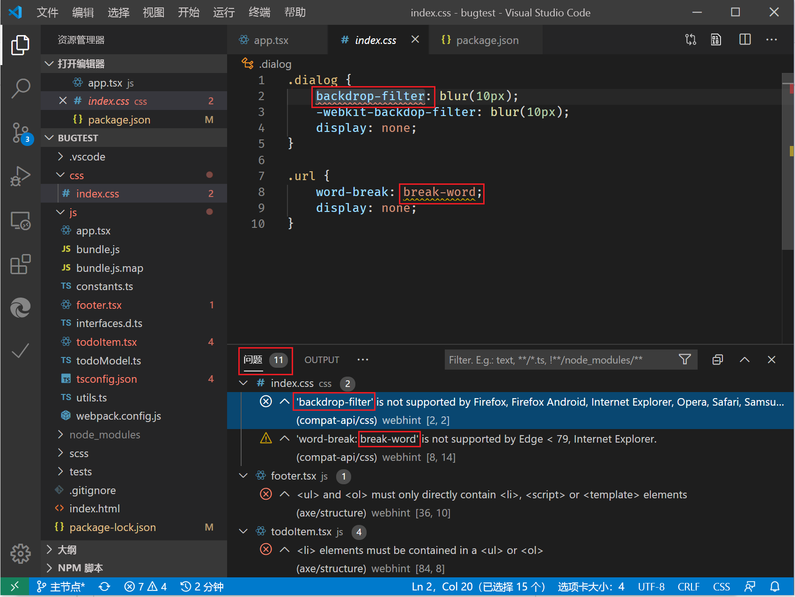
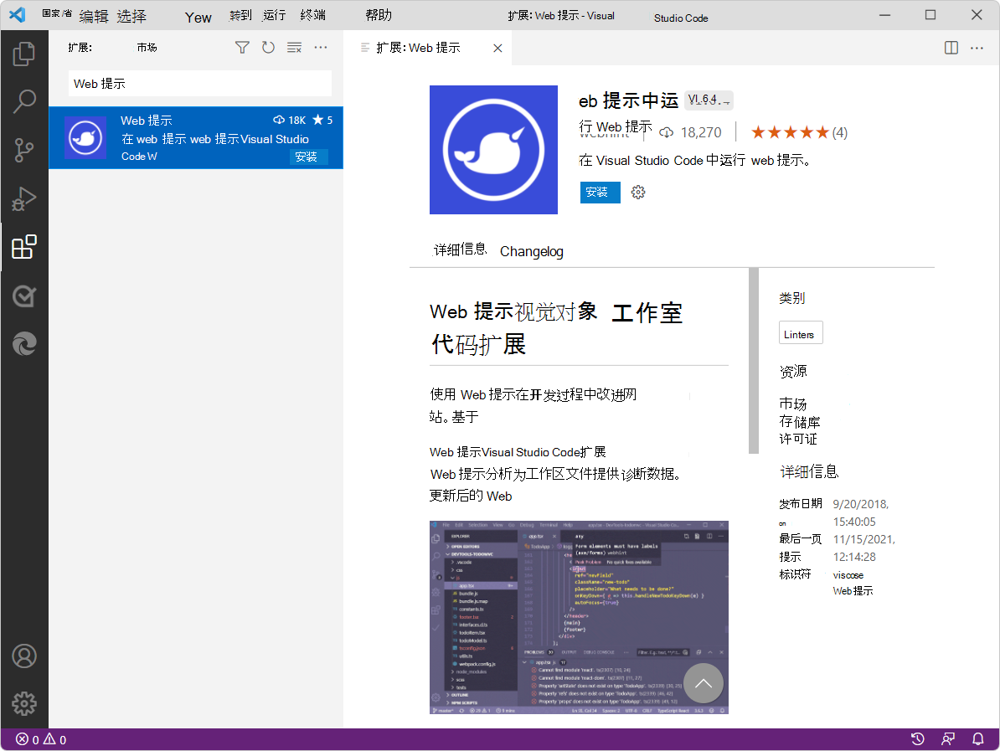

# <a name="the-webhint-extension-for-visual-studio-code"></a>webhint 扩展Visual Studio Code

使用 Webhint（一种可自定义的 Lint 工具）可改进网站的功能，包括：

*   辅助功能。
*   性能。
*   跨浏览器兼容性。
*   PWA兼容性。
*   安全性。

webhint 检查代码的最佳实践和常见错误。  识别并修复文件（包括 HTML、CSS、JavaScript 和 TypeScript）中的问题。  提示在文本编辑器中显示为波浪下划线，并汇总在"问题 **"** 窗格中：



webhint 是一个开源项目。  它最初由 Microsoft Edge 开发，现在是 [OpenJS Foundation 的一部分](https://openjsf.org)。  Microsoft Edge团队将继续与社区中的 Web 开发人员一起为 webhint 做贡献。

有关详细信息，请参阅 [Webhint](https://webhint.io) 网站。


<!-- ====================================================================== -->
## <a name="installing-webhint"></a>安装 Webhint

通过添加 [webhint](https://marketplace.visualstudio.com/items?itemName=webhint.vscode-webhint) 扩展来检查并修复网站中Visual Studio Code。

若要从网站安装 webhint 扩展，Visual Studio Code：

1. 在Visual Studio Code中，导航到 **"扩展"**。  为此，你可以按 `Ctrl`++`Shift``X` Windows/Linux`X` `Command`+`Shift`+或 macOS。

1. 在 Marketplace 中搜索 **Webhint 扩展** ，选择该扩展，然后选择"安装 **"**。

   

或者，你可以安装 [Webhint 扩展，Visual Studio Code](https://marketplace.visualstudio.com/items?itemName=webhint.vscode-webhint)应用商店Visual Studio Webhint。


<!-- ====================================================================== -->
## <a name="configuring-webhint-in-visual-studio-code"></a>在网站中配置 webhint Visual Studio Code

此扩展使用默认[配置 json](https://github.com/webhintio/hint/blob/master/packages/configuration-development/index.json) 文件，用于激活 HTML、CSS、模板系统 (JSX/TSX、Angular 等) 、JavaScript/TypeScript 等的提示和分析程序。

```json
{
    "connector": "local",
    "extends": [
        "accessibility",
        "progressive-web-apps"
    ],
    "formatters": [
        "html",
        "summary"
    ],
    "hints": [
        "apple-touch-icons",
        "button-type",
        "compat-api/css",
        "compat-api/html",
        "create-element-svg",
        "css-prefix-order",
        "disown-opener",
        "highest-available-document-mode",
        "manifest-exists",
        "meta-charset-utf-8",
        "meta-viewport",
        "no-bom",
        "no-protocol-relative-urls",
        "scoped-svg-styles",
        "sri",
        "typescript-config/consistent-casing",
        "typescript-config/import-helpers",
        "typescript-config/is-valid",
        "typescript-config/no-comments",
        "typescript-config/strict",
        "typescript-config/target"
    ],
    "hintsTimeout": 10000,
    "parsers": [
        "babel-config",
        "css",
        "html",
        "javascript",
        "jsx",
        "less",
        "sass",
        "typescript",
        "typescript-config",
        "webpack-config"
    ]
}
```

如果你希望对激活的提示和分析程序 `.hintrc` 进行更多控制，请创建一个本地文件来配置 Webhint。  有关特定提示输出的帮助，请参阅 [Webhint 用户指南](https://webhint.io/docs/user-guide/configuring-webhint/summary)。


<!-- ====================================================================== -->
## <a name="getting-in-touch-with-the-webhint-team"></a>与 Webhint 团队联系

通过向 [Webhintio/hint 存储库提交问题来发送](https://github.com/webhintio/hint)反馈。[](https://github.com/webhintio/hint/issues/new)

若要参与扩展，请参阅 [存储库](https://github.com/webhintio/hint/blob/master/packages/extension-vscode/CONTRIBUTING.md) 的"参与 `webhintio/hint` "。


<!-- ====================================================================== -->
## <a name="see-also"></a>另请参阅

*  [Visual Studio Code](/microsoft-edge/visual-studio-code/index)
*  [辅助功能](/microsoft-edge/accessibility)
