# <a name="visual-studio-for-web-development"></a>用于 Web 开发的Visual Studio

Microsoft [Visual Studio](https://visualstudio.microsoft.com/vs) 是 IDE)  (集成开发环境。  使用它来编辑、调试、生成和发布 Web 应用。  Visual Studio 是一个功能丰富的程序，可用于 Web 开发的许多方面。

除了大多数 IDE 提供的标准编辑器和调试器外，Visual Studio 还包括用于简化开发过程的功能，包括：

*   编译 器。
*   代码完成工具。
*   图形设计器。
*   还有更多功能。

如果尚未使用 Visual Studio，请转到 [“下载 Visual Studio](https://visualstudio.microsoft.com/downloads) ”下载。

目前，Visual Studio 2019 支持在 Microsoft Edge 中为 ASP.NET 框架和 ASP.NET Core应用调试 JavaScript。 若要使用 Visual Studio 调试 Microsoft Edge，请执行以下步骤。


<!-- ====================================================================== -->
## <a name="launch-microsoft-edge"></a>启动 Microsoft Edge

按照本部分中的步骤使用 Visual Studio 执行以下操作：

*  生成 ASP.NET 和 ASP.NET Core应用。
*  启动 Web 服务器。
*  启动 Microsoft Edge。
*  使用单个按钮连接 Visual Studio 调试器。

简化的工作流允许你直接从 IDE 调试在 Microsoft Edge 中运行的 JavaScript。


### <a name="create-a-new-aspnet-core-web-app"></a>创建新的 ASP.NET Core Web 应用

首先，创建新的 ASP.NET Core Web 应用，如下所示：

1. 打开 Visual Studio 2019，然后选择 **“创建新项目**”。

1. 在下一屏幕的搜索框中，输入 **React**。

1. 从模板列表中选择**包含React.js的 ASP.NET Core**，然后**选择“下一步**”。

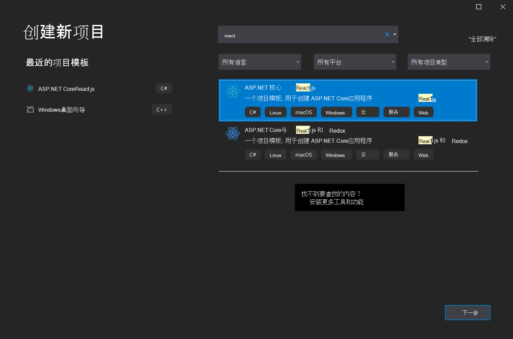

此**React.js**模板指定如何将React.js与 ASP.NET Core应用集成。

现在，你已为 ASP.NET Core Web 应用创建了一个项目。


### <a name="launch-microsoft-edge-from-visual-studio"></a>从 Visual Studio 启动 Microsoft Edge

接下来，在 Visual Studio 中运行和调试 ASP.NET Core Web 应用项目，如下所示：

1. 打开 `ClientApp/src/components/Counter.js`。

1. 选择绿色 **“播放**”按钮旁边的下拉列表，然后**IIS Express**。

   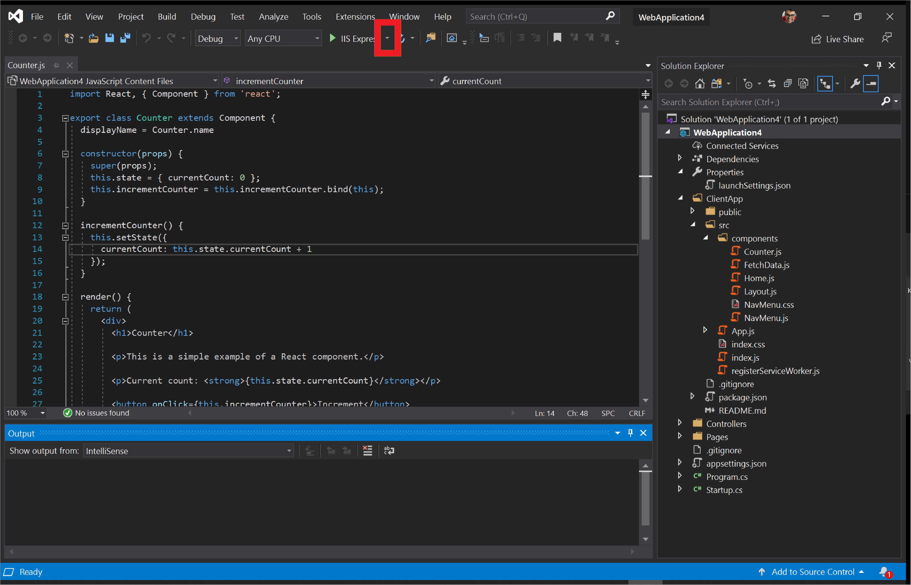

1. 选择 **“已启用****脚本调试** > ”。

   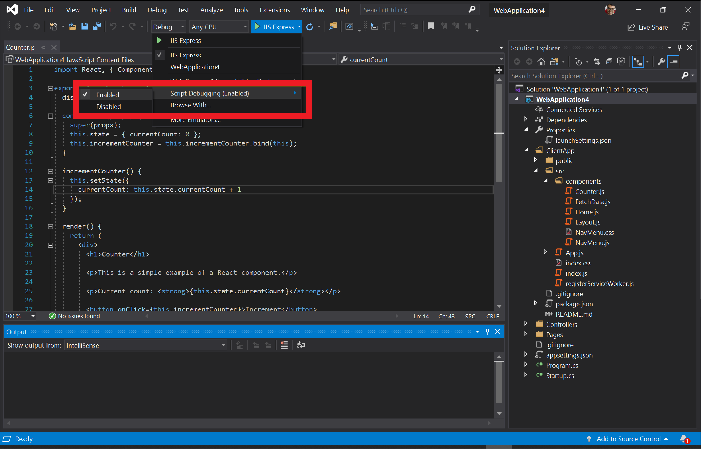

1. 在同一下拉列表中，>要启动 Visual Studio 的 Microsoft Edge 预览频道（如 Microsoft Edge Canary、Dev 或 Beta）选择 **Web 浏览器** 。  如果尚未使用 Microsoft Edge 预览频道之一，请转到 [“下载 Microsoft Edge 预览体验成员频道](https://www.microsoftedgeinsider.com/download) ”下载一个。

   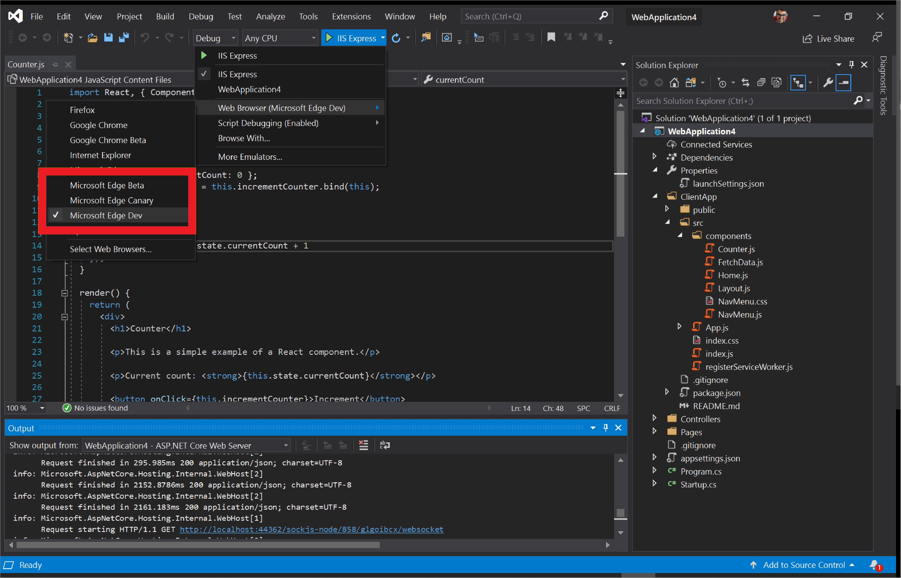

1. 选择绿色 **“播放”** 按钮。  Visual Studio 生成应用、启动 Web 服务器、启动 Microsoft Edge，并导航到 `https://localhost:44362/` 或在 `launchSettings.json`其中指定的任何端口。

   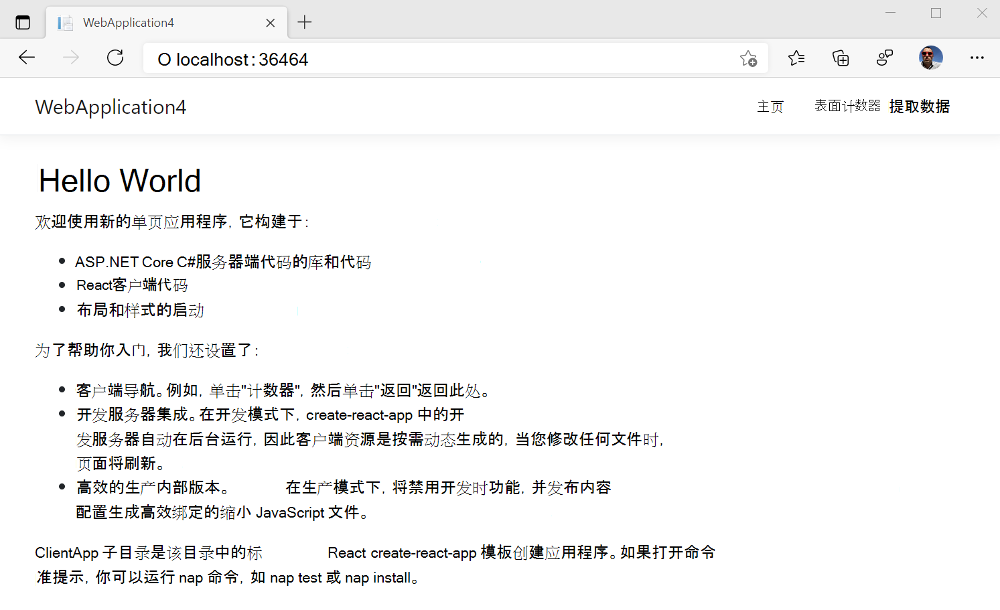

继续执行以下步骤。


### <a name="debug-javascript-code-thats-running-in-microsoft-edge"></a>调试在 Microsoft Edge 中运行的 JavaScript 代码

1. 切换回 Visual Studio 以设置断点。

1. 在 `Counter.js`其中，通过选择线旁的排水沟在 13 行上设置断点。

   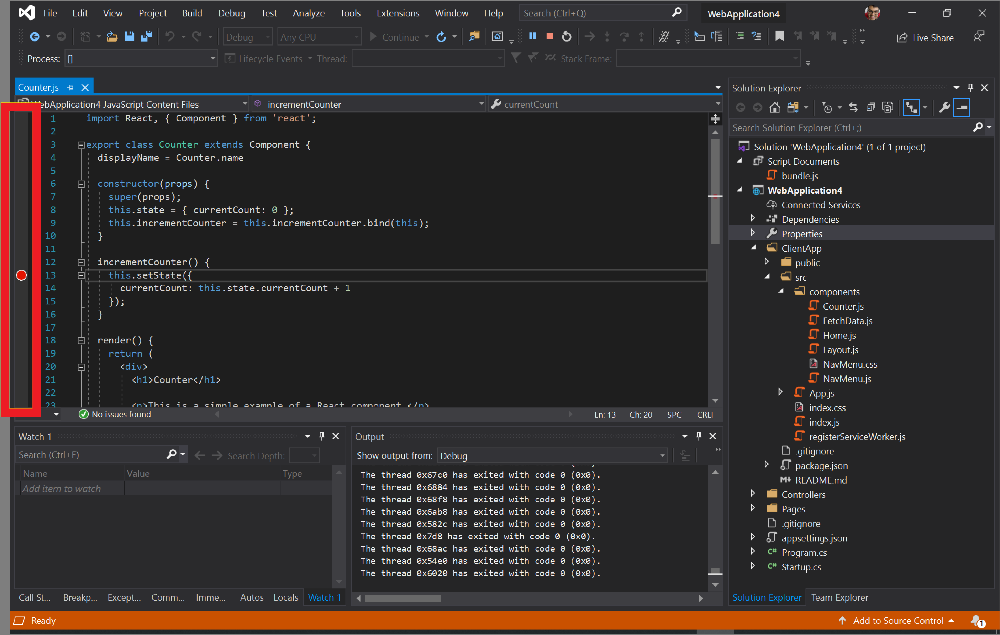

1. 切换回 Visual Studio 启动的 Microsoft Edge 实例。

1. 在网页顶部的导航菜单中选择 **“计数器** ”，然后选择 **“增量**”。

   > [!div class="mx-imgBorder"]
   > 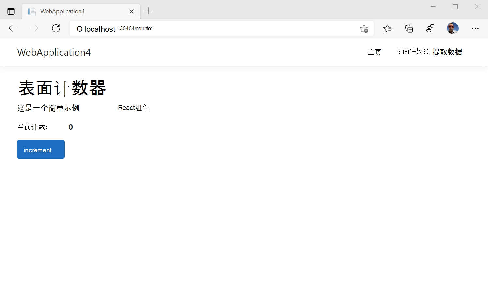

1.  Visual Studio 中的 JavaScript 调试器命中设置的 `Counter.js`断点。  Visual Studio 现在会暂停在 Microsoft Edge 中运行的 JavaScript 的运行时，你可以逐行执行脚本。

   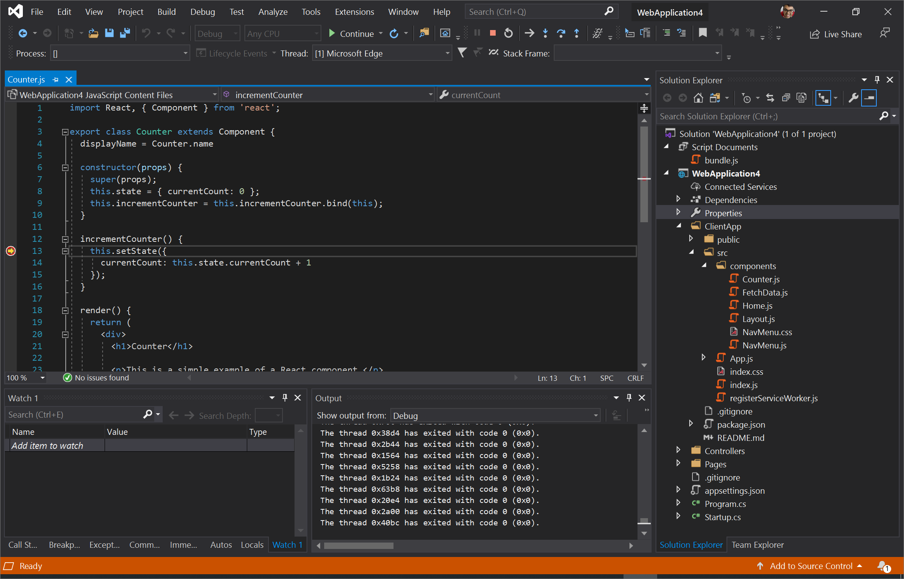

在上述方法中，你从 Visual Studio 推出了 Microsoft Edge。  或者，可以将 Visual Studio 调试器附加到已运行的 Microsoft Edge 实例，如下所述。

此示例只是 Visual Studio 中可用功能的次要演示。  有关 Visual Studio 2019 中的功能的详细信息，请参阅 [Visual Studio 文档](/visualstudio/windows/index)。


<!-- ====================================================================== -->
## <a name="attach-visual-studio-debugger-to-a-running-instance-of-microsoft-edge"></a>将 Visual Studio 调试器附加到正在运行的 Microsoft Edge 实例

若要将 Visual Studio 调试器附加到已运行的 Microsoft Edge 实例，请执行以下操作：

1. 请确保没有正在运行的 Microsoft Edge 实例。

1. 在命令行中，运行以下命令：

   ```console
   start msedge --remote-debugging-port=9222
   ```
    
1. 在 Visual Studio 中，选择 **“调试** > **附加到进程”** 或 `Ctrl`+`Alt`+`P`”

   

1. 在 **“附加到进程** ”对话框中，将 **连接类型** 设置为 **Chrome devtools 协议 Websocket (没有身份验证) **。

1. 在 **“连接目标** ”文本框中，键入 `http://localhost:9222/` 并按下 `Enter`。

1. 查看“ **可用进程** ”部分中列出的 Microsoft Edge 中打开的选项卡列表。

   

1. 从列表中选择要调试的选项卡，然后选择 **“附加**”。

1. 在 **“选择代码类型**”对话框中，选择 **“Microsoft Edge (JavaScript - Chromium) **并选择 **”确定**”。

Visual Studio 调试器现在已附加到 Microsoft Edge。  可以直接在 Visual Studio 的 **“调试输出**”窗口中暂停 JavaScript 的运行、设置断点和查看`console.log()`语句。


<!-- ====================================================================== -->
## <a name="edge-devtools-extension-for-visual-studio"></a>Visual Studio 的 Edge DevTools 扩展

使用 Edge 开发人员工具在 Visual Studio 中调试 ASP.NET 项目。  可以在 Microsoft Visual Studio 中嵌入 Microsoft Edge 开发人员工具以实时调试 ASP.NET 项目。  下载 [适用于 Visual Studio 的 Microsoft Edge 开发人员工具](https://aka.ms/edgetools-for-vs)。 

若要使用扩展，请执行以下操作：

1. 确保安装了 Visual Studio 2022 和 ASP.NET 工作负荷。

1. 如上文所述，将 Web Live Preview 设置为默认Web Forms设计器。

1. 打开 ASP.NET 项目。

1. 在“ **设计** ”窗口中打开项目的网页。

1. 在 **“设计”** 窗口左上角，单击 **“Open Edge DevTools** () 按钮：

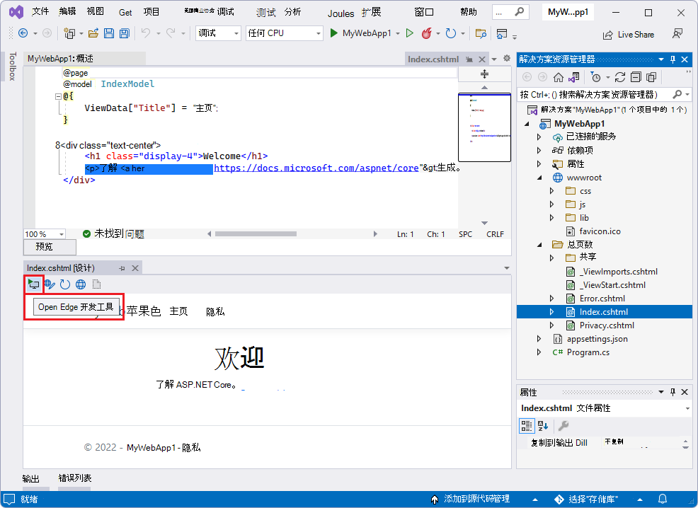

Visual Studio 的 Edge DevTools 随即打开，其中选择了 **“元素** ”工具：

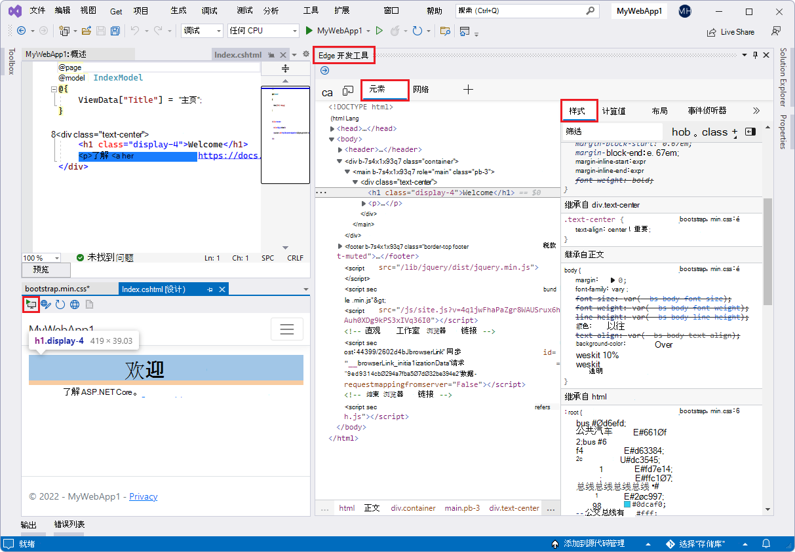

默认情况下， **网络** 工具也处于打开状态：

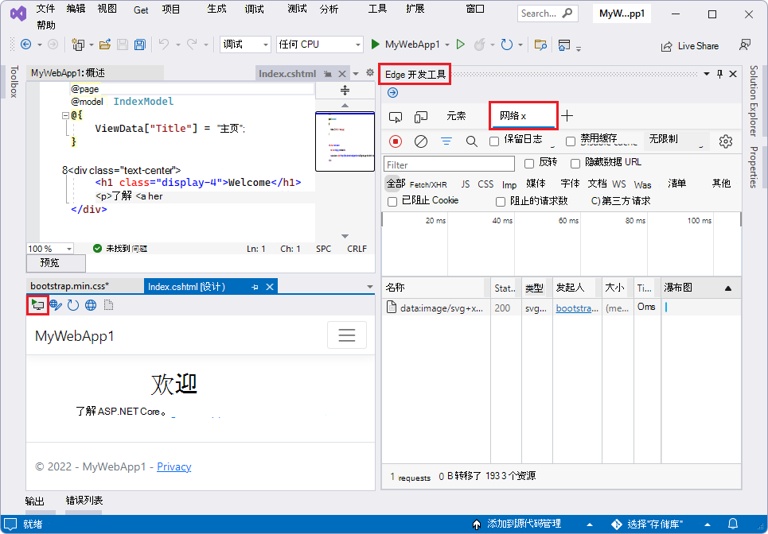

检查 **工具** () 和 **切换屏幕截图** () 可用， **“更多工具** () 菜单提供 [“问题](../devtools-guide-chromium/issues/index.md)”、“ [网络条件](../devtools-guide-chromium/network-conditions/network-conditions-tool.md)”和 [“网络请求阻止](../devtools-guide-chromium/network-request-blocking/network-request-blocking-tool.md) ”工具：

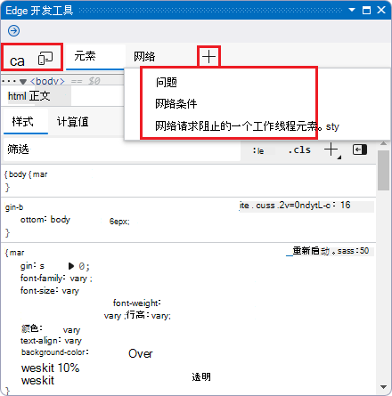


**另请参阅：**

<!-- todo: update url from preview to release: -->
* Visual Studio DevBlogs [中用于 Visual Studio 的 Edge 开发人员工具](https://devblogs.microsoft.com/visualstudio/?p=237066&preview=1&_ppp=7aa7aef54f)。

<!--
* [Microsoft Edge DevTools extension for Visual Studio](../devtools-guide-chromium/whats-new/2022/03/devtools.md#microsoft-edge-devtools-extension-for-visual-studio) in _What's New in DevTools (Microsoft Edge 99)_.
-->


<!-- ====================================================================== -->
## <a name="getting-in-touch-with-the-microsoft-visual-studio-team"></a>与 Microsoft Visual Studio 团队取得联系

Microsoft Visual Studio 和 Microsoft Edge 团队希望详细了解如何在 Visual Studio 中使用 JavaScript。  若要发送反馈，请在 Visual Studio 中选择 **“发送反馈** ”图标或推文 [@VisualStudio and @EdgeDevTools](https://twitter.com/intent/tweet?text=@VisualStudio+@EdgeDevTools) 。


