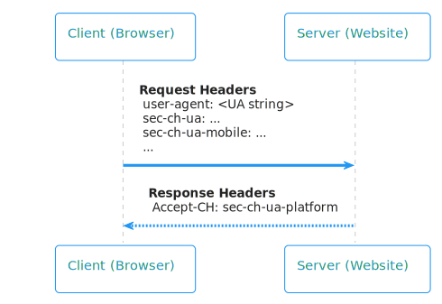

# <a name="detect-windows-11-using-user-agent-client-hints"></a>使用用户代理客户端提示检测 Windows 11

<!--
Restrict the lexicon to these forms:
User-Agent string
user agent string
User-Agent Client Hints
user agent information
-->

网站可以使用从浏览器发送的用户代理信息检测品牌、版本、设备平台等。 网站有两种访问用户代理信息的方法：
*  User-Agent旧版 (字符串) 。
*  User-Agent客户端提示 (推荐) 。

有关这两种方法的详细信息，请参阅[从Microsoft Edge检测数据](user-agent-guidance.md)。

在 Microsoft Edge 和 Chrome 中，网站可以通过 Windows 11 Windows 10 客户端提示User-Agent UA-CH (区分用户) 。 可以在以下 UA-CH 请求标头中找到此信息：

| 头字段 | 指示Windows 10 | 指示Windows 11 |
| --- | --- | --- |
| `Sec-CH-UA-Platform` | `Windows` | `Windows` |
| `Sec-CH-UA-Platform-Version` | 值介于 `1.0.0` 和 之间 `10.0.0` | `13.0.0` 及以上 |

User-Agent字符串不会进行更新以区分Windows 11和Windows 10。  我们不建议使用字符串User-Agent检索用户代理数据。  不支持客户端提示User-Agent将无法区分Windows 11和Windows 10。


<!-- ====================================================================== -->
## <a name="browsers-that-support-user-agent-client-hints"></a>支持客户端提示User-Agent浏览器

下表显示哪些浏览器支持区分Windows 11和Windows 10。

| 浏览器 | 支持通过客户端User-Agent区别？ |
| --- | --- |
| Microsoft Edge 94 及以上 | 是 |
| Chrome 95 及以上 | 是 |
| Opera | 是 |
| Firefox | 否 |
| Internet Explorer 11 | 否 |


<!-- ====================================================================== -->
## <a name="sample-code-for-detecting-windows-11"></a>检测结果的示例Windows 11

以下代码将检测Windows 11：

```javascript
navigator.userAgentData.getHighEntropyValues(["platformVersion"])
 .then(ua => {
   if (navigator.userAgentData.platform === "Windows") {
     const majorPlatformVersion = parseInt(ua.platformVersion.split('.')[0]);
     if (majorPlatformVersion >= 13) {
       console.log("Windows 11 or later");
      }
      else if (majorPlatformVersion > 0) {
        console.log("Windows 10");
      }
      else {
        console.log("Before Windows 10");
      }
   }
   else {
     console.log("Not running on Windows");
   }
 });

```


<!-- ====================================================================== -->
## <a name="optimizing-detection-performance-with-critical-ch"></a>使用 优化检测性能 `Critical-CH`

目前，网站服务器必须将响应标头发送到浏览器客户端，以请求默认情况下未在标头中发送的较高信息 `Accept-CH` `Sec-CH-UA` 向域。 下图显示了浏览器向服务器发送请求标头，包括 和 `user agent: <UA string>` 接收响应标头，包括 `Accept-CH: sec-ch-ua-platform` 。

<!-- To edit SVG go to link: http://www.plantuml.com/plantuml/uml/LOrDIWD144RtVOeogpZGSu11Gc8sMIlYnasbyvaqz4zRLQtNTsH0CgiFwZtgxTLOhEVa7ko63CfiaCY-TaknmBKPnn0R5wFDCKNCktsM-gEGnmsnKbWxhv1l26tVSTPeM1nrWVoETA9XUC5NXngTm1U83WDz5EeAyNn5iOcUtWwa9h5STtz84Nou-SuJZUEuklXSpp7X7ypZrC-Xi8IqrQ9ObmuXe9a_dgQxFosnVLR9RezowJdz0W00 -->


在此初始请求期间，客户端将记录首选项，并默认在后续 `Accept-CH` 请求中包括 `sec-ch-ua-platform` 首选项。 

为了进一步优化此流，除了标头之外，还可以使用新标头立即重新发送请求标头，而无需 `Critical-CH` `Accept-CH` 重新加载页面。 下图显示了浏览器向服务器发送请求标头，包括 和 `user agent: <UA string>` 接收响应标头，包括 `Accept-CH: sec-ch-ua-platform` 和 `Critical-CH: sec-ch-ua-platform` 。 然后，浏览器立即向服务器发送请求标头。

<!-- To edit SVG go to link: http://www.plantuml.com/plantuml/uml/lOz1ImCn48Nl-ol6dkf2-WCMAQrxwLaHBrwcwRCD9DauCz6_RvQYk8XNJmFpFjx7swcnM4snkx4B4YYnGGAxgLeC6LrfSV2XS3PQZJ6WtVMzJ1yAkLqHA_abymXvXz3w6KSDXYkZdIUt9Hsexn_mLg561_09edrFBvcgGXoVM_j0TqzxKfEGpzivKdZdBwxoG9lDPl5nQJg6YE-WdKvT4_chICkK5KlJtdiKS-DX-D5J8jlh96a6HWbj3SU_aF-Pybly5SqZTyYdck8d -->


从 Microsoft Edge版本 96 开始，可以使用新标头接收具有优化性能的所需高向 `Critical-CH` 度标头。 

请记住， `Critical-CH` 和首选项将一直保留，直到清除会话 Cookie，或者直到用户清除给定源的站点数据或 `Accept-CH` Cookie。 有关 有关详细信息， `Critical-CH` 请参阅客户端 [提示可靠性](https://github.com/WICG/client-hints-infrastructure/blob/main/reliability.md)。


<!-- ====================================================================== -->
## <a name="detecting-specific-windows-versions"></a>检测特定Windows版本

若要检测特定版本的Windows，请使用客户端提示中的User-Agent `platformVersion` 值：

| 版本 | `platformVersion` |
| --- | --- | --- |
| Win7/8/8.1 | 0 |
| Win10 1507 | 1 |
| Win10 1511 | 2 |
| Win10 1607 | 3 |
| Win10 1703 | 4 |
| Win10 1709 | 5 |
| Win10 1803 | 6 |
| Win10 1809 | 7 |
| Win10 1903 | 8 |
| Win10 1909 | 8 |
| Win10 2004 | 10 |
| Win10 20H2 | 10 |
| Win10 21H1 | 10 |
| Win11 | 13+ |
