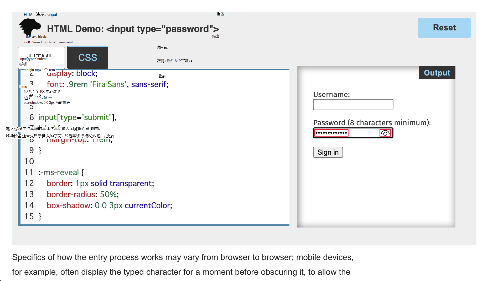

# <a name="customize-the-password-reveal-button"></a>自定义“密码显示”按钮

键入`password`的输入Microsoft Edge密码**显示**按钮。  若要确保正确输入**** 密码，用户可以`Alt`+`F8`单击密码显示按钮或按 ，以显示密码字段中的字符。  你可以删除密码显示控件，或自定义控件样式。

默认情况下，**密码显示**按钮已关闭，因此在密码字段中，点替换用户输入的字符****。  密码**显示**按钮显示为眼睛形图标，显示在密码**** 字段的右侧：



当用户单击密码 **显示** 按钮将其打开时，将显示密码文本，目视图标将发生更改，其上会显示斜杠：


默认情况下， **密码显示** 按钮插入到所有 HTML `input` `type` 元素的 Shadow DOM 中，并将其设置为 `"password"`。  从 Microsoft Edge版本 87 开始，用户或[企业](/deployedge/microsoft-edge-policies#passwordrevealenabled)可以全局禁用此功能。  Web 设计人员和开发人员应该希望大多数Microsoft Edge用户拥有默认体验。

<!--
these might be outdated style: not used in .md files:


-->


<!-- ====================================================================== -->
## <a name="remove-the-password-reveal-control"></a>删除密码显示控件

作为网页作者，您可以通过面向伪元素来完全**** 删除密码`::-ms-reveal`显示按钮：

```css
::-ms-reveal {
    display: none;
}
```

但是，你应该考虑利用密码 **显示** 按钮。  本机 **密码显示** 按钮在行为 [中](#visibility-of-the-control) 内置了重要的安全措施。


<!-- ====================================================================== -->
## <a name="customize-the-control-style"></a>自定义控件样式

你可以改为修改密码显示按钮的样式，以更好地匹配网站的视觉语言，**** 而不是完全删除控件。  以下代码段提供了此类样式的示例：

```css
::-ms-reveal {
    border: 1px solid transparent;
    border-radius: 50%;
    box-shadow: 0 0 3px currentColor;
}
```

设置密码显示按钮样式时，请记住 **以下** 事项：

*  目视图标实现为背景图像。  若要向密码显示按钮添加背景 **色** ，请使用 CSS `background-color` 属性而不是 `background` 速记属性。

*  你可以调整密码显示按钮的大小 **和** 缩放比例。

   > [!NOTE]
   > 浏览器将隐藏密码输入控件边界之外的任何溢出。

*  目前，没有状态选择器可用于设置密码显示按钮的切换 **状态** 样式。


<!-- ====================================================================== -->
## <a name="visibility-of-the-control"></a>控件的可见性

在 **用户向** 密码字段中输入文本之前，密码显示 **按钮不可用** 。  为了帮助确保用户的密码输入安全，浏览器在下列情况下禁止显示该按钮：

*   如果焦点从密码 **字段移** 开，浏览器将删除 **密码显示** 按钮。

*   如果脚本修改 **密码** 字段，浏览器将删除 **密码显示** 按钮。

如果**删除密码**显示按钮，用户必须删除密码字段的内容，使**密码显示按钮**再次显示。**** 如果用户离开未锁定的设备，此行为将阻止某人进行细微的调整以显示密码。

如果使用**密码**管理器自动填充密码字段，**** 则密码显示按钮不可用。
