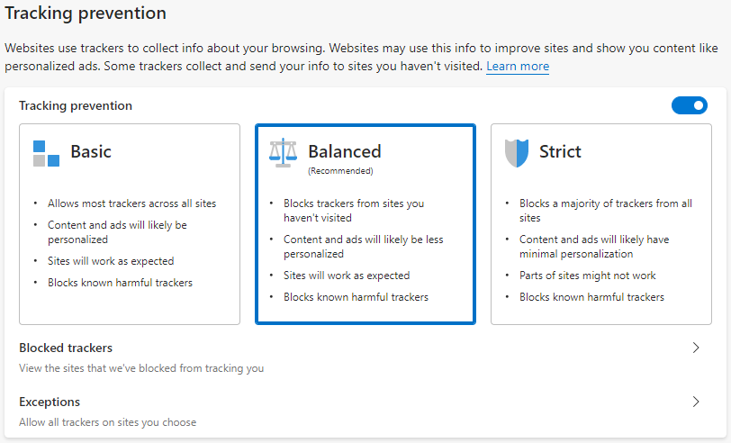
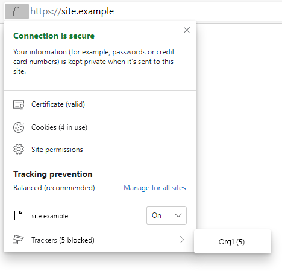

# Microsoft Edge 中的跟踪防护

跟踪防护功能Microsoft Edge跟踪器访问基于浏览器的存储和网络的功能，从而防止用户进行联机跟踪。

跟踪防护功能专为实现浏览器Microsoft Edge承诺而构建，同时还确保默认情况下对网站兼容性或 Web 经济适用性没有影响。

<!-- ====================================================================== -->
## 跟踪防护级别

Microsoft Edge目前为用户提供三个级别的跟踪防护，这三个级别通过导航到 来选择`edge://settings/privacy`。

1. **基本** - 针对喜欢个性化广告的用户和不想在 Web 上跟踪的用户设计的限制性最低级别的跟踪防护。  基本仅保护用户免受恶意跟踪器（如指纹和加密器）的攻击。

1. **平衡 (默认 **) - 针对希望查看个性化程度较低广告的用户而设计的默认跟踪防护级别，同时最大限度地减少在浏览 Web 时兼容性问题的风险。  平衡旨在阻止来自用户从未接触过的网站的跟踪器。

1. **严格** - 最严格的跟踪防护级别，专为允许交易网站兼容性以最大隐私的用户设计。

Microsoft Edge中的跟踪防护功能由三个主要组件组成，这三个组件协同工作，以确定网站中的特定资源是否应该归类为跟踪器并阻止。  组件如下所示：

* **Classification** - Microsoft Edge URL 是否属于跟踪器的方式。

* **强制** - 保护用户Microsoft Edge被分类为跟踪器 URL 的操作。

* **缓解** - 提供的机制可确保用户指定的收藏夹网站仍可工作，同时提供强大的默认保护。

将浏览每个组件，并在此页上详细介绍。

<!-- ====================================================================== -->
## 分类

跟踪防护功能的第一个组件是Microsoft Edge分类。  若要对联机跟踪器进行分类并分组到类别中，Microsoft Edge"[断开开放源代码](https://disconnect.me)[跟踪保护"列表](https://github.com/disconnectme/disconnect-tracking-protection)。  列表通过"信任保护列表"组件传递，该组件在 中可查看 `edge://components`。  下载后，列表存储在磁盘上，您可以使用它们确定是否或如何对特定 URL 进行分类。

若要确定 Microsoft Edge 中的分类系统是否将 URL 视为跟踪程序，将检查一系列主机名，首先检查完全匹配，然后继续检查顶级域之外最多四个标签的部分匹配。

> **示例**：
>
> URL： `https://a.subdomain.of.a.known.tracker.test/some/path`
>
> 测试的主机名：
>
> *   `a.subdomain.of.a.known.tracker.test`
> *   `of.a.known.tracker.test`
> *   `a.known.tracker.test`
> *   `known.tracker.test`
> *   `tracker.test`

如果这些主机名中的任一主机名与断开连接列表上的主机名匹配，Microsoft Edge评估强制操作以防止跟踪用户。

<!-- ====================================================================== -->
## 强制

若要防止跟踪 Web 上的操作，Microsoft Edge对分类跟踪器执行两个强制操作：

*  **限制存储**访问 - 如果已知跟踪资源尝试访问可能尝试保留有关用户的数据的任何 Web 存储，Microsoft Edge阻止该访问。  这包括限制该跟踪器获取或设置 Cookie 以及访问存储 API（如 和 `IndexedDB` ）的能力 `localStorage`。

*  阻止**资源**加载 - 如果在网站上加载已知跟踪资源，Microsoft Edge 可能会阻止该加载，直到请求到达网络，具体取决于负载的兼容性影响以及用户设置的跟踪防护设置。  阻止的负载可能包括跟踪脚本、像素、iframe 等。  这可以防止任何数据被发送到跟踪域，甚至可能会改善加载时间以及页面性能作为副作用。

用户可以选择地址栏左侧的页面信息飞出图标，以找出特定页面上阻止的跟踪器：

如何应用强制取决于用户选择的跟踪防护级别以及可能应用的缓解。

<!-- ====================================================================== -->
## 缓解

为了确保尽可能保持 Web 兼容性，Microsoft Edge三种缓解措施，以帮助平衡特定情况下的强制。  这些是组织[关系缓解、](#org-relationship-mitigation)[组织参与缓解](#org-engagement-mitigation)和 [CompatExceptions 列表](#the-compatexceptions-list)。

在深入分析缓解之前，需要先定义"组织"或"组织"这一概念。  [Disconnect](https://disconnect.me) 还维护一个称为 [entities.json](https://github.com/disconnectme/disconnect-tracking-protection/blob/master/entities.json) 的列表，该列表定义由同一父组织/公司拥有的 URL 组。  组织中的跟踪防护功能Microsoft Edge组织关系缓解和组织参与缓解中使用此列表，以最大程度地减少因跟踪防护（影响跨组织请求）导致的兼容性问题的发生。

### 组织关系缓解

多个热门网站同时维护网站和内容交付网络 (CDN) 为这些网站提供静态资源和内容。  为了确保这些类型的方案不受跟踪防护的影响，Microsoft Edge 当网站向同一父组织 (拥有的其他网站提出第三方请求时，Microsoft Edge 会免除网站跟踪防护，如 [Disconnect entities.json](https://github.com/disconnectme/disconnect-tracking-protection/blob/master/entities.json) 列表) 中的定义。  这一点最好通过一个示例来说明。

> **示例：**
>
> 名为 Org1 的组织拥有域 `org1.test` `org1-cdn.test`和 ，如 [Disconnect entities.json 列表中的定义](https://github.com/disconnectme/disconnect-tracking-protection/blob/master/entities.json)。  Imagine分类`org1-cdn.test`为跟踪器，并且通常会应用跟踪防护强制。  如果用户访问`https://org1.test``https://org1-cdn.test``org1-cdn.test`网站并尝试从 加载资源，Microsoft Edge不会对请求执行任何强制操作，即使它不是第一方 URL。  但是，如果另一个不是 Org1 组织的一部分的 URL 尝试加载同一资源，则请求将受强制执行，因为它不是同一组织的一部分。
>
> 尽管这可放宽对属于同一组织的网站的跟踪防护措施，但不太可能带来很高的隐私风险，因为此类组织能够确定您访问过的网站/`https://org1.test``https://org1-cdn.test`资源以及使用内部后端数据。

### 组织参与缓解

创建组织参与缓解是为了确保用户充分参与的组织所拥有的网站继续按预期在 Web 上工作，从而最大限度地降低通过跟踪防护引入的兼容性风险。  它利用网站参与来在用户与给定网站建立持续关系 (当前由网站参与分数 4.1 或更高) 来限制强制执行。  这一点最好通过一个示例来说明：

> **示例：**
>
> 名为 Social Org 的组织拥有域 和 `social.example` `social-videos.example`。
>
> 如果用户与 Social Org 拥有的任何一个域建立了 4.1 或更高的网站参与度分数，则认为他们与 Social Org 有关系。
>
> `https://content-embedder.example`如果另一个网站 包含第三方内容 (`social-videos.example` 则表明来自) 的嵌入视频来自 Social Org 拥有的任何域，该视频通常会通过跟踪预防强制执行进行限制，则只要 Social Org 拥有域的用户网站参与度分数维持在阈值之上，该网站就免于跟踪防护实施。
>
> 如果网站不属于组织，用户必须直接使用网站参与度分数 4.1 或更高，然后才能放宽跟踪防护施加的任何存储访问/资源负载阻止。

组织参与缓解当前仅在平衡模式下应用，Microsoft Edge为已选择使用 Strict 的用户提供可能的最高保护。

### CompatExceptions 列表

根据 Microsoft 收到的最新用户反馈，Microsoft Edge 维护了一小部分网站列表 (其中大多数网站位于断开连接内容类别) 尽管已执行上述两项缓解措施，但由于跟踪防护，这些网站仍发生中断。 此列表上的网站免于跟踪防护实施。  可以在磁盘上的以下位置 [找到](#determining-whetherhow-a-particular-url-is-classified) 该列表。  用户可以使用 中的"阻止" **选项覆盖其** 上的条目 `edge://settings/content/cookies`。

为了避免继续维护此列表，Microsoft 目前正在开发开放源代码存储 [Access API](https://github.com/MicrosoftEdge/MSEdgeExplainers/blob/master/StorageAccessAPI/explainer.md)。  [存储 Access API](https://github.com/MicrosoftEdge/MSEdgeExplainers/blob/master/StorageAccessAPI/explainer.md) 为网站开发人员提供了直接从用户请求存储访问权限的方法，为用户提供了有关其隐私设置如何影响其浏览体验的透明度，并给予网站开发人员控件快速直观地取消阻止。

实施 [存储 Access API](https://github.com/MicrosoftEdge/MSEdgeExplainers/blob/master/StorageAccessAPI/explainer.md) 后，Microsoft 将弃用 CompatExceptions 列表并联系受影响的站点，以让他们了解问题，并请求他们今后使用 [存储 Access API](https://github.com/MicrosoftEdge/MSEdgeExplainers/blob/master/StorageAccessAPI/explainer.md)。

<!-- ====================================================================== -->
## 当前跟踪防护行为

下表显示了应用于每个分类跟踪器类别中的强制执行操作和Microsoft Edge。

*  顶部是断开连接跟踪保护列表类别定义的跟踪 [程序类别](https://github.com/disconnectme/disconnect-tracking-protection/blob/master/services.json)。
*  左侧是 Microsoft Edge (Basic、Balanced 和 Strict) 中的三个级别的跟踪) 。
*  该 `S` 字母指示阻止存储访问。
*  该 `B` 字母指示存储访问和资源负载 (如网络请求) 阻止。
*  连字符 (`-`) 指示存储访问或资源负载没有应用块。

| | 放大 | 分析 | 内容 | 加密 | 指纹 | 社交 | Other | 同一组织缓解 | 组织参与缓解 |
| - | - | - | - | - | - | - | - | - | - | - |
| **基本** | - | - | - | B | B | - | - | 启用 | 不适用 |
| **平衡** | S | - | S | B | B | S | S | 已启用 | 已启用 |
| **“严格”** | B | B | S | B | B | B | B | 已启用 | 禁用 |

> [!NOTE]
> 组织参与缓解不适用于加密或指纹类别。

> [!TIP]
> 严格模式可阻止比 Balanced 更多的资源负载。  阻止更多资源负载可能会导致出现严格模式，以阻止比 Balanced 更少的跟踪请求，因为从不加载提出请求的跟踪器。

> [!NOTE]
> "当前跟踪防护 [行为"](#current-tracking-prevention-behavior) 中的"指纹"列指除其他列表外，"指纹"列表上的跟踪器。  仅出现在指纹列表上的跟踪器被视为非恶意指纹，并且不会被阻止。

### InPrivate 行为

在 Microsoft Edge 79 中，默认行为是在 InPrivate 中应用 Strict 模式保护。  在 Microsoft Edge 80 `edge://settings/privacy` 中，此行为已替换为 中的开关，允许用户在浏览 InPrivate 时决定是应用严格模式保护还是保留其常规设置。

<!-- ====================================================================== -->
## 确定是否/如何对特定 URL 进行分类

若要确定是否将特定 URL 分类为已知跟踪器：

1. 打开 DevTools 并打开 **控制台** 工具。

1. 刷新网页。

   你可能需要首先清除 **Cookie 和其他网站** 数据，以重置网站参与度分数并确保完全干净。

1. 查找读取 的任何邮件 `Tracking Prevention blocked access to storage for <URL>`。  您可以展开消息以查看被阻止的单个 URL。

1. 如果需要确定特定阻止的网站属于哪个类别，最简单的方法是在 [Disconnect services.json 列表中搜索它](https://github.com/disconnectme/disconnect-tracking-protection/blob/master/services.json)。  条目按字母顺序排序，因此滚动到网站项块的顶部使您能够查找特定网站的特定类别。

### 存储在磁盘上的访问跟踪防护列表

如果需要访问磁盘上存储的跟踪防护列表，可以在以下两个位置之一找到每个列表：

**基于组件的更新** - 从"信任保护列表"组件下载的列表

窗口： `%LOCALAPPDATA%\Microsoft\Edge <OptionalChannelName>\User Data\Trust Protection Lists`

macOS： `~/Library/Application Support/Microsoft Edge <OptionalChannelName>/Trust Protection Lists`

**安装目录** - 与安装程序捆绑Microsoft Edge列表。  如果你选择了不同的安装目录，你的精确路径可能会有所不同。

窗口： `%PROGRAMFILES(x86)%\Microsoft\ Edge <OptionalChannelName>\Application<Version>\Trust Protection Lists`

macOS： `/Applications/Microsoft Edge.app/Contents/Frameworks/Microsoft Edge Framework.framework/Libraries/Trust Protection Lists`

<!-- ====================================================================== -->
## 常见问题

以下部分包含有关跟踪防护功能在Microsoft Edge。

**是否有一种方法可以阻止或允许特定跟踪器用于调试目的？**

目前，Microsoft Edge公开禁用跟踪防护强制在指定网站上运行的选项。  可通过页面信息飞出或通过页面访问 `edge://settings/privacy/trackingPreventionExceptions` 此选项。

也就是说，页面上的 **"** **** `edge://settings/content/cookies`阻止"和"允许"选项可用于允许或拒绝特定域访问存储，如 Cookie 和其他浏览器存储机制。  这可用于调试由跟踪阻止访问特定网站的存储的防护强制导致的站点问题。
