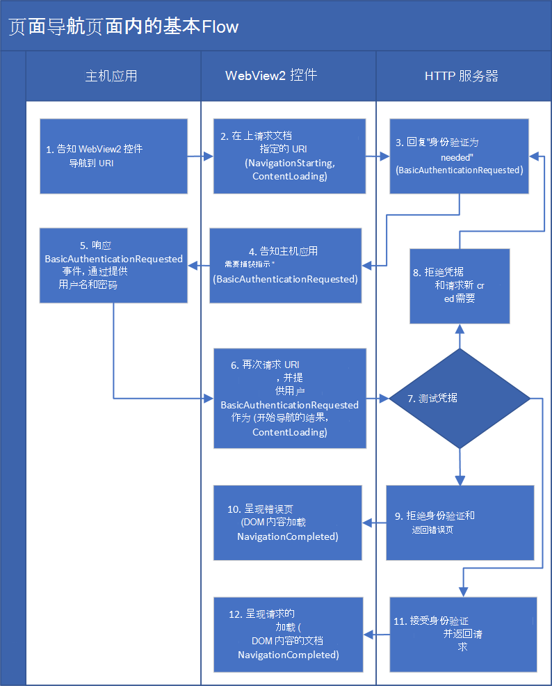

# <a name="basic-authentication-for-webview2-apps"></a>WebView2 应用的基本身份验证

_基本_ 身份验证是 [一种](https://developer.mozilla.org/docs/Web/HTTP/Authentication) 属于 HTTP 协议的身份验证方法。

WebView2 应用的基本身份验证包括从 HTTP 服务器检索网页的一系列身份验证和导航步骤。  WebView2 控件充当主机应用和 HTTP 服务器之间通信的中介。


<!-- ====================================================================== -->
## <a name="use-https-for-sending-credentials"></a>使用 HTTPS 发送凭据

警告：使用基本身份验证时必须使用 HTTPS。  否则，用户名和密码不加密。 您可能需要考虑其他形式的身份验证。

基本身份验证的 HTTP 标准包括未加密 (用户名和密码) 凭据。 因此，必须使用 ， `https`以确保凭据已加密。


<!-- ====================================================================== -->
## <a name="the-order-of-navigation-events"></a>导航事件的顺序

基本身份验证事件在事件序列的中间发生：

1. `NavigationStarting` - 导航事件
1. `ContentLoading` - 导航事件
1. `BasicAuthenticationRequested`
1. `DOMContentLoaded`
1. `NavigationCompleted` - 导航事件

有关详细信息，请参阅 [WebView2 应用的导航事件](navigation-events.md)。


<!-- ====================================================================== -->
## <a name="communication-between-the-http-server-webview2-control-and-host-app"></a>HTTP 服务器、WebView2 控件和主机应用之间的通信

*  **HTTP 服务器检查**身份验证 (用户名和密码凭据) 并返回错误文档或请求的网页。

*  **WebView2 控件**实例引发事件。  WebView2 控件位于 HTTP 服务器和主机应用之间。  WebView2 控件充当主机应用和 HTTP 服务器之间通信的中介。

*  编写主机 **应用**。  主机应用在响应对象中设置事件参数 () `EventArgs` 密码。

`BasicAuthenticationRequestedEventArgs` 具有 属性 `Response` 。  属性 `Response` 是包含用户名和密码属性的对象。


<!-- ====================================================================== -->
## <a name="sequence-of-navigation-events"></a>导航事件序列

下图显示了 WebView2 应用的基本身份验证的导航事件流：


<!-- initial Visio filename: https://microsoft-my.sharepoint.com/ ... "Basic Auth in Page Nav Flow.vsd"
later, check:  Teams > Team > channel > Files > dir > filename -->

<!-- diagram labels in comments: -->

1. 主机应用指示 WebView2 控件导航到 URI。
   <!-- "1. Tells the WebView2 control to navigate to a URI" -->

1. WebView2 控件与 HTTP 服务器通信，请求获取位于指定 URI 的文档。
   <!-- "2. Requests the document at a specified URI (NavigationStarting, ContentLoading)" -->

1. HTTP 服务器答复 WebView2 控件，指出"未经身份验证 (无法获取) URI"。
   <!-- "3. Replies "Authentication is needed" (BasicAuthenticationRequested)" -->

1. WebView2 控件指示主机应用"需要身份验证" (这是事件 `BasicAuthenticationRequested`) 。
   <!-- "4. Tells host app "Authentication is needed" (BasicAuthenticationRequested)" -->

1. 主机应用通过向 WebView2 控件提供用户名和密码来响应该事件。
   <!-- "5. Responds to BasicAuthenticationRequested event by providing the username and password" -->

1. WebView2 控件再次从 HTTP 服务器请求 URI，但这次使用的是身份验证 (用户名和密码) 。
   <!-- "6. Requests the URI again, providing username & password as a BasicAuthenticationRequested result (NavigationStarting, ContentLoading)" -->

1. HTTP 服务器对用户名和密码 (凭据) 。
   <!-- "7. Tests the credentials" -->

1. HTTP 服务器可能会拒绝凭据并请求新的凭据。
   <!-- "8. Denies credentials and requests new credentials" -->

1. HTTP 服务器可能会拒绝用户名和密码;它可能会告诉 WebView2 控件"你不允许获取该 URI/文档"。
   <!-- "9. Denies authentication and returns an error page" -->

1. WebView2 控件呈现 HTTP 服务器返回的错误页。  呈现发生在事件和 `ContentLoading` 事件 `DOMContentLoaded` 之间。
   <!-- "10. Renders the error page (DOMContentLoaded, NavigationCompleted)" -->
   
1. HTTP 服务器可能会接受身份验证凭据并返回请求的文档。
   <!-- "11. Accepts authentication and returns the requested document" -->

1. WebView2 控件呈现返回的文档。  呈现发生在事件和 `ContentLoading` 事件 `DOMContentLoaded` 之间。
   <!-- "12. Renders the requested document (DOMContentLoaded, NavigationCompleted)" -->


<!-- ====================================================================== -->
## <a name="example-code-app-providing-credentials-that-are-known-ahead-of-time"></a>示例代码：提供提前已知凭据的应用

以下简化示例演示提供凭据的主机 (用户名和密码) 提前已知。  [此示例是 WebView2Samples 存储库 > ScenarioAuthentication.cpp](https://github.com/MicrosoftEdge/WebView2Samples/blob/d78d86f1646b6c652908f1e4bc2b64950f05ca0a/SampleApps/WebView2APISample/ScenarioAuthentication.cpp) 中代码的稍微>修改的版本。

此示例不现实，因为：

*  实际上，你会提示用户输入用户名和密码，而不是像 和 那样硬将它们硬行`"user"`。`"pass"`
*  此代码是同步的，但你可能会改为使用异步代码。

有关更真实的代码，请参阅后续部分。

<!-- ------------------------------ -->

# [<a name="c"></a>C#](#tab/csharp)

```csharp
// Prerequisite: Before using this code, make sure you read the section "Use HTTPS 
// for sending credentials" in this article.
    webView.CoreWebView2.BasicAuthenticationRequested += delegate (
       object sender, 
       CoreWebView2BasicAuthenticationRequestedEventArgs args)
    {
        args.Response.UserName = "user";
        args.Response.Password = "pass";
    };
```

**API：**

* [CoreWebView2.BasicAuthenticationRequested 事件](/dotnet/api/microsoft.web.webview2.core.corewebview2.basicauthenticationrequested)
* [CoreWebView2BasicAuthenticationRequestedEventArgs 类](/dotnet/api/microsoft.web.webview2.core.corewebview2basicauthenticationrequestedeventargs)

<!-- ------------------------------ -->

# [<a name="c"></a>C++](#tab/cpp)

```cpp
// Prerequisite: Before using this code, make sure you read the section "Use HTTPS 
// for sending credentials" in this article.
if (auto webView10 = m_webView.try_query<ICoreWebView2_10>())
{
   CHECK_FAILURE(webView10->add_BasicAuthenticationRequested(
      Callback<ICoreWebView2BasicAuthenticationRequestedEventHandler>(
            [this](
               ICoreWebView2* sender,
               ICoreWebView2BasicAuthenticationRequestedEventArgs* args)
            {
               wil::com_ptr<ICoreWebView2BasicAuthenticationResponse> basicAuthenticationResponse;
               CHECK_FAILURE(args->get_Response(&basicAuthenticationResponse));
               CHECK_FAILURE(basicAuthenticationResponse->put_UserName(L"user"));
               CHECK_FAILURE(basicAuthenticationResponse->put_Password(L"pass"));

               return S_OK;
            })
            .Get(),
      &m_basicAuthenticationRequestedToken));
}
else
{
   FeatureNotAvailable();
}
```

**API：**

* [ICoreWebView2BasicAuthenticationRequestedEventHandler](/microsoft-edge/webview2/reference/win32/icorewebview2basicauthenticationrequestedeventhandler)
* [ICoreWebView2BasicAuthenticationRequestedEventArgs](/microsoft-edge/webview2/reference/win32/icorewebview2basicauthenticationrequestedeventargs)
   * `get_Cancel`
   * `put_Cancel`
   * `get_Challenge`
   * `get_Response`
   * `get_Uri`
   * `GetDeferral`

---


<!-- ====================================================================== -->
## <a name="example-code-prompting-user-for-credentials"></a>示例代码：提示用户输入凭据

此示例演示主机应用提示用户输入凭据 (用户名和密码) 使用异步代码。

此示例基于以上示例，通过添加以下功能：
*  显示一个对话框，提示用户输入用户名和密码。
*  对 参数 `GetDeferral` 调用 `event` 方法。

<!-- ------------------------------ -->

# [<a name="c"></a>C#](#tab/csharp)

```csharp
// Prerequisite: Before using this code, make sure you read the section "Use HTTPS 
// for sending credentials" in this article.
webView.CoreWebView2.BasicAuthenticationRequested += delegate (
    object sender, 
    CoreWebView2BasicAuthenticationRequestedEventArgs args)
{
    // We need to show UI asynchronously so we obtain a deferral.
    // A deferral will delay the CoreWebView2 from
    // examining the properties we set on the event args until
    // after we call the Complete method asynchronously later.
    // This gives us time to asynchronously show UI.
    CoreWebView2Deferral deferral = args.GetDeferral();

    // We avoid potential reentrancy from running a message loop in the
    // event handler by showing our download dialog later when we
    // complete the deferral asynchronously.
    System.Threading.SynchronizationContext.Current.Post((_) =>
    {
        using (deferral)
        {
            // When prompting the end user for authentication its important
            // to show them the URI or origin of the URI that is requesting
            // authentication so the end user will know who they are giving
            // their username and password to.

            // Its also important to display the challenge to the end user
            // as it may have important site specific information for the
            // end user to provide the correct username and password.

            // Use an app or UI framework method to get input from the end user.
            TextInputDialog dialog = new TextInputDialog(
                title: "Authentication Request",
                description: "Authentication request from " + args.Uri + "\r\n" +
                    "Challenge: " + args.Challenge,
                defaultInput: "username\r\npassword");
            bool userNameAndPasswordSet = false;

            if (dialog.ShowDialog().GetValueOrDefault(false))
            {
                string[] userNameAndPassword = dialog.Input.Text.Split(
                    new char[] { '\r', '\n' }, StringSplitOptions.RemoveEmptyEntries);
                if (userNameAndPassword.Length > 1)
                {
                    args.Response.UserName = userNameAndPassword[0];
                    args.Response.Password = userNameAndPassword[1];
                    userNameAndPasswordSet = true;
                }
            }

            // If we didn't get a username and password from the end user then
            // we cancel the authentication request and don't provide any
            // authentication.
            if (!userNameAndPasswordSet)
            {
                args.Cancel = true;
            }
        }
    }, null);
};
```

**API：**

* [CoreWebView2BasicAuthenticationRequestedEventArgs 类](/dotnet/api/microsoft.web.webview2.core.corewebview2basicauthenticationrequestedeventargs)
   * 属性：
       * `Cancel`
       * `Challenge`
       * `Response`
       * `Uri`
   * 方法：
      * `GetDeferral()`

<!-- ------------------------------ -->

# [<a name="c"></a>C++](#tab/cpp)

```cpp
// Prerequisite: Before using this code, make sure you read the section "Use HTTPS 
// for sending credentials" in this article.
if (auto webView10 = m_webView.try_query<ICoreWebView2_10>())
{
    CHECK_FAILURE(webView10->add_BasicAuthenticationRequested(
        Callback<ICoreWebView2BasicAuthenticationRequestedEventHandler>(
            [this](
                ICoreWebView2* sender,
                ICoreWebView2BasicAuthenticationRequestedEventArgs* argsRaw)
            {
                // Make a smart pointer copy of the event args so we can take it
                // into our lambda below.
                wil::com_ptr<ICoreWebView2BasicAuthenticationRequestedEventArgs>
                    args = argsRaw;

                // We need to show UI asynchronously so we obtain a deferral.
                // A deferral will delay the CoreWebView2 from
                // examining the properties we set on the event args until
                // after we call the Complete method asynchronously later.
                // This gives us time to asynchronously show UI.
                wil::com_ptr<ICoreWebView2Deferral> deferral;
                CHECK_FAILURE(args->GetDeferral(&deferral));

                HWND mainWindowHwnd = m_appWindow->GetMainWindow();

                m_appWindow->RunAsync([args, deferral, mainWindowHwnd]()
                    {
                        wil::com_ptr<ICoreWebView2BasicAuthenticationResponse>
                            basicAuthenticationResponse;
                        CHECK_FAILURE(args->get_Response(&basicAuthenticationResponse));

                        wil::unique_cotaskmem_string uri;
                        CHECK_FAILURE(args->get_Uri(&uri));

                        wil::unique_cotaskmem_string challenge;
                        CHECK_FAILURE(args->get_Challenge(&challenge));

                        // When prompting the end user for authentication its important
                        // to show them the URI or origin of the URI that is requesting
                        // authentication so the end user will know who they are giving
                        // their username and password to.
                        std::wstring prompt = L"Authentication request from ";
                        prompt += uri.get();
                        // Its also important to display the challenge to the end user
                        // as it may have important site specific information for the
                        // end user to provide the correct username and password.
                        prompt += L"\r\nChallenge: ";
                        prompt += challenge.get(); 

                        // Use an app or UI framework method to get input from the end user.
                        TextInputDialog dialog(
                            mainWindowHwnd, 
                            L"Authentication Request",
                            L"User name and password",
                            prompt.c_str(),
                            L"username\r\npassword");
                        bool userNameAndPasswordSet = false;

                        if (dialog.confirmed)
                        {
                            const std::wstring& userNameAndPassword = dialog.input;
                            std::size_t separatorIdx = userNameAndPassword.find(L"\r\n");
                            if (separatorIdx != std::wstring::npos)
                            {
                                std::wstring userName =
                                    userNameAndPassword.substr(0, separatorIdx);
                                std::wstring password =
                                    userNameAndPassword.substr(separatorIdx + 2);

                                basicAuthenticationResponse->put_UserName(userName.c_str());
                                basicAuthenticationResponse->put_Password(password.c_str());

                                userNameAndPasswordSet = true;
                            }
                        }

                        // If we didn't get a username and password from the end user then
                        // we cancel the authentication request and don't provide any
                        // authentication.
                        if (!userNameAndPasswordSet)
                        {
                            args->put_Cancel(TRUE);
                        }

                        // We've finished our asynchronous work and so we complete the
                        // deferral to let the CoreWebView2 know that we're done changing
                        // values on the event args.
                        deferral->Complete();
                    });

                return S_OK;
            })
            .Get(),
        &m_basicAuthenticationRequestedToken));
}
else
{
    FeatureNotAvailable();
}
```

**API：**

* [ICoreWebView2BasicAuthenticationRequestedEventArgs](/microsoft-edge/webview2/reference/win32/icorewebview2basicauthenticationrequestedeventargs)
   * `get_Cancel`
   * `put_Cancel`
   * `get_Challenge`
   * `get_Response`
   * `get_Uri`
   * `GetDeferral`

---


<!-- ====================================================================== -->
## <a name="how-navigations-work"></a>导航如何工作

此部分提供有关导航如何工作的可选背景信息。

一 _个_ 导航对应于多个导航事件。  通过 _导航_，我们在此处表示每次重试，从 `NavigationStarting` 上图的框开始，通过该 `NavigationCompleted` 框。

当新导航开始时，将分配一个新的导航 ID。  对于新导航，HTTP 服务器为 WebView2 控件提供了一个文档。  这是"具有文档"导航。

作为导航的一部分，WebView2 控件呈现相应的页面 (请求的页面或错误页，无论 HTTP 服务器) 返回哪一个，"成功"或"失败" `NavigationCompleted` 结果将引发成功或失败事件。

有关详细信息，请参阅 [WebView2 应用的导航事件](navigation-events.md)。


### <a name="navigations-for-basic-authentication"></a>基本身份验证的导航

流中有两种类型的导航：
*  "服务器请求的身份验证"导航。
*  "服务器为 WebView2 控件提供文档"导航。

第一种类型的导航后，服务器要求进行身份验证，并且应用需要再次尝试这种导航 (使用新的导航 ID) 。  新导航将使用主机应用从事件参数响应对象获取的任何内容。

HTTP 服务器可能需要 HTTP 身份验证。  在这种情况下，存在第一 _个导航_，该导航具有上面列出的导航事件。  HTTP 服务器返回 401 或 407 HTTP 响应 `NavigationCompleted` ，因此事件具有相应的失败。  然后，WebView2 呈现空白页 `BasicAuthenticationRequested` 并引发事件，这可能会提示用户输入凭据。

`BasicAuthenticationRequested`如果取消该事件，则没有后续导航，并且 WebView2 将保留以显示空白页。

`BasicAuthenticationRequested`如果未取消该事件，WebView2 将再次执行初始导航，但这次使用任何提供的凭据。  你将再次看到与之前相同的导航事件。

如果 HTTP 服务器不接受凭据，导航将再次因 401 或 407 失败。  在这种情况下，类 `CoreWebView2` 实例将再次引发 `BasicAuthenticationRequested` 事件，并且导航将继续，如上所述。

如果 HTTP 服务器接受凭据，则导航成功。  如果 HTTP 服务器拒绝身份验证，则 (通常返回错误页) 。

事件之前和之后导航 `BasicAuthenticationRequested` 是不同的导航，并且具有不同的导航 ID。

导航`event args`有一个属性：。`NavigationId`  与 `NavigationId` 单个导航对应的导航事件紧密结合。  在每个 `NavigationId` 导航过程中保持不变，如重试。  在下次传递事件流期间，使用不同的 `NavigationId` 方法。


<!-- ====================================================================== -->
## <a name="api-reference-overview"></a>API 参考概述

<!-- ------------------------------ -->

# [<a name="c"></a>C#](#tab/csharp)

* [CoreWebView2BasicAuthenticationRequestedEventArgs 类](/dotnet/api/microsoft.web.webview2.core.corewebview2basicauthenticationrequestedeventargs)
* [CoreWebView2.BasicAuthenticationRequested 事件](/dotnet/api/microsoft.web.webview2.core.corewebview2.basicauthenticationrequested)
* [CoreWebView2Deferral 类](/dotnet/api/microsoft.web.webview2.core.corewebview2deferral)

<!-- ------------------------------ -->

# [<a name="c"></a>C++](#tab/cpp)

* [ICoreWebView2BasicAuthenticationRequestedEventArgs 接口](/microsoft-edge/webview2/reference/win32/icorewebview2basicauthenticationrequestedeventargs)
* [add_BasicAuthenticationRequested 方法](/microsoft-edge/webview2/reference/win32/icorewebview2_10#add_basicauthenticationrequested)
* [ICoreWebView2Deferral 接口](/microsoft-edge/webview2/reference/win32/icorewebview2deferral)
* [ICoreWebView2BasicAuthenticationRequestedEventHandler](/microsoft-edge/webview2/reference/win32/icorewebview2basicauthenticationrequestedeventhandler)

---


<!-- ====================================================================== -->
## <a name="see-also"></a>另请参阅

*  [MDN 的 HTTP](https://developer.mozilla.org/docs/Web/HTTP/Authentication) 身份验证。

<!--
Terminology:
| Term | Definition |
|---|---|
| _navigation event args_ | |
| _navigations_, a _navigation_ | |
| _basic authentication_ | A specific technical phrase.  See [HTTP authentication](https://developer.mozilla.org/docs/Web/HTTP/Authentication) at MDN. |
-->
