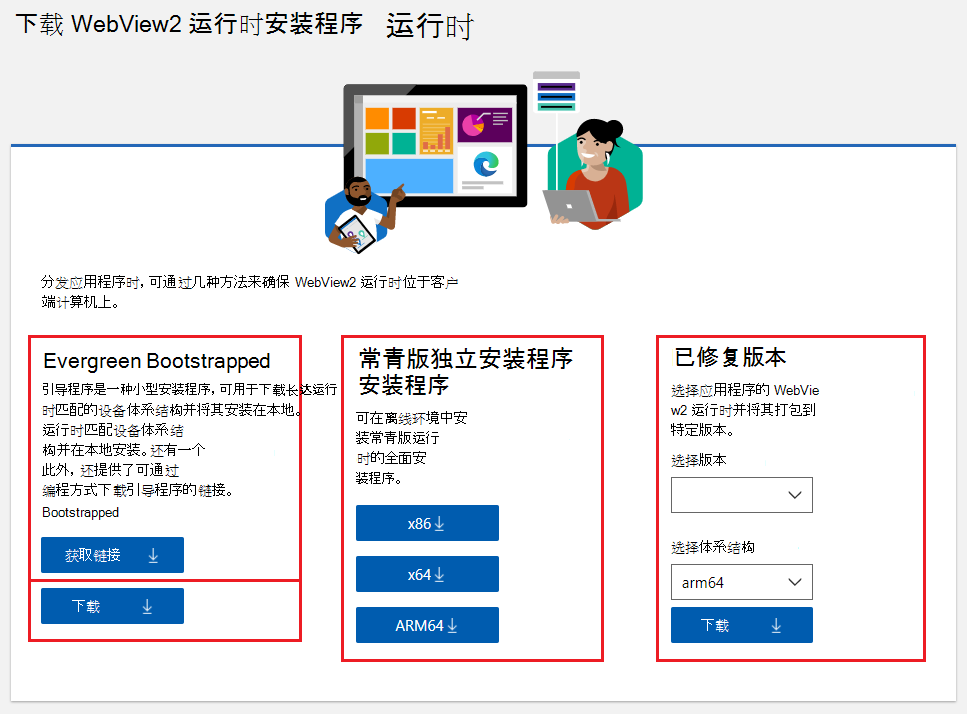
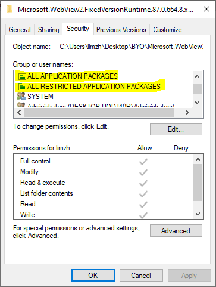

# <a name="distribute-your-app-and-the-webview2-runtime"></a>分发应用和 WebView2 运行时

发布使用 Microsoft Edge WebView2 的应用时，需要通过分发自动更新的 _常青_ 运行时或分发 _已修复的_ 运行时版本来分发 WebView2 运行时。

WebView2 应用依赖于客户端计算机上的 WebView2 运行时。  分发 WebView2 应用时，需要考虑如何在客户端计算机上分发 WebView2 运行时并对其进行更新。


<!-- ====================================================================== -->
## <a name="the-webview2-runtime"></a>WebView2 运行时

WebView2 运行时是可再发行运行时，充当 WebView2 应用的基础 (或 _支持_) Web 平台。  此概念类似于 Visual C++ 或适用于 C++/.NET 应用的 .NET 运行时。  WebView2 运行时包含已修改的 Microsoft Edge 二进制文件，这些二进制文件已针对 WebView2 应用进行了微调和测试。  安装 WebView2 运行时后，它不会显示为用户可见的浏览器应用。  例如，用户在 **“开始”** 菜单中没有浏览器桌面快捷方式或条目。

可通过两种不同的方式将 WebView2 运行时分发和更新到客户端计算机：常青分发模式和固定版本分发模式。


<!-- ====================================================================== -->
## <a name="the-evergreen-runtime-distribution-mode"></a>常青运行时分发模式

在 _Evergreen_ 分发模式下，WebView2 运行时不会与应用打包，但最初使用联机引导程序或脱机安装程序安装到客户端。  之后，WebView2 运行时会在客户端计算机上自动更新。  然后，可以从最新的 WebView2 SDK 分发使用最新 WebView2 API 的 WebView2 应用的更新。  建议大多数开发人员使用常青分发模式。

专业人员：

*  WebView2 运行时 (基础 Web 平台) 自动更新，而无需你付出更多努力。

*  客户端系统上的 WebView2 运行时所需的磁盘空间较少，因为 WebView2 运行时由客户端上的所有 WebView2 应用共享。

*  在符合条件的系统上，Microsoft Edge 和 Evergreen WebView2 运行时的二进制文件在同一版本中硬链接在一起。  此链接为磁盘占用量、内存和性能提供了好处。

缺点：

*  WebView2 应用无法指定需要特定版本的 WebView2 运行时。


<!-- ====================================================================== -->
## <a name="the-fixed-version-runtime-distribution-mode"></a>固定版本运行时分发模式

在 _固定版本_ 分发模式下，下载特定版本的 WebView2 运行时，并将其与应用包中的 WebView2 应用一起打包。  随应用打包的 WebView2 运行时仅由 WebView2 应用使用，而不由客户端计算机上的任何其他应用使用。

专业人员：
*  可以更好地控制 WebView2 运行时的版本控制。  你知道哪些 WebView2 API 可用于你的应用，因为你控制哪个版本的 WebView2 运行时可供你的应用使用。  你的应用不需要测试是否存在最新的 API。

缺点：

*  需要自行管理 WebView2 运行时。  WebView2 运行时不会在客户端上自动更新，因此若要使用最新的 WebView2 API，必须定期将应用与更新的 WebView2 运行时一起更新。

*  如果安装了多个 WebView2 应用，则客户端需要更多磁盘空间。

*  无法使用安装程序安装固定版本运行时。


<!-- ====================================================================== -->
## <a name="understanding-the-options-at-the-runtime-download-page"></a>了解运行时下载页面上的选项

**Microsoft Edge WebView2** 页面的“[下载 WebView2 运行时](https://developer.microsoft.com/microsoft-edge/webview2#download-section)”部分提供了多个选项，用于将 WebView2 运行时分发到客户端计算机上。  了解此页面上的选项提供了很好的介绍，有助于确定要使用哪种方法。



对于大多数应用，建议使用常青分发模式。

*  页面的 **Evergreen Bootstrapper** 部分为在线用户提供在客户端计算机上运行的小型常青运行时引导程序。  引导程序将相应的 WebView2 Evergreen Runtime 下载并安装到客户端上。  可以通过几种不同的方式使用引导程序：

   *  使用从“ **获取链接** ”按钮获取的链接链接到引导程序。  应用使用此链接以编程方式将引导程序下载到客户端并调用引导程序。  此方法避免需要使用应用打包引导程序。  此方法依赖于 Microsoft 的内容分发网络 (CDN) ，以获取引导程序。

   *  使用 **Bootstrapper** 部分中的 **“下载**”按钮下载引导程序 () ，然后将引导程序与应用一起分发。  在此方法中，可以使用应用安装程序/更新程序或应用本身打包引导程序，并调用应用中包含的引导程序。  此方法可避免依赖 Microsoft 的 CDN 来获取引导程序。

*  页面的 **常青独立安装程序** 部分提供大型独立 Evergreen 安装程序，主要面向脱机用户。  在此方法中，使用应用安装程序/更新程序或应用本身打包独立安装程序，并调用 Evergreen 独立安装程序。  此方法可避免依赖 Microsoft 的 CDN 获取运行时。

*  页面的 **“固定版本** ”部分提供固定版本运行时，这是与应用一起分发的 WebView2 运行时的特定版本。


<!-- ====================================================================== -->
## <a name="details-about-the-webview2-runtime"></a>有关 WebView2 运行时的详细信息

分发 WebView2 应用时，请确保 WebView2 运行时存在于客户端计算机上。  此要求适用于常青版和固定版本分发模式。

如果要使用固定版本分发模式，可以跳过接下来的几个部分，并跳转到 [有关固定版本运行时分发模式的详细信息](#details-about-the-fixed-version-runtime-distribution-mode)。

### <a name="servicing-the-webview2-runtime-through-windows-server-update-services-wsus"></a>通过 Windows Server Update Services (WSUS) 为 WebView2 运行时提供服务

请参阅 _WebView2 运行时企业管理_中的[Windows Server Update Services (WSUS) ](enterprise.md#windows-server-update-services-wsus)。

### <a name="runtime-or-browser-support-during-development-or-production"></a>开发或生产期间的运行时或浏览器支持

在开发和测试期间，WebView2 应用可以使用任一选项作为支持 Web 平台：

*  WebView2 运行时。  运行时通常提供与 Microsoft Edge 浏览器稳定通道相同的 Web 平台功能和更新节奏。  在生产环境中使用 WebView2 运行时，或针对用户当前拥有的 Web 平台进行开发和测试。

*  预览 (预览体验) Microsoft Edge 浏览器频道。  这些 Microsoft Edge 预览频道是 Beta、Dev 和 Canary。  使用此方法测试应用是否具有前向兼容性，以便知道是否即将发生需要更新应用的重大更改。  请参阅 [测试即将推出的 API 和功能](../how-to/set-preview-channel.md)。

WebView2 应用的生产版本只能使用 WebView2 运行时作为后备 Web 平台，而不能使用 Microsoft Edge。

#### <a name="microsoft-edge-stable-channel-isnt-supported-for-webview2"></a>WebView2 不支持 Microsoft Edge Stable 通道

不允许 WebView2 应用使用 Microsoft Edge 的稳定通道作为后备 Web 平台。  此限制可防止 WebView2 应用的生产版本依赖浏览器。  由于以下原因，WebView2 应用无法在生产过程中依赖浏览器：

*  不能保证 Microsoft Edge 存在于所有用户设备上。  企业和教育部门的许多设备都与Windows 更新断开连接，或者不受 Microsoft 直接管理。  此类设备可能未安装 Microsoft Edge。  要求 WebView2 应用的生产版本使用 WebView2 运行时而不是 Microsoft Edge 可避免使 Microsoft Edge 成为运行 WebView2 应用的先决条件。

*  浏览器和应用有不同的用例。  如果 WebView2 应用需要在客户端上存在 Microsoft Edge，这可能会对 WebView2 应用产生意外的副作用。  例如，IT 管理员可以阻止从特定版本更新浏览器，以使浏览器与内部网站兼容。  要求 WebView2 应用的生产版本使用 WebView2 运行时而不是浏览器，即使客户端管理员阻止了浏览器更新，WebView2 应用也可保持常青。

*  与浏览器不同，WebView2 运行时是针对应用方案开发和测试的，在某些情况下，WebView2 运行时可能包含浏览器中尚不可用的 bug 修复。

Evergreen WebView2 运行时将作为Windows 11操作系统的一部分包含在内。  在Windows 11之前，各种 WebView2 应用已在具有操作系统的设备上安装了 Evergreen 运行时。 但是，某些设备可能未预安装运行时，因此最好检查客户端上是否存在运行时。

在应用创建 WebView2 之前，应用应通过检查注册表项或调用 API) 来检查 WebView2 运行时是否存在 (，并在缺少运行时时安装它。  在安装或更新应用 (建议的) 或应用运行时，应用可以执行此检查。  若要检查运行时是否存在，请参阅下面 [的“部署常青 WebView2 运行时](#deploying-the-evergreen-webview2-runtime)”。


<!-- ====================================================================== -->
## <a name="details-about-the-evergreen-runtime-distribution-mode"></a>有关常青运行时分发模式的详细信息

常青分发模式可确保 WebView2 应用正在利用最新的 WebView2 功能和安全更新。  常青分布模式具有以下特征：

*  WebView2 运行时会自动更新，而无需执行任何操作。 它接收的 Microsoft Edge 更新与 [Microsoft Edge 稳定频道发行说明](/deployedge/microsoft-edge-relnote-stable-channel)和 [Microsoft Edge 安全更新发行说明](/deployedge/microsoft-edge-relnotes-security)中所述的 Microsoft Edge 更新相同。

*  所有使用常青分发模式的 WebView2 应用都使用常青 WebView2 运行时的共享副本，从而节省磁盘空间。

*  在符合条件的系统上，Microsoft Edge 和 Evergreen WebView2 运行时的二进制文件在同一版本中硬链接在一起。  此链接为磁盘占用量、内存和性能提供了好处。

使用 WebView2 运行时的 Evergreen 分发模式时，WebView2 应用假定客户端具有最新的运行时。  对于客户端上的所有应用，应用不能要求特定版本的 WebView2 运行时。  发布新的 WebView2 SDK 包时，WebView2 运行时的兼容版本已分发给客户端。  因此，WebView2 应用可以使用最新版本的 WebView2 SDK 中的 API。

请参阅 [了解浏览器版本和 WebView2](versioning.md)。


### <a name="deploying-the-evergreen-webview2-runtime"></a>部署 Evergreen WebView2 运行时

设备上的所有常青应用只需要安装一个 Evergreen WebView2 运行时。  下载 [WebView2 运行时](https://developer.microsoft.com/microsoft-edge/webview2#download-section) 提供了多种工具来帮助部署常青运行时。

*  对于联机客户端： _WebView2 运行时引导程序_ 是一个小 (大约 2 MB) 安装程序。  WebView2 运行时引导程序从与用户的设备体系结构匹配的 Microsoft 服务器下载并安装 Evergreen Runtime。

   *  在 WebView2 应用的安装部分中，链接到引导程序。  使用链接以编程方式下载引导程序;选择上述下载页上的 **“获取链接”** 按钮。

   *  或者，下载引导程序并将其打包到 WebView2 应用中。

*  对于脱机客户端： _WebView2 运行时独立安装程序_ 是一个完整的安装程序，可在脱机环境中安装 Evergreen WebView2 运行时。


### <a name="installing-the-runtime-as-per-machine-or-per-user"></a>按计算机或按用户安装运行时

最新的引导程序和独立安装程序支持 WebView2 运行时 _的每台计算机_ 和 _每用户_ 安装。

<!-- keep the 3 instances or variants of this passage in sync: instance 1: -->
如果从提升的进程或命令提示符运行安装程序，则运行时将按 _计算机_安装。  如果未从提升的进程或命令提示符运行安装程序，将 _按用户_安装运行时。  但是，如果_每台计算机_的 Microsoft Edge 更新程序已就绪，_则每个用户_安装会自动替换为_每台计算机_安装。  _每台计算机_的 Microsoft Edge 更新器包含在 Microsoft Edge 中，Microsoft Edge 的 Canary 预览频道除外。

使用以下联机部署工作流或脱机部署工作流，确保在应用启动之前已安装运行时。  可以根据方案调整工作流。  示例代码在 [示例存储库](https://github.com/MicrosoftEdge/WebView2Samples#webview2-deployment)中可用。

#### <a name="detect-if-a-suitable-webview2-runtime-is-already-installed"></a>检测是否已安装合适的 WebView2 运行时

若要验证 WebView2 运行时是否已安装，请使用以下方法之一：

   *  方法 1：在以下两个注册表位置检查 `pv (REG_SZ)` WebView2 运行时的 regkey。  regkey `HKEY_LOCAL_MACHINE` 用于 _每台计算机_ 安装。  regkey `HKEY_CURRENT_USER` 用于 _按用户_ 安装。

      对于 WebView2 应用程序，必须至少存在其中一个具有大于 0.0.0.0 的版本并对其进行定义。  如果两个 regkey 都不存在，或者仅存在其中一个 regkey，但其值为 `null`空字符串或 0.0.0.0，则表示未在客户端上安装 WebView2 运行时。  检查这些 regkey 以检测是否安装了 WebView2 运行时，并获取 WebView2 运行时的版本。  在以下两个位置找到 `pv (REG_SZ)` 。

      要在 64 位 Windows 上检查的两个注册表位置：

      ```
      HKEY_LOCAL_MACHINE\SOFTWARE\WOW6432Node\Microsoft\EdgeUpdate\Clients\{F3017226-FE2A-4295-8BDF-00C3A9A7E4C5}

      HKEY_CURRENT_USER\Software\Microsoft\EdgeUpdate\Clients\{F3017226-FE2A-4295-8BDF-00C3A9A7E4C5}
      ```

      要在 32 位 Windows 上检查的两个注册表位置：

      ```
      HKEY_LOCAL_MACHINE\SOFTWARE\Microsoft\EdgeUpdate\Clients\{F3017226-FE2A-4295-8BDF-00C3A9A7E4C5}

      HKEY_CURRENT_USER\Software\Microsoft\EdgeUpdate\Clients\{F3017226-FE2A-4295-8BDF-00C3A9A7E4C5}
      ```

   *  方法 2：运行 [GetAvailableCoreWebView2BrowserVersionString](/microsoft-edge/webview2/reference/win32/webview2-idl#getavailablecorewebview2browserversionstring) 并评估是否 `versionInfo` 为 `nullptr`。  `nullptr` 指示未安装 WebView2 运行时。  此 API 返回 WebView2 运行时或任何安装的 Microsoft Edge (Beta、Dev 或 Canary) 预览频道的版本信息。

#### <a name="online-only-deployment"></a>仅联机部署

如果有一个仅限联机的部署方案，假定用户具有 Internet 访问权限，请使用以下工作流。

1. 在应用设置期间，运行测试以确保已安装 WebView2 运行时。 请参阅 [“检测是否已安装合适的 WebView2 运行时](#detect-if-a-suitable-webview2-runtime-is-already-installed)”。

1. 如果未安装运行时，请在应用设置过程中，使用下载页上“ **获取链接”** 按钮 (链接) 以编程方式下载 WebView2 运行时引导程序。

1. 通过发出以下命令调用 WebView2 运行时引导程序。

   <!-- keep the 3 instances or variants of this passage in sync: instance 2: -->

   如果从提升的进程或命令提示符运行以下命令，则会触发 _每台计算机_ 的安装。  如果未从提升的进程或命令提示符运行命令，则会进行 _每用户_ 安装。  但是，如果_每台计算机_的 Microsoft Edge 更新程序已就绪，_则每个用户_安装会自动替换为_每台计算机_安装。  _每台计算机_的 Microsoft Edge 更新器作为 Microsoft Edge 的一部分提供，Microsoft Edge 的 Canary 预览频道除外。  有关详细信息，请参阅 [按计算机或按用户安装运行时](#installing-the-runtime-as-per-machine-or-per-user)。<!-- since this link is provided, the present paragraph could be shortened -->

   ```Shell
   MicrosoftEdgeWebview2Setup.exe /silent /install
   ```

上述工作流具有以下几个优点：

* 运行时仅在需要时安装。

* 无需使用 WebView2 应用打包运行时安装程序。

* WebView2 运行时启动程序会自动检测设备的体系结构 (平台) ，然后安装匹配的 WebView2 运行时。

* 运行时以无提示方式安装。

或者，可以使用应用打包用于 WebView2 运行时的 Evergreen Bootstrapper，而不是通过获取链接以编程方式按需下载引导程序。如上所示。

#### <a name="offline-deployment"></a>脱机部署

如果有脱机部署方案（应用部署必须完全脱机工作），请使用以下工作流。

1. 将 Evergreen 独立安装程序从 [“下载 WebView2 运行时”下载](https://developer.microsoft.com/microsoft-edge/webview2#download-section) 到开发计算机。  常青独立安装程序在客户端上安装 WebView2 Evergreen 运行时。

1. 在应用安装程序或更新程序中包括 Evergreen 独立安装程序。

1. 在应用设置期间，运行测试以确保已安装 WebView2 运行时。 请参阅 [“检测是否已安装合适的 WebView2 运行时](#detect-if-a-suitable-webview2-runtime-is-already-installed)”。

1. 如果未安装 WebView2 运行时，请运行 Evergreen 独立安装程序。  如果要运行无提示安装，可以运行以下命令。

   <!-- keep the 3 instances or variants of this passage in sync: instance 3 -->

   如果从提升的进程或命令提示符运行以下命令，则会触发 _每台计算机_ 的安装。  如果未从提升的进程或命令提示符运行命令，则会进行 _每用户_ 安装。  但是，如果_每台计算机_的 Microsoft Edge 更新程序已就绪，_则每个用户_安装会自动替换为_每台计算机_安装。  _每台计算机_的 Microsoft Edge 更新器作为 Microsoft Edge 的一部分提供，Microsoft Edge 的 Canary 预览频道除外。  有关详细信息，请参阅 [按计算机或按用户安装运行时](#installing-the-runtime-as-per-machine-or-per-user)。<!-- since this link is provided, the present paragraph could be shortened -->

   ```Shell
   MicrosoftEdgeWebView2RuntimeInstaller{X64/X86/ARM64}.exe /silent /install
   ```

### <a name="test-your-app-for-forward-compatibility"></a>测试应用是否具有转发兼容性

Web 在不断发展。  在 Evergreen 分发模式下，WebView2 运行时会自动在客户端上保持最新，以提供最新的功能和安全修补程序。  如果使用 Evergreen 分发版，以确保 WebView2 应用与 Web 保持兼容，应设置测试基础结构。

Microsoft Edge 预览频道 (Beta、Dev 和 Canary) 提供 WebView2 运行时下一步内容的简要浏览。  针对 Microsoft Edge 预览频道定期测试 WebView2 应用，并在出现问题时更新应用或 [报告问题](https://github.com/MicrosoftEdge/WebViewFeedback) 。  Canary 是建议的预览频道，因为它以最快的节奏提供，并且具有最新的 API。

若要帮助你确定哪个频道是正确的，请参阅 [Microsoft Edge 频道概述](/deployedge/microsoft-edge-channels)。  可以在测试环境中 [下载 Microsoft Edge 预览体验成员频道](https://www.microsoftedgeinsider.com/download) ，并使用 `regkey` 或环境变量来指示测试应用的频道首选项。

请参阅 [CreateCoreWebView2EnvironmentWithOptions](/microsoft-edge/webview2/reference/win32/webview2-idl#createcorewebview2environmentwithoptions)。  还可以使用 WebDriver 自动执行 WebView2 测试，如 Automate 中所述 [，并使用 Microsoft Edge WebDriver 测试 WebView2](../how-to/webdriver.md)。


### <a name="feature-detect-when-using-recent-apis"></a>使用最近的 API 时的功能检测

<!-- the main section about QueryInterface is in versioning.md, so limit this section to a couple paragraphs -->

如果使用 Evergreen 模式，则当 WebView2 应用使用最近 SDK 中的新 WebView2 API 时，应使用此类 `QueryInterface` 方法，或 `try-catch` 确保客户端计算机上存在新 API。  此功能检测是最佳做法，因为在某些情况下，WebView2 运行时未更新。

即使使用常青分发模式，WebView2 运行时也可能由于以下原因而无法更新：

*  IT 管理员可以关闭 WebView2 运行时的更新，因为管理员可以控制其设备的更新。

*  处于脱机状态的客户端不会收到更新的 WebView2 运行时。

Microsoft Edge 和 WebView2 运行时的更新策略是单独的。  即使 IT 管理员已禁用 Microsoft _Edge_ 的自动更新，WebView2 _运行时_仍会自动更新，除非管理员关闭运行时更新。  如果管理员禁用更新 Microsoft Edge (这) 有些常见，则不会影响客户端计算机上可用的 WebView2 API。

请参阅 [功能检测，以测试已安装的运行时是否支持最近添加的 API](../concepts/versioning.md#feature-detecting-to-test-whether-the-installed-runtime-supports-recently-added-apis)。


<!-- ====================================================================== -->
## <a name="details-about-the-fixed-version-runtime-distribution-mode"></a>有关固定版本运行时分发模式的详细信息

对于具有严格兼容性要求的受约束环境，请考虑使用固定版本分发模式。  固定版本分发模式以前称为 _自带_版本分发模式。

在固定版本分发模式下，控制应用的 WebView2 运行时更新的时间。  下载 WebView2 运行时的特定版本，然后使用 WebView2 应用对其进行打包。  不会自动更新客户端上的 WebView2 运行时。  而是定期更新与更新后的应用一起打包和分发的 WebView2 运行时。  固定版本方法不使用 WebView2 运行时的注册表项。

固定版本二进制文件超过 250 MB，并且会使应用包更大。

若要使用固定版本分发模式，请执行以下操作：

1. 从下载 [WebView2 运行时](https://developer.microsoft.com/microsoft-edge/webview2#download-section)下载 WebView2 运行时的固定版本作为包。

   可在此站点下载最新版本和第二大版本的最修补版本。  保留所需任何版本的存档副本。

1. 使用命令行命令 `expand {path to the package} -F:* {path to the destination folder}` 或使用解压缩工具（如 WinRAR）解压缩 WebView2 运行时包。  避免通过文件资源管理器进行解压缩，因为该方法可能不会生成正确的文件夹结构。

1. 在应用包中包括所有解压缩的固定版本二进制文件，这些二进制文件将在应用安装期间部署在目标计算机上。

1. 指示创建 WebView2 环境时固定版本二进制文件的路径。

   *  对于 Win32 C/C++，可以使用 [CreateCoreWebView2EnvironmentWithOptions](/microsoft-edge/webview2/reference/win32/webview2-idl#createcorewebview2environmentwithoptions) 函数创建环境。  `browserExecutableFolder`使用该参数指示包含`msedgewebview2.exe`的文件夹的路径。

   *  对于 .NET，必须在 WebView2 `Source` 属性生效之前指定环境。  对于 .NET，可以使用以下任一方法来指定环境：

      *  在`CreationProperties`元素上`WebView2`设置 ([WPF](/dotnet/api/microsoft.web.webview2.wpf.webview2.creationproperties)/[WinForms](/dotnet/api/microsoft.web.webview2.winforms.webview2)) 属性。  `BrowserExecutableFolder`使用 ([WPF](/dotnet/api/microsoft.web.webview2.wpf.corewebview2creationproperties)/[WinForms](/dotnet/api/microsoft.web.webview2.winforms)) 类中`CoreWebView2CreationProperties`的成员指示固定版本二进制文件的路径。

      *  或者，使用 `EnsureCoreWebView2Async` ([WPF](/dotnet/api/microsoft.web.webview2.wpf.webview2.ensurecorewebview2async)/[WinForms](/dotnet/api/microsoft.web.webview2.winforms.webview2.ensurecorewebview2async)) 来指定环境。  `browserExecutableFolder`使用 [CoreWebView2Environment.CreateAsync](/dotnet/api/microsoft.web.webview2.core.corewebview2environment.createasync) 中的参数来指示固定版本二进制文件的路径。

   *  对于 WinUI，请通过指定已安装的位置并为运行时路径设置环境变量来确保应用有权访问该文件夹。  执行此操作的一种方法是将以下 C# 代码添加到应用：
        
      ```csharp
      StorageFolder localFolder = Windows.ApplicationModel.Package.Current.InstalledLocation;
      String fixedPath = Path.Combine(localFolder.Path, "FixedRuntime\\(version number)");
      Debug.WriteLine($"Launch path [{localFolder.Path}]");
      Debug.WriteLine($"FixedRuntime path [{fixedPath}]");
      Environment.SetEnvironmentVariable("WEBVIEW2_BROWSER_EXECUTABLE_FOLDER", fixedPath);
      ```
   
1. 使用应用打包并寄送固定版本二进制文件。  根据需要更新二进制文件。

   *  对于 WinUI，这可能包括在代码编辑器中打开项目文件 (`.csproj`) ，然后在项目标记中添加以下代码：

      ```xml
      <ItemGroup>
         <Content Include="FixedRuntime\(version number)\\**\*.*">
         <CopyToOutputDirectory>PreserveNewest</CopyToOutputDirectory>
         </Content>
      </ItemGroup>
      ```

      `bin\**designated architecture**\Release`验证文件夹是否具有匹配的 FixedRuntime\\ (版本号) 文件夹，其中包含运行时文件。

### <a name="known-issues-for-fixed-version"></a>已修复版本的已知问题

*  目前，无法从网络位置或 UNC 路径运行固定版本。

*  在客户端上安装 WebView2 运行时的固定版本会导致[Microsoft PlayReady](https://www.microsoft.com/playready)停止工作。  按如下所示修复 PlayReady 设置：

   1. 找到在用户设备上部署固定版本包的路径，例如以下位置：

      ```text
      D:\myapp\Microsoft.WebView2.FixedVersionRuntime.87.0.664.8.x64
      ```

   1. 在用户的设备上运行以下命令：

      ```shell
      icacls {Fixed Version path} /grant *S-1-15-2-2:(OI)(CI)(RX)
      icacls {Fixed Version path} /grant *S-1-15-2-1:(OI)(CI)(RX)
      ```

      PlayReady 现在应在用户的设备上工作。

   1. 若要确认 PlayReady 已正确安装，请在 **“固定版本**”文件夹的“**安全**”选项卡中，确保为其授予`ALL APPLICATION PACKAGES`权限，`ALL RESTRICTED APPLICATION PACKAGES`如下所示：

      


<!-- ====================================================================== -->
## <a name="files-to-ship-with-the-app"></a>要随应用一起寄送的文件

需要 `WebView2Loader` 随应用一起提供代码。  这可以通过[静态链接](../how-to/static.md)`WebView2Loader.lib`到应用二进制文件或包含`WebView2Loader.dll`与应用体系结构匹配的二进制文件来完成。 通常，在 WebView2 SDK 中使用 `.targets` 该文件时，Visual Studio 会自动处理此操作，但在某些情况下，可能需要手动指定要使用应用发布的文件。

`WebView2Loader.dll` 是本机和特定于体系结构的二进制文件，因此需要包含此二进制文件的所有样式，你希望应用能够运行。  例如：

*  对于 x86，你将包括 x86 版本的 `WebView2Loader.dll`。

*  对于使用 AnyCPU 的托管应用，将包括 x86、x64 和 arm64 版本。`WebView2Loader.dll` 正确的版本 `WebView2Loader.dll` 是从适当的特定于体系结构的文件夹加载的。

本机应用文件夹结构示例：

```
\<myApp>
    \WebView2Loader.dll
```

对于 .NET 托管应用，还需要包括用于核心 WebView2 功能的 WebView2 .NET 程序集 () `Microsoft.Web.WebView2.Core.dll` 以及特定于 WPF/WinForms 的功能 (`Microsoft.Web.WebView2.Winforms.dll` 或 `Microsoft.Web.WebView2.WPF.dll`) 。

托管应用文件夹结构示例：

```
\<myApp>
    \Microsoft.Web.WebView2.Core.dll
    \Microsoft.Web.WebView2.Winforms.dll
    \Microsoft.Web.WebView2.WPF.dll
    \runtimes
        \win-arm64\native\WebView2Loader.dll (arm64)
        \win-x64\native\WebView2Loader.dll (x64)
        \win-x86\native\WebView2Loader.dll (x86)
```
